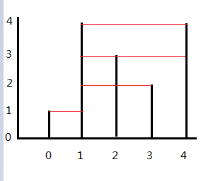

> Given n non-negative integers a1, a2, ..., an, where each represents a point at coordinate (i, ai). n vertical lines are drawn such that the two endpoints of line i is at (i, ai) and (i, 0). Find two lines, which together with x-axis forms a container, such that the container contains the most water.
> 
> Note: You may not slant the container.
> 

<!--more-->


class Solution {
public:
    int maxArea(vector<int>& height) {
        
    }
};


### 题意：

有一排竖直放置的、长短不一的圆柱，圆柱之间间隔都是1，问哪2根圆柱（用ai，aj表示)可以组成一个体积（因为是二维空间，其实就是面积）最大的**水容器**。

注意：容器里面放着其他圆柱也是没影响的（奇葩的容器？），ai和aj不要求相邻；因为是水容器，所以最短边决定了容器的容量。

### 题解：

这道题并不是动态规划题， 原因是动态规划的一个条件——无后效性，无法满足。

> 无后效性是这样一种性质：某阶段的状态一旦确定，则此后过程的演变不再受此前各种状态及决策的影响，简单的说，就是“未来与过去无关”，当前的状态是此前历史的一个完整总结。

设S(i)是从第0根柱子到第i根柱子这个范围里，所能得到的最大的面积。换一种说法就是说，S(i)是考虑只有前i根柱子存在的情况下的最优解。所以，S(4)就是我们的解。

考虑动态规划的最优化原理——最优策略的任何一部分子策略也必须是最优的。
S(i)是符合这个定义的，S(i)代表i阶段时的最优结果。

但S(i)并不满足无后效性规则。考虑下面这个情况：

S(3)的值是以[1,3]为边界的面积:(3-1)*min(4,2) = 4。按照无后效性定义“未来与过去无关”，S(3)是对0,1,2,3这4根柱子的一个总结，那么S(4)呢？容易看出，S(4)的值是以[1,4]为边界的面积：(4-1)*min(4,4) = 12。S(4)的值(未来），不仅与3有关系，还与0、1、2有关系，即过去影响了未来。

这道题的真正解法是很简单的。假设T(i,j)代表我们能从整个区间里找的最大容器面积，T(i,j)=(j-i)*min(a[i],[j]) (i<j)，可以证明，在j的右端肯定没有比j更高的柱子了（只可能小于或等于），不然T(i,j)就不成立。

那么可以反过来思考，我们假设0和n-1号柱子组成的面积是最大的，要使这个结论不成立，除非是在[0,n-1]区间里找到了比a[0]或a[n-1]高的柱子，且新的柱子对的面积比目前的最大值还大。

所以可以从两端向中间迭代，直接看代码：


	int maxArea(vector<int>& height) {
		if (height.size() == 0 || height.size() == 1)
			return 0;
		int l = 0, r = height.size() - 1;
		int area = 0;
		while (l < r){
			int curArea = min(height[l], height[r]) * (r - l);
			if (curArea > area)
				area = curArea;
			if (height[l] < height[r]){
				int k = l;
				while (height[k] <= height[l]){
					k++;
				}
				l = k;
			}
			else{
				int k = r;
				while (height[k] <= height[r]){
					k--;
				}
				r = k;
			}
		}
		return area;
	}


