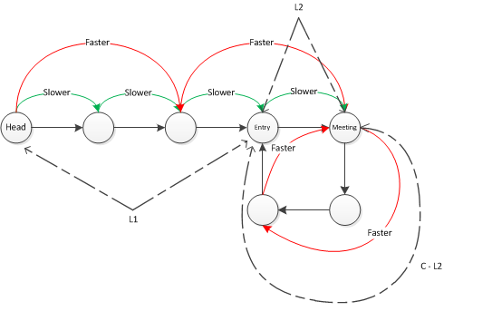

> 
> Given a linked list, return the node where the cycle begins. If there is no cycle, return null.
> 
> Follow up:
> 
> Can you solve it without using extra space?

### 题意：

判断一个链表是否有环，有环的话返回环的起始节点，无环的话返回NULL。

<!--more-->

### 题解：

Linked List Cycle的升级，不仅要判断有无环，还要求入口。很显然可以在Linked List Cycle的基础上来做。

这里我直接翻译ngcl的[answer](https://leetcode.com/discuss/16567/concise-solution-using-with-detailed-alogrithm-description "answer")，写得非常好：

1. 用slower和faster方法判断是否有环；
2. 设链表的头节点是head，环的入口节点是entry，slower和faster2个指针相遇的节点是meeting;
3. 设L1是head到entry的正向距离，**L2是entry到meeting的正向距离**，C是环的长度，n是faster指针在cycle里遍历的次数(不到一遍算0)；

根据上面的定义，可知：

1. 当slower和faster相遇时，slower已经走了L1 + L2的距离，也即head和meeting的距离;
2. 当slower和faster相遇时，faster已经走了L1 + L2 + n * C的距离;
3. 因为slower步进1，而faster步进2，那么当slower和faster第一次相遇时，faster已经走的距离是slower已经走的距离的两倍，即 2* (L1 + L2) = L1 + L2 + n * C => L1 = (n - 1) * C + (C - L2)

**L1 = (n - 1) * C + (C - L2)** 这个等式表明， head和entry的距离(L1)，等于**meeting到entry的正向距离**（链表是有遍历方向的）。

这是因为式子中的 (n - 1) * C相当于走n-1个循环，对一个指向meeting的环内指针来说，走(n - 1) * C等于回到起点，所以式子可以简化成 **L1 = C - L2**。

画成图是这样子：

ngcl的代码如下：


	ListNode *detectCycle(ListNode *head) {
	    if (head == NULL || head->next == NULL)
	        return NULL;
	
	    ListNode *slow  = head;
	    ListNode *fast  = head;
	    ListNode *entry = head;
	
	    while (fast->next && fast->next->next) {
	        slow = slow->next;
	        fast = fast->next->next;
	        if (slow == fast) {                      // there is a cycle
	            while(slow != entry) {               // found the entry location
	                slow  = slow->next;
	                entry = entry->next;
	            }
	            return entry;
	        }
	    }
	    return NULL;                                 // there has no cycle
	}

