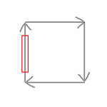
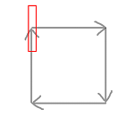
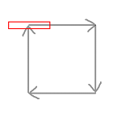
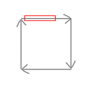
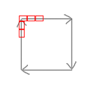

游戏试玩地址：[http://wanga.me/45512](http://wanga.me/45512 "http://wanga.me/45512")

技术架构：

平台：web、mobile

引擎：cocos2d

语言：js

使用的插件：chipmunk(物理引擎) underscore(js增加函数库）

技术实现：

这游戏的技术难点是**电网**的实现。

电网的特点：

- 电流在电网上移动（路径固定，会循环）
- 电流可能有多条，电流会转向，可以设置电流的长度、速度

实际上这个游戏的核心创意是我提出的，提出之后，大家一起围绕这个核心玩法开了各种脑洞。可惜因时间关系，只来得及完成这个核心玩法。

技术永远是跟着需求走的。需求确定的情况下，只要选一个成本最低、最简单的实现方案即可。若改了需求，任何程序员都不能保证既有代码实现可以完全不改动。

对于这个电网来说，我主要处理几个难点：

- 电流和导弹的碰撞的实现
- 电流移动问题
- 电流转弯问题
- 电流动画问题
- 电流和发电器整体移动的问题

第一个问题是用物理引擎chipmunk解决的，为什么不是box2d？因为我在公司刚好也在做一款物理类游戏，而chipmunk是能跨android和ios的引擎（box2d暂时不支持ios）。But，引入chipmunk后，又引发新的问题，下面会说到。

第二和第三个问题，电流移动和转弯，都是用cocos的action功能实现的，移动是cc.moveTo，转弯是cc.callFunc（在回调函数里即时计算旋转角），那么一个电流sprite就是不断执行move->rotate->move->rotate即可。

但电流转弯又引发新的问题，因为电流是一个绑定了chipmunk's body的PhysicSprite，body是一个狭长的长方形，转弯的时候会出现这样子的bug：

即电流的body会超出路径限定的范围。于是我做了一个细分的操作，把一条电流切成N截，每一截都是一个PhsicalSprite，那么只要让他们在路径上移动时有前后顺序，就会变成：

这里有个实现技巧：要生成N个速度为v的小电流，且他们的总长度为s，可以做一个createCurrent()函数，然后用某种延时机制，在0、 1/N *(s/v)、2/N *(s/v)、···、N/N *(s/v)时刻，各执行一次createCurrent函数，每次执行函数都会在路径起点生成一截小电流。执行N次后，就得到了一条会拐弯的大电流。

第四个问题，电流动画，因为没做过类似的需求，在处理这个问题时总感觉不对，最后出来的效果也不太好。我的做法是，让每截小电流都播放同一个cc.animation帧动画。最后发现效果不是很理想，因为每截小电流太小了，导致动画的细节少了很多。但勉强可以作为demo演示用。

第五个问题，电流和发电器整体移动的问题。按照chipmunk的物理规则，一个PhysicSprite的移动应该是被动的，cp.body移动从而导致PhysicSprite移动。但我是用cc.moveTo来移动的，也就是反过来实现了。不过这个细节也没什么影响。对于这第五个问题，一开始想到的方案是，通过改变所有电流Sprite的父节点的位置，从而整体移动整个电网。

但实际上会出bug：电网是整体偏移了，但是Sprite的body没有偏移，这是因为chipmunk的实现和cocos的node树的实现是完全分开的。所以就还要让body也跟着偏移。

最后我的实现方法是：如果电网会移动，那么久解除PhysicSprite和body的连接，从而可以分别操作sprite和body的位置而又不会互相影响，这样只要2边的位置能对上，就OK了。具体实现这里不提。

其他问题：

- 电流角度的计算
- 关卡配表问题

