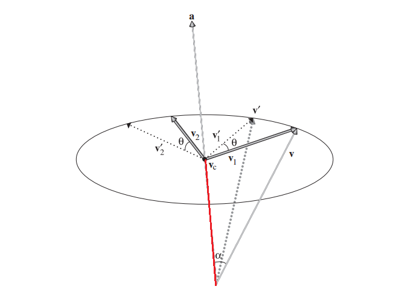
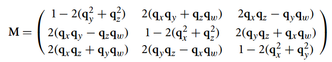

最近在看线代的公开课，顺便也把PBRT这个坑开了，合在一起学。

本文的cpp代码均来自[https://github.com/mmp/pbrt-v2](https://github.com/mmp/pbrt-v2)，木有修改。只为方便读者阅读。

<!--more-->

## 正文

一个基本的渲染器，需要实现2点：输入场景数据、输出渲染图像。

输入场景数据这一步，就需要对3D世界各种东西进行抽象、并设计各种数据结构，比如比较fundamental的：3D空间向量、3D坐标系系统、光线，或者visible的：各种2D/3D几何体、纹理系统等。大概就是，这个渲染器要渲染的东西，程序上都会有一些对应的代码。渲染器不可能对未知的东西进行渲染。比如毛发、布这种高端的东西，一个基本的渲染器是无法渲染的，除非你写了一些代码来完成这个事情。

《PBRT》第二章就讲了这些基础的东西。

在前面的线代的文章中，提到了矩阵的基(basis)的概念。矩阵的基是一组线性无关的列向量，这个矩阵的列空间的任意一点，可以通过对矩阵的基的线性组合得到。

那么n维的情况下，定义一个向量的公式是：

\\[ v = s\_\{1\}v\_\{1\} + \\cdots + s\_\{n\}v\_\{n\} \\]

定义一个点的位置的公式是：

\\[ p = p\_\{0\} + s\_\{1\}v\_\{1\} + \\cdots + s\_\{n\}v\_\{n\} \\]

对于渲染器的3维空间，要简化成：

\\[ p\_\{0\} = (0,0,0) \\]
\\[ basis = (1,0,0) (0,1,0) (0,0,1) \\]

这3个标准基向量对应的空间被称为世界空间(world space)。

### 向量(vector)、点(point)的区别

向量和点，区别在于点没有长度的概念，也就是说点是零维的，点代表空间里的一个**位置**（pbrt的Point和Vector的差异是没有LengthSquared、Length函数)，而向量没有起点的概念，向量只是指明了一个**方向**并且有长度。

### 3维空间下，如何从一个向量出发，构造出一组标准正交基

注意，这个问题是有重要意义的，因为一组标准正交基相当于一个坐标系。

- 设\\( v\_\{1\}=(x\_\{1\},y\_\{1\},z\_\{1\}) \\)，并且v1已经单位化

- 随便选择v1的某一个分量，并将它变成0，再交换剩余的2个分量的位置，并对其中一个分量取反，就能得到和v1正交的v2。这是因为这样构造出来的v2，必然使得\\(  v\_\{1\}\\cdot v\_\{2\}=0 \\)。比如当\\( v\_\{2\}=(-z\_\{1\},0,x\_\{1\}) \\)时，有\\( v\_\{1\}\\cdot v\_\{2\}=(x\_\{1\},y\_\{1\},z\_\{1\})\\cdot (-z\_\{1\},0,x\_\{1\}) = 0\\)
- 上面的v2还有不足，因它不是单位化的。单位化的v2应该是\\[v\_\{2\}=\\dfrac \{ (-z\_\{1\},0,x\_\{1\}) \}\{ \\sqrt \{z\_\{1\}\^\{1\}+x\_\{1\}\^\{1\}\}\} \\]
- 有了v1、v2后，v3就等于v1和v2的叉积(cross product): \\( v\_\{3\} =v\_\{1\} \\times v\_\{2\} \\)

### 法向量Normal

(突然意识到，pbrt把向量、点、法向量写成3个没有继承关系的类，意义在于，防止程序员乱用并搞砸代码=。=)

** A surface normal is a vector that is perpendicular to a surface at a particular position.It can be defined as the cross product of any two nonparallel vectors
that are tangent to the surface at a point. **

**法向量是与某个平面垂直，并经过平面上某个特殊位置的向量。可以用平面上2个互不平行、与平面正切的向量的叉积来表示。**

法向量应该说是一种特殊的向量。pbrt也实现了一个以Vector为参数的Normal构造函数（但有explicit标志），允许通过向量构造出法向量。

### 光线Ray

光线是一条半无限长的线，用一个原点和一个方向向量来表示。

参数形式的光线表示：

\\[ r(t) = o + td   \ \ \ 0\\leq t\\geq \\infty \\]

光线还有其他成员变量：

- mint maxt，用来限定t的范围
- time 用于构建动画，当构建静态场景时不需要
- depth 光线弹射深度。限制光线只能bounce多少次

### 微分光线Differential Ray

先跳过

### 包围盒

包围盒的主要作用，是用来优化程序性能的，更具体的说，就是让复杂场景物件简化成简单的球形、方盒，使得光线快速剔除不相交的对象，计算得更快。

BBox

这玩意神奇的地方，我觉得是它的构造函数。输入是2个Point，就能构造一个盒子，并且也仅仅是花了2个Point来存储。这2个新的Point和输入的Point不同，被称为pMin和pMax:

\\[ pMin = (min(p\_\{1\}.x,p\_\{2\}.x), min(p\_\{1\}.y,p\_\{2\}.y), min(p\_\{1\}.z,p\_\{2\}.z)) \\]

\\[ pMax = (max(p\_\{1\}.x,p\_\{2\}.x), max(p\_\{1\}.y,p\_\{2\}.y), max(p\_\{1\}.z,p\_\{2\}.z)) \\]

需要注意的是，根据这个转换公式，要使得pMin和pMax足够定义一个BBox，那么他们必然是BBox的2个对角顶点。且因为BBox平行于x、y、z轴，那么pMin和pMax的任意一个分量都不能相等。（否则，pMin、pMax就只能是BBox的一对邻接顶点）

p1、p2和pMin、pMax是什么关系呢？其实，p1、p2也是这个BBox的某一组对角顶点。计算出来的pMin、pMax也只是这4组对角顶点的特定的一组，只不过pMin必然是BBox8个顶点中最靠近坐标系原点的顶点、pMax必然是最远离坐标系原点的顶点。

### 转换Transformation

** In general, a transformation T is a mapping from points to points and from vectors to
vectors:**

\\[ p\^\{\\prime \} = T(p) \\]
\\[ v\^\{\\prime \} = T(v) \\]

回想下线代的知识，就可以知道，这个T必然是一个方阵，阶数等于p(或v)的维数，T对p(或v)的转换，其实只是一次矩阵乘法。

T有很多种，大部分是无特殊转换意义的，但有小部分是有特定意义且能用在图形学里的。譬如：

- Translation，我称之为位置转换
- Scaling，缩放转换
- Rotation，旋转转换
- LookAt，视角转换

Translation的一般形式：


\\[ T(\\vartriangle x,\\vartriangle y,\\vartriangle z) =  \\]

Scaling的一般形式：


\\[ T(\\vartriangle x,\\vartriangle y,\\vartriangle z) =  \\]

Rotation的一般形式，比较复杂，先分成3种情况考虑。所谓的旋转，都要有一个轴线，对任意一个3维坐标系来说，有3条轴，所以就有以3条轴为轴线的3个Rotation：



\\[ R\_\{x\}(\\theta ) =  \\]



\\[ R\_\{y\}(\\theta ) =  \\]



\\[ R\_\{z\}(\\theta ) =  \\]

以x轴的旋转分析一下：

因为：

\\[ R\_\{x\}(\\theta )[x,y,z,w]\^\{T\} = [x,cos\\theta \\cdot y - sin\\theta \\cdot z,sin\\theta \\cdot y + cos\\theta \\cdot z, w]\^\{T\} \\]

所以有：

\\[ R\_\{x\}(\\theta )[1,0,0,0]\^\{T\} = [1,0,0,0]\^\{T\} \\]

\\[ R\_\{x\}(\\theta )[0,1,0,0]\^\{T\} = [0,cos\\theta ,sin\\theta ,0]\^\{T\} \\]

\\[ R\_\{x\}(\\theta )[0,0,1,0]\^\{T\} = [0,-sin\\theta ,cos\\theta ,0]\^\{T\} \\]

可以看出，用Rx旋转x轴,x轴不变,旋转y、z轴，y、z轴会被顺时针旋转\\(\\theta \\)度（左手坐标系时）。

Rotation有一些特性：

- \\( R\_\{\\alpha \}(0) = I \\) 这个0是指\\(\\theta=0\\)，不是向量0
- \\( R\_\{\\alpha \}(\\theta \_\{1\})R\_\{\\alpha \}(\\theta \_\{2\}) = R\_\{\\alpha \}(\\theta \_\{1\} + \\theta \_\{2\}) \\)
- \\( R\_\{\\alpha \}(\\theta \_\{1\})R\_\{\\alpha \}(\\theta \_\{2\}) = R\_\{\\alpha \}(\\theta \_\{2\})R\_\{\\alpha \}(\\theta \_\{1\}) \\)
- \\( R\_\{\\alpha \}\^\{-1\}(\\theta ) = R\_\{\\alpha \}(-\\theta ) = R\_\{\\alpha \}\^\{T\}(\\theta ) \\)

回想下正交矩阵的定义：**如果实数域上的方阵A满足 \\( A\^\{T\}A = I \\)，则称A为正交矩阵**，根据上面的第四条性质，R显然也是一个正交矩阵。正交矩阵的好处是，它的逆矩阵很简单，等于它的转置矩阵。

当需要围绕任意一个向量做旋转时，可以这样想：

- 设轴向量为a，要被旋转的向量为v
- 把a向量当做一个x轴（y or z轴也行）；把v到a的error向量（如果不知道什么是error向量，请看我之前的文章）当做y轴
- 以x、y轴向量去计算正交的z轴向量（用叉积即可）
- 就得到了一个以a向量为x轴的xyz坐标系了
- 所以原问题就变成了，绕这个虚拟坐标系的x轴旋转

计算过程：

- \\( v\_\{c\} = a\\parallel v\\parallel cos\\alpha = a(v\\cdot a) \\)
- \\( v\_\{1\} = v - v\_\{c\} \\)
- \\( v\_\{2\} = v\_\{1\}\\times a \\)
- \\( v\_\{1\}\^\{\\prime \} =  v\_\{1\}cos\\theta + v\_\{2\}sin\\theta \\) 
- \\( v\^\{\\prime \} = v\_\{c\} + v\_\{1\}\^\{\\prime \} \\) 

(书里没有标出来\\( v\_\{c\} \\) ,红色的那段就是)

书里也没有解释上面第三个式子是怎么得到的。我的理解是，因为\\( v\_\{1\}\^\{\\prime \} \\)和\\( v\_\{1\} \\)等长，所以\\( v\_\{1\}\^\{\\prime \} \\)在\\( v\_\{1\} \\)上的投影(向量)等于\\(v\_\{1\}cos\\theta \\)，又因为\\( v\_\{1\} \\)是一个坐标系的轴，所以这个投影就是\\( v\_\{1\}\^\{\\prime \} \\)对应这个轴的分量；同理，\\(v\_\{2\}sin\\theta \\)，是\\( v\_\{1\}\^\{\\prime \} \\)在\\( v\_\{2\} \\)上的投影。这两个投影向量的和，就是\\( v\_\{1\}\^\{\\prime \} \\)。

不过这个任意轴旋转的矩阵就不那么简单了，先设：

- \\( c = cos\\theta  \\)
- \\( s = sin\\theta  \\)
- \\( x,y,z = normalize(x,y,z) \\)



\\[ R\_\{(x,y,z)\}(\\theta ) =  \\]

(好可怕的矩阵=。=，不过这世界上还有个东西叫四元数旋转。有空再写一篇四元数的文章）

LookAt转换

LookAt矩阵的第4列是摄像机在世界坐标系的坐标；第3列是单位化的视点朝向向量（摄像机的前方），即视点坐标减去第4列的坐标;第2列是单位化的up向量（摄像机的上方），以世界坐标系表示；第1列是摄像机坐标系的x向量在世界坐标系对应的向量。

第1列的x向量，是用第2列的up向量和第3列的朝向向量进行叉积得到。

设：

- pos是摄像机坐标（世界坐标）
- up是用户提供的摄像机朝向上方的向量（世界坐标）
- look是用户提供的摄像机视点的向量（世界坐标）

于是有：

- dir = Normalize(look - pos)，摄像机的朝向向量（世界坐标）
- xaxis = Normalize(Cross(Normalize(up), dir))，摄像机的x轴单位向量（世界坐标）
- newUp = Cross(Normalize(dir), xaxis)，新的单位化的up向量（世界坐标）。这里不太明白为什么不直接newUp = Normalize(up)。



\\[  \\]

### Tranform的应用原理

Tranform对Vector和Point的作用过程，上面已经提到了，就是简单的矩阵相乘。

对Ray和BBox的转换，也不难，就是对Ray的o和d分量分别左乘T、对BBox的8个顶点分别左乘T。

这里要提一下法向量的Tranform。法向量是不能直接T(n)的，这是错误的。

直接贴公式：

\\[ n\\cdot t = n\^\{T\}t = 0 \\]
\\[ (n\^\{\\prime \})\^\{T\}t\^\{\\prime \}= 0 \\]
\\[ (Sn)\^\{T\}Mt = 0 \\]
\\[ n\^\{T\}S\^\{T\}Mt = 0 \\]
\\[ S\^\{T\}M = I \\]
\\[ n\^\{\\prime \} = Sn = (M\^\{-1\})\^\{T\}n \\]

M是某种转换，当M对一个面作用时，这个面的法向量要用上面最后那条公式转换。注意到公式里面有一个逆矩阵，所以这就是为什么Transform要存一个逆矩阵。

### 旋转四元数->旋转矩阵

虽然可以用四元数来实现旋转变换，但是如果能变回矩阵的形式，也是有用的。实际上却是办得到。

设四元数的旋转轴为:
\\[ q = [cos\\frac \{\\theta \}\{2\}, sin\\frac \{\\theta \}\{2\}\\hat \{v\}] = [q\_\{w\}, q\_\{x\}i + q\_\{y\}j + q\_\{z\}k] = (q\_\{x\}, q\_\{y\}, q\_\{z\}, q\_\{w\}) \\]

被旋转的点的原坐标为p，旋转后的坐标为\\(p'\\)：

\\[ p = [w, xi + yj + zk] = (x,y,z,0)  \\]

四元数表示的旋转公式：

\\[ p' = qpq\^\{-1\} \\]

而矩阵表示的旋转公式是：
\\[ p' = Mp \\]

M是未知的，目标就是算出M。把上面的p和q代入四元数旋转公式，就能得到一个新的四元数\\(p'\\),这个\\(p'\\)会有i、j、k分量，只要把i、j、k3个分量再按3个未知数x、y、z去分开，就得到一个9x9的矩阵，也就是M了。

我在纸上写了下推导公式，非常繁琐，不好弄成latex。直接贴上最终的公式吧：

