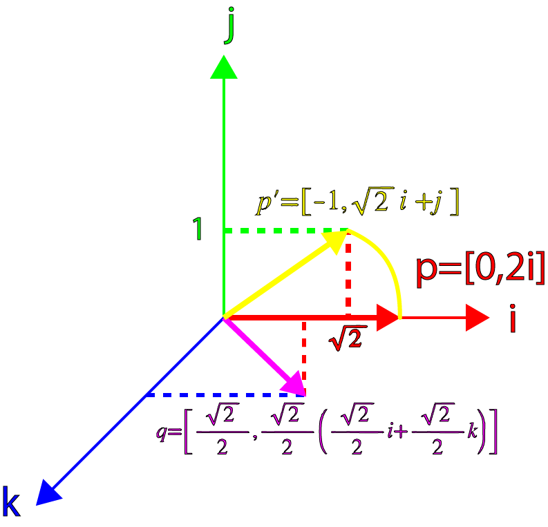
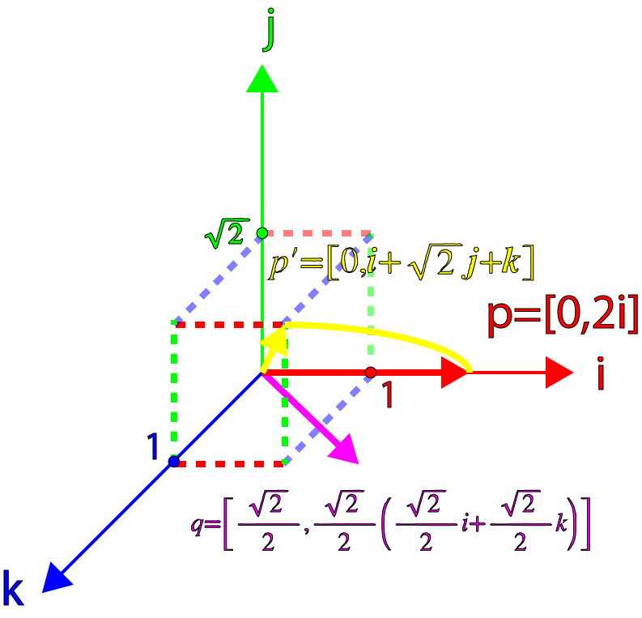

原文地址:[http://www.3dgep.com/understanding-quaternions/](http://www.3dgep.com/understanding-quaternions/)

## 正文

在这篇文章中我会尝试用简单的方式去解释四元数的概念，即用可视化的方式解释四元数以及几种对四元数的操作。我将把矩阵、欧拉角和四元数放在一起比较，并解释什么时候该用四元数、什么时候该用欧拉角或矩阵。

### 内容结构

- 介绍
- 复数
	- 复数的加减
	- 复数的系数缩放
	- 复数的积
	- 复数的平方
	- 共轭复数
	- 复数的绝对值
	- 两复数的商
- i的幂
- 复数平面
	- 旋转数（Rotors)
- 四元数
	- 作为有序数的四元数
	- 四元数的加减
	- 四元数的积
	- 实四元数
	- 四元数的系数缩放
	- 纯四元数
	- 四元数的加法形式
	- 单位四元数
	- 四元数的二元形式
	- 共轭四元数
	- 四元数范数
	- 四元数规范化
	- 四元数的逆
	- 四元数的点乘
- 旋转
- 四元数的插值
	- SLERP
		- 四元数的差
		- 四元数的指数运算
		- 2个四元数的分数差
		- 考虑？
	- SQUARD
- 结论
- 下载Demo
- 引用

<!--more-->

### 介绍

在计算机图形学中，我们使用转换矩阵来表示空间中的一个位置，以及朝向。一个转换矩阵还可以表示对一个目标的缩放或裁减(?)。	我们可以把转换矩阵想象成一个空间，当你用这个矩阵乘以向量、点（甚至矩阵）， 你就能把向量、点、矩阵转换进这个空间。

在这篇文章中，我不会讨论这个转换函数的细节。你可以查看我前面的文章，文章中描述了转换矩阵的细节。

在这篇文章中，我想要讨论一个可替代的方案，即用四元数来描述空间里的物体的朝向。

四元数的概念是由爱尔兰数学家Sir William Rowan Hamilton发明的（1843年，都柏林）。Hamilton当时正和他的妻子前往爱尔兰皇家研究院，当他从Brougham桥通过皇家运河时，他领悟到了一个激动人心的东西，并立刻把它刻在桥的一个石头上：

\\[ i\^\{2\} = j\^\{2\} = k\^\{2\} = ijk = -1 \\]

William Rowan Hamilton Plaque on Broome Bridge on the Royal Canal commemorating his discovery of the fundamental formula for quaternion multiplication.

### 复数

在我们能够完全理解四元数之前，我们必须先理解四元数是怎么来的。四元数的根源其实是**复数**。

除了知名的数集（自然数、整数、实数、分数）之外，复数系统引入了一个新的数集——虚数。虚数的发明是为了解决一些特定的无解的方程，例如；
\\[ x\^\{2\} + 1 = 0 \\]
要解决这个等式，必须让\\(x\^\{2\} = -1 \\)，在当然是不行的，因为任意数字的平方都是非负数。

一般而言，数学家是不能忍受一个等式是无解的，于是一个新的术语被发明了，它就是虚数，一个可以解决上面这个等式的数。

虚数有这样的形式：

\\[ i\^\{2\} = -1 \\]

不要为这个术语较真，因为逻辑上这个数是不存在的。只要知道i是一个平方等于-1的东西即可。

虚数的集合可以用\\( \\mathbb\{I\} \\)来表示。

复数的集合\\( \\mathbb\{C\} \\)是一个实数和一个虚数的和，形式如下：

\\[ z = a + bi \ a,b\\in R,\ i\^\{2\} = -1 \\]

可以认为所有实数都是b为0的复数、所有虚数都是a=0的复数。

### 复数的加减

加法：

\\[ (a\_\{1\} + b\_\{1\}i) + (a\_\{2\} + b\_\{2\}i) = (a\_\{1\} + a\_\{2\}) + (b\_\{1\} + b\_\{2\})i \\]

减法：

\\[ (a\_\{1\} + b\_\{1\}i) - (a\_\{2\} + b\_\{2\}i) = (a\_\{1\} - a\_\{2\}) + (b\_\{1\} - b\_\{2\})i \\]

### 复数的系数缩放

\\[ \\lambda (a\_\{1\} + b\_\{1\}i) = \\lambda  a\_\{1\} + \\lambda b\_\{1\}i \\]

### 复数的积

\\[  z\_\{1\} = (a\_\{1\} + b\_\{1\}i) \\]
\\[  z\_\{2\} = (a\_\{2\} + b\_\{2\}i) \\]
\\[  z\_\{1\}z\_\{2\} = (a\_\{1\} + b\_\{1\}i)(a\_\{2\} + b\_\{2\}i) = a\_\{1\}a\_\{2\} + a\_\{1\}b\_\{2\}i + b\_\{1\}a\_\{2\}i+b\_\{1\}b\_\{2\}i\^\{2\} \\]
\\[ z\_\{1\}z\_\{2\} = (a\_\{1\}a\_\{2\} - b\_\{1\}b\_\{2\}) + (a\_\{1\}b\_\{2\} + b\_\{1\}a\_\{2\})i \\]

### 复数的平方

\\[ z = (a + bi) \\]
\\[ z\^\{2\} = (a + bi)(a + bi) \\]
\\[ z\^\{2\} = (a\^\{2\} - b\^\{2\}) + 2abi \\]

### 共轭复数

复数的共轭就是指把复数的虚数部分变成负的。共轭复数的符号是\\(\\bar z\\)或\\(z\^\{*\}\\)。

\\[ z = (a + bi) \\]

\\[ z\^\{*\} = (a - bi) \\]

复数和它的共轭复数的乘积是：

\\[ zz\^\{*\} = (a + bi)(a - bi) = a\^\{2\}-abi+abi+b\^\{2\} = a\^\{2\}+b\^\{2\} \\]

### 复数的绝对值

我们使用共轭复数来计算复数的绝对值：

\\[ z = (a + bi) \\]

\\[ |z| = \\sqrt \{zz\^\{*\}\} = \\sqrt \{(a + bi)(a - bi)\} = \\sqrt \{a\^\{2\} + b\^\{2\} \} \\]

### 两复数的商

\\[  z\_\{1\} = (a\_\{1\} + b\_\{1\}i) \\]
\\[  z\_\{2\} = (a\_\{2\} + b\_\{2\}i) \\]
\\[ \\frac \{z\_\{1\}\}\{z\_\{2\}\} = \\frac \{a\_\{1\} + b\_\{1\}i\}\{a\_\{2\} + b\_\{2\}i\} = \\frac \{(a\_\{1\} + b\_\{1\}i)(a\_\{2\} - b\_\{2\}i)\}\{(a\_\{2\} + b\_\{2\}i)(a\_\{2\} - b\_\{2\}i)\} \\]
\\[  = \\frac \{a\_\{1\}a\_\{2\}-a\_\{1\}b\_\{2\}i+b\_\{1\}a\_\{2\}i-b\_\{1\}b\_\{2\}i\^\{2\} \}\{a\_\{2\}\^\{2\} + b\_\{2\}\^\{2\}\} \\]

\\[ = \\frac \{a\_\{1\}a\_\{2\} + b\_\{1\}b\_\{2\} \}\{a\_\{2\}\^\{2\} + b\_\{2\}\^\{2\}\}   + \\frac \{b\_\{1\}a\_\{2\} - a\_\{1\}b\_\{2\} \}\{a\_\{2\}\^\{2\} + b\_\{2\}\^\{2\}\}i \\]

## i的幂

如果i的平方等于-1，那么i的n次幂也应该存在：

\\[ i\^\{0\} = 1 \\]
\\[ i\^\{1\} = i \\]
\\[ i\^\{2\} = -1 \\]
\\[ i\^\{3\} = ii\^\{2\} = -i \\]
\\[ i\^\{4\} = i\^\{2\}i\^\{2\} = 1 \\]
\\[ i\^\{5\} = ii\^\{4\} = i \\]
\\[ i\^\{6\} = ii\^\{5\} = i\^\{2\} = -1 \\]

如果按照这个顺序写下去，会出现这样一个模式：
(1,i,-1,-i,1,...)

一个类似的模式也出现在递增的负数幂：

\\[ i\^\{0\} = 1 \\]
\\[ i\^\{-1\} = -i \\]
\\[ i\^\{-2\} = -1 \\]
\\[ i\^\{-3\} = i \\]
\\[ i\^\{-4\} = 1 \\]
\\[ i\^\{-5\} = -i \\]
\\[ i\^\{-6\} = -1 \\]

你可能已经在数学里头见过类似的模式，但是是以（x,y,-x,-y,x,...)的形式，这是在2D笛卡尔平面对一个点逆时针旋转90度时生成的；（x,-y,-x,y,x,...)则是在2D笛卡尔平面对一个点顺时针旋转90度时生成的。

 

## 复数平面

我们也能够把复数映射到一个2D网格平面——复数平面，只需要把实数映射到横轴、虚数映射到纵轴。

 
如前面的序列所示，我们可以认为，对一个复数乘以i，这个复数就在复数平面上旋转了90度。

让我们看看这是不是真的。我们随机地在复数平面上取一个点：

\\[ p = 2 + i \\]

p乘以i后得到q：
\\[ q = pi = (2+i)i = 2i+i\^\{2\} = -1+2i \\]

q乘以i后得到r：
\\[ r = qi = (-1+2i)i = -i+2i\^\{2\} = -2-i \\]

r乘以i后得到s：
\\[ s = ri = (-2-i)i = -2i-i\^\{2\} = 1-2i \\]

s乘以i后得到t：
\\[ t = si = (1-2i)i = i-2i\^\{2\} = 2+i \\]

t刚好是开始的p。如果我们把这些复数放到复数平面上，就得到下面的图：

我们也可以按顺时针方向旋转，只需要把上面的乘数i改成-i。

### 旋转数（Rotors)

我们也可以在复数平面上进行任意的旋转，只需要定义下面这个复数：
\\[q = cos\\theta +isin\\theta \\]

任意的复数乘以q：

\\[ p = a + bi \\]
\\[ q = cos\\theta + isin\\theta \\]
\\[ pq = (a + bi)(cos\\theta + isin\\theta ) \\]
\\[ a' + b'i = acos\\theta -bsin\\theta + (asin\\theta +bcos\\theta )i \\] 

也可以写成矩阵的形式：







\\[  =  \\]

这也是一个在复数平面绕原点逆时针旋转任意点的方法。

## 四元数

了解了复数系统和复数平面后，我们可以额外增加2个虚数到我们的复数系统，从而把这些概念拓展到3维空间。

四元数的一般形式：

\\[ q = s + xi + yj + zk s,x,y,z \\in \\mathbb\{R\} \\]

上面的公式是根据Hamilton的著名的表达式得到的：

\\[ i\^\{2\} = j\^\{2\} = k\^\{2\} = ijk = -1 \\]

以及：

\\[ ij = k jk = i ki = j \\]
\\[ ji = -k kj = -i ik = -j \\]

你可能已经注意到了，i、j、k之间的关系非常像笛卡尔坐标系下单位向量的叉积规则：

\\[ x\\times y = z y\\times z = x z\\times x = y \\]
\\[ y\\times x = -z z\\times y = -x x\\times z = -y \\]

Hamilton自己也发现i、j、k虚数可以被用来表达3个笛卡尔坐标系单位向量i、j、k，并且仍然保持有虚数的性质，也即\\( i\^\{2\} = j\^\{2\} = k\^\{2\} = -1 \\)。

（ij, jk, ki这几个性质的可视化）

上图展示了如何用i、j、k作为笛卡尔坐标系的单位向量。

### 作为有序数的四元数

我们可以用有序对的形式，来表示四元数：
\\[s,v] s\\in \\mathbb\{R\},v\\in \\mathbb\{R\^\{3\}\} \\]

其中的v，也可以用它各自独立的3个分量表示：

\\[ q = [s,xi + yj + zk], s,x,y,z\\in \\mathbb\{R\} \\]

使用这种表示法，我们可以更容易地展示四元数和复数之间的相似性。

### 四元数的加减

和复数类似，四元数也可以被加减：

\\[ q\_\{a\} = [s\_\{a\},a] \\]
\\[ q\_\{b\} = [s\_\{b\},b] \\]
\\[ q\_\{a\} + q\_\{b\} = [s\_\{a\} + s\_\{b\},a + b] \\]
\\[ q\_\{a\} - q\_\{b\} = [s\_\{a\} - s\_\{b\},a - b] \\]

### 四元数的积

我们也可以表示四元数的乘积：

\\[ q\_\{a\}q\_\{b\} = [s\_\{a\},a][s\_\{b\},b] \\]
\\[ = (s\_\{a\} + x\_\{a\}i + y\_\{a\}j +z\_\{a\}k)(s\_\{b\} + x\_\{b\}i + y\_\{b\}j +z\_\{b\}k) \\]
\\[ = (s\_\{a\}s\_\{b\} - x\_\{a\}x\_\{b\} - y\_\{a\}y\_\{b\} - z\_\{a\}z\_\{b\}) \\]
\\[ + (s\_\{a\}x\_\{b\} + s\_\{b\}x\_\{a\} + y\_\{a\}z\_\{b\} - y\_\{b\}z\_\{a\})i \\]
\\[ + (s\_\{a\}y\_\{b\}+s\_\{b\}y\_\{a\}+z\_\{a\}x\_\{b\}-z\_\{b\}x\_\{a\})j \\]
\\[ + (s\_\{a\}z\_\{b\}+s\_\{b\}z\_\{a\}+x\_\{a\}y\_\{b\}-x\_\{b\}y\_\{a\})k \\]

四元数的乘积依然还是一个四元数。如果我们把虚数i、j、k替换成有序对：

\\[ i = [0,i] j = [0,j] k = [0,k] \\]

以及还有[1,0] = 1，将它们代入前面的表达式，就得到了：

\\[ q\_\{a\}q\_\{b\} = (s\_\{a\}s\_\{b\} - x\_\{a\}x\_\{b\} - y\_\{a\}y\_\{b\} - z\_\{a\}z\_\{b\})[1,0] \\]
\\[ + (s\_\{a\}x\_\{b\} + s\_\{b\}x\_\{a\} + y\_\{a\}z\_\{b\} - y\_\{b\}z\_\{a\})[0,i] \\]
\\[ + (s\_\{a\}y\_\{b\}+s\_\{b\}y\_\{a\}+z\_\{a\}x\_\{b\}-z\_\{b\}x\_\{a\})[0,j] \\]
\\[ + (s\_\{a\}z\_\{b\}+s\_\{b\}z\_\{a\}+x\_\{a\}y\_\{b\}-x\_\{b\}y\_\{a\})[0,k] \\]

再把这个表达式扩展成多个有序对的和：

\\[ q\_\{a\}q\_\{b\} = [(s\_\{a\}s\_\{b\} - x\_\{a\}x\_\{b\} - y\_\{a\}y\_\{b\} - z\_\{a\}z\_\{b\}),0] \\]
\\[ + [0,(s\_\{a\}x\_\{b\} + s\_\{b\}x\_\{a\} + y\_\{a\}z\_\{b\} - y\_\{b\}z\_\{a\})i] \\]
\\[ + [0,(s\_\{a\}y\_\{b\}+s\_\{b\}y\_\{a\}+z\_\{a\}x\_\{b\}-z\_\{b\}x\_\{a\})j] \\]
\\[ + [0,(s\_\{a\}z\_\{b\}+s\_\{b\}z\_\{a\}+x\_\{a\}y\_\{b\}-x\_\{b\}y\_\{a\})k] \\]

如果把上面的式子再乘以单位四元数，并提取公共部分，就可以把等式改写成：

\\[ q\_\{a\}q\_\{b\} = [(s\_\{a\}s\_\{b\} - x\_\{a\}x\_\{b\} - y\_\{a\}y\_\{b\} - z\_\{a\}z\_\{b\}),0] \\]
\\[ + [0,s\_\{a\}(x\_\{b\}i + y\_\{b\}j+z\_\{b\}k) + s\_\{b\}(x\_\{a\}i+y\_\{a\}j+z\_\{a\}k)\\]
\\[+(y\_\{a\}z\_\{b\}-y\_\{b\}z\_\{a\})i+(z\_\{a\}x\_\{b\}-z\_\{b\}x\_\{a\})j+(x\_\{a\}y\_\{b\}-x\_\{b\}y\_\{a\})k] \\]

这个等式是2个有序对的和。第1个有序对是一个**实**四元数，第2个是一个**纯**四元数。这两个四元数也可以合并成一个：

\\[ q\_\{a\}q\_\{b\} = [(s\_\{a\}s\_\{b\} - x\_\{a\}x\_\{b\} - y\_\{a\}y\_\{b\} - z\_\{a\}z\_\{b\}), \\]
\\[ s\_\{a\}(x\_\{b\}i + y\_\{b\}j+z\_\{b\}k) + s\_\{b\}(x\_\{a\}i+y\_\{a\}j+z\_\{a\}k)\\]
\\[+(y\_\{a\}z\_\{b\}-y\_\{b\}z\_\{a\})i+(z\_\{a\}x\_\{b\}-z\_\{b\}x\_\{a\})j+(x\_\{a\}y\_\{b\}-x\_\{b\}y\_\{a\})k] \\]

如果把下面的表达式代入上面的等式：

\\[ a = x\_\{a\}i + y\_\{a\}j + z\_\{a\}k\\]
\\[ b = x\_\{b\}i + y\_\{b\}j + z\_\{b\}k\\]
\\[ a\\cdot b = x\_\{a\}x\_\{b\}i\^\{2\}+y\_\{a\}y\_\{b\}j\^\{2\}+z\_\{a\}z\_\{b\}k\^\{2\} \\]
\\[ a\\times b = (y\_\{a\}z\_\{b\}-y\_\{b\}z\_\{a\})i + (z\_\{a\}x\_\{b\} - z\_\{b\}x\_\{a\})j + (x\_\{a\}y\_\{b\} - x\_\{b\}y\_\{a\})k  \\]

我们就得到了：

\\[ q\_\{a\}q\_\{b\} = [s\_\{a\}s\_\{b\} - a\\cdot b, s\_\{a\}b+s\_\{b\}a+a\\times b] \\]

这就是四元数乘积的一般式。

### 实四元数

一个实四元数是一个虚部向量为零向量的四元数：

\\[ q = [s,0] \\]

两个实四元数的乘积是另一个实四元数：
	
\\[ q\_\{a\} = [s\_\{a\},0] \\]
\\[ q\_\{b\} = [s\_\{b\},0] \\]
\\[ q\_\{a\}q\_\{b\} = [s\_\{a\},0] [s\_\{b\},0] = [s\_\{a\}s\_\{b\},0]  \\]

这和2个虚部为0的复数的乘积几乎一样：

\\[ z\_\{1\} = a\_\{1\} + 0i \\]
\\[ z\_\{2\} = a\_\{2\} + 0i \\]
\\[ z\_\{1\}z\_\{2\} = (a\_\{1\} + 0i)(a\_\{2\} + 0i) = a\_\{1\}a\_\{2\} \\] 

### 四元数的系数缩放

我们也可以用一个系数（实数）去乘四元数：

\\[ q = [s,v] \\]
\\[ \\lambda q = \\lambda [s,v] = [\\lambda s,\\lambda v] \\]

我们可以用实四元数与普通四元数的乘积，来确认这个等式是否正确：

\\[ q = [s,v] \\]
\\[ \\lambda = [\\lambda ,0] \\]
\\[ \\lambda q = [\\lambda ,0][s,v] = [\\lambda s,\\lambda v] \\]

### 纯四元数

和实四元数相似，Hamilton也定义了纯四元数。纯四元数是s=0的四元数：

\\[ q = [0,v] \\]

也可以写成下面的形式：

\\[ q = xi + yj + zk \\]

然后是2个纯四元数的乘积：

\\[ q\_\{a\} = [0,a] \\]
\\[ q\_\{b\} = [0,b] \\]
\\[ q\_\{a\}q\_\{b\} = [0,a] [0,b] = [-a\\cdot b, a\\times b]  \\]

### 四元数的加法形式

我们可以把四元数写成实四元数和纯四元数的和：

\\[ q = [s,v] \\]
\\[ = [s,0] + [0,v] \\]

### 单位四元数

给定任意的向量v，我们可以把这个向量写成一个系数和一个单位方向向量的乘积：

\\[ v = \\upsilon \\hat \{v\}\ \ v=|v|,|\\hat \{v\}|=1\\]

将这个定义和纯四元数的定义结合，就得到了：

\\[ q = [0,v] \\]
\\[ = [0,\\upsilon \\hat \{v\}] \\]
\\[ = \\upsilon [0,\\hat \{v\}] \\]

然后，我们可以定义单位四元数了，它是一个s=0、v为单位向量的四元数：

\\[ \\hat \{q\} = [0, \\hat \{v\}] \\]

### 四元数的二元形式

我们现在可以把单位四元数的定义和四元数的加法形式结合到一起，就创造了一种新的四元数的表示法，这种表示法和复数的表示法形似：

\\[ q = [s,v] \\]
\\[ = [s,0] + [0,v] \\]
\\[ = [s,0] + \\upsilon [0,\\hat \{v\}] \\]
\\[ = s + \\upsilon \\hat \{q\} \\]

这就给了我们一种和复数非常相似的四元数表示法：

\\[ z = a + bi \\]
\\[ q = s + v\\hat \{q\} \\]

### 共轭四元数

共轭四元数的计算，就是将四元数的虚向量取反：

\\[  q = [s,v] \\]
\\[  q\^\{*\} = [s,-v] \\]

四元数和它的共轭四元数的乘积：

\\[  qq\^\{*\} = [s,v][s,-v] \\]
\\[ = [s\^\{2\} - v\\cdot -v,-sv+sv+v\\times -v] \\]
\\[ = [s\^\{2\} + v\\cdot v,0] \\]
\\[ = [s\^\{2\} + v\^\{2\},0] \\]

### 四元数范数

回忆下复数范数的定义：

\\[ |z| = \\sqrt \{a\^\{2\}+b\^\{2\}\} \\]
\\[ zz\^\{*\} = |z|\^\{2\} \\]

类似的，四元数的范数可以这样定义：

\\[ q = [s,v] \\]
\\[ |q| = \\sqrt \{s\^\{2\} + v\^\{2\}\} \\]

这也让我们可以这样表达四元数范数：

\\[ qq\^\{*\} = |q|\^\{2\} \\]

### 四元数规范化

利用四元数范数的定义，就可以对四元数进行规范化。要让一个四元数规范化，只需要让这个四元数去除以它的范数：

\\[ q' = \\frac \{q\}\{\\sqrt \{s\^\{2\}+v\^\{2\}\}\} \\]

举一个例子，让我们规范化下面这个四元数：

\\[ q = [1, 4i + 4j - 4k] \\]

第一步，先计算q的范数：

\\[ |q| = \\sqrt \{1\^\{2\}+4\^\{2\}+4\^\{2\}+(-4)\^\{2\}\} \\]
\\[ = \\sqrt \{49\} = 7 \\]

然后，q除以|q|:

\\[ q' = \\frac \{q\}\{|q|\} \\]
\\[ = \\frac \{(1+4i+4j-4k)\}\{7\} \\]
\\[ = \\frac \{1\}\{7\}+\\frac \{4\}\{7\}i+\\frac \{4\}\{7\}j-\\frac \{4\}\{7\}k \\]

### 四元数的逆

四元数的逆用\\(q\^\{-1\} \\)表示。要计算四元数的逆，需要用四元数的共轭四元数去除以四元数的范数的平方：

\\[ q\^\{-1\} = \\frac \{q\^\{*\}\}\{|q|\^\{2\} \} \\]

为了证明这个式子，我们先根据**逆**的定义，有：

\\[ qq\^\{-1\} = [1,0] = 1 \\]

两边都左乘共轭四元数\\(q\^\{*\} \\)：
\\[ q\^\{*\}qq\^\{-1\} = q\^\{*\} \\]

将上文中的\\( qq\^\{*\} = |q|\^\{2\} \\)代入这个式子，得到：

\\[ |q|\^\{2\}q\^\{-1\} = q\^\{*\} \\] 

\\[ q\^\{-1\} = \\frac \{q\^\{*\}\}\{|q|\^\{2\}\} \\] 

对于单位四元数，它的范数是1，所以可以写成：

\\[ q\^\{-1\} = q\^\{*\} \\]

### 四元数的点积

和向量的点积相似，我们也可以计算2个四元数的点积，只需要将各个对应的系数相乘，然后相加:

\\[ q\_\{1\} = [s\_\{1\},x\_\{1\}i+y\_\{1\}j+z\_\{1\}k] \\]
\\[ q\_\{2\} = [s\_\{2\},x\_\{2\}i+y\_\{2\}j+z\_\{2\}k] \\]
\\[ q\_\{1\}q\_\{2\} = s\_\{1\}s\_\{2\}+x\_\{1\}x\_\{2\}+y\_\{1\}y\_\{2\}+z\_\{1\}z\_\{2\} \\]

我们也可以利用四元数点积，来计算四元数之间的角度差：

\\[ cos\\theta = \\frac \{s\_\{1\}s\_\{2\}+x\_\{1\}x\_\{2\}+y\_\{1\}y\_\{2\}+z\_\{1\}z\_\{2\}\}\{|q\_\{1\}||q\_\{2\}|\} \\]

对于单位四元数，我们可以简化上面的等式：
\\[ cos\\theta = s\_\{1\}s\_\{2\}+x\_\{1\}x\_\{2\}+y\_\{1\}y\_\{2\}+z\_\{1\}z\_\{2\} \\]

## 旋转

前面我们定义了一个特殊的复数：旋转数。它是用来旋转2D复数平面的点的：
\\[ q = cos\\theta + isin\\theta \\]

根据四元数和复数的相似性，应该有可能设计一个可以旋转3D空间的点的四元数：
\\[ q = [cos\\theta, sin\\theta v] \\]

让我们测试一下这个理论是否可靠，方法就是计算四元数q和向量p的积。第一步，我们把p写成纯四元数的形式：

\\[ p = [0,\\textbf \{p\}] \\]

以及单位四元数q：

\\[ q = [s,\\lambda \\hat \{v\}] \\]

从而：

\\[ p' = qp = [s,\\lambda \\hat \{v\}] [0,\\textbf \{p\}] \\]
\\[ =  [-\\lambda \\hat \{v\}\\cdot \\textbf \{p\}, s\\textbf \{p\} + \\lambda \\hat \{v\}\\times \\textbf \{p\} ] \\]

我们可以看到结果是一个同时有系数、有虚向量的四元数。

让我们先考虑特殊的情形：\\( \\textbf \{p\} \\)与\\( \\hat \{v\} \\)正交。这种情况下，点乘部分等于0：\\(-\\lambda \\hat \{v\}\\cdot \\textbf \{p\} = 0\\)。所以上面的四元数就变成了纯四元数：

\\[ p' =  [0, s\\textbf \{p\} + \\lambda \\hat \{v\}\\times \\textbf \{p\}] \\]

这时候，要使\\( \\textbf \{p\} \\)绕\\( \\hat \{v\} \\)旋转，我们只需要代入\\(s=cos\\theta \\)和\\( \\lambda =sin\\theta \\)：

\\[ p' =  [0, cos\\theta \\textbf \{p\} + sin\\theta \\hat \{v\}\\times \\textbf \{p\}] \\]

现在，让我们找一个例子来测试上面的公式。譬如绕z轴(就是k轴)旋转45度，那么我们的四元数q就变成：

\\[ q = [cos\\theta ,sin\\theta k] \\]
\\[ = [\\frac \{\\sqrt \{2\}\}\{2\},\\frac \{\\sqrt \{2\}\}\{2\}k] \\]

然后，选一个特殊的向量p，并且p要和k轴正交，譬如把在p放到i轴上，也就是：
\\[ p = [0, 2i] \\]

好了，现在计算下qp：

\\[ p' = qp \\]
\\[ = [\\frac \{\\sqrt \{2\}\}\{2\},\\frac \{\\sqrt \{2\}\}\{2\}k] [0,2i] \\]
\\[ = [0,2\\frac \{\\sqrt \{2\}\}\{2\}i + 2\\frac \{\\sqrt \{2\}\}\{2\}k\\times i]  \\]
\\[  = [0, \\sqrt \{2\}i + \\sqrt \{2\}j] \\]

结果是一个绕了k轴转了45度的纯四元数。
我们可以确认这个四元数的向量部分的长度是：

\\[  p' = \\sqrt \{ \\sqrt \{2\}\^\{2\} + \\sqrt \{2\}\^\{2\} \}  =  2 \\]

这正是我们所期望的！

我们可以用图像展示旋转过程：

现在，让我们考虑更一般化的四元数，即和p不正交的四元数。现在让我们把p的向量部分偏移45度：

\\[ \\hat \{v\} = \\frac \{\\sqrt \{2\}\}\{2\}i + \\frac \{\\sqrt \{2\}\}\{2\}k \\]

\\[ p = 2i \\]

\\[ q = [cos\\theta , sin\\theta \\hat \{v\}] \\]

\\[ p = [0, \\textbf \{p\}] \\]

然后算qp：

\\[ p' = qp \\]
\\[ = [cos\\theta ,sin\\theta \\hat \{v\}] [0, \\mathbf \{p\} ]  \\]
\\[ [-sin\\theta \\hat \{v\}\\cdot \\mathbf \{p\}, cos\\theta \\mathbf \{p\}+sin\\theta \\hat \{v\}\\times \\mathbf \{p\}] \\]

代入我们设定的\\(\\hat \{v\}, \\mathbf \{p\}\\)，以及\\(\\theta = 45\^\{\\circ \} \\)，得到：

\\[ p' = [-\\frac \{\\sqrt \{2\}\}\{2\}(\\frac \{\\sqrt \{2\}\}\{2\}i + \\frac \{\\sqrt \{2\}\}\{2\}k)\\cdot (2i), \\frac \{\\sqrt \{2\}\}\{2\}2i+\\frac \{\\sqrt \{2\}\}\{2\}(\\frac \{\\sqrt \{2\}\}\{2\}i + \\frac \{\\sqrt \{2\}\}\{2\}k)\\times 2i] \\]
\\[ = [-1, \\sqrt \{2\}i + j] \\]
注意，算出来的结果已经不是纯四元数了，并且，它并没有旋转45度、范数也不再是2(反而变小了，变成\\(\\sqrt \{3\}\\))

我们可以用图像展示旋转过程：

> 严格来说，这样子在3维空间中表示\\(p'\\)是不正确的。因为它其实是一个4维的向量！为了简单起见，我只讲这个四元数的向量部分显示出来。

然而，还有一线生机。Hamilton发现（但没有正式宣布），如果对qp右乘q的逆，出来的结果是一个纯四元数，并且四元数向量部分的范数可以保持不变。让我们试试应用在我们的例子里。

首先计算:

\\[ q =  [cos\\theta ,  sin\\theta (\\frac \{\\sqrt \{2\}\}\{2\}i + \\frac \{\\sqrt \{2\}\}\{2\}k)] \\]

\\[ q\^\{-1\} =  [cos\\theta ,  -sin\\theta (\\frac \{\\sqrt \{2\}\}\{2\}i + \\frac \{\\sqrt \{2\}\}\{2\}k)] \\]

再代入\\(\\theta = 45\^\{\\circ \} \\)，得到：

\\[ q\^\{-1\} =  [\\frac \{\\sqrt \{2\}\}\{2\},  -\\frac \{\\sqrt \{2\}\}\{2\}(\\frac \{\\sqrt \{2\}\}\{2\}i + \\frac \{\\sqrt \{2\}\}\{2\}k)] \\]

\\[ \\frac \{1\}\{2\}[\\sqrt \{2\}, -i-k] \\]

现在，把前面算出来的qp再次拿出来：

\\[ qp = [-1, \\sqrt \{2\}i + j] \\]
\\[ qpq\^\{-1\}  = [-1, \\sqrt \{2\}i + j]\\frac \{1\}\{2\}[\\sqrt \{2\}, -i-k] \\]
\\[ = \\frac \{1\}\{2\}[-\\sqrt \{2\}-(\\sqrt \{2\}i+j)\\cdot (-i-k), i+k+\\sqrt \{2\}(\\sqrt \{2\}i+j)-i+\\sqrt \{2\}j+k] \\]
\\[ = \\frac \{1\}\{2\}[-\\sqrt \{2\}+\\sqrt \{2\},i+k+2i+\\sqrt \{2\}j-i+\\sqrt \{2\}j+k] \\]
\\[ = [0,i+\\sqrt \{2\}j+k] \\]

这下是纯四元数了，并且它的范数是：

\\[ |qpq\^\{-1\}| = \\sqrt \{1\^\{2\} + \\sqrt \{2\}\^\{2\} + 1\^\{2\} \} = \\sqrt \{4\} = 2 \\]

这和原始的p的范数一致。

下面的图像展示了旋转结果：

所以我们可以看到，这个结果是一个纯四元数，并且原四元数的向量的范数也保持住了。但是还有一个问题：向量被旋转了90度而不是45度。这刚好是我们需要的度数的两倍！为了正确地让一个向量绕某个轴向量旋转某个角度，我们必须以目标角度的一半来计算。因此，我们构造了下面的四元数：

\\[ q = [cos\\frac \{1\}\{2\}\\theta ,sin\\frac \{1\}\{2\}\\theta \\hat \{v\}] \\]

这就是**旋转四元数**的一般形式！

## 四元数插值

在计算机图形学中使用四元数，其中一个重要原因是四元数非常适合用来表示空间中的旋转。四元数解决
了其他3维空间旋转算法会遇到的恼人的问题，比如使用欧拉角来表示旋转操作时会遇到的万向节锁问题。

使用四元数，我们可以定义好几种方案来表示3维空间的转动插值。第一种是SLERP，它被用来把一个点(物体)从一个朝向平滑地插值到另一个朝向。第二个是SLERP的扩展版本，被称为SQAD，它被用来处理，用一系列朝向定义得到的一条路径的插值。

## SLERP 

SLERP代表**S**pherical **L**inear Int**erp**olation。SLERP可以在2个朝向之间平滑地插值。

第一个朝向设为\\( q\_\{1\}\\)，第二个朝向设为\\( q\_\{2\}\\)。被插值前的点设为\\( \\mathbf \{p\} \\)，插值后的点设为\\( \\mathbf \{p\}' \\)。而插值参数t，当t=0时会把\\(\\mathbf \{p\}\\)转到\\( q\_\{1\}\\)，当t=1时会转到\\( q\_\{2\}\\)。

标准的线性插值公式是：

\\[ \\mathbf \{p\}' = \\mathbf \{p\}\_\{1\} + t(\\mathbf \{p\}\_\{2\} - \\mathbf \{p\}\_\{1\} ) \\]

应用这个等式的一般步骤是：

- 计算\\( \\mathbf \{p\}\_\{1\} 、\\mathbf \{p\}\_\{2\}\\)之间的差。
- 根据参数t，计算两个点的差的小数值(因为0<=t<=1)
- 把第二步的值加上原始点的值，算出结果

我们可以把这个基础公式，套用到2个四元数朝向的插值上。

### 四元数的差

根据上面的公式的第一步，我们必须先计算\\( q\_\{1\}, q\_\{2\}\\)的差。对于四元数来说，这等价于计算2个四元数的角度差：

\\[ diff =  q\_\{1\}\^\{-1\}q\_\{2\} \\]

（译注：这个公式用到了上述的四元数点积公式）

### 四元数的指数

接下来是计算上面的角度差的分数值，方法是计算四元数的幂(0到1)。

四元数的指数的一般化公式是：

\\[ q\^\{n\} = exp(t \\log q) \\]

其中，(纯)四元数的exp函数的公式是：

\\[ e\^\{q\} = exp(q) = exp([0,\\theta \\hat \{v\}]) \\]
\\[ = [cos\\theta ,sin\\theta \\hat \{v\} ] \\]

(纯)四元数的对数公式是：

\\[ \\log q = \\log (cos\\theta + sin \\theta \\hat \{v\}) \\]
\\[ = \\log (exp(\\theta \\hat \{v\} )) \\]
\\[ = \\theta \\hat \{v\} \\]
\\[ = [0, \\theta \\hat \{v\}] \\]

(译注：上述的2次公式推导，其实省略了很多证明过程。具体可以参考：[http://bpeers.com/blog/?itemid=861](http://bpeers.com/blog/?itemid=861),[http://bpeers.com/blog/?itemid=863](http://bpeers.com/blog/?itemid=863),[http://bpeers.com/blog/?itemid=866](http://bpeers.com/blog/?itemid=866), [http://bpeers.com/blog/?itemid=1001](http://bpeers.com/blog/?itemid=1001) )

对于t = 0，我们有：

\\[ q\^\{0\} = exp(0\\log q) \\]
\\[ = exp([cos(0), sin(0)\\hat \{v\}]) \\]
\\[ = exp([1,0]) \\]
\\[ = [1,0] \\]

而对于t = 1，有：

\\[ q\^\{0\} = exp(1\\log q) = q \\]

### 2个四元数的分数差

对于角旋转的插值计算，我们利用q1和q2的角度分数差来调整原始朝向q1：

\\[ q' = q\_\{1\}(q\_\{1\}\^\{-1\}q\_\{2\})\^\{t\} \\]

这也就是使用四元数的球面线性插值的一般形式。然而，这不是slerp函数的常用形式。

我们可以应用类似的用于计算向量的球面插值公式，到四元数里。计算向量的球面插值的一般形式定义如下：

\\[ v\_\{t\} = \\frac \{sin((1-t)\\theta )\}\{sin\\theta \}v\_\{1\} + \\frac \{sin(t\\theta )\}\{sin\\theta \}v\_\{2\} \\]

用图像表示如下：

这个公式可以原封不动地应用到四元数：

\\[ q\_\{t\} = \\frac \{sin((1-t)\\theta )\}\{sin\\theta \}q\_\{1\} + \\frac \{sin(t\\theta )\}\{sin\\theta \}q\_\{2\} \\]

我们可以计算\\(q\_\{1\}\\)和\\(q\_\{2\}\\)的点积从而得出角度\\(\\theta \\)：

\\[ cos\\theta  = \\frac \{q\_\{1\}\\cdot q\_\{2\}\}\{ |q\_\{1\}||q\_\{2\}| \} \\]

\\[ cos\\theta = \\frac \{s\_\{1\}s\_\{2\}+x\_\{1\}x\_\{2\}+y\_\{1\}y\_\{2\}+z\_\{1\}z\_\{2\}\}\{|q\_\{1\}||q\_\{2\}|\} \\]

\\[ \\theta = cos\^\{-1\}(\\frac \{s\_\{1\}s\_\{2\}+x\_\{1\}x\_\{2\}+y\_\{1\}y\_\{2\}+z\_\{1\}z\_\{2\}\}\{|q\_\{1\}||q\_\{2\}|\}) \\]

### 注意事项

这个方案有2个问题，必须在实现过程中加以考虑。

第一，如果四元数点积的结果是负值，那么后面的插值就会在4D球面上绕远路，这并不是我们想要的。为了解决这个问题，我们测试点积的结果，当结果是负值时，我们将2个四元数的其中一个取反，取反它的系数和向量部分，并不会改变它代表的朝向。而经过这一步操作，可以保证这个旋转走的是最短路径。

当\\(q\_\{1\}\\)和\\(q\_\{2\}\\)的角度差非常小，小到导致\\(sin\\theta = 0\\)时，会出现第二个问题。如果这个情况出现了，当我们除以\\(sin\\theta\\)时就会得到一个未定义的结果。在这个情况下，我们可以回退去使用\\(q\_\{1\}\\)和\\(q\_\{2\}\\)的线性插值。

## SQUAD

正如一个SLERP可以被用来计算四元数之间的插值，一个SQUAD (**S**pherical and **Quad**rangle)可以被用来对旋转路径进行平滑插值。

如果我们有四元数序列：

\\[ q\_\{1\},q\_\{2\},q\_\{3\},\\cdots,q\_\{n-2\},q\_\{n-1\},q\_\{n\}\\]

然后我们再定义一个"辅助"四元数(\\(s\_\{i\}\\))，它是一个中间控制点：

\\[ s\_\{i\} = exp( - \\frac \{\\log(q\_\{i+1\}q\_\{i\}\^\{-1\})+\\log(q\_\{i-1\}q\_\{i\}\^\{-1\})\}\{4\})q\_\{i\} \\]

所以，沿着子曲线的朝向可以定义为：

\\[ q\_\{i-1\},q\_\{i\},q\_\{i+1\},q\_\{i+2\} \\]

在t时刻的朝向就是：

\\[ squad(q\_\{i\},q\_\{i+1\},s\_\{i\},s\_\{i+1\},t ) = slerp(slerp(q\_\{i\},q\_\{i+1\},t),slerp(s\_\{i\},s\_\{i+1\},t),2t(1-t)) \\]

## 总结

除了特别难理解之外，相比矩阵或欧拉角，四元数在表示旋转这个事情上，拥有一些明显的优点。

- SLERP和SQUAD，提供了一种使得在朝向之间可以平滑过渡的方法。

- 使用四元数来串联"旋转"，要比使用矩阵快得多。

- 对于单位四元数，逆向旋转可以通过对向量部分取反来实现。而计算一个矩阵的逆矩阵是被认为比较慢的，如果这个矩阵未被标准正交化的话(标准正交矩阵的逆矩阵是它的转置矩阵)。

- 从四元数转换到矩阵，要比从欧拉角转换到矩阵快一点。

- 四元数只需要4个数字(如果旋转四元数已经单位化了那么只需要3个，实数部分可以在运行时计算)来表示一个旋转，而矩阵需要至少9个数字。

尽管使用四元数有这么多优点，还是有缺点存在的。

- 因为浮点数的舍入运算错误，四元数可能会变无效。不过，这个错误可以通过重新单位化四元数来避免。

- 使用四元数最具威慑性的地方，还是四元数的理解难度大。我希望这个问题可以通过阅读本文来解决。

存在一些已经实现了四元数、并且是正确的的数学程序库。在我的个人经验里，我发现GLM(OpenGL Math Library)是一个优秀的数学库，它的四元数的实现极其不错。如果你对在你的程序中使用四元数感兴趣，那么我会推荐你使用这个数学库。

## 下载Demo

我实现了一个小demo来演示一个四元数如何被用来旋转一个3维物体。这个demo是用Unity3.5.2实现的，你可以免费下载它和阅读它的脚本。zip文件也包含了一个Windows版的Unity程序。当然你可以自己构建一个Mac的版本。

[Understanding Quaternions.zip](https://docs.google.com/open?id=0B0ND0J8HHfaXdzM0dmdGUzBLV1U)