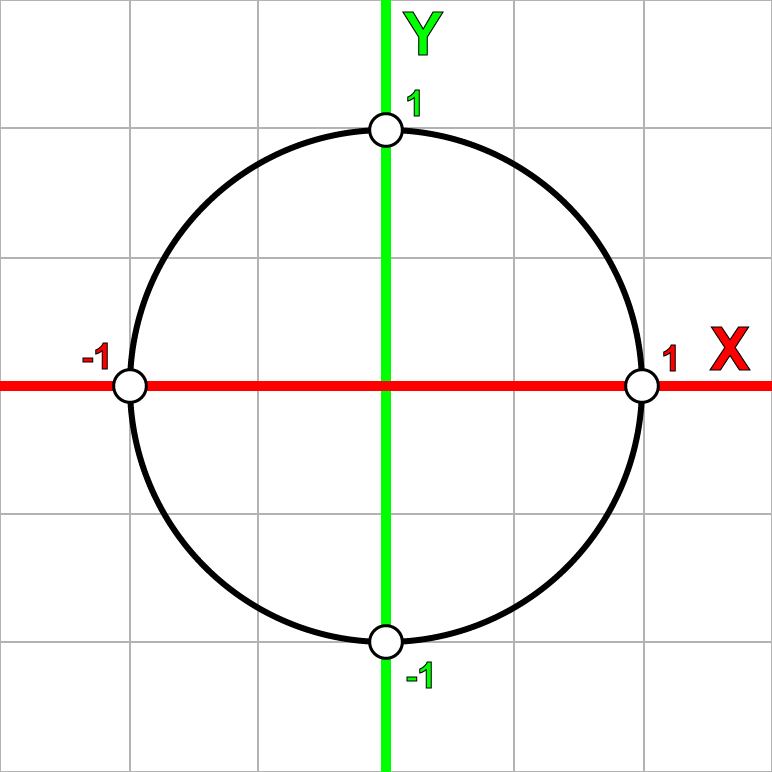

原文地址:[http://www.3dgep.com/understanding-quaternions/](http://www.3dgep.com/understanding-quaternions/)

## 正文

在这篇文章中我会尝试用简单的方式去解释四元数的概念，即用可视化的方式解释四元数以及几种对四元数的操作。我将把矩阵、欧拉角和四元数放在一起比较，并解释什么时候该用四元数、什么时候该用欧拉角或矩阵。

### 内容结构

- 介绍
- 复数
### 复数的加减
### 复数的系数缩放
### 复数的积
### 复数的平方
### 共轭复数
### 复数的绝对值
### 两复数的商
- i的幂
- 复数平面
### 旋转数（Rotors)
- 四元数
### 作为有序数的四元数
### 四元数的加减
### 四元数的积
### 实四元数
### 四元数的系数缩放
### 纯四元数
### 四元数的加法形式
### 单位四元数
### 四元数的二元形式
### 共轭四元数
### 四元数规范
### 四元数规范化
### 四元数的逆
### 四元数的点乘
- 旋转
- 四元数的插值
### SLERP
	### 四元数的差
	### 四元数求幂运算
	### 四元数的分数差
	### 考虑？
### SQUARD
- 结论
- 下载Demo
- 引用

### 介绍

在计算机图形学中，我们使用转换矩阵来表示空间中的一个位置，以及朝向。一个转换矩阵还可以表示对一个目标的缩放或裁减(?)。	我们可以把转换矩阵想象成一个空间，当你用这个矩阵乘以向量、点（甚至矩阵）， 你就能把向量、点、矩阵转换进这个空间。

在这篇文章中，我不会讨论这个转换函数的细节。你可以查看我前面的文章，文章中描述了转换矩阵的细节。

在这篇文章中，我想要讨论一个可替代的方案，即用四元数来描述空间里的物体的朝向。

四元数的概念是由爱尔兰数学家Sir William Rowan Hamilton发明的（1843年，都柏林）。Hamilton当时正和他的妻子前往爱尔兰皇家研究院，当他从Brougham桥通过皇家运河时，他领悟到了一个激动人心的东西，并立刻把它刻在桥的一个石头上：

\\[ i\^\{2\} = j\^\{2\} = k\^\{2\} = ijk = -1 \\]

William Rowan Hamilton Plaque on Broome Bridge on the Royal Canal commemorating his discovery of the fundamental formula for quaternion multiplication.

### 复数

在我们能够完全理解四元数之前，我们必须先理解四元数是怎么来的。四元数的根源其实是**复数**。

除了知名的数集（自然数、整数、实数、分数）之外，复数系统引入了一个新的数集——虚数。虚数的发明是为了解决一些特定的无解的方程，例如；
\\[ x\^\{2\} + 1 = 0 \\]
要解决这个等式，必须让\\(x\^\{2\} = -1 \\)，在当然是不行的，因为任意数字的平方都是非负数。

一般而言，数学家是不能忍受一个等式是无解的，于是一个新的术语被发明了，它就是虚数，一个可以解决上面这个等式的数。

虚数有这样的形式：

\\[ i\^\{2\} = -1 \\]

不要为这个术语较真，因为逻辑上这个数是不存在的。只要知道i是一个平方等于-1的东西即可。

虚数的集合可以用\\( \\mathbb\{I\} \\)来表示。

复数的集合\\( \\mathbb\{C\} \\)是一个实数和一个虚数的和，形式如下：

\\[ z = a + bi \ a,b\\in R,\ i\^\{2\} = -1 \\]

可以认为所有实数都是b为0的复数、所有虚数都是a=0的复数。

### 复数的加减

加法：

\\[ (a\_\{1\} + b\_\{1\}i) + (a\_\{2\} + b\_\{2\}i) = (a\_\{1\} + a\_\{2\}) + (b\_\{1\} + b\_\{2\})i \\]

减法：

\\[ (a\_\{1\} + b\_\{1\}i) - (a\_\{2\} + b\_\{2\}i) = (a\_\{1\} - a\_\{2\}) + (b\_\{1\} - b\_\{2\})i \\]

### 复数的系数缩放

\\[ \\lambda (a\_\{1\} + b\_\{1\}i) = \\lambda  a\_\{1\} + \\lambda b\_\{1\}i \\]

### 复数的积

\\[  z\_\{1\} = (a\_\{1\} + b\_\{1\}i) \\]
\\[  z\_\{2\} = (a\_\{2\} + b\_\{2\}i) \\]
\\[  z\_\{1\}z\_\{2\} = (a\_\{1\} + b\_\{1\}i)(a\_\{2\} + b\_\{2\}i) = a\_\{1\}a\_\{2\} + a\_\{1\}b\_\{2\}i + b\_\{1\}a\_\{2\}i+b\_\{1\}b\_\{2\}i\^\{2\} \\]
\\[ z\_\{1\}z\_\{2\} = (a\_\{1\}a\_\{2\} - b\_\{1\}b\_\{2\}) + (a\_\{1\}b\_\{2\} + b\_\{1\}a\_\{2\})i \\]

### 复数的平方

\\[ z = (a + bi) \\]
\\[ z\^\{2\} = (a + bi)(a + bi) \\]
\\[ z\^\{2\} = (a\^\{2\} - b\^\{2\}) + 2abi \\]

### 共轭复数

复数的共轭就是指把复数的虚数部分变成负的。共轭复数的符号是\\(\\bar z\\)或\\(z\^\{*\}\\)。

\\[ z = (a + bi) \\]

\\[ z\^\{*\} = (a - bi) \\]

复数和它的共轭复数的乘积是：

\\[ zz\^\{*\} = (a + bi)(a - bi) = a\^\{2\}-abi+abi+b\^\{2\} = a\^\{2\}+b\^\{2\} \\]

### 复数的绝对值

我们使用共轭复数来计算复数的绝对值：

\\[ z = (a + bi) \\]

\\[ |z| = \\sqrt \{zz\^\{*\}\} = \\sqrt \{(a + bi)(a - bi)\} = \\sqrt \{a\^\{2\} + b\^\{2\} \} \\]

### 两复数的商

\\[  z\_\{1\} = (a\_\{1\} + b\_\{1\}i) \\]
\\[  z\_\{2\} = (a\_\{2\} + b\_\{2\}i) \\]
\\[ \\frac \{z\_\{1\}\}\{z\_\{2\}\} = \\frac \{a\_\{1\} + b\_\{1\}i\}\{a\_\{2\} + b\_\{2\}i\} = \\frac \{(a\_\{1\} + b\_\{1\}i)(a\_\{2\} - b\_\{2\}i)\}\{(a\_\{2\} + b\_\{2\}i)(a\_\{2\} - b\_\{2\}i)\} \\]
\\[  = \\frac \{a\_\{1\}a\_\{2\}-a\_\{1\}b\_\{2\}i+b\_\{1\}a\_\{2\}i-b\_\{1\}b\_\{2\}i\^\{2\} \}\{a\_\{2\}\^\{2\} + b\_\{2\}\^\{2\}\} \\]

\\[ = \\frac \{a\_\{1\}a\_\{2\} + b\_\{1\}b\_\{2\} \}\{a\_\{2\}\^\{2\} + b\_\{2\}\^\{2\}\}   + \\frac \{b\_\{1\}a\_\{2\} - a\_\{1\}b\_\{2\} \}\{a\_\{2\}\^\{2\} + b\_\{2\}\^\{2\}\}i \\]

## i的幂

如果i的平方等于-1，那么i的n次幂也应该存在：

\\[ i\^\{0\} = 1 \\]
\\[ i\^\{1\} = i \\]
\\[ i\^\{2\} = -1 \\]
\\[ i\^\{3\} = ii\^\{2\} = -i \\]
\\[ i\^\{4\} = i\^\{2\}i\^\{2\} = 1 \\]
\\[ i\^\{5\} = ii\^\{4\} = i \\]
\\[ i\^\{6\} = ii\^\{5\} = i\^\{2\} = -1 \\]

如果按照这个顺序写下去，会出现这样一个模式：
(1,i,-1,-i,1,...)

一个类似的模式也出现在递增的负数幂：

\\[ i\^\{0\} = 1 \\]
\\[ i\^\{-1\} = -i \\]
\\[ i\^\{-2\} = -1 \\]
\\[ i\^\{-3\} = i \\]
\\[ i\^\{-4\} = 1 \\]
\\[ i\^\{-5\} = -i \\]
\\[ i\^\{-6\} = -1 \\]

你可能已经在数学里头见过类似的模式，但是是以（x,y,-x,-y,x,...)的形式，这是在2D笛卡尔平面对一个点逆时针旋转90度时生成的；（x,-y,-x,y,x,...)则是在2D笛卡尔平面对一个点顺时针旋转90度时生成的。

 

## 复数平面

我们也能够把复数映射到一个2D网格平面——复数平面，只需要把实数映射到横轴、虚数映射到纵轴。

 
如前面的序列所示，我们可以认为，对一个复数乘以i，这个复数就在复数平面上旋转了90度。

让我们看看这是不是真的。我们随机地在复数平面上取一个点：

\\[ p = 2 + i \\]

p乘以i后得到q：
\\[ q = pi = (2+i)i = 2i+i\^\{2\} = -1+2i \\]

q乘以i后得到r：
\\[ r = qi = (-1+2i)i = -i+2i\^\{2\} = -2-i \\]

r乘以i后得到s：
\\[ s = ri = (-2-i)i = -2i-i\^\{2\} = 1-2i \\]

s乘以i后得到t：
\\[ t = si = (1-2i)i = i-2i\^\{2\} = 2+i \\]

t刚好是开始的p。如果我们把这些复数放到复数平面上，就得到下面的图：

我们也可以按顺时针方向旋转，只需要把上面的乘数i改成-i。

### 旋转数（Rotors)

我们也可以在复数平面上进行任意的旋转，只需要定义下面这个复数：
\\[q = cos\\theta +isin\\theta \\]

任意的复数乘以q：

\\[ p = a + bi \\]
\\[ q = cos\\theta + isin\\theta \\]
\\[ pq = (a + bi)(cos\\theta + isin\\theta ) \\]
\\[ a' + b'i = acos\\theta -bsin\\theta + (asin\\theta +bcos\\theta )i \\] 

也可以写成矩阵的形式：







\\[  =  \\]

这也是一个在复数平面绕原点逆时针旋转任意点的方法。

## 四元数

了解了复数系统和复数平面后，我们可以额外增加2个虚数到我们的复数系统，从而把这些概念拓展到3维空间。

四元数的一般形式：

\\[ q = s + xi + yj + zk s,x,y,z \\in \\mathbb\{R\} \\]

上面的公式是根据Hamilton的著名的表达式得到的：

\\[ i\^\{2\} = j\^\{2\} = k\^\{2\} = ijk = -1 \\]

以及：

\\[ ij = k jk = i ki = j \\]
\\[ ji = -k kj = -i ik = -j \\]

你可能已经注意到了，i、j、k之间的关系非常像笛卡尔坐标系下单位向量的叉积规则：

\\[ x\\times y = z y\\times z = x z\\times x = y \\]
\\[ y\\times x = -z z\\times y = -x x\\times z = -y \\]

Hamilton自己也发现i、j、k虚数可以被用来表达3个笛卡尔坐标系单位向量i、j、k，并且仍然保持有虚数的性质，也即\\( i\^\{2\} = j\^\{2\} = k\^\{2\} = -1 \\)。

（ij, jk, ki这几个性质的可视化）

上图展示了如何用i、j、k作为笛卡尔坐标系的单位向量。

### 作为有序数的四元数

我们可以用有序对的形式，来表示四元数：
\\[s,v] s\\in \\mathbb\{R\},v\\in \\mathbb\{R\^\{3\}\} \\]

其中的v，也可以用它各自独立的3个分量表示：

\\[ q = [s,xi + yj + zk], s,x,y,z\\in \\mathbb\{R\} \\]

使用这种表示法，我们可以更容易地展示四元数和复数之间的相似性。

### 四元数的加减

和复数类似，四元数也可以被加减：

\\[ q\_\{a\} = [s\_\{a\},a] \\]
\\[ q\_\{b\} = [s\_\{b\},b] \\]
\\[ q\_\{a\} + q\_\{b\} = [s\_\{a\} + s\_\{b\},a + b] \\]
\\[ q\_\{a\} - q\_\{b\} = [s\_\{a\} - s\_\{b\},a - b] \\]

### 四元数的积

我们也可以表示四元数的乘积：

\\[ q\_\{a\}q\_\{b\} = [s\_\{a\},a][s\_\{b\},b] \\]
\\[ = (s\_\{a\} + x\_\{a\}i + y\_\{a\}j +z\_\{a\}k)(s\_\{b\} + x\_\{b\}i + y\_\{b\}j +z\_\{b\}k) \\]
\\[ = (s\_\{a\}s\_\{b\} - x\_\{a\}x\_\{b\} - y\_\{a\}y\_\{b\} - z\_\{a\}z\_\{b\}) \\]
\\[ + (s\_\{a\}x\_\{b\} + s\_\{b\}x\_\{a\} + y\_\{a\}z\_\{b\} - y\_\{b\}z\_\{a\})i \\]
\\[ + (s\_\{a\}y\_\{b\}+s\_\{b\}y\_\{a\}+z\_\{a\}x\_\{b\}-z\_\{b\}x\_\{a\})j \\]
\\[ + (s\_\{a\}z\_\{b\}+s\_\{b\}z\_\{a\}+x\_\{a\}y\_\{b\}-x\_\{b\}y\_\{a\})k \\]

四元数的乘积依然还是一个四元数。如果我们把虚数i、j、k替换成有序对：

\\[ i = [0,i] j = [0,j] k = [0,k] \\]

以及还有[1,0] = 1，将它们代入前面的表达式，就得到了：

\\[ q\_\{a\}q\_\{b\} = (s\_\{a\}s\_\{b\} - x\_\{a\}x\_\{b\} - y\_\{a\}y\_\{b\} - z\_\{a\}z\_\{b\})[1,0] \\]
\\[ + (s\_\{a\}x\_\{b\} + s\_\{b\}x\_\{a\} + y\_\{a\}z\_\{b\} - y\_\{b\}z\_\{a\})[0,i] \\]
\\[ + (s\_\{a\}y\_\{b\}+s\_\{b\}y\_\{a\}+z\_\{a\}x\_\{b\}-z\_\{b\}x\_\{a\})[0,j] \\]
\\[ + (s\_\{a\}z\_\{b\}+s\_\{b\}z\_\{a\}+x\_\{a\}y\_\{b\}-x\_\{b\}y\_\{a\})[0,k] \\]

再把这个表达式扩展成多个有序对的和：

\\[ q\_\{a\}q\_\{b\} = [(s\_\{a\}s\_\{b\} - x\_\{a\}x\_\{b\} - y\_\{a\}y\_\{b\} - z\_\{a\}z\_\{b\}),0] \\]
\\[ + [0,(s\_\{a\}x\_\{b\} + s\_\{b\}x\_\{a\} + y\_\{a\}z\_\{b\} - y\_\{b\}z\_\{a\})i] \\]
\\[ + [0,(s\_\{a\}y\_\{b\}+s\_\{b\}y\_\{a\}+z\_\{a\}x\_\{b\}-z\_\{b\}x\_\{a\})j] \\]
\\[ + [0,(s\_\{a\}z\_\{b\}+s\_\{b\}z\_\{a\}+x\_\{a\}y\_\{b\}-x\_\{b\}y\_\{a\})k] \\]

如果把上面的式子再乘以单位四元数，并提取公共部分，就可以把等式改写成：

\\[ q\_\{a\}q\_\{b\} = [(s\_\{a\}s\_\{b\} - x\_\{a\}x\_\{b\} - y\_\{a\}y\_\{b\} - z\_\{a\}z\_\{b\}),0] \\]
\\[ + [0,s\_\{a\}(x\_\{b\}i + y\_\{b\}j+z\_\{b\}k) + s\_\{b\}(x\_\{a\}i+y\_\{a\}j+z\_\{a\}k)\\]
\\[+(y\_\{a\}z\_\{b\}-y\_\{b\}z\_\{a\})i+(z\_\{a\}x\_\{b\}-z\_\{b\}x\_\{a\})j+(x\_\{a\}y\_\{b\}-x\_\{b\}y\_\{a\})k] \\]

这个等式是2个有序对的和。第1个有序对是一个**实**四元数，第2个是一个**纯**四元数。这两个四元数也可以合并成一个：

\\[ q\_\{a\}q\_\{b\} = [(s\_\{a\}s\_\{b\} - x\_\{a\}x\_\{b\} - y\_\{a\}y\_\{b\} - z\_\{a\}z\_\{b\}), \\]
\\[ s\_\{a\}(x\_\{b\}i + y\_\{b\}j+z\_\{b\}k) + s\_\{b\}(x\_\{a\}i+y\_\{a\}j+z\_\{a\}k)\\]
\\[+(y\_\{a\}z\_\{b\}-y\_\{b\}z\_\{a\})i+(z\_\{a\}x\_\{b\}-z\_\{b\}x\_\{a\})j+(x\_\{a\}y\_\{b\}-x\_\{b\}y\_\{a\})k] \\]

如果把下面的表达式代入上面的等式：

\\[ a = x\_\{a\}i + y\_\{a\}j + z\_\{a\}k\\]
\\[ b = x\_\{b\}i + y\_\{b\}j + z\_\{b\}k\\]
\\[ a\\cdot b = x\_\{a\}x\_\{b\}i\^\{2\}+y\_\{a\}y\_\{b\}j\^\{2\}+z\_\{a\}z\_\{b\}k\^\{2\} \\]
\\[ a\\times b = (y\_\{a\}z\_\{b\}-y\_\{b\}z\_\{a\})i + (z\_\{a\}x\_\{b\} - z\_\{b\}x\_\{a\})j + (x\_\{a\}y\_\{b\} - x\_\{b\}y\_\{a\})k  \\]

我们就得到了：

\\[ q\_\{a\}q\_\{b\} = [s\_\{a\}s\_\{b\} - a\\cdot b, s\_\{a\}b+s\_\{b\}a+a\\times b] \\]

这就是四元数乘积的一般式。

### 实四元数

一个实四元数是一个虚部向量为零向量的四元数：

\\[ q = [s,0] \\]

两个实四元数的乘积是另一个实四元数：

\\[ q\_\{a\} = [s\_\{a\},0] \\]
\\[ q\_\{b\} = [s\_\{b\},0] \\]
\\[ q\_\{a\}q\_\{b\} = [s\_\{a\},0] [s\_\{b\},0] = [s\_\{a\}s\_\{b\},0]  \\]

这和2个虚部为0的复数的乘积几乎一样：

\\[ z\_\{1\} = a\_\{1\} + 0i \\]
\\[ z\_\{2\} = a\_\{2\} + 0i \\]
\\[ z\_\{1\}z\_\{2\} = (a\_\{1\} + 0i)(a\_\{2\} + 0i) = a\_\{1\}a\_\{2\} \\] 

### 四元数的系数缩放

我们也可以用一个系数（实数）去乘四元数：

\\[ q = [s,v] \\]
\\[ \\lambda q = \\lambda [s,v] = [\\lambda s,\\lambda v] \\]

我们可以用实四元数与普通四元数的乘积，来确认这个等式是否正确：

\\[ q = [s,v] \\]
\\[ \\lambda = [\\lambda ,0] \\]
\\[ \\lambda q = [\\lambda ,0][s,v] = [\\lambda s,\\lambda v] \\]

### 纯四元数

和实四元数相似，Hamilton也定义了纯四元数。纯四元数是s=0的四元数：

\\[ q = [0,v] \\]

也可以写成下面的形式：

\\[ q = xi + yj + zk \\]

然后是2个纯四元数的乘积：

\\[ q\_\{a\} = [0,a] \\]
\\[ q\_\{b\} = [0,b] \\]
\\[ q\_\{a\}q\_\{b\} = [0,a] [0,b] = [-a\\cdot b, a\\times b]  \\]

### 四元数的加法形式

我们可以把四元数写成实四元数和纯四元数的和：

\\[ q = [s,v] \\]
\\[ = [s,0] + [0,v] \\]

### 单位四元数

给定任意的向量v，我们可以把这个向量写成一个系数和一个单位方向向量的乘积：

\\[ v = \\upsilon \\hat \{v\}\ \ v=|v|,|\\hat \{v\}|=1\\]

将这个定义和纯四元数的定义结合，就得到了：

\\[ q = [0,v] \\]
\\[ = [0,\\upsilon \\hat \{v\}] \\]
\\[ = \\upsilon [0,\\hat \{v\}] \\]

然后，我们可以定义单位四元数了，它是一个s=0、v为单位向量的四元数：

\\[ \\hat \{q\} = [0, \\hat \{v\}] \\]

### 四元数的二元形式

我们现在可以把单位四元数的定义和四元数的加法形式结合到一起，就创造了一种新的四元数的表示法，这种表示法和复数的表示法形似：

\\[ q = [s,v] \\]
\\[ = [s,0] + [0,v] \\]
\\[ = [s,0] + \\upsilon [0,\\hat \{v\}] \\]
\\[ = s + \\upsilon \\hat \{q\} \\]

这就给了我们一种和复数非常相似的四元数表示法：

\\[ z = a + bi \\]
\\[ q = s + v\\hat \{q\} \\]

### 共轭四元数

共轭四元数的计算，就是将四元数的虚向量取反：

\\[  q = [s,v] \\]
\\[  q\^\{*\} = [s,-v] \\]

四元数和它的共轭四元数的乘积：

\\[  qq\^\{*\} = [s,v][s,-v] \\]
\\[ = [s\^\{2\} - v\\cdot -v,-sv+sv+v\\times -v] \\]
\\[ = [s\^\{2\} + v\\cdot v,0] \\]
\\[ = [s\^\{2\} + v\^\{2\},0] \\]

### 四元数规范

### 四元数规范化

### 四元数的逆

### 四元数的点乘
