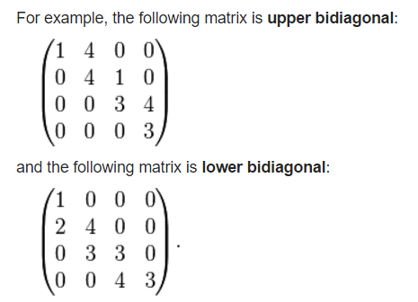

矩阵家族成员非常多，本文主要记录了我遇到过的矩阵(前面的文章所提到的矩阵，在这里就不重复列举了)。以后见识了新的矩阵时，会继续扩充本文。

(以下知识均查阅了wikipedia。单词的中文翻译查的是有道词典。)

<!--more-->

## 余子式、代数余子式、代数余子式矩阵 Minor、Cofactor、Cofactor Matrix

wiki: [https://en.wikipedia.org/wiki/Minor_(linear_algebra)](https://en.wikipedia.org/wiki/Minor_(linear_algebra))

在wiki中**余子式**被叫做minor。minor不是一个独立的概念，当把一个方阵A中的第i行、第j列去掉后，剩余的元素组成的n-1阶方阵的行列式值，就是Minor。

Minor的记号是: \\( M\_\{ij\} \\)，是一个行列式值。
而Cofactor(中文是叫代数余子式？)的记号是: \\( C\_\{ij\} \\)，公式是:\\( C\_\{ij\} = (-1)\^\{i+j\}M\_\{ij\} \\)

(个人建议，一切记法以wiki为准，抛弃国内中文教材的记法和中英对应关系吧，太容易混乱了)

余子式矩阵Cofactor Matrix的定义：

由方阵A的所有代数余子式\\( C\_\{ij\} \\)组成的矩阵叫做余子式矩阵，记为C，公式为：



\\[ C =   \\]

## 伴随矩阵 Adjugate Matrix

wiki: [https://en.wikipedia.org/wiki/Adjugate_matrix](https://en.wikipedia.org/wiki/Adjugate_matrix)

> In linear algebra, the adjugate, classical adjoint, or adjunct of a square matrix is the transpose of its cofactor matrix.
> The adjugate has sometimes been called the "adjoint", but today the "adjoint" of a matrix normally refers to its corresponding adjoint operator, which is its conjugate transpose.

注意：伴随矩阵在我大学的课本里用的记号是A\^\{*\}，然而wiki是用adj(A)来表示伴随矩阵，A\^\{*\}表示的是共轭转置矩阵( conjugate transpose)。

公式：

\\[ adj(A) = C\^\{T\} \\]

从公式可以发现，伴随矩阵就是代数余子式矩阵的转置。

## 共轭(转置)矩阵 Conjugate Transpose Matrix

公式上的定义：

\\[ A\^\{*\} = (\\overline \{A\})\^\{T\} \\]

A上面的横线表示对矩阵中的元素的复数部分取反(类似复数的上横线)。

回想下共轭复数的定义，可以发现，矩阵的共轭，还需要再转置一下，很很大的一个不同点。

共轭矩阵还有其他表达形式：

\\[ A\^\{\\dagger \} = A\^\{*\} = A\^\{H\} \\]

## 厄米特矩阵 Hermitian matrix

厄米特矩阵也称为self-adjoint matrix，中文是：自伴矩阵、自共轭矩阵、自伴随矩阵。

厄米特矩阵必须满足下面的性质:

\\[ A = A\^\{*\} \\]

即，A等于A的共轭矩阵时，A是一个厄米特矩阵。

## 单式矩阵 Unitary matrix

其他名称：酉矩阵/幺正矩阵。

看名字有点像单位矩阵(Unit matrix)，但是公式上的定义是这样子的：

\\[ U\^\{*\}U = I \\]

即：如果矩阵的共轭乘以矩阵自身等于单位矩阵，那么它是一个单式矩阵。

## 正定矩阵 Positive Definite Matrix

定义比较复杂，我翻译下wikipedia的定义吧：

> 一个对称的n阶实数矩阵M，设元素不全为0的列向量为z，当所有这样的z满足\\( z\^\{T\}Mz > 0\\)时，M是正定矩阵。

根据定义，可以知道单位矩阵I是正定的；

贴上wiki的例子来帮助理解：

设M的z为(a,b,c)，则有：

这个式子的结果显然是非负的，且当a=b=c=0时，这个式子才等于0，所以满足正定矩阵的条件。

此外，正定矩阵还有另外一个“间接”的定义：**如果一个矩阵的所有特征值都是正数，那么这个矩阵是正定矩阵**。要通过这个定义判断一个矩阵是不是正定矩阵，需要先知道这个矩阵的所有特征值。

## 半正定矩阵 Positive Semi-Definite

参考正定矩阵，半正定矩阵的定义公式是:\\( z\^\{T\}Mz >= 0\\)。

半正定矩阵的“间接”的定义：**如果一个矩阵的所有特征值都是正数或0（非负），那么这个矩阵是半正定矩阵**。

## 负定矩阵 Negative Definite Matrix

参考正定矩阵，负定矩阵的定义公式是:\\( z\^\{T\}Mz < 0\\)。

负定矩阵的“间接”的定义：**如果一个矩阵的所有特征值都是负数，那么这个矩阵是半正定矩阵**。

## 半负定矩阵 Negative Semi-Definite Matrix

参考正定矩阵，负定矩阵的定义公式是:\\( z\^\{T\}Mz <= 0\\)。

半负定矩阵的“间接”的定义：**如果一个矩阵的所有特征值都是负数或0（非正），那么这个矩阵是半正定矩阵**。

## 厄米特矩阵的正定矩阵

参考正定矩阵，厄米特矩阵的正定矩阵的定义公式是:\\( z\^\{*\}Mz > 0\\)，注意，算出来的值必须是实数，不能是复数。

## 规范化矩阵 Normal Matrix

又名：正规矩阵、正规阵、规范矩阵。

wiki:[https://en.wikipedia.org/wiki/Normal_matrix](https://en.wikipedia.org/wiki/Normal_matrix)。

当矩阵A满足下面的等式时，A是规范化矩阵:

\\[ A\^\{\*\}A = AA\^\{\*\} \\]

( \\(A\^\{\*\}\\) 代表A的共轭转置矩阵 )

## 双对角矩阵 Bidiagonal matrix

一图以言之:

(from wiki)

wiki:[https://en.wikipedia.org/wiki/Bidiagonal_matrix](https://en.wikipedia.org/wiki/Bidiagonal_matrix)

## 格拉姆矩阵 Gramian matrix

设矩阵X：



\\[ X =   \\]

则Gramian matrix为：

\\[ G = X\^\{T\}X \\]

性质：

- G是positive semi-definite matrix正半定矩阵

- G的行列式非0时，X是线性无关的（充分必要）（可用来判定X是否线性无关，很重要）

## 协方差矩阵 Covariance matrix （或离差矩阵dispersion matrix）

先给出协方差(covariance)公式：

\\[ cov(X,Y) = \\frac \{ \\sum \^\{n\} \_\{i=1\}(X\_\{i\} - \\overline \{X\})(Y\_\{i\} - \\overline \{Y\}) \}\{n-1\} = E[(X - E[X])(Y - E[Y])] \\]

协方差是一个测量2个变量关联性程度的方法。当变量数目多于2时，任意2个变量之间的协方差的集合就构成了协方差矩阵C：

\\[ C = \\Sigma \_\{ij\} = cov(X\_\{i\},X\_\{j\}) = E[(X\_\{i\} - E[X\_\{i\}])(X\_\{j\} - E[X\_\{j\}])]  \\]

