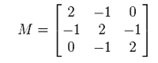
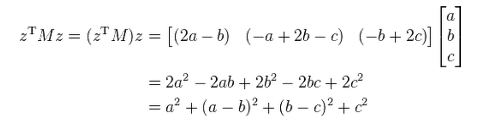

矩阵家族成员非常多，本文主要记录了我遇到过的矩阵(前面的文章所提到的矩阵，在这里就不重复列举了)。以后见识了新的矩阵时，会继续扩充本文。

(以下知识均查阅了wikipedia。单词的中文翻译查的是有道词典。)

<!--more-->

## 共轭(转置)矩阵 Conjugate Transpose Matrix

公式上的定义：

\\[ A\^\{*\} = (\\overline \{A\})\^\{T\} \\]

A上面的横线表示对矩阵中的元素的复数部分取反(类似复数的上横线)。

回想下共轭复数的定义，可以发现，矩阵的共轭，还需要再转置一下，很很大的一个不同点。

共轭矩阵还有其他表达形式：

\\[ A\^\{\\dagger \} = A\^\{*\} = A\^\{H\} \\]

## 厄米特矩阵 Hermitian matrix

厄米特矩阵也称为self-adjoint matrix，中文是：自伴矩阵、自共轭矩阵、自伴随矩阵。

厄米特矩阵必须满足下面的性质:

\\[ A = A\^\{*\} \\]

即，A等于A的共轭矩阵时，A是一个厄米特矩阵。

## 单式矩阵 Unitary matrix

看名字有点像单位矩阵(Unit matrix)，但是公式上的定义是这样子的：

\\[ U\^\{*\}U = I \\]

即：如果矩阵的共轭乘以矩阵自身等于单位矩阵，那么它是一个单式矩阵。

## 正定矩阵 Positive Definite Matrix

定义比较复杂，我翻译下wikipedia的定义吧：

> 一个对称的n阶实数矩阵M，设元素不全为0的列向量为z，当所有这样的z满足\\( z\^\{T\}Mz > 0\\)时，M是正定矩阵。

根据定义，可以知道单位矩阵I是正定的；

贴上wiki的例子来帮助理解：

设M的z为(a,b,c)，则有：

这个式子的结果显然是非负的，且当a=b=c=0时，这个式子才等于0，所以满足正定矩阵的条件。

## 半正定矩阵 Positive Semi-Definite

参考正定矩阵，半正定矩阵的定义公式是:\\( z\^\{T\}Mz >= 0\\)。

## 负定矩阵 Negative Definite Matrix

参考正定矩阵，负定矩阵的定义公式是:\\( z\^\{T\}Mz < 0\\)。

## 半负定矩阵 Negative Semi-Definite Matrix

参考正定矩阵，负定矩阵的定义公式是:\\( z\^\{T\}Mz <= 0\\)。

## 厄米特矩阵的正定矩阵

参考正定矩阵，厄米特矩阵的正定矩阵的定义公式是:\\( z\^\{*\}Mz > 0\\)，注意，算出来的值必须是实数，不能是复数。