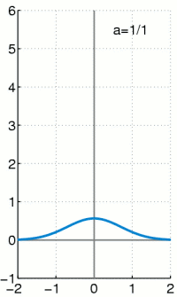

## 数学中的卷积

卷积的wiki：[Convolution](https://en.wikipedia.org/wiki/Convolution#Derivations)。

卷积和(convolution sum)的公式是:

\\[ y(t) = x(t)*h(t) = \\sum \_\{\\tau =-\\infty \}\^\{\\infty \}x(\\tau )h(t-\\tau )\\]

写成积分形式是:

<!--more-->

\\[ x(t)*h(t) = \\int \_\{-\\infty \}\^\{\\infty \}x(\\tau )h(t-\\tau )d\\tau = \\int \_\{-\\infty \}\^\{\\infty \}x(t-\\tau )h(\\tau )d\\tau \\]

这个东西，很难从公式推导上理解（其实是没在网上找到推导过程，只知道和这个东西有关[LTI system theory](https://en.wikipedia.org/wiki/LTI_system_theory#Overview)）。不过我想到一个比较好的理解方式。

首先介绍下狄拉克δ函数。

### 狄拉克δ函数 dirac delta function

狄拉克δ函数的wiki：[dirac delta function](https://en.wikipedia.org/wiki/Dirac_delta_function)。

狄拉克δ函数在坐标系上的长相:

（图片来自wiki）

在**信号处理科学**中狄拉克δ函数被称为单位脉冲信号(unit impulse symbol）。上面这个图也很形象地说明了这一点。

狄拉克δ函数有这样的性质:

\\[ delta (t) =  \\begin \{cases\} +\\infty , t=0 \\\\  0, t\\neq 0 \\end \{cases\} \\]

\\[ \\int \_\{-\\infty \}\^\{\\infty \}\\delta (t)dt = 1 \\]

狄拉克δ函数在t等于0时值为正无穷，t不等于0时则为0，且在整个定义域的积分等于1。

### 狄拉克δ函数与卷积

考虑一个特殊情况：h(t)是狄拉克δ函数。代入卷积公式，有:

\\[ x(t) * h(t) = x(t) * \\delta (t) = \\int \_\{-\\infty \}\^\{\\infty \}x(\\tau )\\delta (t-\\tau )d\\tau = x(t) \\]

(这里省略了推导过程）

这个结果说明，x(t)和狄拉克δ函数卷积的结果还是x(t)，为什么会这样呢？

再看下前面给出的卷积和标准公式：

\\[ y(t) = x(t)*h(t) = \\sum \_\{\\tau =-\\infty \}\^\{\\infty \}x(\\tau )h(t-\\tau )\\]

把其中的\\( h(t - \\tau ) \\)换成\\( \\delta (t - \\tau ) \\)，那么里面的\\( t - \\tau \\)，其实就是让那个脉冲信号在横轴上移动(偏移)\\( \\tau \\)距离。根据狄拉克δ函数的定义，可以知道，当\\( t = \\tau \\)时，\\( x(\\tau )h(t-\\tau ) \\)才非0，且等于\\( x(\\tau ) \\)。所以卷积和也就等于\\( x(\\tau ) \\)。（这也算是上面的公式的证明吧）

将这个特殊情况一般化，即不限制h = δ时，就是所谓的卷积公式了。

### 找到的相关资料

[The Convolution Sum for Discrete-Time LTI Systems. Andrew W. H. House](http://www.eecg.toronto.edu/~ahouse/mirror/engi7824/course_notes_7824_part6.pdf)