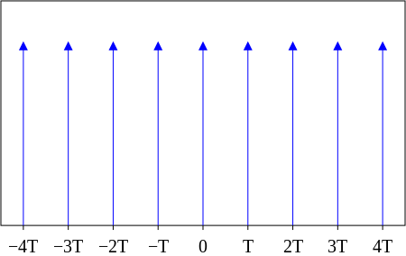

这个函数在电子工程[electrical engineering](https://en.wikipedia.org/wiki/Electrical_engineering)中称为脉冲序列(impulse train)或采样函数(sampling function)。注意，有些文章会把它叫做Shah function。

它其实就是关于狄拉克δ函数的用周期T间隔的无穷级数。(wiki原文是:**A Dirac comb is an infinite series of Dirac delta functions spaced at intervals of T**）

用图表示:

(图片来自wiki）

公式表示:

\\[ III\_\{T\}(t) = \\sum \_\{k=-\\infty \}\^\{\\infty \}\\delta (t - kT)\\]

这个公式和图片完全对应。但是这样还不够，还要再变换一下。

把右边的T提取出来，就有：

\\[ III\_\{T\}(t) = \\sum \_\{k=-\\infty \}\^\{\\infty \}\\delta (t - kT) = T\\sum \_\{k=-\\infty \}\^\{\\infty \}\\delta (\\frac \{t\}\{T\} - k) \\] 

并且，当T=1（单位周期）时，上面的标准公式变成:

\\[ III\_\{T=1\}(t) = III(t) = \\sum \_\{k=-\\infty \}\^\{\\infty \}\\delta (t - k)\\]

把\\( \\frac \{t\}\{T\} \\)代入上面的式子，就得到了:

\\[ III(\\frac \{t\}\{T\}) = \\sum \_\{k=-\\infty \}\^\{\\infty \}\\delta (\\frac \{t\}\{T\} - k)\\]

所以就有：

\\[ III\_\{T\}(t)  = TIII(\\frac \{t\}\{T\}) \\]

