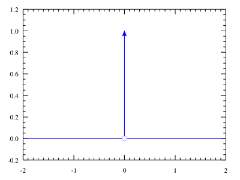

## 狄拉克δ函数(Dirac delta)

在卷积那篇文章中，已经提到了狄拉克δ函数的定义:

\\[ delta (t) =  \\begin \{cases\} +\\infty , t=0 \\\\  0, t\\neq 0 \\end \{cases\} \\]

\\[ \\int \_\{-\\infty \}\^\{\\infty \}\\delta (t)dt = 1 \\]

下面介绍它的一些性质:

#### 对称性质

从δ函数的波形图(或者定义)可以简单看出，δ函数是偶函数，即:

\\[ \\delta (t) = \\delta (-t) \\]

#### 缩放性质

设有常数a，令u = at，再依据δ函数的积分特性，有:

\\[ dt = \\frac \{1\}\{a\}du \\]

\\[ \\int \_\{-\\infty \}\^\{\\infty \}\\delta (at)dt = \\int \_\{-\\infty \}\^\{\\infty \}\\delta (u)\\frac \{1\}\{a\}du = \\frac \{1\}\{a\} \\int \_\{-\\infty \}\^\{\\infty \}\\delta (u)du = \\frac \{1\}\{a\} \\]

也即:

\\[ \\delta (at) = \\frac \{1\}\{a\}\\delta (t) \\]

又因为它的对称性质，有:

\\[ \\delta (at) = \\frac \{1\}\{|a|\}\\delta (t) \\]

#### 代数性质

\\[ t\\delta (t) = 0 \\]

这个太简单了，从基本定义出发可以很快看出来这个式子的正确性。

#### 平移性质

\\[ \\int \_\{-\\infty \}\^\{\\infty \}f(t)\\delta (t - T)dt = f(T) \\]

在[理解卷积 Convolution](http://www.qiujiawei.com/convolution/)中有对这个式子的详细讨论。当然从δ函数的定义去理解这个式子也很简单。

#### δ函数的傅里叶变换

\\[ \\mathcal \{F\}\[\\delta (s)\] = \\int \_\{-\\infty \}\^\{\\infty \}e\^\{-2\\pi ist\}\\delta (t) = 1 \\]

因为只有当x等于0时，δ函数才非0(等于1)，所以这个式子的计算结果等于1。

傅里叶变换后是一个常数1，这个性质看起来就很特别。

## 狄拉克梳状函数(Dirac comb)

这个函数在电子工程[electrical engineering](https://en.wikipedia.org/wiki/Electrical_engineering)中称为脉冲序列(impulse train)或采样函数(sampling function)。注意，有些文章会把它叫做Shah function。

它其实就是关于狄拉克δ函数的用周期T间隔的无穷级数(多个δ函数的合并)。(wiki原文是:**A Dirac comb is an infinite series of Dirac delta functions spaced at intervals of T**）

<!--more-->

用图表示:

(图片来自wiki）

公式表示:

\\[ III\_\{T\}(t) = \\sum \_\{k=-\\infty \}\^\{\\infty \}\\delta (t - kT)\\]

这个公式和图片完全对应。

