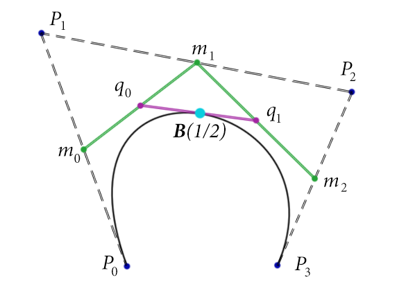

本文主要关注的是公式的推导。

在讲贝塞尔曲线之前先复习下组合数学。


<!--more-->

# 组合数学

## 排列 permutation

注意，排列的英文是permutation，这个词也就是线性代数里的“置换”。联想置换矩阵的概念，就可以近似理解“排列”的意义。


permutation的公式是：

\\[ P(n,k) = P\_\{n\}\^\{k\} = \\frac \{n!\}\{(n-k)!\} \\]

含义：从n个数取出某k个数总共有多少种排列。

所以，排列是**有顺序**的。

## 组合 combination

组合这个东西可以用“排列”来理解，比如对于某3个不同的数a、b、c，有\\[ P\_\{3\}\^\{3\} = \\frac \{3!\}\{(3-3)!\} = 6 \\]种排列: abc、acb、bac、bca、cab、cba，然而，组合数只有一个，也就是[a、b、c]。

所以，组合是**没有顺序**的。

combination的公式是：

\\[ C(n,k)  = C\_\{n\}\^\{k\} = \\frac \{ P\_\{n\}\^\{k\} \} \{ P\_\{k\}\^\{k\} \} = \\frac \{n!\}\{k!(n-k)!\} , 0 < k <= n\\]


性质1：

\\(  C\_\{n\}\^\{k\} = \\frac \{n!\}\{k!(n-k)!\} \\)

\\( = \\frac \{n!\}\{(n-(n-k))!(n-k)!\} \\)

\\( = \\frac \{n!\}\{(n-k)!(n-(n-k))!\} \\)

\\( = C\_\{n\}\^\{n-k\} \\)

性质2：

\\[  C\_\{n\}\^\{k\} = \\frac \{n!\}\{k!(n-k)!\} = 0 【 k < 0 ， k > n】 \\] 

(当k<0或k>n时，右边的式子会出现负数的阶乘。负数阶乘在组合数公式的计算中，可以认为等于0)


combination很重要，比如说二项式定理里的展开式就用到了它：

\\[ (a+b)\^\{n\} = \\sum\_\{r=0\}\^\{n\}C\_\{n\}\^\{r\}a\^\{n-r\}b\^\{r\} \\]


combination还有一条公式要注意下：

\\[ C\_\{n\}\^\{k\} = C\_\{n-1\}\^\{k-1\} + C\_\{n-1\}\^\{k\} , 0 < k < n \\]

顺便给个简单证明：

\\( C\_\{n-1\}\^\{k-1\} + C\_\{n-1\}\^\{k\} = \\)

\\( \\frac \{(n-1)!\}\{(n-1-(k-1))!(k-1)!\} + \\frac \{(n-1)!\}\{(n-1-k)!k!\}  = \\)

\\( \\frac \{(n-1)!\}\{(n-k)!(k-1)!\} + \\frac \{(n-1)!\}\{(n-1-k)!k!\}  = \\)

\\( \\frac \{k(n-1)!\}\{k(n-k)!(k-1)!\} + \\frac \{(n-k)(n-1)!\}\{(n-k)(n-1-k)!k!\}  = \\)

\\( \\frac \{k(n-1)!\}\{(n-k)!k!\} + \\frac \{(n-k)(n-1)!\}\{(n-k)!k!\}  = \\)

\\( \\frac \{k(n-1)!+(n-k)(n-1)!\}\{(n-k)!k!\}  = \\)

\\( \\frac \{n(n-1)!\}\{(n-k)!k!\}  =  \\frac \{n!\}\{(n-k)!k!\}  =   C\_\{n\}\^\{k\} \\)

# 贝塞尔曲线

## 定义

给定n个控制点\\(P\_\{0\},P\_\{1\},\\cdots ,P\_\{n\}\\)，贝塞尔曲线的公式如下：

\\[ P(t) = \\sum\_\{i=0\}\^\{n\}P\_\{i\}B\_\{i,n\}(t) , t\\in [0,1] \\]

其中的\\( B\_\{i,n\}(t) \\)叫Bernstein polynomial，定义如下：

\\[ B\_\{i,n\}(t) = C\_\{n\}\^\{i\}t\^\{i\}(1-t)\^\{n-i\} = \\frac \{n!\}\{i!(n-i)!\}t\^\{i\}(1-t)\^\{n-i\} 【i=0,1,\\cdots ,n】 \\]

## Bézier曲线的特性

特性1：改变单个控制点会引起整条曲线的改变。

## Bernstein polynomial的特性


#### 递归性

\\[ B\_\{i,n\}(t) = (1-t)B\_\{i,n-1\}(t) + tB\_\{i-1,n-1\}(t)   【i=0,1,\\cdots ,n】 \\]

证明：

\\( B\_\{i,n\}(t) \\)

\\( = C\_\{n\}\^\{i\}t\^\{i\}(1-t)\^\{n-i\} \\)

\\( = C\_\{n-1\}\^\{i-1\} + C\_\{n-1\}\^\{i\})t\^\{i\}(1-t)\^\{n-i\} \\)

\\( = C\_\{n-1\}\^\{i-1\}t\^\{i\}(1-t)\^\{n-i\} + C\_\{n-1\}\^\{i\}t\^\{i\}(1-t)\^\{n-i\} \\)

\\( = (1-t)C\_\{n-1\}\^\{i\}t\^\{i\}(1-t)\^\{(n-1)-i\} + tC\_\{n-1\}\^\{i-1\}t\^\{i-1\}(1-t)\^\{(n-1)-(i-1)\} \\)

\\( = (1-t)B\_\{i,n-1\}(t) + tB\_\{i-1,n-1\}(t) \\)


#### 归一性

\\[ \\sum\_\{i=0\}\^\{n\}B\_\{i,n\}(t) \\equiv 1   【t\\in (0,1)】 \\]


证明：

根据二项式定理有：

\\[ \\sum\_\{i=0\}\^\{n\}B\_\{i,n\}(t) \\]
\\[ = \\sum\_\{i=0\}\^\{n\}C\_\{n\}\^\{i\}t\^\{i\}(1-t)\^\{n-i\} \\]
\\[ [(1-t)+t]\^\{n\} \\equiv 1  \\]


#### Partition of Unity

\\[ \\sum\_\{i=0\}\^\{n\}B\_\{i,n\}(t) = \\sum\_\{i=0\}\^\{n-1\}B\_\{i,n-1\}(t) = 1 \\]

证明:

利用递归公式，有：

\\( \\sum\_\{i=0\}\^\{n\}B\_\{i,n\}(t) \\)

\\( = \\sum\_\{i=0\}\^\{n\}[(1-t)B\_\{i,n-1\}(t) + tB\_\{i-1,n-1\}(t)] \\)

\\( = \\sum\_\{i=0\}\^\{n\}[(1-t)B\_\{i,n-1\}(t)] + \\sum\_\{i=0\}\^\{n\}[tB\_\{i-1,n-1\}(t)] \\)

\\( = (1-t)\\sum\_\{i=0\}\^\{n\}[B\_\{i,n-1\}(t)] + t\\sum\_\{i=0\}\^\{n\}[B\_\{i-1,n-1\}(t)] \\)

\\( = (1-t)[\\sum\_\{i=0\}\^\{n-1\}B\_\{i,n-1\}(t) + B\_\{n,n-1\}(t) ] + t[\\sum\_\{i=1\}\^\{n\}B\_\{i-1,n-1\}(t) + B\_\{-1,n-1\}(t) ] \\)

因为:

\\[ B\_\{n,n-1\}(t) = C\_\{n-1\}\^\{n\}t\^\{n\}(1-t)\^\{n-1-n\} = 0 \\]

\\[ B\_\{-1,n-1\}(t) = C\_\{n-1\}\^\{-1\}t\^\{-1\}(1-t)\^\{(n-1)-(-1)\} = 0 \\]

(这里利用了上文提到的组合数公式性质2)

所以可简化为：

\\( \\sum\_\{i=0\}\^\{n\}B\_\{i,n\}(t) \\)

\\( = (1-t)[\\sum\_\{i=0\}\^\{n-1\}B\_\{i,n-1\}(t)] + t[\\sum\_\{i=1\}\^\{n\}B\_\{i-1,n-1\}(t)] \\)

\\( = (1-t)[\\sum\_\{i=0\}\^\{n-1\}B\_\{i,n-1\}(t)] + t[\\sum\_\{i=0\}\^\{n-1\}B\_\{i,n-1\}(t)] \\)

\\( = (1-t+t)[\\sum\_\{i=0\}\^\{n-1\}B\_\{i,n-1\}(t)] \\)

\\( = \\sum\_\{i=0\}\^\{n-1\}B\_\{i,n-1\}(t) \\)


#### 对称性

\\[ B\_\{i,n\}(1 - t) = B\_\{n-i,n\}(t) \\]


证明：

由定义：

\\[ B\_\{i,n\}(t) = C\_\{n\}\^\{i\}t\^\{i\}(1-t)\^\{n-i\} \\]

有：

\\( B\_\{n-i,n\}(t) = C\_\{n\}\^\{n-i\}t\^\{n-i\}(1-t)\^\{n-(n-i)\}  \\)

\\( = C\_\{n\}\^\{n-i\}t\^\{n-i\}(1-t)\^\{i\}  \\)

\\( = C\_\{n\}\^\{i\}t\^\{n-i\}(1-t)\^\{i\} \\)


\\( B\_\{i,n\}(1 - t) =  C\_\{n\}\^\{i\}(1 - t)\^\{i\}(1-(1 - t))\^\{n-i\} \\)

\\( = C\_\{n\}\^\{i\}(1 - t)\^\{i\}t\^\{n-i\} \\)

\\( = C\_\{n\}\^\{i\}t\^\{n-i\}(1-t)\^\{i\} \\)

得证。


#### 非负性

当 t = 0 时：

\\[ B\_\{i,n\}(0) = 0 , 【i > 0】\\]

\\[ B\_\{i,n\}(0) = 1 , 【i = 0】\\]

当 t = 1 时：

\\[ B\_\{i,n\}(0) = 0 , 【i > 0】\\]

\\[ B\_\{i,n\}(0) = 1 , 【i = 0】\\]


当 t= (0,1) 时：

\\[ B\_\{i,n\}(t) > 0 , 【i =0,1,2,\\cdots ,n-1】\\]


证明：把数值代入定义公式就可以了。

## Bernstein基(Bernstein Basis)到幂基(Power Basis)的转换

由二项式定理：

\\[ (a+b)\^\{n\} = \\sum\_\{r=0\}\^\{n\}C\_\{n\}\^\{r\}a\^\{n-r\}b\^\{r\} \\]

得到：

\\[ (1-t)\^\{n\} = \\sum\_\{r=0\}\^\{n\}C\_\{n\}\^\{r\}1\^\{n-r\}(-t)\^\{r\} = \\sum\_\{r=0\}\^\{n\}C\_\{n\}\^\{r\}(-t)\^\{r\}\\]

所以：

\\[ B\_\{i,n\}(t) = C\_\{n\}\^\{i\}t\^\{i\}(1-t)\^\{n-i\} \\]

\\[ = C\_\{n\}\^\{i\}t\^\{i\}\\sum \_\{k=0\}\^\{n-i\}C\_\{n-i\}\^\{k\}(-t)\^\{k\} \\]

\\[ = C\_\{n\}\^\{i\}t\^\{i\}\\sum \_\{k=0\}\^\{n-i\}C\_\{n-i\}\^\{k\}(-1)\^\{k\}t\^\{k\} \\]

\\[ = \\sum \_\{k=0\}\^\{n-i\}C\_\{n\}\^\{i\}t\^\{i\}C\_\{n-i\}\^\{k\}(-1)\^\{k\}t\^\{k\} \\]

\\[ = \\sum \_\{k=0\}\^\{n-i\}C\_\{n\}\^\{i\}C\_\{n-i\}\^\{k\}(-1)\^\{k\}t\^\{k+i\} \\]

这时设g = k + i ，则有 k = g - i，i = g - k，上式变成：

\\[ = \\sum \_\{g - i=0\}\^\{n-(g-k)\}C\_\{n\}\^\{i\}C\_\{n-i\}\^\{g - i\}(-1)\^\{g - i\}t\^\{g\} \\]

\\[ = \\sum \_\{g=i\}\^\{n-g+k\}C\_\{n\}\^\{i\}C\_\{n-i\}\^\{g - i\}(-1)\^\{g - i\}t\^\{g\}\\]

把g换成k，上式变成：

\\[ = \\sum \_\{k=i\}\^\{n-k+k\}C\_\{n\}\^\{i\}C\_\{n-i\}\^\{k - i\}(-1)\^\{k - i\}t\^\{k\} \\]

\\[ = \\sum \_\{k=i\}\^\{n\}C\_\{n\}\^\{i\}C\_\{n-i\}\^\{k - i\}(-1)\^\{k - i\}t\^\{k\} \\]

其中\\(C\_\{n\}\^\{i\}C\_\{n-i\}\^\{k - i\}\\)可以进一步简化：

\\( C\_\{n\}\^\{i\} C\_\{n-i\}\^\{k - i\} \\)
\\( = \\frac \{n!\}\{i!(n-i)!\} \\frac \{(n-i)!\}\{(k-i)!((n-i)-(k-i))!\}  \\)

\\( = \\frac \{n!\}\{i!(n-i)!\} \\frac \{(n-i)!\}\{(k-i)!((n-k)!\}  \\)

\\( = \\frac \{n!(n-i)!\}\{i!(n-i)!(k-i)!((n-k)!\} \\)

\\( = \\frac \{n!\}\{i!(k-i)!((n-k)!\} \\)

\\( = \\frac \{n!k!\}\{i!(k-i)!((n-k)!k!\} \\)

\\( = \\frac \{n!\}\{k!(n-k)!\} \\frac \{k!\}\{i!((k-i)!\} \\)

\\( = C\_\{n\}\^\{k\} C\_\{k\}\^\{i\} \\)


所以：


\\[ = \\sum \_\{k=i\}\^\{n\}C\_\{n\}\^\{i\}C\_\{n-i\}\^\{k - i\}(-1)\^\{k - i\}t\^\{k\} \\]

\\[ = \\sum \_\{k=i\}\^\{n\}C\_\{n\}\^\{k\} C\_\{k\}\^\{i\}(-1)\^\{k - i\}t\^\{k\} \\]

综上:

\\[  B\_\{i,n\}(t) = \\sum \_\{k=i\}\^\{n\}C\_\{n\}\^\{k\} C\_\{k\}\^\{i\}(-1)\^\{k - i\}t\^\{k\} \\]

设\\( b\_\{k,i\} = C\_\{n\}\^\{k\} C\_\{k\}\^\{i\}(-1)\^\{k - i\} \\)

则上式变成：

\\[  B\_\{i,n\}(t) = \\sum \_\{k=i\}\^\{n\}b\_\{k,i\}t\^\{k\} \\]

展开后：

\\[  B\_\{i,n\}(t) = b\_\{i,i\}t\^\{i\} + b\_\{i+1,i\}t\^\{i+1\} + \\cdots + b\_\{n,i\}t\^\{n\} \\]


# Bézier曲线的递推形式(de Casteljau算法)

前面讲的是Bézier曲线的曲线方程定义，现在介绍一个简单实用的算法:de Casteljau's Algorithm。

先分享我找到的一些演示程序：

[http://myst729.github.io/bezier-curve/](http://myst729.github.io/bezier-curve/)。

[https://www.jasondavies.com/animated-bezier/](https://www.jasondavies.com/animated-bezier/)。

以及油管上的:[https://www.youtube.com/watch?v=YATikPP2q70](https://www.youtube.com/watch?v=YATikPP2q70)。


递推公式如下：

\\[ P\_\{i\}\^\{k\} =\\begin \{cases\} P\_\{i\}  【k=0】 \\\\  (1-t)P\_\{i\}\^\{k-1\}+tP\_\{i+1\}\^\{k-1\} 【k=1,2,\\cdots ,n,i=0,1,\\cdots ,n-k】 \\end \{cases\}  \\]



以上图为例演示下这条公式：

因为有\\( P\_\{0\},P\_\{1\},P\_\{2\},P\_\{3\} \\)4个控制点，所以n的值是3(要减1)。

然后求该贝塞尔曲线在 t = 1/2时的坐标点B(1/2)的步骤如下：

k = 0时，\\(i = 0,1,\\cdots ,n-k = 0,1,2,3 \\)，所以有:

\\( P\_\{i\}\^\{k=0\} = P\_\{i\} \\) 

\\( P\_\{0\}\^\{k=0\} = P\_\{0\} \\)

\\( P\_\{1\}\^\{k=0\} = P\_\{1\} \\)

\\( P\_\{2\}\^\{k=0\} = P\_\{2\} \\)

\\( P\_\{3\}\^\{k=0\} = P\_\{3\} \\)


k = 1时，\\(i = 0,1,\\cdots ,n-k = 0,1,2 \\)，所以有:

\\( P\_\{i\}\^\{k=1\} = (1-t)P\_\{i\}\^\{1-1\}+tP\_\{i+1\}\^\{1-1\}  = (1-t)P\_\{i\}\^\{0\}+tP\_\{i+1\}\^\{0\} \\)

\\( P\_\{0\}\^\{k=1\} = (1-t)P\_\{0\}\^\{0\}+tP\_\{1\}\^\{0\} = 0.5P\_\{0\} + 0.5P\_\{1\} = m\_\{0\} \\)

\\( P\_\{1\}\^\{k=1\} = (1-t)P\_\{1\}\^\{0\}+tP\_\{2\}\^\{0\} = 0.5P\_\{1\} + 0.5P\_\{2\} = m\_\{1\} \\)

\\( P\_\{2\}\^\{k=1\} = (1-t)P\_\{2\}\^\{0\}+tP\_\{3\}\^\{0\} = 0.5P\_\{2\} + 0.5P\_\{3\} = m\_\{2\} \\)

k = 2时，\\(i = 0,1,\\cdots ,n-k = 0,1\\)，所以有:

\\( P\_\{i\}\^\{k=2\} = (1-t)P\_\{i\}\^\{1\}+tP\_\{i+1\}\^\{1\} \\)

\\( P\_\{0\}\^\{k=2\} = (1-t)P\_\{0\}\^\{1\}+tP\_\{1\}\^\{1\} = 0.5m\_\{0\} + 0.5m\_\{1\} = q\_\{0\} \\)

\\( P\_\{1\}\^\{k=2\} = (1-t)P\_\{1\}\^\{1\}+tP\_\{2\}\^\{1\} = 0.5m\_\{1\} + 0.5m\_\{2\} = q\_\{1\} \\)

k = 3时，\\(i = 0,1,\\cdots ,n-k = 0\\)，所以有:

\\( P\_\{i\}\^\{k=3\} = (1-t)P\_\{i\}\^\{2\}+tP\_\{i+1\}\^\{2\} \\)

\\( P\_\{0\}\^\{k=3\} = (1-t)P\_\{0\}\^\{2\}+tP\_\{1\}\^\{2\} = 0.5q\_\{0\} + 0.5q\_\{1\} = B(1/2) \\)

# Bézier曲线的矩阵形式

由上上一节推导出来的2条式子：

\\[ b\_\{k,i\} = C\_\{n\}\^\{k\} C\_\{k\}\^\{i\}(-1)\^\{k - i\} \\]

\\[  B\_\{i,n\}(t) = \\sum \_\{k=i\}\^\{n\}b\_\{k,i\}t\^\{k\} = b\_\{i,i\}t\^\{i\} + b\_\{i+1,i\}t\^\{i+1\} + \\cdots + b\_\{n,i\}t\^\{n\} \\]


可以推导出矩阵：



\\[  \\]



\\[ =  \\]





\\[ =  \\]


再由Bézier曲线的公式：

\\[ P(t) = \\sum\_\{i=0\}\^\{n\}P\_\{i\}B\_\{i,n\}(t) , t\\in [0,1] \\]

有：



\\[ P(t) =   \\]


注意，中间的矩阵B是常量(取决于阶数):

n = 2时：

\\( b\_\{k,i\} = C\_\{2\}\^\{k\} C\_\{k\}\^\{i\}(-1)\^\{k - i\} \\)

\\( b\_\{0,0\} = C\_\{2\}\^\{0\} C\_\{0\}\^\{0\}(-1)\^\{0 - 0\} =  1*1=1 \\)

\\( b\_\{1,0\} = C\_\{2\}\^\{1\} C\_\{1\}\^\{0\}(-1)\^\{1 - 0\} =  2*1*(-1)=-2 \\)

\\( b\_\{2,0\} = C\_\{2\}\^\{2\} C\_\{2\}\^\{0\}(-1)\^\{2 - 0\} =  1*1=1 \\)

\\( b\_\{1,1\} = C\_\{2\}\^\{1\} C\_\{1\}\^\{1\}(-1)\^\{1 - 1\} =  2*1=2 \\)

\\( b\_\{2,1\} = C\_\{2\}\^\{2\} C\_\{2\}\^\{1\}(-1)\^\{2 - 1\} =  1*2*(-1)=-2 \\)

\\( b\_\{2,2\} = C\_\{2\}\^\{2\} C\_\{2\}\^\{2\}(-1)\^\{2 - 2\} =  1*1=1 \\)



\\[ B =  \\]

n = 3时：



\\[ B =  \\]


## 测试一下正确性

测试代码基于我正在开发中的[renderer](https://github.com/voyagingmk/renderer)

```c
#include "transform.hpp"
#include "geometry.hpp"

using namespace renderer;

int main(int argc, char ** argv){
	Matrix3x3 P = {
		20.f, 20.f,		0, 	//P0
		770.f, 30.f,	0,	//P1
		400.f, 780.f,	0,	//P2
	};

	Matrix3x3 B = {
		1,	0,	0,
		-2,	2,	0,
		1,	-2,	1,
	};

	Matrix3x3 BP = B * P;

	typedef Matrix<MxN<float, 1, 3>> Matrix1x3;

	cil::CImg<unsigned char> img(800, 800, 1, 3);

	img.atXYZC(P[0], P[1], 0, 1) = 255;
	img.atXYZC(P[3], P[4], 0, 1) = 255;
	img.atXYZC(P[6], P[7], 0, 1) = 255;

	for (float t = 0; t < 1; t += 0.0001f) {
		Matrix1x3 T = { 1, t, t * t };
		Matrix1x3 TBP = T * BP;
		int x = int(TBP[0]);
		int y = int(TBP[1]);
		img.atXYZC(x, y, 0, 0) = 255;
	}
	img.display("");
	return 0;
}

```


