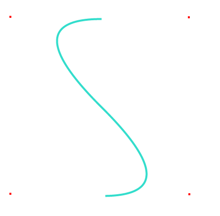
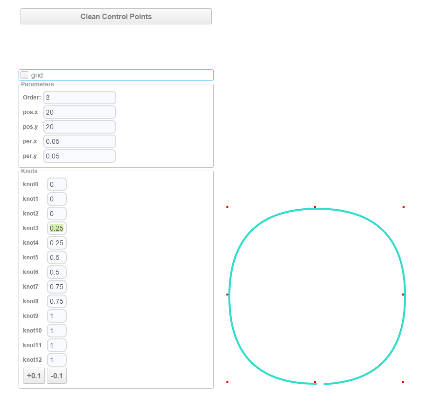

上一篇文章已经介绍了贝塞尔曲线。本篇文章接着介绍B样条曲线。

B样条曲线，简单来说，它是对贝塞尔曲线的一个补充。为什么这样说呢？是因为贝塞尔曲线某些情况下不实用：曲线上每个点受所有控制点影响，这会给调整曲线工作带来麻烦。可以想到的第一个优化是，把整个贝塞尔曲线变成多段贝塞尔子曲线的拼接。然而，这个方案也不好用，因为拼接工作很难做好，因为要拼接曲线显得“光滑”前提是保证相邻曲线之间的连续性。

于是，老外发明了一个算法:[De Boor's algorithm](https://en.wikipedia.org/wiki/De_Boor%27s_algorithm)，基于这个算法的曲线也被称为贝塞尔曲线的变种：B-Spline(B样条)曲线。为什么叫Spline曲线呢？我猜是因为Spline曲线在4个控制点的情况下，有个典型的形状：

<!-- more -->

是不是有点像一条脊椎(spine)？(跑题了= =)

下文开始进入数学部分。

# B-Spline的定义

B-Spline曲线我所知道的第一种估计也是最主要的定义：递归定义，其实是贝塞尔曲线的递归定义的一般化。先搬出贝塞尔的递归定义：

\\[ P\_\{i\}\^\{k\} =\\begin \{cases\} P\_\{i\}  【k=0】 \\\\  (1-t)P\_\{i\}\^\{k-1\}+tP\_\{i+1\}\^\{k-1\} 【k=1,2,\\cdots ,n,i=0,1,\\cdots ,n-k】 \\end \{cases\}  \\]

而B-Spline是：

\\[ N\_\{i\}\^\{n\}(x) = \\frac \{x-u\_\{i\}\}\{u\_\{i+n\}-u\_\{i\}\}N\_\{i\}\^\{n-1\}(x) + \\frac \{u\_\{i+n+1\} - x\}\{u\_\{i+n+1\}-u\_\{i+1\}\}N\_\{i+1\}\^\{n-1\}(x) \\]

\\[ N\_\{i\}\^\{0\}(x) =\\begin \{cases\} 1  【x \\in [ u\_\{i\},u\_\{i+1\} ) 】 \\\\ 0  【otherwise】 \\end \{cases\} \\]

(怎么也能看出一丝相似吧。)

从公式来看，似乎是变复杂了。然而其实现代码可以很简单，比如github上的这个js实现:[https://github.com/thibauts/b-spline](https://github.com/thibauts/b-spline)，它的B-Spline核心代码只有10行不到(OTL)。

对于这条公式的剖析，我发现有人已经做得机好了：

[B-样条曲线教程B-spline Curves Notes目录](http://blog.csdn.net/tuqu/article/details/4749586)

[B-样条基函数：定义 B-spline Basis Functions: Definition](http://blog.csdn.net/tuqu/article/details/5177405)

扒了下原文，原来是密西根理工大学的教学讲义: [http://www.cs.mtu.edu/~shene/COURSES/cs3621/NOTES/](http://www.cs.mtu.edu/~shene/COURSES/cs3621/NOTES/)

如果认真看完这些资料，基本该懂的都懂了。

因为我自己来写B-Spline剖析肯定写不到这个深度，当然也没必要。所以我做了点别的事情：写了一个curve designer：

[curve designer](http://voyagingmk.github.io/curvedesigner/)

(这个东西基于zebra WebUI和上面那个bspline，顺便吐槽下，zebra没有看起来那么好用)

目的是实现一个B样条曲线的可视化编辑器，通过改变参数来理解B样条的实际特性。这可比看公式看论文爽多了。

