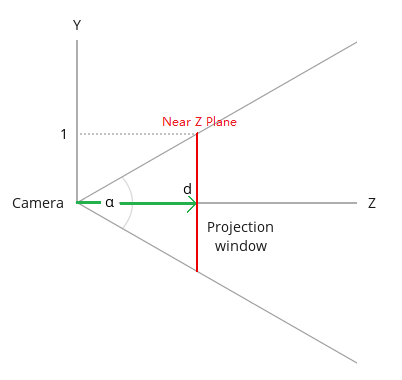

本文部分内容翻译自：[Tutorial 12: Perspective Projection](http://www.ogldev.org/www/tutorial12/tutorial12.html)

本文介绍的是OpenGL中的透视矩阵。

# 介绍

所谓的透视矩阵，指的是一个“降维”的转换过程。

设想下一个在3维空间里的3D模型，它必然拥有一些顶点信息，设其中任意顶点的坐标为(x,y,z,1)（后面的1是齐次坐标的意思），当我们需要把这个模型投影到某个平面上时，它就从3维变成了2维（看过三体3的童鞋就容易理解了，这就是二向箔!），而顶点坐标(x,y,z,1)则变成(x`,y`,d,?)。

可以注意到，经过透视变换后的顶点，依然是四维的形式，只是含义变了，其中的(x`,y`)分量指的是这个顶点在投影平面上的坐标(显然是因为投影平面相当于一个2维坐标系)。d指的是这个投影点的深度(depth)，d一般是规范化的，范围是[-1,1]。d的作用在下一个渲染阶段(Depth Test)大有用处。而后面的?，无法一言蔽之，下文会讲到这个问题。

# 视锥体 Frustum

视锥体，指的是一个有限的椎体空间，处于这个视锥体里的对象，才是“可见”的对象，可见的对象会被渲染到“视平面”上（三维到二维的投影）。视锥体有4个参数：

- aspect ratio，简称ar，ar = 视平面width/视平面height
- （vertical）field of view，简称fov，指yz平面的视角大小，即下文的\\( \alpha \\)角。
- near Z Plane，简称near面，是一个平行于xy平面的面，世界坐标系下是一个浮点值，可以用来裁剪太靠近摄像机的物体
- far Z Plane，简称far面，含义类似near面，可以用来裁剪太远离摄像机的物体

视平面可以认为是视锥体的near面；far面相对来说并没有那么重要，因为我们知道人眼的“视锥体”是没有far面的（比如裸眼可以看到月亮星星，far面其实是无限远的），在图形学中，far面主要是用来裁剪太过遥远的物体、提高渲染效率的。

下面这个是我找到的一个视锥体的演示程序，非常直观地展示了视锥体的作用：

  <iframe class="webgl_example" style="width: 400px; height: 600px;" src="http://webglfundamentals.org/webgl/frustum-diagram.html"></iframe>

[演示程序来源：http://webglfundamentals.org/webgl/lessons/webgl-3d-perspective.html](http://webglfundamentals.org/webgl/lessons/webgl-3d-perspective.html)

从摄像机位置（一个点）观察视平面的话，是长这样子的：

(图片来自www.ogldev.org)

y轴范围是[-1,1]，x轴范围是[-ar,ar]，因为ar = 视平面width/视平面height，其实也就是ar=屏幕width/屏幕height，因为大部分屏幕都是宽屏，所以ar的值一般是大于1的。当屏幕宽高一致时，视平面才是上面这幅图的样子。

现在，换成侧视角来观察这个视锥体(yz平面)：

(图片来自www.ogldev.org，有修改)

红线是投影面(视平面)，绿色线是摄像机到投影面的距离d，\\(\alpha \\)角即是fov。从此图可以得出：

\\[ tan(\\frac \{\alpha \} \{ 2 \} ) = \\frac \{1\} \{d\} \\]

\\[ d = \\frac \{1\} \{ tan(\\frac \{\alpha \} \{ 2 \} ) \} \\]

接下来是求某顶点\\( (x,y,z,w) \\)在投影面上的投影坐标\\( (x\_\{p\},y\_\{p\},z\_\{p\},w\_\{p\}) \\)。 看下面的侧视图，我们可以先求解\\( y\_\{p\} \\)：

根据相似三角形定理，可以得到：

\\[ \\frac \{y\_\{p\} \} \{ d \} = \\frac \{ y \} \{ z \} \\]

\\[ y\_\{p\} = \\frac \{ y * d \} \{ z \} = \\frac \{ y \} \{ z * tan(\\frac \{\alpha \} \{ 2 \} ) \} \\]

同样的，x分量也可以用相同的公式求得：

\\[ \\frac \{x\_\{p\} \} \{ d \} = \\frac \{ x \} \{ z \} \\]

\\[ x\_\{p\} = \\frac \{ x * d \} \{ z \} = \\frac \{ x \} \{ z * tan(\\frac \{\alpha \} \{ 2 \} ) \} \\]

此时要考虑到一个问题： \\( y\_\{p\} \\)的范围是[-1,1]，而\\( x\_\{p\} \\)是[-ar, ar]。为了让\\( x\_\{p\} \\)和\\( y\_\{p\} \\)一致，需要让\\( x\_\{p\} \\)除以ar，从而得到：

\\[ x\_\{p\} = \\frac \{ x \} \{ ar * z * tan(\\frac \{\alpha \} \{ 2 \} ) \} \\]

\\[ y\_\{p\} = \\frac \{ y \} \{ z * tan(\\frac \{\alpha \} \{ 2 \} ) \} \\]

到了这里，我们可以开始构造下透视矩阵了：



\\[ Perspective Matrix = M =  \\]

被转换的顶点的坐标(矩阵)是：



\\[ V =  \\]

转换后的投影点是:



\\[ V\_\{p\} =  \\]

转换过程:

\\[ MV = V\_\{p\} \\]

\\[    =  \\]

从以上等式可以得到:

\\[ ax + by + cz + dw = x\_\{p\} = \\frac \{ x \} \{ ar * z * tan(\\frac \{\alpha \} \{ 2 \} ) \} \\]

这是M矩阵第一行和V的点积等式。求解这个等式的话，会发现可以让b=0、c=0，从而等式简化成:

\\[ ax + cz = \\frac \{ x \} \{ ar * z * tan(\\frac \{\alpha \} \{ 2 \} ) \} \\]

这样做后就有了个问题：找不到可以代入a、c的常量值。其中比较多余的cz，如果干掉的话，意味着c等于0，等式进而变成:

\\[ ax = \\frac \{ x \} \{ ar * z * tan(\\frac \{\alpha \} \{ 2 \} ) \} \\]

观察等式，可以发现等式右边有个多余的z。OpenGL中对这个问题的处理是，在变换过程中强(偷)制(偷)插入一个步骤：把矩阵相乘的结果值再统一除以z（Divide z技术）！这么做之后，事情就简单了，上面的等式可以推出：

\\[ a = \\frac \{ 1 \} \{ ar * tan(\\frac \{\alpha \} \{ 2 \} ) \}  \\]

对于M矩阵的f，用同样的做法可以得到:

\\[ f = \\frac \{ 1 \} \{ tan(\\frac \{\alpha \} \{ 2 \} ) \}   \\]

从而得到了M的前两行的值：



\\[ M =  \\]

到了这里，其实透视变换问题已经解决大半了，因为\\(x\_\{p\}\\)和\\(y\_\{p\}\\)都可以算了，并且可以规范化到[-1,1]范围。剩下的问题是\\(z\_\{p\}\\)，即顶点的深度信息。

前面提到的Divide z技术会导致一个问题：z分量在转换过程中会因为Divide z技术而导致变成1。针对这个问题，OpenGL的解决方案是，把V的z值复制覆盖到w上，从而把原始z值保存起来，同时Divide z仅对x、y、z有效（跳过w）。

因此，M的后两行也可以得到了：



\\[ M =  \\]

然而，事情还没有结束。现在用这个新的M去做透视变换后，得不到规范化的z分量。规范化的，可以使得后续的渲染步骤不需要知道near Z和far Z。为了完成这个事情，需要对M做改进，着手点就是row 3，全为0的第三行。

再阐述一下问题：我们需要求出row3=(i,j,k,l)，使得row3和V做点积运算能得到规范化的\\(z\_\{p\}\\)。用公式表示：

\\[z\_\{p\} = Az + B , z\_\{p\}\\in [-1,1] \\]

再考虑上divide z技术，上式变成：

\\[z\_\{p\} = A + \\frac \{B\}\{z\} , z\_\{p\}\\in [-1,1] \\]

把公式中的A、B求出来，代入row3，就能解决问题。

因为当z等于near Z时，\\(z\_\{p\}\\)必然等于1；当z等于far Z时，\\(z\_\{p\}\\)必然等于-1 (Note：这里用的是右手坐标系）。因此得到：

\\[ A + \\frac \{B\}\{NearZ\} = 1 \\]

\\[ A = 1 - \\frac \{B\}\{NearZ\} \\]

接着：

\\[ A + \\frac \{B\}\{FarZ\} = -1 \\]

\\[ \\frac \{B\}\{FarZ\} + 1 - \\frac \{B\}\{NearZ\} = -1 \\]

\\[ \\frac \{B*NearZ - B*FarZ\}\{FarZ*NearZ\} = -2 \\]

\\[ B = \\frac \{-2*FarZ*NearZ\}\{NearZ - FarZ\}  \\]

B解决了，求A：

\\[ A = 1 - \\frac \{B\}\{NearZ\}  = 1 - \\frac \{-2*FarZ*NearZ\}\{NearZ*(NearZ - FarZ)\} \\]

\\[ A = 1 - \\frac \{-2*FarZ\}\{NearZ - FarZ\}  \\]

\\[ A =\\frac \{NearZ - FarZ +2*FarZ\}\{NearZ - FarZ\}\\]

\\[ A = \\frac \{NearZ + FarZ\}\{NearZ - FarZ\} \\]

有了A、B后，就可以求row3了:

\\[ ix +jy +kz +lw = Az + B \\]

显然，可让i = j = 0，那么上式变成:

\\[ kz + lw = Az + B \\]

因为V的w分量必然是1，所以可以得知：k = A，l = B。

代入M，得：



\\[ M =  \\]

