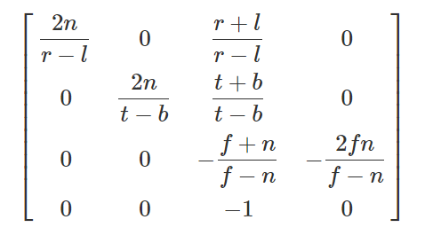

本文部分内容翻译自：[Tutorial 12: Perspective Projection](http://www.ogldev.org/www/tutorial12/tutorial12.html)

本文介绍的是OpenGL中的透视矩阵。

# 介绍

所谓的透视矩阵，指的是一个“降维”的转换过程。

<!--more-->


设想下一个在3维空间里的3D模型，它必然拥有一些顶点信息，设其中任意顶点的坐标为(x,y,z,1)（后面的1是齐次坐标的意思），当我们需要把这个模型投影到某个平面上时，它就从3维变成了2维（看过三体3的童鞋就容易理解了，这就是二向箔!），而顶点坐标(x,y,z,1)则变成(x`,y`,d,?)。


可以注意到，经过透视变换后的顶点，依然是四维的形式，只是含义变了，其中的(x`,y`)分量指的是这个顶点在投影平面上的坐标(显然是因为投影平面相当于一个2维坐标系)。d指的是这个投影点的深度(depth)，d一般是规范化的，范围是[-1,1]。d的作用在下一个渲染阶段(Depth Test)大有用处。而后面的?，无法一言蔽之，下文会讲到这个问题。


# 视锥体 Frustum

视锥体，指的是一个有限的椎体空间，处于这个视锥体里的对象，才是“可见”的对象，可见的对象会被渲染到“视平面”上（三维到二维的投影）。视锥体有4个参数：

- aspect ratio，简称ar，ar = 视平面width/视平面height
- （vertical）field of view，简称fov，指yz平面的视角大小，即下文的\\( \alpha \\)角。
- near Z Plane，简称near面，是一个平行于xy平面的面，世界坐标系下是一个浮点值，可以用来裁剪太靠近摄像机的物体
- far Z Plane，简称far面，含义类似near面，可以用来裁剪太远离摄像机的物体


视平面可以认为是视锥体的near面；far面相对来说并没有那么重要，因为我们知道人眼的“视锥体”是没有far面的（比如裸眼可以看到月亮星星，far面其实是无限远的），在图形学中，far面主要是用来裁剪太过遥远的物体、提高渲染效率的。

下面这个是我找到的一个视锥体的演示程序，非常直观地展示了视锥体的作用：

<div>
  <iframe class="webgl_example" style="width: 400px; height: 600px;" src="http://webglfundamentals.org/webgl/frustum-diagram.html"></iframe>
</div>

[演示程序来源：http://webglfundamentals.org/webgl/lessons/webgl-3d-perspective.html](http://webglfundamentals.org/webgl/lessons/webgl-3d-perspective.html)

从摄像机位置（一个点）观察视平面的话，是长这样子的：


(图片来自www.ogldev.org)

y轴范围是[-1,1]，x轴范围是[-ar,ar]，因为ar = 视平面width/视平面height，其实也就是ar=屏幕width/屏幕height，因为大部分屏幕都是宽屏，所以ar的值一般是大于1的。当屏幕宽高一致时，视平面才是上面这幅图的样子。

# 矩阵推导

现在，换成侧视角来观察这个视锥体(yz平面)：


(图片来自www.ogldev.org，有修改)

红线是投影面(视平面)，绿色线是摄像机到投影面的向量d，\\(\alpha \\)角即是fov。注意，OpenGL在“世界坐标系”中，用的是右手坐标系，所以上图中，z轴的左边才是1、右边是-1。因此，向量d的长度是-d（要取反，不然会计算错误）。综上，可以得出：

\\[ tan(\\frac \{\alpha \} \{ 2 \} ) = \\frac \{1\} \{\|\\vec d\|\} \\]

\\[  \|\\vec d\| = -d = \\frac \{1\} \{ tan(\\frac \{\alpha \} \{ 2 \} ) \} \\]

接下来是求某顶点\\( (x,y,z,w) \\)在投影面上的投影坐标\\( (x\_\{p\},y\_\{p\},z\_\{p\},w\_\{p\}) \\)。 看下面的侧视图，我们可以先求解\\( y\_\{p\} \\)：


根据相似三角形定理，可以得到：

\\[ \\frac \{y\_\{p\} \} \{ \|\\vec d\| \} = \\frac \{ y \} \{ -z \} \\]

\\[ y\_\{p\} = \\frac \{ y * \|\\vec d\| \} \{ -z \} = \\frac \{ y \} \{ -z * tan(\\frac \{\alpha \} \{ 2 \} ) \} \\]

注意，这里的z需要取反，因为上面的等式里，\\(y\_\{p\}\\)和y同符号，\\(\|\\vec d\|\\)是正号，而z显然本身是负值，所以z要取反。

同样的，x分量也可以用相同的公式求得：

\\[ \\frac \{x\_\{p\} \} \{ \|\\vec d\| \} = \\frac \{ x \} \{ -z \} \\]

\\[ x\_\{p\} = \\frac \{ x * \|\\vec d\| \} \{ -z \} = \\frac \{ x \} \{ -z * tan(\\frac \{\alpha \} \{ 2 \} ) \} \\]

此时要考虑到一个问题： \\( y\_\{p\} \\)的范围是[-1,1]，而\\( x\_\{p\} \\)是[-ar, ar]。为了让\\( x\_\{p\} \\)和\\( y\_\{p\} \\)一致，需要让\\( x\_\{p\} \\)除以ar，从而得到：

\\[ x\_\{p\} = \\frac \{ x \} \{ -z * ar * tan(\\frac \{\alpha \} \{ 2 \} ) \} \\]

\\[ y\_\{p\} = \\frac \{ y \} \{ -z * tan(\\frac \{\alpha \} \{ 2 \} ) \} \\]

到了这里，我们可以开始构造下透视矩阵了：



\\[ Perspective Matrix = M =  \\]

被转换的顶点的坐标(矩阵)是：



\\[ V =  \\]

转换后的投影点是:



\\[ V\_\{p\} =  \\]

转换过程:

\\[ MV = V\_\{p\} \\]

\\[    =  \\]

从以上等式可以得到:

\\[ ax + by + cz + dw = x\_\{p\} = \\frac \{ x \} \{  -z * ar * tan(\\frac \{\alpha \} \{ 2 \} ) \} \\]

这是M矩阵第一行和V的点积等式。求解这个等式的话，会发现可以让b=0、d=0（因为右式没有y、w），从而等式简化成:

\\[ ax + cz = \\frac \{ x \} \{ -z * ar * tan(\\frac \{\alpha \} \{ 2 \} ) \} \\]

这样做后就有了个问题：找不到可以代入a、c的常量值。其中左边比较多余的cz项，如果可以干掉的话，意味着c必须等于0。这么做后，等式进而变成:

\\[ ax = \\frac \{ x \} \{ -z * ar * tan(\\frac \{\alpha \} \{ 2 \} ) \} \\]

观察等式，可以发现等式右边有个多余的z。OpenGL中对这个问题的处理是，在变换过程中强(偷)制(偷)插入一个步骤：把矩阵相乘的结果值再统一除以-z。对，没错，确实是-z而不是z，负号的作用是把坐标从右手坐标系转换到左手坐标系，原因是NDC(Normalized Device Coord)坐标系是左手坐标系，即NDC的z轴的正方向是朝向屏幕里面的。这个除以-z的技巧被称为**Perspective Divide**。


这么做之后，事情就简单了，上面的等式可以推出：

\\[ a = \\frac \{ 1 \} \{ ar * tan(\\frac \{\alpha \} \{ 2 \} ) \}  \\]

对于M矩阵的f，用同样的做法:


\\[ ex + fy + gz + hw = y\_\{p\} = \\frac \{ y \} \{ -z * tan(\\frac \{\alpha \} \{ 2 \} ) \} \\]


\\[ fy + gz = \\frac \{ y \} \{ -z * tan(\\frac \{\alpha \} \{ 2 \} ) \} \\]

\\[ fy  = \\frac \{ y \} \{ -z * tan(\\frac \{\alpha \} \{ 2 \} ) \} \\]


\\[ f = \\frac \{ 1 \} \{ tan(\\frac \{\alpha \} \{ 2 \} ) \}   \\]

从而得到了M的前两行的值：



\\[ M =  \\]

到了这里，其实透视变换问题已经解决大半了，因为\\(x\_\{p\}\\)和\\(y\_\{p\}\\)都可以算了，并且可以规范化到[-1,1]范围。剩下的问题是\\(z\_\{p\}\\)，即顶点的深度信息。

前面提到的**Perspective Divide**会导致一个问题：z分量在转换过程中会因为**Perspective Divide**而导致变成-1。针对这个问题，OpenGL的解决方案是，把V的z值取反并复制覆盖到w上，从而把原始z值保存起来（也就是M矩阵的第四行所负责的事情），同时**Perspective Divide**仅对x、y、z有效（跳过w）。

因此，M的后两行也可以得到了：



\\[ M =  \\]

然而，事情还没有结束。现在用这个新的M去做透视变换后，得不到规范化的z分量。规范化的z，可以使得后续的渲染步骤不需要知道near Z和far Z。为了完成这个事情，需要对M做改进，着手点就是row 3，全为0的第三行。

再阐述一下问题：我们需要求出row3=(i,j,k,l)，使得row3和V做点积运算能得到规范化的\\(z\_\{p\}\\)。用公式表示：

\\[z\_\{p\} = Az + B , z\_\{p\}\\in [-1,1] \\]

再考虑上**Perspective Divide**，上式变成：

\\[z\_\{p\} = A + \\frac \{B\}\{-z\} , z\_\{p\}\\in [-1,1] \\]

思路非常明确了：把公式中的A、B求出来，代入row3，就能解决问题。

因为当z等于near Z时，\\(z\_\{p\}\\)必然等于1；当z等于far Z时，\\(z\_\{p\}\\)必然等于-1 (Note：这里用的是右手坐标系）。因此得到：


\\[ A + \\frac \{B\}\{-NearZ\} = 1 \\]

\\[ A = 1 - \\frac \{B\}\{-NearZ\} = 1 + \\frac \{B\}\{NearZ\}  \\]

接着：

\\[ A + \\frac \{B\}\{-FarZ\} = -1 \\]

\\[ 1 + \\frac \{B\}\{NearZ\} - \\frac \{B\}\{FarZ\} = -1 \\]

\\[ \\frac \{B*FarZ - B*NearZ\}\{NearZ*FarZ\} = -2 \\]

\\[ B = \\frac \{-2*NearZ*FarZ\}\{FarZ - NearZ\} = \\frac \{2*NearZ*FarZ\}\{NearZ - FarZ\}  \\]

B解决了，求A：

\\[ A = 1 + \\frac \{B\}\{NearZ\}  = 1 + \\frac \{2*FarZ*NearZ\}\{NearZ*(NearZ - FarZ)\} \\]

\\[ A = 1 + \\frac \{2*FarZ\}\{NearZ - FarZ\}  \\]

\\[ A =\\frac \{NearZ - FarZ + 2*FarZ\}\{NearZ - FarZ\}\\]

\\[ A = \\frac \{NearZ + FarZ\}\{NearZ - FarZ\} \\]

有了A、B后，就可以求row3了:

\\[ ix +jy +kz +lw = Az + B \\]

显然，可让i = j = 0，那么上式变成:

\\[ kz + lw = Az + B \\]

因为V的w分量必然是1，所以可以得知：k = A，l = B。

代入M，得到最终完善的M：




\\[ M =  \\]


再对比下superbible7中构造透视矩阵的代码：

```c
static inline mat4 perspective(float fovy, float aspect, float n, float f)
{
    float q = 1.0f / tan(radians(0.5f * fovy));
    float A = q / aspect;
    float B = (n + f) / (n - f);
    float C = (2.0f * n * f) / (n - f);

    mat4 result;

    result[0] = vec4(A, 0.0f, 0.0f, 0.0f);
    result[1] = vec4(0.0f, q, 0.0f, 0.0f);
    result[2] = vec4(0.0f, 0.0f, B, -1.0f);
    result[3] = vec4(0.0f, 0.0f, C, 0.0f);

    return result;
}
```
仔细观察，发现有1处不同：这个函数构造的矩阵是列主导的矩阵。其中元素的取值和本文的推导完全一致！


# 左右手坐标系问题

上面的透视矩阵是右手坐标系下的，例如OpenGL的情况。而DX用的是左手坐标系，这就导致z值要取反，上面的透视矩阵就变成：



\\[ M =  \\]

仔细对比能发现，m22和m32的值取反了，m22取反是因为：

\\[ kz + lw = Az + B \\]

这里面的A是m22，而B是m23，A乘了z，所以只有A要取反，B不变。

m32也类似的意思。


# 投影z的范围问题

上面讨论的是把世界空间的z投影到[-1, 1]范围，这种情况下的投影矩阵。

如果要投影到[0, 1]范围，那么投影矩阵就要重新推导了。还是用右手坐标系：


\\[z\_\{p\} = A + \\frac \{B\}\{-z\} , z\_\{p\}\\in [0,1] \\]


\\[ A + \\frac \{B\}\{-NearZ\} = 1 \\]

\\[ A + \\frac \{B\}\{-FarZ\} = 0 \\]

两式相减：

\\[  \\frac \{B\}\{-NearZ\} - \\frac \{B\}\{-FarZ\} = 1 \\]

\\[  \\frac \{B\}\{-NearZ\} - \\frac \{B\}\{-FarZ\} = 1 \\]

\\[  B = \\frac \{FarZ * NearZ\}\{NearZ - FarZ\} \\]

\\[  A = \\frac \{B\}\{FarZ\} = \\frac \{FarZ * NearZ\}\{FarZ*(NearZ - FarZ)\} \\]

\\[  A = \\frac \{NearZ\}\{NearZ - FarZ\} \\]

得到右手坐标系的01范围投影z的透视矩阵：



\\[ M =  \\]


左手坐标系的情况：


\\[z\_\{p\} = A + \\frac \{B\}\{z\} , z\_\{p\}\\in [0,1] \\]


\\[ A + \\frac \{B\}\{NearZ\} = 0 \\]

\\[ A + \\frac \{B\}\{FarZ\} = 1 \\]

两式相减：

\\[  \\frac \{B\}\{FarZ\} - \\frac \{B\}\{NearZ\} = 1 \\]


\\[  B = \\frac \{FarZ * NearZ\}\{NearZ - FarZ\} \\]

\\[  A = -\\frac \{B\}\{NearZ\} = -\\frac \{ \\frac \{FarZ * NearZ\}\{NearZ - FarZ\} \}\{NearZ\}  \\]

\\[  A = \\frac \{-FarZ\}\{NearZ - FarZ\} = \\frac \{FarZ\}\{FarZ - NearZ\} \\]

得到左手坐标系的01范围投影z的透视矩阵：



\\[ M =  \\]


# 另一种形式的透视矩阵

在上面的推导过程中，透视矩阵的某些参数直接默认成0了，然而并非必须为0。

于是理论上是存在其他形式的透视矩阵的，例如这篇文章中的OpenGL透视矩阵：

[The Perspective and Orthographic Projection Matrix](https://www.scratchapixel.com/lessons/3d-basic-rendering/perspective-and-orthographic-projection-matrix/opengl-perspective-projection-matrix)



对比我在上文中推导出来的第一个透视矩阵：

\\[   \\]

发现第三四行时完全一样的。

那么区别之处在于第一二行。

这里面的关键是，OpenGL先假设了视椎体的**近平面就是视窗口**，视窗口大小的单位是像素，于是用(bottom, left)和(top, right)表示了它的边界位置（注意，坐标轴原点在窗口中心，bottom和left一般是负值）：


意思就是把投影后的p约束到[left, right]和[bottom, top]参数化范围，而不是[-1, 1]亦或者[0, 1]的单位化范围。

**这也是TAA算法的jitter操作关键点：TAA对(bottom, left)和(top, right)做了微小的偏移**。


于是可以列出不等式，并做一些变换，把最小值和最大值变换成单位化的[-1,1]：


其中的\\( P\_\{sx\} \\) 是世界坐标P在near平面上的投影点的x分量。需要另外求。


从上面的视椎侧视图中可以得到：

\\[  \\frac \{AB\}\{DE\} = \\frac \{BC\}\{EF\} \\]

(A和D重叠)

其中BC是未知数\\( P\_\{sy\} \\)，AB等于near，DE等于\\( P\_z \\)绝对值，因为是右手坐标系，所以DE等于\\( -P\_z \\)，EF等于\\( P\_y \\)（不用取反）。


同理，x分量也可以求得：


\\( P\_\{sx\} \\)代入上面的不等式，得到：


因为**Perspective Divide**的存在，上面的不等式可等价换成下面的形式：

\\[ -1 \\leq \\frac \{ \\frac \{2nP\_x\}\{r-l\} + \\frac \{P\_z(r + l)\}\{r-l\} \}\{ -P\_z \} \\leq -1 \\]

又因为在透视矩阵中，是去除掉**Perspective Divide**的，所以再简写成：


\\[ -1 \\leq  \\frac \{2nP\_x\}\{r-l\} + \\frac \{P\_z(r + l)\}\{r-l\}  \\leq -1 \\]

可以发现中间的部分是P点的x、z分量与2个系数的点积式：

\\[ \\frac \{2n\}\{r-l\} \\]

\\[ \\frac \{r + l\}\{r-l\} \\]

这不就是透视矩阵的m00和m02系数了吗：


第二行也同理，先列出类似的不等式：


于是第二行也解出来了：


第三行其实和上文第一个透视矩阵是一样的，因为用的是一样的near、far参数，最终得到OpenGL的透视矩阵：


# 如何将TAA抗锯齿算法中的jitter值应用到透视矩阵

上一节讲到了近平面用[left, right]和[bottom, top]表示，我们可以假设视窗口是对称的，那么:

\\[ r = 窗口半径x \\] 

\\[ l = -r = -窗口半径x \\] 

\\[ t = 窗口半径y \\] 

\\[ b = -t = -窗口半径y \\] 

做jitter时，是整体往一个方向动的，视窗口大小不变，于是有：

\\[ r' = x + \triangle x \\] 

\\[ l' = -x + \triangle x \\] 

\\[ t' = y + \triangle y \\] 

\\[ b' = -y + \triangle y \\] 

代入OpenGL透视矩阵，有：

\\[ \\frac \{r' + l'\}\{r' - l'\} = \\frac \{x + \triangle x + (-x + \triangle x)\}\{x + \triangle x - (-x + \triangle x)\} = \\frac \{ \triangle x \} \{ x \}\\] 

\\[ \\frac \{t' + b'\}\{t' - b'\} = \\frac \{y + \triangle y + (-y + \triangle y)\}\{y + \triangle y - (-y + \triangle y)\} = \\frac \{ \triangle y \} \{ y \}\\] 

这里注意下，如果\\(  \triangle x \\) 和 \\(  \triangle y \\) 为0，即没有jitter存在，相机正常绘制，那么这个透视矩阵就退化成上文第一个透视矩阵的形式了。

继续推导。因为：

\\[ 窗口半径x = 0.5 * width \\] 

\\[ 窗口半径y = 0.5 * height \\] 

所以有：

\\[ \\frac \{r' + l'\}\{r' - l'\} =  \\frac \{ \triangle x \} \{ 0.5 * width \} = \frac \{ 2 \triangle x \} \{ width \} \\] 

\\[ \\frac \{t' + b'\}\{t' - b'\} =  \\frac \{ \triangle y \} \{ 0.5 * height  \} = \frac \{ 2 \triangle y \} \{ height \}  \\] 

对比下UE4的相应代码：

```c++
····

View.ViewMatrices.HackAddTemporalAAProjectionJitter(FVector2D(SampleX * 2.0f / View.ViewRect.Width(), SampleY * -2.0f / View.ViewRect.Height()));

····
```

SampleX、SampleY就是上面的\\(  \triangle x \\)、\\(  \triangle y \\)。

View.ViewRect.Width()、 View.ViewRect.Height()就是上面的width、height。

唯一有点不同的就是SampleY乘以了负的2.0f，这里我没深究，可能是y方向有什么翻转吧。有大佬看到这里的话求分析下。


HackAddTemporalAAProjectionJitter函数很简单，直接把jitter叠加到m20和m21：

```c++
	void HackAddTemporalAAProjectionJitter(const FVector2D& InTemporalAAProjectionJitter)
	{
		ensure(TemporalAAProjectionJitter.X == 0.0f && TemporalAAProjectionJitter.Y == 0.0f);

		TemporalAAProjectionJitter = InTemporalAAProjectionJitter;

		ProjectionMatrix.M[2][0] += TemporalAAProjectionJitter.X;
		ProjectionMatrix.M[2][1] += TemporalAAProjectionJitter.Y;
		InvProjectionMatrix = InvertProjectionMatrix(ProjectionMatrix);

		RecomputeDerivedMatrices();
	}
```

再看下UE4的投影矩阵初始化方法：

```c++
FORCEINLINE FPerspectiveMatrix::FPerspectiveMatrix(float HalfFOVX, float HalfFOVY, float MultFOVX, float MultFOVY, float MinZ, float MaxZ)
	: FMatrix(
		FPlane(MultFOVX / FMath::Tan(HalfFOVX),	0.0f,								0.0f,																	0.0f),
		FPlane(0.0f,							MultFOVY / FMath::Tan(HalfFOVY),	0.0f,																	0.0f),
		FPlane(0.0f,							0.0f,								((MinZ == MaxZ) ? (1.0f - Z_PRECISION) : MaxZ / (MaxZ - MinZ)),			1.0f),
		FPlane(0.0f,							0.0f,								-MinZ * ((MinZ == MaxZ) ? (1.0f - Z_PRECISION) : MaxZ / (MaxZ - MinZ)),	0.0f)
	)
{ }
```

发现和上文的**左手坐标系的01范围投影z的透视矩阵**对得上：


\\[ M =  \\]