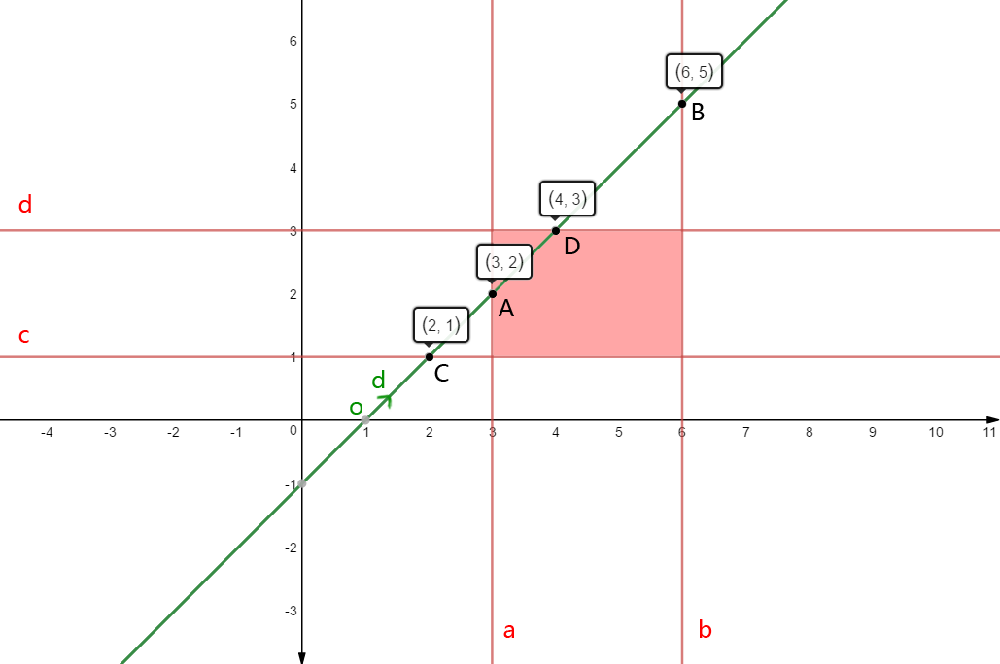
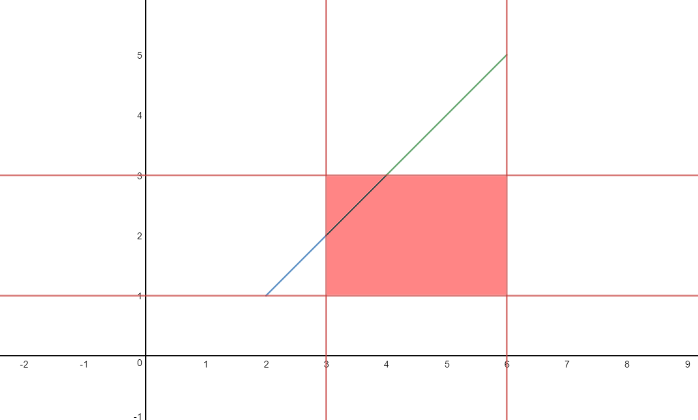
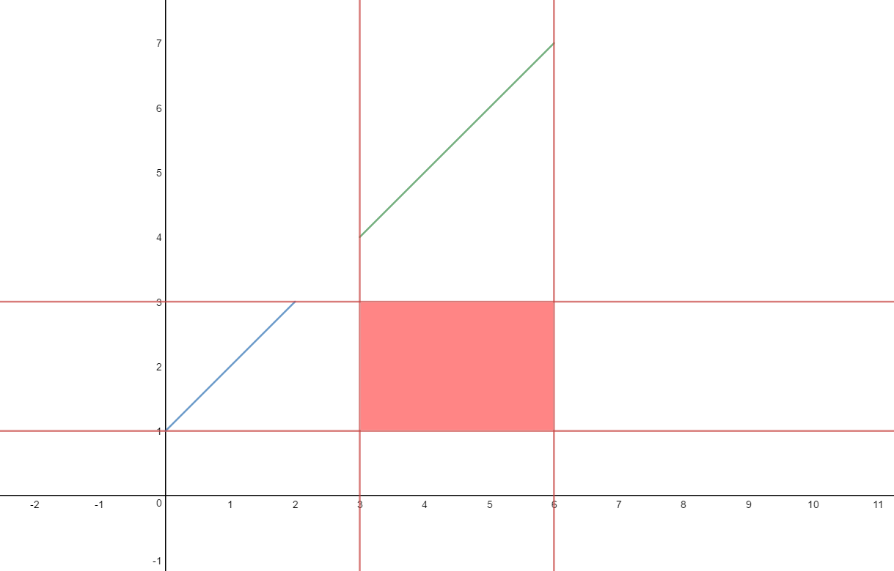

<!--more-->

# 平面的方程

设位于平面P上的某个点为\\( \\vec p\_\{0\} \\)(已知量)，平面P的法向量为\\( \\vec n \\)(已知量)，该平面P的任意一点设为\\( \\vec p \\)，则平面P的方程为：

\\[ (\\vec p -  \\vec p\_\{0\} )\\cdot \\vec n = 0 \\]

使得这个方程成立的原理是，位于平面P上的任意一个向量\\( (\\vec p -  \\vec p\_\{0\} ) \\)，必然和平面P的法向量垂直，互相垂直的向量的点积必然为0。

# 直线的方程

设位于直线上的某个点为\\( \\vec o \\)(已知量)，直线的方向向量为\\( \\vec d \\)(已知量)，直线上的任意一点为\\( \\vec p \\)，则直线的方程为:

\\[ \\vec p = \\vec o + t\\vec d, t\\in R \\]

注意，式子右边的t是一个Scalar（一个实数标量），这个t决定了\\(\\vec p\\)的位置。

# 直线与平面的相交

直线与平面的相交，必然是一个点。将上面的直线方程代入平面方程，得到：

\\[ ( \\vec o + t\\vec d -  \\vec p\_\{0\} )\\cdot \\vec n = 0  \\]

其中，\\( \\vec o 、\\vec d 、\\vec p\_\{0\} 、\\vec n \\)都是已知量，只有t是未知量，**所以求直线与平面的相交点等同于求t的值**。

化简这个式子，得到：

\\[ t\\vec d \\cdot \\vec n + (\\vec o -  \\vec p\_\{0\} )\\cdot \\vec n = 0  \\]


\\[ t\\vec d \\cdot \\vec n = ( \\vec p\_\{0\} - \\vec o )\\cdot \\vec n  \\]


\\[ t = \\frac \{ ( \\vec p\_\{0\} - \\vec o )\\cdot \\vec n \}\{ \\vec d \\cdot \\vec n \}  \\]

# 实例 (基于三维坐标系)

本小节的实例是结合实际需求设计的。在3D图形学中，直线与平面相交算法一般是应用到了光线与包围盒的相交判定问题中。

那么下面就设直线为任意直线(光线都是任意方向的)，而平面设为某几种特定的特殊平面，来展示上面的算法的流程。

## 1. 法向量为\\( (1,0,0) \\)并且经过点\\( (x\_\{0\},0,0) \\)的平面

根据上面的定义，可以知道：

\\[ \\vec n =  (1,0,0)  \\]

\\[ \\vec p\_\{0\} =  (x\_\{0\},0,0)  \\]

代入上面的方程，得到：


\\[ t = \\frac \{ ( (x\_\{0\},0,0) - \\vec o )\\cdot (1,0,0) \}\{ \\vec d \\cdot (1,0,0) \}  \\]

化简得到：

\\[ t = \\frac \{ x\_\{0\} -  o\_\{x\} \}\{ d\_\{x\} \}  \\]

## 2. 法向量为\\( (0,1,0) \\)并且经过点\\( (0,y\_\{0\},0) \\)的平面

同上，可以得到：

\\[ t = \\frac \{ y\_\{0\} -  o\_\{y\} \}\{ d\_\{y\} \}  \\]

## 3. 法向量为\\( (0,0,1) \\)并且经过点\\( (0,0,z\_\{0\}) \\)的平面

同上，可以得到：

\\[ t = \\frac \{ z\_\{0\} -  o\_\{z\} \}\{ d\_\{z\} \}  \\]


# 应用，判定直线与BBox是否相交

BBox是一个分别和x、y、z轴平行的长方体。在判定直线与BBox是否相交的问题中，要把BBox想象成6个无限大的平面，每个平面称为一个slab。然后就可以应用上面的公式，计算直线与6个slab的相交点(即，算出t值)，根据t值，就可以知道直线是不是和BBox相交了。

## 2维的情况

以此图为例：



图中的红色区域是一个BBox，一般定义一个BBox只需要记录它的2个对角顶点的坐标值即可。图中BBox的左下顶点坐标为(3,1)，右上顶点坐标为(6,3)；

图中绿色直线的方程为 y = x - 1。

BBox的4个slab分别为:
	
- 法向量为\\( (1,0) \\)并且经过点\\( (3,0) \\)的直线a

- 法向量为\\( (1,0) \\)并且经过点\\( (6,0) \\)的直线b

- 法向量为\\( (0,1) \\)并且经过点\\( (0,1) \\)的直线c

- 法向量为\\( (0,1) \\)并且经过点\\( (0,3) \\)的直线d

绿色直线的o和d分别为：

- o = (1,0)

- d = (1,1)

根据上面的交点公式，可以知道绿色直线与4个slab的相交点A、B、C、D，它们的t值分别为：

\\[ t\_\{A\} = \\frac \{ x\_\{0\} -  o\_\{x\} \}\{ d\_\{x\} \}  = \\frac \{ 3 - 1 \}\{ 1 \} = 2  \\]

\\[ t\_\{B\} = \\frac \{ x\_\{1\} -  o\_\{x\} \}\{ d\_\{x\} \}  = \\frac \{ 6 - 1 \}\{ 1 \} = 5  \\]


\\[ t\_\{C\} = \\frac \{ y\_\{0\} -  o\_\{y\} \}\{ d\_\{y\} \}  = \\frac \{ 1 - 0 \}\{ 1 \} = 1  \\]

\\[ t\_\{D\} = \\frac \{ y\_\{1\} -  o\_\{y\} \}\{ d\_\{y\} \}  = \\frac \{ 3 - 0 \}\{ 1 \} = 3  \\]

得到这4个t值之后，怎么知道相交还是不相交呢？这需要分析一下：

- \\( t\_\{A\} \\)、\\( t\_\{B\} \\)的意义是：对于在BBox内的任意一个点P，它的分量x关于直线的t值，必然在\\( [ t\_\{A\} ,  t\_\{B\} ] \\)之间；

- \\( t\_\{C\} \\)、\\( t\_\{D\} \\)的意义是：对于在BBox内的任意一个点P，它的分量y关于直线的t值，必然在\\( [ t\_\{C\} ,  t\_\{D\} ] \\)之间；

结合例子来说就是：若BBox内存在一个点P，它的x、y分量的t值分别满足\\( 2 \\leq t\_\{x\} \\leq 5 \\)、\\( 1 \\leq t\_\{y\} \\leq 3 \\)时，这个BBox就必然与直线y = x - 1相交。

但是这个方案并不是最佳方案。

接着分析下。

因为我们给直线定义了o和d，所以直线的另一个表达式是 \\(\\vec o + t\\vec d\\)。根据这个表达式，\\( t\_\{A\} \\)、\\( t\_\{B\} \\) 和  \\( t\_\{C\} \\)、\\( t\_\{D\} \\)有了新的意义：

-  \\( t\_\{A\} \\)、\\( t\_\{B\} \\)限定了一条在直线上的有限长度线段\\( \\overline \{AB\} \\)，起点是\\(\\vec o + t\_\{A\}\\vec d \\)，终点是\\(\\vec o + t\_\{B\}\\vec d \\)

-  \\( t\_\{C\} \\)、\\( t\_\{D\} \\)限定了一条在直线上的有限长度线段\\( \\overline \{CD\} \\)，起点是\\(\\vec o + t\_\{C\}\\vec d \\)，终点是\\(\\vec o + t\_\{D\}\\vec d \\)

于是，判定直线与BBox是否相交的充分必要条件呼之欲出：**s1和s2两个线段存在重叠**。



图中的黑色线段即为\\( \\overline \{AB\} \\)、\\( \\overline \{CD\} \\)的重叠部分。




对于直线y = x + 1来说，就不存在重叠部分了。

## 3维的情况

理解了2维的情况，3维（甚至更高维）的情况类推就可以了。完整的算法流程是：

```c

bool BBox::IsIntersectWithRay(const Ray &ray) const {
	float t0 = ray.mint, t1 = ray.maxt;
	for (int i = 0; i < 3; ++i) { //x y z
		float invRayDir = 1.f / ray.d[i];
		float tNear = (pMin[i] - ray.o[i]) * invRayDir;
		float tFar = (pMax[i] - ray.o[i]) * invRayDir;
		if (tNear > tFar)
			std::swap(tNear, tFar);
		t0 = std::max(tNear, t0);
		t1 = std::min(tFar, t1);
		if (t0 > t1) 
			return false;
	}
	return true;
}

```