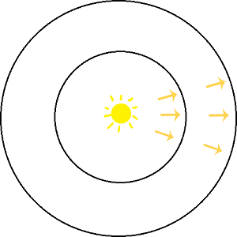

<!--more-->

# 基础概念

## 辐射通量(Flux)

辐射通量(Radiant Flux)，指的是单位时间到达一块平面(或一个局部空间区域)的能量总和。单位是焦耳每秒(joules/second,，J/s)，或瓦特(watts，W)。符号是\\(\\Phi \\)。

一个点光源发射出去的能量大小可以用Flux来描述。其中要注意的是，Flux描述的是单位时间的能量，那么对于点光源来说，Flux只和光源的强弱有关，所以下图的2个圆圈的Flux值是一样的。

## 辐射密度(Irradiance) 和 辐射照度(Radiant Exitence)

辐射密度也叫辐射照度。定义了辐射通量后，就可以定义辐射照度了，辐射照度指的是单位面积**进入**的辐射通量，单位是\\(W/m\^\{2\}\\)。根据这个定义用符号E表示。

辐射照度和辐射密度是近似的东西，辐射照度指的是单位面积**离开**的辐射通量，单位也是\\(W/m\^\{2\}\\)。用符号M表示。

以上面的点光源来分析，可以知道上图中内圆圈的辐射照度比外圆圈的辐射照度大，这是因为内圆圈的面积更小而点光源的Flux值恒定，所以内圆圈的E值就大。

用公式表示：

\\[ E = \\frac \{ 点光源辐射通量 \}\{ 球的表面积 \} =  \\frac \{\\Phi\}\{4\\pi r\^\{2\} \} \\]

可见，W恒定，半径r越小，那么辐射照度E越大。

当假设光源在无限远处时，可把光源认为是一块平面（这种光源叫方向光）。此时，光源平面与被照射平面存在2种情形：光源平面与被照射平面平行（下图中的A）、光源平面与被照射平面不平行（下图中的B）：

(图中的平面附近的A指的是面积Area)

当光源平面与被照射平面平行时，有：

\\[ E\_\{1\} = \\frac \{\\Phi\}\{ A \} \\]

当光源平面与被照射平面不平行时，需要根据平面的法向量和光线方向的夹角θ，先求出\\( A\^\{'\} \\)：

\\[ cos\\theta = \\frac \{ A \}\{ A\^\{'\} \}  \\]

\\[ A\^\{'\}= \\frac \{ A \}\{ cos\\theta \}  \\]

于是得到：

\\[ E\_\{2\} = \\frac \{\\Phi\}\{ A\^\{'\} \} =  \\frac \{\\Phi\}\{ \\frac \{ A \}\{ cos\\theta \}  \} =  \frac \{  \\Phi  cos\\theta  \}\{ A \} \\]

也可以记为

\\[ E = \frac \{ \\Phi  cos\\theta  \}\{ A\^\{\\perp \} \}  \\]

( \\(  A\^\{\\perp \} \\) 指A'在光线的方向的正交平面上的投影)

微分形式：

\\[ dE = \frac \{  d\\Phi  cos\\theta  \}\{ dA\^\{\\perp \}  \} \\]

根据这个式子，可以想到，当θ逼近0度时，cosθ等于1，法向量和光线方向平行（上图中的A）；当θ逼近90度时，cosθ等于0，辐射照度E为0（光线垂直于法向量了）。

## 立体角(Solid Angle)

理解立体角之前要先理解圆心角。在二维平面上，一个圆的圆弧的微分记为ds(也叫弧微分)，半径为r，则圆心角指的是弧微分与半径的比值:

\\[ d\\theta = \\frac \{ds\}\{r\} \\]

对这个式子做0到2π的积分的话，显然右边的分子变成了圆周长2πr，圆心角为\\( \\frac \{ 2πr \}\{r\} = 2π \\)。

立体角与圆心角非常类似。立体角的ds的含义是球面上的面积微分，而分母需要变成半径r的平方（1[球面度](https://en.wikipedia.org/wiki/Steradian)所对应的立体角所对应的球面表面积为\\(r\^\{2\}\\) ）：

\\[ d\\omega = \\frac \{ds\}\{r\^\{2\}\} \\]

因为球体表面积等于\\( 4πr\^\{2\} \\)，所以上面的式子积分到整个球体的话，立体角等于4π。

在宏观上看，立体角的定义是：

\\[ \\Omega = \\frac \{A\}\{r\^\{2\} \} sr \\]

其中，sr是单位，叫做球面度；A是这个立体角所对应的球表面积，A被叫做**[spherical cap](https://en.wikipedia.org/wiki/Spherical_cap)**(球帽?)。

 spherical cap的几何表示如下：

(from wiki)

 spherical cap面积等于\\(2\\pi rh \\)，所以上式可变成：

\\[ \\Omega = \\frac \{2\\pi rh\}\{r\^\{2\} \} sr \\]

当h等于r时，得到：

\\[ \\Omega = \\frac \{2\\pi rr\}\{r\^\{2\} \} sr = 2\\pi \ sr \\]

此时得到的是半球的立体角，那么就可以知道整个球的立体角为\\(4\\pi  \\)，和上述结论一致。

## 辐射强度(Intensity)

辐射强度指**辐射通量和立体角**的比值，符号是I。注意，这里的立体角有朝向性，用新的符号\\(\\omega \\)区分。

\\[ I = \\frac \{ \\Phi \}\{d\\omega \} \\]

因为定义中用到了立体角，立体角只存在在点光源中，所以辐射强度是对点光源才有意义的。

## 辐射亮度(Radiance)

辐射亮度是指辐射通量与单位面积单位立体角的比值。符号为L。定义式如下：

\\[ L = \\frac \{ d\\Phi \}\{ d\\omega dA\^\{\\perp \} \} \\]

或：

\\[ L = \\frac \{ I \}\{  dA\^\{\\perp \} \}  \\]

物理含义如下图所示：

注意：在计算机图形学中，辐射亮度比起上面其他物理量，都重要地得多。

如果要求平面上某点p的某方向\\(\\omega \\)的辐射亮度L(Radiance)，可用下面的符号表示：

\\[ L(p,\\omega ) \\]

其中，\\(\\omega \\)的方向需要注意，因为它是一个立体角，立体角的圆心是p，\\(\\omega \\)的朝向必然是从圆心p往外（向量起点是p）。

实际上，需要区分成入射(input)和出射(output)2种辐射亮度L，用下面2个符号表示：

\\[ L\_\{i\}(p,\\omega ) \\]

\\[ L\_\{o\}(p,\\omega ) \\]

且在现实世界中有：

\\[ L\_\{i\}(p,\\omega ) \\neq L\_\{o\}(p,\\omega ) \\]

还有，上面的这个p不能简单认为真的是一个无体积的点，它也可能是一个无限小的平面块，即它是一个有面积A、有法向量n的“点”。对于这样一个“点”，我们可以求出它的上半球(沿着n的方向)的辐射密度值\\( E(p, n) \\)：

\\[ E(p, n) = \\int \_\{\\Omega \} L\_\{i\} (p,\\omega ) |cos\\theta |d\\omega \\]

分析下这个式子的由来。首先搬出上文给出的L和E的公式：

\\[ L = \\frac \{ d\\Phi \}\{ d\\omega dA\^\{\\perp \} \} \\]

\\[ E = \\frac \{  d\\Phi  cos\\theta  \}\{ dA\^\{\\perp \}  \} \\]

所以有：

\\[ d\\Phi = L d\\omega dA\^\{\\perp \} \\]

\\[ 
E = \\frac \{  d\\Phi  cos\\theta  \}\{ dA\^\{\\perp \}  \}
= \\frac \{  L d\\omega dA\^\{\\perp \}  cos\\theta  \}\{ dA\^\{\\perp \}  \}  
= L d\\omega cos\\theta \\]

对上式做整个半球的积分，就得到了：

\\[ E = \\int \_\{\\Omega \}L|cos\\theta |d\\omega \\]

也就是：

\\[ E(p, n) = \\int \_\{\\Omega \} L\_\{i\} (p,\\omega ) |cos\\theta |d\\omega \\]

其中的\\( cos\\theta \\)加绝对值是因为我们求的是半球的积分，立体角\\(\\omega \\)和法向量的夹角必然是锐角，锐角的余弦值必然大于等于0。

## 立体角(Solid Angle)转换到球形角(Sphere Angle)

Spherical Coordinates坐标系下的单位球，可用2个**弧度变量**来定位球面上一个点：\\(\\theta 和 \\phi \\)。和三维坐标系的对应关系如下：

\\[ x = sin\\theta cos\\phi \\]

\\[ y = sin\\theta sin\\phi \\]

\\[ x = cos\\theta \\]

简单验证下。把上面3个式子代入单位球公式:\\(x\^\{2\}+y\^\{2\}+z\^\{2\} = 1\\)，可得：

\\[ (sin\\theta cos\\phi)\^\{2\} + (sin\\theta sin\\phi )\^\{2\} + cos\^\{2\}\\theta = 1 \\]

\\[ sin\^\{2\}\\theta (cos\^\{2\}\\phi  + sin\^\{2\}\\phi ) + cos\^\{2\}\\theta = 1 \\]

\\[ sin\^\{2\}\\theta  + cos\^\{2\}\\theta = 1 \\]

那么，立体角\\(\\omega \\)和\\(\\theta 、 \\phi \\)是什么关系呢？先给出答案：

\\[ d\\omega = sin\\theta d\\theta d\\phi \\]

似乎有点莫名其妙，这里我详细解释吧。首先先搞懂\\(  d\\theta 和  d\\phi \\)的几何意义。

弧度变量的单位是**弧度**，1弧度的定义是：弧长s等于半径r的弧对应的圆心角为1弧度。因此可以知道整个圆的弧度为周长\\(2\\pi r\\)除以半径\\(r\\)等于\\(2\\pi \\)。

因此，如果已知弧度和半径，就可以求出弧长s，那么上面的\\(\\theta 、 \\phi \\)对应的弧长就是：

\\[ s\_\{ \\theta \} = r\_\{ \\theta \}\\theta  \\]

\\[ s\_\{ \\phi \} = r\_\{ \\phi \}\\phi  \\]

微分形式：

\\[ ds\_\{ \\theta \} = r\_\{ \\theta \} d\\theta  \\]

\\[ ds\_\{ \\phi \} = r\_\{ \\phi \} d\\phi  \\]

\\( r\_\{ \\theta \}、r\_\{ \\phi \}\\)的值并不是相等的，需要接着分析。

在球坐标系下，\\(\\theta 、 \\phi \\)指的是这2个角：

\\(\\theta\\)是目标点p与z轴的夹角；而\\(\\phi\\)是目标点p在xy平面上的投影与y轴的夹角。

从图可知，\\( r\_\{ \\theta \} \\)与圆的半径r相等；而\\( r\_\{ \\phi \} \\)是小于等于r的(注意看上面的小圆)，且有：

\\[ sin\\theta = \\frac \{ r\_\{ \\phi \} \} \{r\_\{ \\theta \} \}\\]

当球是单位球时，球的半径为1，所以有：

\\[ r\_\{ \\theta \} = 1\\]

\\[ r\_\{ \\phi \} = sin\\theta  r\_\{ \\theta \} = sin\\theta \\]

又因为在微观下，立体角对应的曲面(或者叫球帽)面积可以当做一个小矩形看，这个小矩形dA的面积等于2个弧长\\( ds\_\{ \\theta \} \\)和\\( ds\_\{ \\phi \} \\)的积：

\\[ dA = ds\_\{ \\theta \}ds\_\{ \\phi \} = r\_\{ \\theta \} r\_\{ \\phi \}d\\theta d\\phi = sin\\theta d\\theta d\\phi \\]

再因为立体角的微分其实也就是这个小矩阵，那么就有：

\\[ d\\omega = dA = sin\\theta d\\theta d\\phi \\]