<!--more-->

# 基础概念

## 辐射度学 Radiometry 

辐射度学是指测量电磁辐射(包括可见光)的一系列技术，它是和观察者无关的。而近似的光度学(photometric)，是观察者相关的。这里我所说的观察者无关，是指测量值和人眼并无关系，是绝对值。

基于辐射度学来做渲染，需要了解下面这些东西：

- 光谱 Spectrum
- 光谱功率分布(SPD, spectral power distribution)
- XYZ 和 RGB 两种CIE颜色系统以及它们之间、它们和SPD之间的转换
- 辐射通量(Flux)
- 立体角(Solid Angle)
- 辐射照度(Irradiance)
- 辐射亮度(Radiance)

## 光谱 Spectrum

现实中大部分光源（非直接光源也算），发射出的光都是复合光，即是由不同波长的色光混合而成的。 光谱就是指所有光波的**分布**。光谱图如下：

其中波长在 390 nm 到700 nm之间的光波称为可见光。

## 光谱功率分布[spectral power distribution](https://en.wikipedia.org/wiki/Spectral_power_distribution)

光谱功率分布描述的是这样一件事情：对于一个直接或间接光源物体，它发射出的复合光中各个波长的色光分别有多少能量，或者说，这个光源的能量是如何分布到各个波长的光波的？

譬如，水银灯的光主成分是波长为404.7, 407.8, 435.8, 546.1, 577.0, 579.0纳米的光波（见下图）。这意味着能量分布非常不平衡，主要集中在这几个波长上了，相当于离散了。

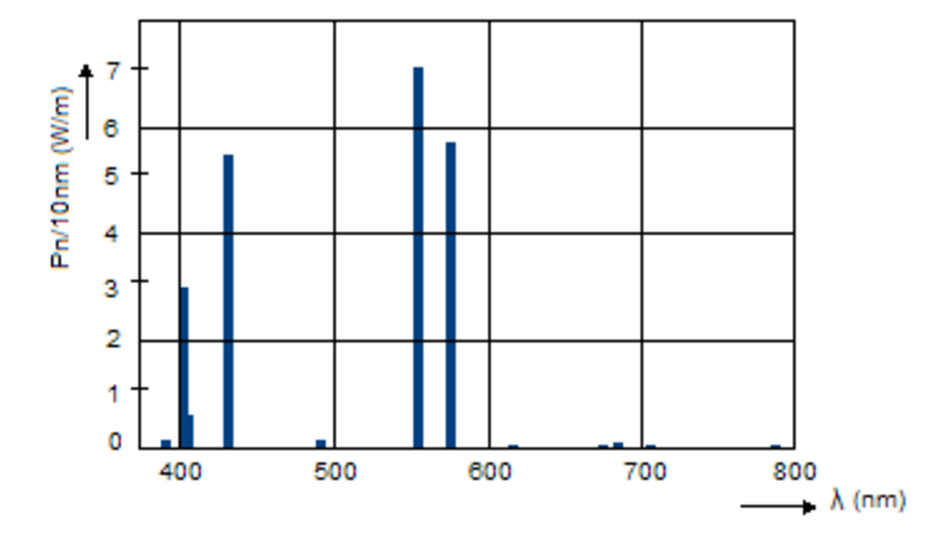

上图就是水银灯的SPD曲线了。

而白炽灯的SPD曲线是这样子的：

注意上面两个图中，横轴是指波长，纵轴是指每单位纳米(10纳米一个单位)的波长的功率（能量）。

SPD曲线都是用[Spectroradiometers](https://en.wikipedia.org/wiki/Spectroradiometer) 这种专门仪器测量的。

SPD一般用符号P(λ)表示。

## XYZ 三色刺激值(tristimulus vlaues)

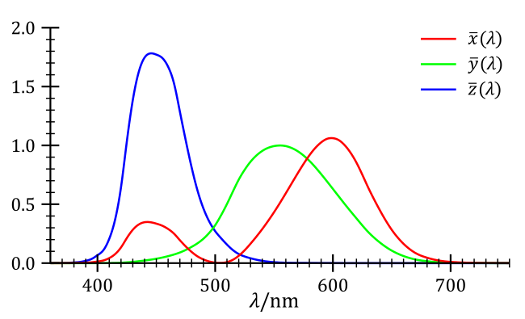

(CIE标准观察者颜色匹配函数)(The CIE standard observer color matching functions)

当看到CIE standard observer字眼时，其实指的就是上面这个图。这个图是通过测量获得的，好处是这个图相当于一个数据表，当需要把SPD曲线转换成XYZ三刺激值时，就可以用这个图做，坏处是它不是数学描述出来的，那么应用起来就有一定限制性。

那么SPD如何转换到XYZ呢？公式如下：

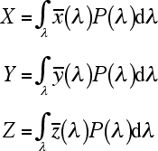

这里面用到了积分，但因为匹配函数是非数学描述的（上面的图的3条曲线），所以这个公式不可用，然而我们可以另辟蹊径，用采样和线性叠加的方法计算XYZ：

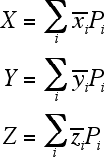

这里的下标i代表第几个刻度的采样。采样间隔(spacing)一般是1到20纳米，采样空间(span)是整个可见光波段（这个波段的具体范围取决于实际需求和SPD曲线）。

[通过SPD计算XYZ：Computing XYZ From Spectral Data](http://www.brucelindbloom.com/index.html?Eqn_Spect_to_XYZ.html)

## XYZ和RGB之间的互相转换

### XYZ到RGB

公式是：

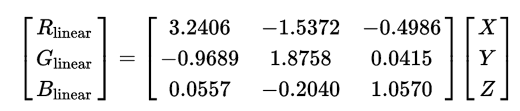

(此矩阵只适用于 [sRGB](https://en.wikipedia.org/wiki/SRGB) 定义中的RGB)

(对于右边的输入值XYZ，也是有要求的，这是因为左边的\\(RGB\_\{linear\} \\)的取值范围是[0,1]，所以右边的XYZ也需要做规范化。在我的下一篇文章中会介绍这部分。)

得到的\\(RGB\_\{linear\} \\)是线性空间的，有什么意义呢？因为一般渲染器都是在线性空间下进行光照计算的，所以这个\\(RGB\_\{linear\} \\)可直接用到光照等计算中。但是当要把最终的渲染结果输出时，例如写入到位图文件或显示到屏幕上，就需要对每个像素的\\(RGB\_\{linear\} \\)做gamma校正，校正成sRGB，公式如下：

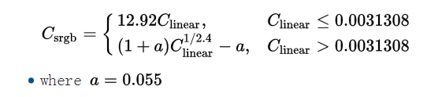

校正后的sRGB是单位化的，各个分量的取值范围是[0.0, 1.0]，输出时需要乘以255并取整。

### RGB到XYZ

当输入的RGB是sRGB时，需要做逆gamma校正，公式如下：

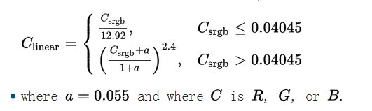

得到线性空间的RGB值后，就可以用下面的公式转换到XYZ空间：

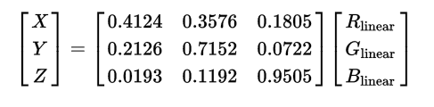

## 辐射通量(Flux)

辐射通量(Radiant Flux)，指的是单位时间到达一块平面(或一个局部空间区域)的能量总和。单位是焦耳每秒(joules/second,，J/s)，或瓦特(watts，W)。符号是\\(\\Phi \\)。

一个点光源发射出去的能量大小可以用Flux来描述。其中要注意的是，Flux描述的是单位时间的能量，那么对于点光源来说，Flux只和光源的强弱有关，所以下图的2个圆圈的Flux值是一样的。

## 辐射照度([Irradiance](https://en.wikipedia.org/wiki/Irradiance))

Irradiance翻译成中文是辐射度/辐照度/辐射照度。定义了辐射通量后，就可以定义辐射照度了，辐射照度指的是单位面积**进入**的辐射通量，单位是\\(W/m\^\{2\}\\)。根据这个定义用符号E表示。

以上面的点光源来分析，可以知道上图中内圆圈的辐射照度比外圆圈的辐射照度大，这是因为内圆圈的面积更小而点光源的Flux值恒定，所以内圆圈的E值就大。

用公式表示：

\\[ E = \\frac \{ 点光源辐射通量 \}\{ 球的表面积 \} =  \\frac \{\\Phi\}\{4\\pi r\^\{2\} \} \\]

可见，W恒定，半径r越小，那么辐射照度E越大。

当假设光源在无限远处时，可把光源认为是一块平面（这种光源叫方向光）。此时，光源平面与被照射平面存在2种情形：光源平面与被照射平面平行（下图中的A）、光源平面与被照射平面不平行（下图中的B）：

(图中的平面附近的A指的是面积Area)

当光源平面与被照射平面平行时，有：

\\[ E\_\{1\} = \\frac \{\\Phi\}\{ A \} \\]

当光源平面与被照射平面不平行时，需要根据平面的法向量和光线方向的夹角θ，先求出\\( A\^\{'\} \\)：

\\[ cos\\theta = \\frac \{ A \}\{ A\^\{'\} \}  \\]

\\[ A\^\{'\}= \\frac \{ A \}\{ cos\\theta \}  \\]

于是得到：

\\[ E\_\{2\} = \\frac \{\\Phi\}\{ A\^\{'\} \} =  \\frac \{\\Phi\}\{ \\frac \{ A \}\{ cos\\theta \}  \} =  \frac \{  \\Phi  cos\\theta  \}\{ A \} \\]

也可以记为

\\[ E = \frac \{ \\Phi  cos\\theta  \}\{ A\^\{\\perp \} \}  \\]

( \\(  A\^\{\\perp \} \\) 指A'在光线的方向的正交平面上的投影)

微分形式：

\\[ dE = \frac \{  d\\Phi  cos\\theta  \}\{ dA\^\{\\perp \}  \} \\]

根据这个式子，可以想到，当θ逼近0度时，cosθ等于1，法向量和光线方向平行（上图中的A）；当θ逼近90度时，cosθ等于0，辐射照度E为0（光线垂直于法向量了）。

## 立体角(Solid Angle)

立体角的介绍请访问：[立体角(Solid Angle)详解](http://www.qiujiawei.com/solid-angle/)

## 辐射亮度([Radiance](https://en.wikipedia.org/wiki/Radiance))

辐射亮度是指辐射通量与单位面积(注意，是与光线方向正交的那块)单位立体角的比值。符号为L。定义式如下：

\\[ L = \\frac \{ d\\Phi \}\{ d\\omega dA\^\{\\perp \} \} = \\frac \{ d\\Phi \}\{ d\\omega dA cos\theta  \} \\]

或：

\\[ L = \\frac \{ \\Phi \}\{ \\omega A\^\{\\perp \} \} \\]

物理含义如下图所示：

辐射照度E和辐射亮度L的关系是"总体"和"个体"的区别，可以对比下两者的公式来理解：

\\[ E = \frac \{ \\Phi \}\{ A \}  \\]

\\[ L = \\frac \{ \\Phi \}\{ \\omega A\^\{\\perp \} \} \\]

E是指进入目标区域的总辐射通量与目标区域总面积的比值；而L是指进入目标区域的总辐射通量与目标区域总面积、**总的入射立体角**的比值，也就是说L是比E多除了立体角。直观图示如下：

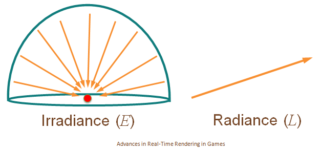

**也就是说其实E和L可以认为是同一个东西，只是L描述的是E的局部。用一句话记住两者的区别：有特定方向时是L，无特定方向时是E。这个区别相当重要，因为它体现在了渲染方程中。**

注意：在计算机图形学中，辐射亮度比起上面其他物理量，都重要地得多。

如果要求平面上某点p的某方向\\(\\omega \\)的辐射亮度L(Radiance)，可用下面的符号表示：

\\[ L(p,\\omega ) \\]

其中，\\(\\omega \\)的方向需要注意，因为它是一个立体角，立体角的圆心是p，\\(\\omega \\)的朝向必然是从圆心p往外（向量起点是p）。

实际上，需要区分成入射(input)和出射(output)2种辐射亮度L，用下面2个符号表示：

\\[ L\_\{i\}(p,\\omega ) \\]

\\[ L\_\{o\}(p,\\omega ) \\]

且在现实世界中有：

\\[ L\_\{i\}(p,\\omega ) \\neq L\_\{o\}(p,\\omega ) \\]

还有，上面的这个p不能简单认为真的是一个无体积的点，它也可能是一个无限小的平面块，即它是一个有面积A、有法向量n的“点”。对于这样一个“点”，我们可以求出它的上半球(沿着n的方向)的辐射照度值\\( E(p, n) \\)：

\\[ E(p, n) = \\int \_\{\\Omega \} L\_\{i\} (p,\\omega ) |cos\\theta |d\\omega \\]

分析下这个式子的由来。首先搬出上文给出的L和E的公式：

\\[ L = \\frac \{ d\\Phi \}\{ d\\omega dA\^\{\\perp \} \} \\]

\\[ dE = \\frac \{  d\\Phi  cos\\theta  \}\{ dA\^\{\\perp \}  \} \\]

所以有：

\\[ d\\Phi = L d\\omega dA\^\{\\perp \} \\]

\\[ 
dE = \\frac \{  d\\Phi  cos\\theta  \}\{ dA\^\{\\perp \}  \}
= \\frac \{  L d\\omega dA\^\{\\perp \}  cos\\theta  \}\{ dA\^\{\\perp \}  \}  
= L d\\omega cos\\theta \\]

对上式做整个半球的积分，就得到了：

\\[ E = \\int \_\{\\Omega \}L|cos\\theta |d\\omega \\]

也就是：

\\[ E(p, n) = \\int \_\{\\Omega \} L\_\{i\} (p,\\omega ) |cos\\theta |d\\omega \\]

其中的\\( cos\\theta \\)加绝对值是因为我们求的是半球的积分，立体角\\(\\omega \\)和法向量的夹角必然是锐角，锐角的余弦值必然大于等于0。

如果把式子中的\\(d\\omega \\)替换成球形角(Sphere Angle)，则得到：

\\[ d\\omega = sin\\theta d\\theta d\\phi \\]

\\[ E(p, n) = \\int \_\{\\Omega \} L\_\{i\} (p,\\omega ) |cos\\theta |sin\\theta d\\theta d\\phi \\]

这个式子是不对的，因为积分那里用了立体角，需要将其转换成对\\(\\theta 和 \\phi \\)的积分。因为这里积分的是半球，那么\\(\\theta \\)的取值范围是\\( [0,\\frac \{π\}\{2\}] \\)、\\(\\phi \\)的取值范围是\\( [0,2π] \\)：

\\[ E(p, n) = \\int \_\{0 \}\^\{ 2π \} \\int \_\{0 \}\^\{ \\frac \{π\}\{2\} \}  L\_\{i\} (p,\\theta ,\\phi ) cos\\theta sin\\theta d\\theta d\\phi \\]

（因为已经明确限定了\\(\\theta \\)的取值范围，所以\\( cos\\theta \\)必然大于等于0，可去掉绝对值符号）

如果\\(L\_\{i\} (p,\\theta ,\\phi ) \\)是一个常量值，那么就意味着任意方向的Radiance都是相等的，于是上式可以求出积分：

\\[ E(p, n) = L\_\{i\} (p,\\theta ,\\phi ) \\int \_\{0 \}\^\{ 2π \} \\int \_\{0 \}\^\{ \\frac \{π\}\{2\} \}  cos\\theta sin\\theta d\\theta d\\phi \\]

\\[ = L\_\{i\} (p,\\theta ,\\phi ) \\int \_\{0 \}\^\{ 2π \} (\\frac \{1\}\{2\}sin\^\{2\}\\theta )\\rvert \^\{\\frac \{π\}\{2\}\}\_\{0\} d\\phi \\]

\\[ = L\_\{i\} (p,\\theta ,\\phi ) \\int \_\{0 \}\^\{ 2π \} (\\frac \{1\}\{2\}sin\^\{2\}\\frac \{π\}\{2\} - \\frac \{1\}\{2\}sin\^\{2\}0  ) d\\phi \\]

\\[ = L\_\{i\} (p,\\theta ,\\phi ) \\int \_\{0 \}\^\{ 2π \} \\frac \{1\}\{2\} d\\phi \\]

\\[ = L\_\{i\} (p,\\theta ,\\phi ) \\frac \{1\}\{2\}( 2π - 0) \\]

\\[ = L\_\{i\} (p,\\theta ,\\phi ) π  \\]

注意，这个简化公式在渲染中很重要。因为当计算一个点到摄像机的Radiance，第一步就是先求这个点的入射E（求E的过程可以很复杂），当求出E之后，就可以认为这个点对任意方向的出射Radiance是均等的，也就是\\( L = \\frac \{E\}\{\\pi \} \\)。

# 渲染方程 Rendering Equation

把wiki的渲染方程贴进来：

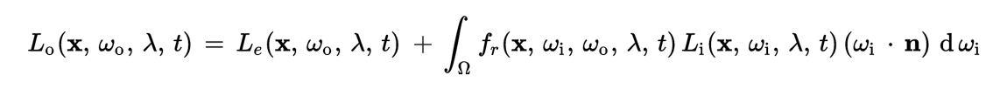

[https://en.wikipedia.org/wiki/Rendering_equation](https://en.wikipedia.org/wiki/Rendering_equation)

各个组成元素的解释：

- **λ** 指代波长为λ的光

- **t** 某一时间点

- **x** 指空间上的某个点，也即被渲染的点(微分平面) (其实应该写成p吧)

- **n** 被渲染的点(平面)的法向量，可以人为指定也可以根据一定规则自动生成

- \\( \\omega \_\{o\} \\)  出射光线的方向（是一个立体角)，起点在x(被渲染的点)

- \\( \\omega \_\{i\} \\)  入射光线的反方向（是一个立体角)，起点也在x，所以才叫反方向

- \\( L\_\{o\}(x, \\omega \_\{o\}, λ, t) \\)   在t时刻、从x点往\\( \\omega \_\{o\} \\)方向的光(λ)的总辐射亮度(Radiance)

- \\( L\_\{e\}(x, \\omega \_\{o\}, λ, t) \\)  指x点自身发射出的辐射亮度(Radiance)，其他参数含义同\\( L\_\{o\}(x, \\omega \_\{o\}, λ, t) \\)

- \\(\Omega \\)是以x为圆心的单位半球，半球的朝向和法向量**n**一致

- \\(\\int \_\{ \Omega \} \\cdots d\omega \_\{i\} \\) 指对这个半球做积分

- \\(f\_\{r\}(x, \\omega \_\{i\}, \\omega \_\{o\}, λ, t) \\) BRDF函数，函数的返回值是一个比值标量(ratio scalar)

- \\( L\_\{i\}(x, \\omega \_\{i\}, λ, t) \\)  在t时刻、沿着\\( \\omega \_\{i\} \\)方向进入x点的光(λ)的辐射亮度(Radiance)

- \\(\\omega \_\{i\} \\cdot n \\) 是一个衰减比值(一般是0到1)，指入射光的方向和法向量的夹角\\( \\theta \_\{i\} \\)，这个夹角导致产生的衰减。原因请参考上面的**辐射通量**小节。这个参数也可以写成\\( \\cos \\theta \_\{i\} \\)

这个方程可以用一句话概括：出辐射亮度等于自身辐射亮度加上

上面的可能太教科书了，下面展示一个简化的渲染方程：

\\[ L\_\{o\}(p, \omega \_\{o\}) = L\_\{e\}(p, \omega \_\{o\})  + \\int \_\{\Omega \}f(p, \omega \_\{o\}, \omega \_\{i\}) L\_\{i\}(p, \omega \_\{i\}) |cos \theta \_\{i\}|d\omega \_\{i\} \\]

能简化成这个式子的原因是，在做渲染器的时候，本来就是把t值固定的，即做动画渲染的话，也是把动画离散成一帧帧来渲染，对每一帧来说t值是常量值；而另外的λ值蕴含在颜色空间(XYZ RGB)中。

还有一个要说清楚的，就是这个方程3个部分的含义：

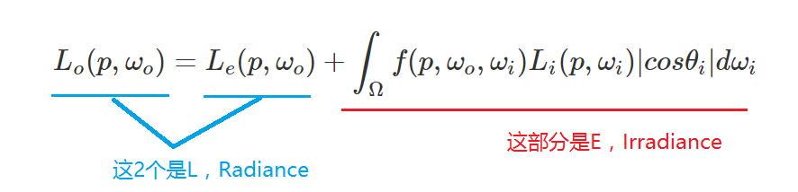

为什么右边那坨是E？上文已经说过了:"有特定方向时是L，无特定方向时是E",因为它是对L做整个半球的积分（注意，积分的是入射角度），也就是无特定方向，所以它是E。而另外2个分部都是指定了朝向了\\(\\omega \_\{o\} \\)（出射方向）的，所以是L。

整个渲染方程可以说就是在求出射方向到底有多少辐射通量（为什么不是L？因为被渲染区域的面积一般都限定为单位面积，即等于1，所以L相当于\\(\\Phi \\) )，辐射通量一旦确定就可以知道这个被渲染区域的颜色。

基于光线追踪的离线渲染中，是可以直接基于上面的渲染方程去做工程实现的。（相比而言，实时渲染更多的是用各种trick技术来近似渲染方程。）

# 参考资料

[http://blog.csdn.net/candycat1992/article/details/46228771](http://blog.csdn.net/candycat1992/article/details/46228771)

[http://www.poynton.com/GammaFAQ.html](http://www.poynton.com/GammaFAQ.html)

[http://www.poynton.com/PDFs/GammaFAQ.pdf](http://www.poynton.com/PDFs/GammaFAQ.pdf)

[Useful Color Equations](http://www.brucelindbloom.com/index.html?Equations.html)

[RGB/XYZ Matrices](http://www.brucelindbloom.com/index.html?Eqn_RGB_XYZ_Matrix.html)