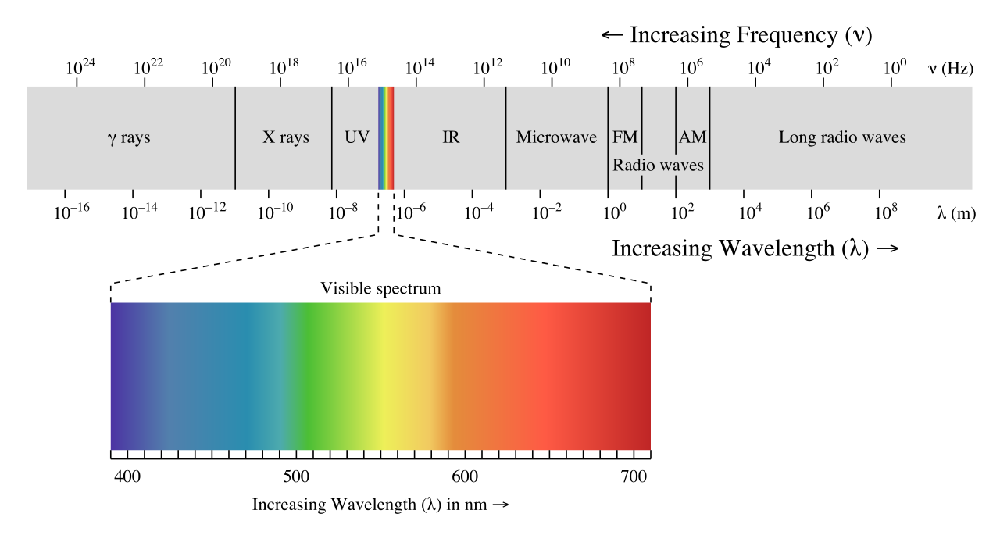
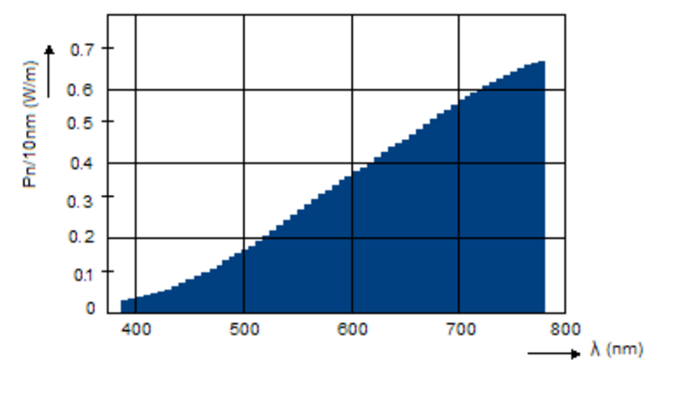

<!--more-->

# 基础概念

## 辐射度学 Radiometry 

辐射度学是指测量电磁辐射(包括可见光)的一系列技术，它是和观察者无关的。而近似的光度学(photometric)，是观察者相关的。这里我所说的观察者无关，是指测量值和人眼并无关系，是绝对值。

基于辐射度学来做渲染，还需要了解另外几个概念：

- 光谱 Spectrum
- 光谱功率分布(SPD, spectral power distribution)
- XYZ 和 RGB 两种CIE颜色系统以及它们之间、它们和SPD之间的转换

## 光谱 Spectrum

现实中大部分光源（非直接光源也算），发射出的光都是复合光，即是由不同波长的色光混合而成的。 光谱就是指所有光波的**分布**。光谱图如下：

其中波长在 390 nm 到700 nm之间的光波称为可见光。

## 光谱功率分布[spectral power distribution](https://en.wikipedia.org/wiki/Spectral_power_distribution)

光谱功率分布描述的是这样一件事情：对于一个直接或间接光源物体，它发射出的复合光中各个波长的色光分别有多少能量，或者说，这个光源的能量是如何分布到各个波长的光波的？

譬如，水银灯的光主成分是波长为404.7, 407.8, 435.8, 546.1, 577.0, 579.0纳米的光波（见下图）。这意味着能量分布非常不平衡，主要集中在这几个波长上了，相当于离散了。

上图就是水银灯的SPD曲线了。

而白炽灯的SPD曲线是这样子的：

注意上面两个图中，横轴是指波长，纵轴是指每单位纳米(10纳米一个单位)的波长的功率（能量）。

SPD曲线都是用[Spectroradiometers](https://en.wikipedia.org/wiki/Spectroradiometer) 这种专门仪器测量的。

SPD一般用符号P(λ)表示。

## XYZ 三色刺激值(tristimulus vlaues)

(CIE标准观察者颜色匹配函数)(The CIE standard observer color matching functions)

看到CIE standard observer字眼时，其实指的就是上面这个图。这个图是通过测量获得的，好处是这个图相当于一个数据表，当需要把SPD曲线转换成XYZ三刺激值时，就可以用这个图做。

那么如何转换呢？公式如下：

这里面用到了积分，但因为匹配函数是非数学描述的（上面的图的3条曲线），所以这个公式不可用，然而可以另辟蹊径，用采样和线性叠加的方法计算XYZ：

这里的下标i代表第几个刻度的采样。采样间隔(spacing)一般是1到20纳米，采样空间(span)是整个可见光波段，这个波段的具体值取决于实际需求和SPD曲线。

[通过SPD计算XYZ：Computing XYZ From Spectral Data](http://www.brucelindbloom.com/index.html?Eqn_Spect_to_XYZ.html)

## XYZ和RGB之间的互相转换

公式是：

看公式可以知道，XYZ和RGB之间可以线性转换得到，这就很实用了。

另外，此图的转换矩阵M是测量获得的，不用去纠结是怎么来的。

[XYZ to RGB](http://www.brucelindbloom.com/index.html?Eqn_XYZ_to_RGB.html)

关于各种CIE颜色表示之间的转换，请访问：

[Useful Color Equations](http://www.brucelindbloom.com/index.html?Equations.html)

## 辐射通量(Flux)

辐射通量(Radiant Flux)，指的是单位时间到达一块平面(或一个局部空间区域)的能量总和。单位是焦耳每秒(joules/second,，J/s)，或瓦特(watts，W)。符号是\\(\\Phi \\)。

一个点光源发射出去的能量大小可以用Flux来描述。其中要注意的是，Flux描述的是单位时间的能量，那么对于点光源来说，Flux只和光源的强弱有关，所以下图的2个圆圈的Flux值是一样的。

## 辐射密度(Irradiance) 和 辐射照度(Radiant Exitence)

辐射密度也叫辐射照度。定义了辐射通量后，就可以定义辐射照度了，辐射照度指的是单位面积**进入**的辐射通量，单位是\\(W/m\^\{2\}\\)。根据这个定义用符号E表示。

辐射照度和辐射密度是近似的东西，辐射照度指的是单位面积**离开**的辐射通量，单位也是\\(W/m\^\{2\}\\)。用符号M表示。

以上面的点光源来分析，可以知道上图中内圆圈的辐射照度比外圆圈的辐射照度大，这是因为内圆圈的面积更小而点光源的Flux值恒定，所以内圆圈的E值就大。

用公式表示：

\\[ E = \\frac \{ 点光源辐射通量 \}\{ 球的表面积 \} =  \\frac \{\\Phi\}\{4\\pi r\^\{2\} \} \\]

可见，W恒定，半径r越小，那么辐射照度E越大。

当假设光源在无限远处时，可把光源认为是一块平面（这种光源叫方向光）。此时，光源平面与被照射平面存在2种情形：光源平面与被照射平面平行（下图中的A）、光源平面与被照射平面不平行（下图中的B）：

(图中的平面附近的A指的是面积Area)

当光源平面与被照射平面平行时，有：

\\[ E\_\{1\} = \\frac \{\\Phi\}\{ A \} \\]

当光源平面与被照射平面不平行时，需要根据平面的法向量和光线方向的夹角θ，先求出\\( A\^\{'\} \\)：

\\[ cos\\theta = \\frac \{ A \}\{ A\^\{'\} \}  \\]

\\[ A\^\{'\}= \\frac \{ A \}\{ cos\\theta \}  \\]

于是得到：

\\[ E\_\{2\} = \\frac \{\\Phi\}\{ A\^\{'\} \} =  \\frac \{\\Phi\}\{ \\frac \{ A \}\{ cos\\theta \}  \} =  \frac \{  \\Phi  cos\\theta  \}\{ A \} \\]

也可以记为

\\[ E = \frac \{ \\Phi  cos\\theta  \}\{ A\^\{\\perp \} \}  \\]

( \\(  A\^\{\\perp \} \\) 指A'在光线的方向的正交平面上的投影)

微分形式：

\\[ dE = \frac \{  d\\Phi  cos\\theta  \}\{ dA\^\{\\perp \}  \} \\]

根据这个式子，可以想到，当θ逼近0度时，cosθ等于1，法向量和光线方向平行（上图中的A）；当θ逼近90度时，cosθ等于0，辐射照度E为0（光线垂直于法向量了）。

## 立体角(Solid Angle)

立体角的介绍请访问：[立体角(Solid Angle)详解](http://www.qiujiawei.com/solid-angle/)

## 辐射亮度(Radiance)

辐射亮度是指辐射通量与单位面积(注意，是与光线方向正交的那块)单位立体角的比值。符号为L。定义式如下：

\\[ L = \\frac \{ d\\Phi \}\{ d\\omega dA\^\{\\perp \} \} \\]

或：

\\[ L = \\frac \{ I \}\{  dA\^\{\\perp \} \}  \\]

物理含义如下图所示：

注意：在计算机图形学中，辐射亮度比起上面其他物理量，都重要地得多。

如果要求平面上某点p的某方向\\(\\omega \\)的辐射亮度L(Radiance)，可用下面的符号表示：

\\[ L(p,\\omega ) \\]

其中，\\(\\omega \\)的方向需要注意，因为它是一个立体角，立体角的圆心是p，\\(\\omega \\)的朝向必然是从圆心p往外（向量起点是p）。

实际上，需要区分成入射(input)和出射(output)2种辐射亮度L，用下面2个符号表示：

\\[ L\_\{i\}(p,\\omega ) \\]

\\[ L\_\{o\}(p,\\omega ) \\]

且在现实世界中有：

\\[ L\_\{i\}(p,\\omega ) \\neq L\_\{o\}(p,\\omega ) \\]

还有，上面的这个p不能简单认为真的是一个无体积的点，它也可能是一个无限小的平面块，即它是一个有面积A、有法向量n的“点”。对于这样一个“点”，我们可以求出它的上半球(沿着n的方向)的辐射密度值\\( E(p, n) \\)：

\\[ E(p, n) = \\int \_\{\\Omega \} L\_\{i\} (p,\\omega ) |cos\\theta |d\\omega \\]

分析下这个式子的由来。首先搬出上文给出的L和E的公式：

\\[ L = \\frac \{ d\\Phi \}\{ d\\omega dA\^\{\\perp \} \} \\]

\\[ E = \\frac \{  d\\Phi  cos\\theta  \}\{ dA\^\{\\perp \}  \} \\]

所以有：

\\[ d\\Phi = L d\\omega dA\^\{\\perp \} \\]

\\[ 
E = \\frac \{  d\\Phi  cos\\theta  \}\{ dA\^\{\\perp \}  \}
= \\frac \{  L d\\omega dA\^\{\\perp \}  cos\\theta  \}\{ dA\^\{\\perp \}  \}  
= L d\\omega cos\\theta \\]

对上式做整个半球的积分，就得到了：

\\[ E = \\int \_\{\\Omega \}L|cos\\theta |d\\omega \\]

也就是：

\\[ E(p, n) = \\int \_\{\\Omega \} L\_\{i\} (p,\\omega ) |cos\\theta |d\\omega \\]

其中的\\( cos\\theta \\)加绝对值是因为我们求的是半球的积分，立体角\\(\\omega \\)和法向量的夹角必然是锐角，锐角的余弦值必然大于等于0。

如果把式子中的\\(d\\omega \\)替换成球形角(Sphere Angle)，则得到：

\\[ E(p, n) = \\int \_\{\\Omega \} L\_\{i\} (p,\\omega ) |cos\\theta |sin\\theta d\\theta d\\phi \\]

这个式子是不对的，因为积分那里用了立体角，需要将其转换成对\\(\\theta 和 \\phi \\)的积分。因为这里积分的是半球，那么\\(\\theta \\)的取值范围是\\( [0,\\frac \{π\}\{2\}] \\)、\\(\\phi \\)的取值范围是\\( [0,2π] \\)：

\\[ E(p, n) = \\int \_\{0 \}\^\{ 2π \} \\int \_\{0 \}\^\{ \\frac \{π\}\{2\} \}  L\_\{i\} (p,\\theta ,\\phi ) cos\\theta sin\\theta d\\theta d\\phi \\]

（因为已经明确限定了\\(\\theta \\)的取值范围，所以\\( cos\\theta \\)必然大于等于0，可去掉绝对值符号）

如果\\(L\_\{i\} (p,\\theta ,\\phi ) \\)是一个常量值，那么就意味着任意方向的Radiance都是相等的，于是上式可以求出积分：

\\[ E(p, n) = L\_\{i\} (p,\\theta ,\\phi ) \\int \_\{0 \}\^\{ 2π \} \\int \_\{0 \}\^\{ \\frac \{π\}\{2\} \}  cos\\theta sin\\theta d\\theta d\\phi \\]

\\[ = L\_\{i\} (p,\\theta ,\\phi ) \\int \_\{0 \}\^\{ 2π \} (\\frac \{1\}\{2\}sin\^\{2\}\\theta )\\rvert \^\{\\frac \{π\}\{2\}\}\_\{0\} d\\phi \\]

\\[ = L\_\{i\} (p,\\theta ,\\phi ) \\int \_\{0 \}\^\{ 2π \} (\\frac \{1\}\{2\}sin\^\{2\}\\frac \{π\}\{2\} - \\frac \{1\}\{2\}sin\^\{2\}0  ) d\\phi \\]

\\[ = L\_\{i\} (p,\\theta ,\\phi ) \\int \_\{0 \}\^\{ 2π \} \\frac \{1\}\{2\} d\\phi \\]

\\[ = L\_\{i\} (p,\\theta ,\\phi ) \\frac \{1\}\{2\}( 2π - 0) \\]

\\[ = L\_\{i\} (p,\\theta ,\\phi ) π  \\]

