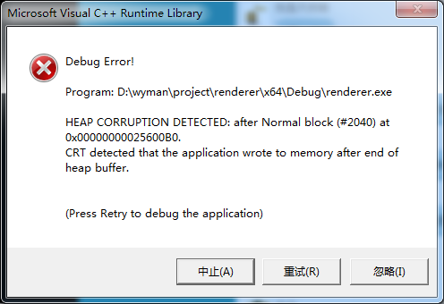

<!--more-->


## Heap Corruption Deteched



这个报错发生在main函数返回时。出错原因是在堆数组的赋值上。

先是初始化一个数组指针：

```c
bool * array = new bool[100];
```

然后循环赋值：

```c
for(int i = 0; i <= 100; i++){
	array[i] = true;
}
```

注意，这个循环溢出了，这个循环对array[100]进行了赋值，即数组的第101个元素，而数组长度只有100。

然后再执行delete[] array就会出上面截图那个报错了。

修了那个循环次数就没事了，就酱。