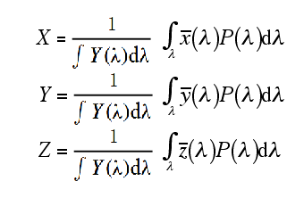

<!--more-->


## 从SPD到XYZ

在上一篇文章中，已经提到了SPD需要转换成XYZ值，才能进一步转换成RGB从而变成位图。这里面的工程实现还是需要学习一下的。

首先，先回顾下三色XYZ三色刺激值(tristimulus vlaues)的图:


这个图怎么用到程序里呢？方法就是打表，图中有3个函数\\( \\hat \{x\}(\\lambda ) 、 \\hat \{y\}(\\lambda ) 、 \\hat \{z\}(\\lambda )\\)，可以建立4个数组来表示：

```c
//切片数
static const int nCIESamples = 471;

//存了λ值的数组，范围是从360到830，即可见光波段
const Float CIE_lambda[nCIESamples] = {
	360, 361, 362, 363, 364, 365, 366, 367, 368, 369, 370, 371, 372, 373, 374,
	······
	825, 826, 827, 828, 829, 830
};

//下面三个数组的元素的取值范围是[0.0, 2.0]

//hat(x)函数
extern const Float CIE_X[nCIESamples] = {
    0.0001299000f,   0.0001458470f,   0.0001638021f,   0.0001840037f,
 	······
 	0.000001439440f, 0.000001341977f, 0.000001251141f
};

//hat(y)函数
extern const Float CIE_Y[nCIESamples] = {
	0.000003917000f,0.000004393581f,  0.000004929604f, 0.000005532136f,
    ······
    0.0000005198080f, 0.0000004846123f, 0.0000004518100f
};

//hat(z)函数
extern const Float CIE_Z[nCIESamples] = {
	0.0006061000f, 0.0006808792f, 0.0007651456f, 0.0008600124f,
    ······
    0.0f, 0.0f, 0.0f
};

```

因为\\( \\hat \{x\}(\\lambda ) 、 \\hat \{y\}(\\lambda ) 、 \\hat \{z\}(\\lambda )\\)是常量（和万有引力常数一样的常数）,所以上面的4个数组只需要制作一次就行了，然后可以把它们硬编码到你的程序里(pbrt就是这么干的)。

## SPD数据源

SPD数据源如何获得暂且不提，这里关注的是SPD数据源的存放格式：它应该是一个序列，序列中的元素是一个tuple，tuple里存了2个元素，一是λ值，二是v值，代表眼睛-光谱敏感度(spectral sensitivity)，后者一般是一个单位化的值(0.0到1.0之间):

```c

//n由数据提供方给出
Float SPD[n]  = [
	λ, v
	···
];

```

## 从SPD转换到XYZ到RGB

先贴上pbrt的实现代码：

```c
//pbrt-v2
static RGBSpectrum FromSampled(const float *lambda, const float *v, int n) {
    //part I
    float xyz[3] = { 0, 0, 0 };
    float yint = 0.f;
    for (int i = 0; i < nCIESamples; ++i) {
        yint += CIE_Y[i];
        float val = InterpolateSpectrumSamples(lambda, v, n,
                                               CIE_lambda[i]);
        xyz[0] += val * CIE_X[i];
        xyz[1] += val * CIE_Y[i];
        xyz[2] += val * CIE_Z[i];
    }
    //part II
    xyz[0] /= yint;
    xyz[1] /= yint;
    xyz[2] /= yint;
    //part III
    return FromXYZ(xyz);
}

```
该函数的参数分别是SPD曲线的λ值、v值、λ-v对数(即采样次数)，这3者确定了一条离散的SPD曲线；该函数的返回值就是一个RGB值。

可以把这个函数分成3部分来阅读理解。

part I是其中最关键的，这个for循环计算出了xyz各个分量的值，循环次数和nCIESamples一致，每次循环需要执行一个InterpolateSpectrumSamples函数得到一个val值(这个val是波长!)，再把这个val值分别和CIE_X、CIE_Y、CIE_Z相乘，并累加到xyz数组里。这个步骤其实就是下面的公式：


的离散版本:


InterpolateSpectrumSamples做的事情也不复杂。因为SPD的n值和nCIESamples不一定一样，也就是说不可能SPD和XYZ表的切片刚好一致，所以必然要做线性插值，从而把SPD切片数据转换成可用数据。具体转换过程看pbrt源码即可。

part II是把xyz规范化(Normalize)的过程。part I 加上 part II总的公式如下：



part III做的事情就是把XYZ转换成RGB，公式在上一篇文章已经给出了：


对应的代码如下：

```c

inline void XYZToRGB(const Float xyz[3], Float rgb[3]) {
    rgb[0] = 3.240479f * xyz[0] - 1.537150f * xyz[1] - 0.498535f * xyz[2];
    rgb[1] = -0.969256f * xyz[0] + 1.875991f * xyz[1] + 0.041556f * xyz[2];
    rgb[2] = 0.055648f * xyz[0] - 0.204043f * xyz[1] + 1.057311f * xyz[2];
}

```

注意，这里得到的RGB是线性空间的RGB，并没有做gamma校正。

## 参考资料

pbrt源码