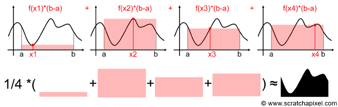
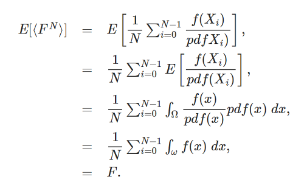

<!--more-->

## 蒙特·卡罗积分公式

对于一个连续函数f，它的积分公式为：

\\[ F = \\int \_\{a\}\^\{b\}f(x)dx \\]

对应的，f的[蒙特·卡罗积分公式](https://en.wikipedia.org/wiki/Monte_Carlo_integration)如下：

\\[ F\^\{N\} = \\frac \{1\}\{N\}\\sum \_\{i=1\}\^\{N\}\\frac \{f(X\_\{i\})\}\{ pdf(X\_\{i\}) \} \\]

蒙特卡罗最关键的就是理解这条公式了。其他延伸探讨都可以暂时忽略。那么这条公式如何理解呢？首先第一点是，虽然这条公式没有积分符号\\(\\int  \\)，但是它认被称为**积分**，这是因为这公式的作用相当于在对f(x)做积分，只不过不那么“精确”，即蒙特·卡罗积分是**对理想积分的近似**。

那么这个近似是如何完成的？很简单，核心就是两个字：**采样(Sampling)**。对一个连续函数的采样方法是在该函数的定义域中随机挑N个值，并求出对应的N个\\( f(X\_\{i\}) \\)，就得到了样本集合。再对这些样本集合做一些换算，就可以得到一个近似的积分了。对于蒙特·卡罗积分，**采样样本越多，就越逼近真实的积分结果**，这是蒙特·卡罗积分的最核心特性。

继续观察上面的公式，里面还有一个极其重要的参数：pdf(probability distribution function，概率分布函数)。pdf还有个近亲pmf，下面小节详解pdf、pmf的由来。

## pdf和pmf

- pmf(probability mass function)，指的是**离散的**随机变量的概率分布函数
- pdf(probability distribution function)， 指的是**连续的**随机变量的概率分布函数

离散的随机变量X的数学期望为：

\\[E[X] = \\sum \_\{ x\_\{i\} \}pmf(x\_\{i\})x\_\{i\} \\]

连续的随机变量X的数学期望为：

\\[E[X] = \\int \^\{\\infty \}\_\{-\\infty \}pdf(x)xdx \\]

pdf和pmf名字接近，含义也是接近。pdf、pmf函数的参数都是样本值x，返回值是概率，即表示一个样本出现的概率，所有样本的出现概率之和(概率的积分)应等于1。要注意的是，pdf、pmf的存在说明有可能每个样本的出现概率都是各不相同的。

### pmf

pmf的简单例子就是**基于均匀分布的离散的随机变量X**，此时\\( pmf(X\_\{i\}) \\)恒等于\\( \\frac\{1\}\{N\} \\)，含义是每个随机样本的出现概率等于\\( \\frac\{1\}\{样本总数\} \\)。

通过这个例子也印证了pmf的性质：**pmf函数的所有结果值之和等于1**。

### pdf

借用[http://www.scratchapixel.com/](http://www.scratchapixel.com/)的一个很好的例子来说明：

这个例子中，目标问题是求出该函数[a,b]段曲线下方的面积(最后一幅图的黑色区域)，也就是要求该函数[a,b]段的积分。基于蒙特·卡罗积分的解法，就要用上面给出的公式：

\\[ F\^\{N\} = \\frac \{1\}\{N\}\\sum \_\{i=1\}\^\{N\}\\frac \{f(X\_\{i\})\}\{ pdf(X\_\{i\}) \} \\]

在此图中，做了四次随机采样，得到了四个随机样本\\( x\_\{i\} \\)：\\( x\_\{1\}、x\_\{2\}、x\_\{3\}、x\_\{4\} \\)，并且进而得到了这四个样本的\\( f(x\_\{i\}) \\)值：\\( f(x\_\{1\})、f(x\_\{2\})、f(x\_\{3\})、f(x\_\{4\}) \\)。（原文没有提及如何得到\\( f(x\_\{i\}) \\)。函数f是奇形怪状的，不太可能有表达式存在，难道是用尺子量的？暂且忽略这个事吧。）

有了这4个样本后，可以针对每一个样本求一个**近似面积值**，这个面积值等于\\( f(x\_\{i\})  (b - a) \\)。为什么可以这样做呢？是因为每一个单独的样本是对原函数f的近似，即在每个样本中，认为\\( f(x) \\)恒等于\\( f(x\_\{i\}) \\)，从而让原函数曲线简化成一个矩形区域，而矩形的面积显然就是长(b-a)乘以宽\\( f(x\_\{i\}) \\)。

得到4个**近似面积值**后，再求出它们的均值(数学期望)，就完成了蒙特·卡罗积分。把上述流程汇总得到：

\\[ Area = \\frac \{1\}\{4\}(f(x\_\{1\})(b - a) + f(x\_\{2\})(b - a) + f(x\_\{3\})(b - a) + f(x\_\{4\})(b - a)) \\]

\\[ = \\frac \{1\}\{4\}(b - a)( f(x\_\{1\}) + f(x\_\{2\}) + f(x\_\{3\}) + f(x\_\{4\}) ) \\]

\\[ = \\frac \{1\}\{4\}(b - a)\\sum \_\{i=1\}\^\{4\}f(x\_\{i\}) \\]

此时，对比下蒙特·卡罗积分公式：

\\[ F\^\{N\} = \\frac \{1\}\{N\}\\sum \_\{i=1\}\^\{N\}\\frac \{f(X\_\{i\})\}\{ pdf(X\_\{i\}) \} \\]

发现两个式子非常相似，对式子做下转换得到：

\\[ Area =  \\frac \{1\}\{4\}\\sum \_\{i=1\}\^\{4\}\\frac \{f(x\_\{i\})\}\{\\frac \{1\}\{b - a\} \} \\]

于是可以知道\\( pdf(x\_\{i\}) \\)等于：

\\[ pdf(x\_\{i\}) = \\frac \{1\}\{b - a \} \\]

这意味着，对于连续函数f，f的每个可能取值x的出现概率等于x的取值范围[a,b]的倒数\\(\\frac\{1\}\{b-a\}\\)。

在实际应用场合，随机变量X要写成F(X)，即可能需要对X做一个转换再使用。这时候要注意F(X)的pdf不等于X的pdf。

## 蒙特·卡罗积分的数学期望等于理想积分？

对于下面的\\(F\\)和\\(F\^\{N\}\\)：

\\[ F = \\int \_\{a\}\^\{b\}f(x)dx \\]

\\[ F\^\{N\} = \\frac \{1\}\{N\}\\sum \_\{i=1\}\^\{N\}\\frac \{f(X\_\{i\})\}\{ pdf(X\_\{i\}) \} \\]

是否随着N变大，\\(F\^\{N\}\\)会逼近\\(F\\)？即\\(F\^\{N\}\\)的数学期望是否等于\\(F\\)?[Monte Carlo Methods in Practice](http://www.scratchapixel.com/lessons/mathematics-physics-for-computer-graphics/monte-carlo-methods-in-practice/monte-carlo-integration)文章中给出了推导过程：

第二行到第三行是最不好理解的。因为这里其实用到了新的知识点：[Law of the unconscious statistician](https://en.wikipedia.org/wiki/Law_of_the_unconscious_statistician)(简称：LOTUS)。LOTUS的应用情景是，已知随机变量X的概率分布，但不知道f(x)的分布，此时用LOTUS公式能计算出函数f(x)的数学期望。LOTUS的公式如下：

f(x)是离散函数时:

\\[ E[f(X)] = \\sum \_\{x\_\{i\}\}f(x\_\{i\})pmf(x\_\{i\}) \\]

f(x)是连续函数时:

\\[ E[f(X)] = \\int \_\{-\\infty \}\^\{\\infty\}f(x)pdf(x)dx \\]

(建议对比第二小节开头的两条公式来理解)

有了LOTUS公式，再来看第二行到第三行的转换，就好理解了：

\\[ E[ \\frac \{f(X\_\{i\})\}\{pdf(X\_\{i\})\} ] = E[ \\frac \{f(x)\}\{pdf(x)\} ] =\\int \_\{-\\infty \}\^\{\\infty\}\\frac \{f(x)\}\{pdf(x)\}pdf(x)dx \\]

\\[ =\\int \_\{-\\infty \}\^\{\\infty\}f(x)dx \\]

## 蒙特·卡罗积分在图形学中的应用

经过上一小节对pmf、pdf的介绍和举例后，可以知道蒙特·卡罗积分公式是确实有用的，但在图形学中有什么地方会用到呢？

第一个用到的地方是**计算着色点的间接光照**。

\\( p(θ,ϕ)\\) 被称为联合概率分布(joint probability distribution)。

[边缘分布(marginal distribution)](https://en.wikipedia.org/wiki/Marginal_distribution)

[累积分布函数CDF(Cumulative distribution function)](https://en.wikipedia.org/wiki/Cumulative_distribution_function)

# 参考资料

[http://www.scratchapixel.com/lessons/3d-basic-rendering/global-illumination-path-tracing/global-illumination-path-tracing-practical-implementation](http://www.scratchapixel.com/lessons/3d-basic-rendering/global-illumination-path-tracing/global-illumination-path-tracing-practical-implementation)

[http://www.scratchapixel.com/lessons/mathematics-physics-for-computer-graphics/monte-carlo-methods-in-practice/monte-carlo-integration](http://www.scratchapixel.com/lessons/mathematics-physics-for-computer-graphics/monte-carlo-methods-in-practice/monte-carlo-integration)

[http://www.scratchapixel.com/lessons/mathematics-physics-for-computer-graphics/monte-carlo-methods-mathematical-foundations/expected-value-of-the-function-of-a-random-variable](http://www.scratchapixel.com/lessons/mathematics-physics-for-computer-graphics/monte-carlo-methods-mathematical-foundations/expected-value-of-the-function-of-a-random-variable)