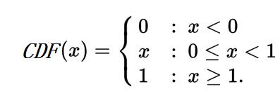

<!--more-->

# 计算着色点的间接光照

在计算一个着色点的间接光照时，理论上可以通过从着色点往上半球各个方向发射无数条光线，并计算这些光线返回的Rdiance值，就可以得到这个着色点的间接光照。但因为计算机的计算速度问题，不可能给一个着色点生成“无数”条光线，在工程实现上必然是得做成有限数量的光线，且很悲哀的，这个数量值不会很大。

那么如何用有限的光线，得到最真实的间接光照值呢？答案是用蒙特·卡罗积分。蒙特·卡罗积分的特性是，采样数越多就越接近真实积分值，而这正是做间接光照计算所需要的。譬如我们可以根据实际需求，设置采样数量，数量大就出图慢、精度高，数量小就出图快但粗糙。

下面开始数学环节。

## 计算间接光照的蒙特·卡罗方法

生成间接光照的各个光线时，需要有一个随机变量\\(\omega \\)，这个随机变量就是光线的“出射角度”，更严格地说应该是“[立体角](http://www.qiujiawei.com/solid-angle/)”。

对于一个半球，它的总立体角是2π，那么关于\\(\omega \\)的pdf函数记为\\(p(\omega ) \\)，而在上一篇文章中我们知道pdf的积分等于1，所以有：

\\[ \\int \_\{\omega = 0 \}\^\{2π\}p(\omega )d\omega = 1 \\]

又因为我们希望\\(\omega \\)是符合均匀分布的，从而使得间接光照采样是概率无偏的，那么\\(p(\omega ) \\)是一个常数：

\\[ p(\omega ) = C \\]

\\[ C\\int \_\{\omega = 0 \}\^\{2π\}d\omega = 1 \\]

这个方程是可以解出来的:

\\[ C\\int \_\{\omega = 0 \}\^\{2π\}d\omega = C(2π - 0 ) =  1 \\]

\\[  p(\omega ) = C = \\frac \{1\}\{2π\} \\]

成功解决了第一个事情：**随机变量\\(\omega \\)的pdf函数**。

下一个问题是：**把立体角\\(\omega \\)转换成球形角\\(\phi 、\theta  \\)，从而方便实际计算**：

\\[  p(\omega ) d\\omega =  p(\\theta , \\phi) d\\theta d\\phi \\]

其中，\\(d\omega \\)的转换方法在[立体角(Solid Angle)详解](http://www.qiujiawei.com/solid-angle/)中已经阐述过了，公式为：

\\[ d\\omega = sin\\theta d\\theta d\\phi \\]

所以有：

\\[  p(\omega ) d\\omega =  p(\\theta , \\phi) d\\theta d\\phi \\]

\\[  p(\omega ) sin\\theta d\\theta d\\phi =  p(\\theta , \\phi) d\\theta d\\phi \\]

\\[  \\frac \{1\}\{2π\} sin\\theta d\\theta d\\phi =  p(\\theta , \\phi) d\\theta d\\phi \\]

\\[  \\frac \{1\}\{2π\} sin\\theta  =  p(\\theta , \\phi)  \\]

\\[  p(\\theta , \\phi) = \\frac \{sin\\theta\}\{2π\}  \\]

\\( p(θ,ϕ)\\) 被称为联合概率分布(joint probability distribution)。此时，我们需要实现对θ,ϕ各自的独立采样，所以需要把\\( p(θ,ϕ)\\)拆分开，求出\\( p(θ)\\) 和 \\( p(ϕ) \\)。幸运地是，有简单的方法可以实现同样的效果，那就是用[边缘分布(marginal distribution)](https://en.wikipedia.org/wiki/Marginal_distribution)。计算过程如下：

\\[ p(θ) = \\int \_\{\phi = 0\}\^\{2π\}p(θ,ϕ)d\phi = \\int \_\{\phi = 0\}\^\{2π\}\\frac \{sin\\theta\}\{2π\}d\phi = 2π \\frac \{sin\\theta\}\{2π\} =sin\\theta \\]

\\[ p(ϕ) = \\int \_\{θ = 0\}\^\{ \\frac \{π\}\{2\} \}p(θ,ϕ)dθ = \\int \_\{ θ = 0\}\^\{ \\frac \{π\}\{2\} \}\\frac \{sin\\theta\}\{2π\}dθ = \\frac \{-cos\\theta\}\{2π\} | \_\{0\}\^\{\\frac \{π\}\{2\}\}= \\frac \{-cos \\frac \{π\}\{2\} \}\{2π\} - \\frac \{-cos0 \}\{2π\} = \\frac \{1\}\{2π\} \\]

\\(p(ϕ)\\)也可以用联合概率公式来求解：

\\[ p(ϕ) =\\frac \{p(θ,ϕ)\}\{p(θ)\} =  \\frac \{ \\frac \{sin\\theta\}\{2π\}  \}\{ sin\\theta \}  = \\frac \{1\}\{2π\} \\]

到了这里，事情还没完，还有2个东西要学习：

[CDF, Cumulative distribution function](https://en.wikipedia.org/wiki/Cumulative_distribution_function) 和 [Inverse transform sampling](https://en.wikipedia.org/wiki/Inverse_transform_sampling)。

## CDF 累积分布函数

公式如下：

\\[ CDF(x) = P( -\\infty < X \\leq x ) \\]

大写X是指随机变量，小写x指的是参数，P是概率函数，因此CDF(x)的含义是，**随机变量X的值小于等于x的概率**。

对于连续随机变量X，CDF可以用积分形式表示：

\\[ CDF(s) = \\int \_\{-\\infty \}\^\{s\}pdf(x)dx \\]

从基本定义延伸出来的公式：

\\[ P(a < x \\leq b) = CDF(b) - CDF(a) = \\int \_\{ a \}\^\{b\}pdf(x)dx  \\]

CDF的性质：

\\[ \\lim \_\{x\\to -\\infty \}CDF(x) = 0 \\]

\\[ \\lim \_\{x\\to +\\infty \}CDF(x) = 1 \\]

实例，取值范围是[0,1]的随机变量X的CDF：

CDF一般也可以用\\(F\_\{X\}\\)表示。

## Inverse transform sampling 逆采样方法

步骤一：获得一个均布分布的随机变量u，这个u必须落在[0,1]范围内，并把这个u解释为“概率值”（概率的范围也是[0,1])。

步骤二：获得一个CDF(x)函数

步骤三：计算使得下面的不等式成立的x的最大值：

\\[ CDF(x) = P( -\\infty < X \\leq x ) = F\_\{X\}(x) < u \\]

因为**逆采样**本质上是一个函数，变量是u，解是x，所以用这个不等式来表达逆采样方法是不方便的，更常见的做法是用\\(F\_\{X\}\^\{-1\}(u) \\)来表示**逆采样**。\\(F\_\{X\}\^\{-1\}(u) \\)的完整表达式一般用[下确界或上确界](https://en.wikipedia.org/wiki/Infimum_and_supremum)等式表示：

上确界形式：

 \\[ F\_\{X\}\^\{-1\}(u) = \\sup \lbrace F\_\{X\}(x) < u \rbrace \\]

下确界形式：

 \\[ F\_\{X\}\^\{-1\}(u) = \\inf \lbrace F\_\{X\}(x) \geq u \rbrace \\]

\\(F\_\{X\}\^\{-1\}(u) \\)的重要性质：u的每一个取值都有唯一的x与之对应。使得这个性质的原因是CDF是一个递增的函数。

因此，在实际应用中，可以先随机一个u，再通过CDF函数计算出对应的x，又因为u是均匀采样(uniform sample)的，于是x也是均匀采样的。

## 再回到间接光照的问题

前面已经得到了\\( p(θ)\\) 和 \\( p(ϕ) \\):

\\[ p(θ) = sin\\theta \\]

\\[ p(ϕ) = \\frac \{1\}\{2π\} \\]

现在可以推导它们的CDF函数了：

\\[ CDF(θ) = \\int \_\{0 \}\^\{θ\}p(θ)dθ = \\int \_\{0 \}\^\{θ\}sin\\theta dθ = (-cos\\theta) |\_\{0\}\^\{θ\}  = -cos\\theta - (-cos0) = 1 - cos\\theta \\]

\\[ CDF(ϕ) = \\int \_\{0 \}\^\{ϕ\}p(ϕ)dϕ = \\int \_\{0 \}\^\{ϕ\}\\frac \{1\}\{2π\}dϕ = \\frac \{1\}\{2π\}\\int \_\{0 \}\^\{ϕ\}dϕ = \\frac \{ϕ\}\{2π\} \\]

即：

\\[ F\_\{θ\}(θ) = 1 - cos\\theta  \\]

\\[ F\_\{ϕ\}(ϕ) = \\frac \{ϕ\}\{2π\} \\]

然后就是推导这两个CDF的逆采样公式，设：

\\[ u\_\{1\} = 1 - cos\\theta \\]

\\[ cos\\theta = 1 - u\_\{1\}  \\]

\\[ \\theta = cos\^\{-1\}(1 - u\_\{1\})  \\]

即：

\\[ F\_\{θ\}\^\{-1\}(u\_\{1\}) = cos\^\{-1\}(1 - u\_\{1\}) \\]

再设：

\\[ u\_\{2\} = \\frac \{ϕ\}\{2π\} \\]

\\[ ϕ = u\_\{2\}2π  \\]

即：

\\[ F\_\{ϕ\}\^\{-1\}(u\_\{2\}) =  u\_\{2\}2π   \\]

汇总一下：

\\[ F\_\{θ\}\^\{-1\}(u\_\{1\}) = cos\^\{-1\}(1 - u\_\{1\}) \\]

\\[ F\_\{ϕ\}\^\{-1\}(u\_\{2\}) =  u\_\{2\}2π   \\]

总结一下：只要生成2个在[0,1]范围的符合均匀分布的随机数\\( u\_\{1\}、u\_\{2\}\\)，就可以得到均匀分布的\\(θ、ϕ\\)了，就是这么简单。

有了\\(θ、ϕ\\)后，就可以代入3维的极坐标公式，得到3维的笛卡尔坐标：

\\[ x= sinθ cosϕ \\]

\\[ y= cosθ \\]

\\[ z= sinθ sinϕ \\]

坐标(x,y,z)必然落在圆心在原点、半径为1、法向量为(0,1,0)的半球的球面。

有了(x,y,z)坐标，就可以生成沿着半球面的均匀的出射光线了。之后的就是光线追踪的问题了。本文不表。

# 参考资料

[http://www.scratchapixel.com/lessons/3d-basic-rendering/global-illumination-path-tracing/global-illumination-path-tracing-practical-implementation](http://www.scratchapixel.com/lessons/3d-basic-rendering/global-illumination-path-tracing/global-illumination-path-tracing-practical-implementation)

