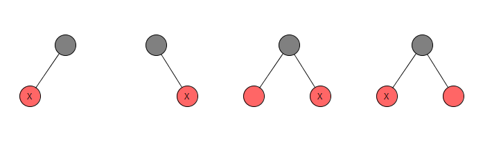
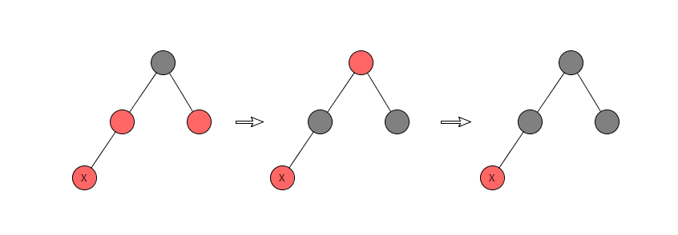

<!--more-->
本文争取用精简的文字描述清楚红黑树的各种基本操作：插入、删除、查询。

# Insert

根据插入的节点在树中的位置以及树的着色状态，可以划分出多种情况（其实这是个不好的现象，情况太多，容易写错），这些情况总结如下：

（注意，在以下所有情况中，在节点插入前红黑树是平衡的，即使从图片上看并不能看出平衡性）

1.插入的节点是根节点

2.插入的节点的父节点是**黑**色

3.插入的节点的父节点是**红**色

- 3a.叔节点（即父节点的兄弟节点）也是**红**色

- 3b.叔节点是**黑**色

4.插入的节点的父节点是**红**色，叔节点是**黑**色，插入的节点是父节点的**左**孩子

5.插入的节点的父节点是**红**色，叔节点是**黑**色，插入的节点是父节点的**右**孩子

## 资料

本文配图来自：https://www.cs.usfca.edu/~galles/visualization/RedBlack.html

http://www.geeksforgeeks.org/red-black-tree-set-2-insert/