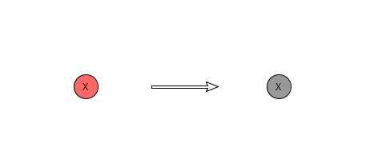
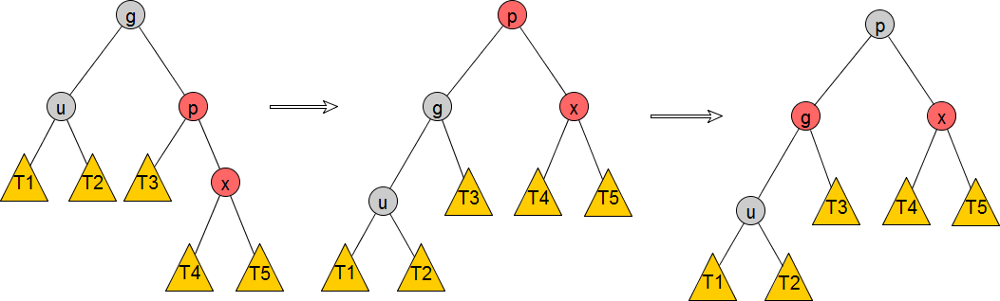
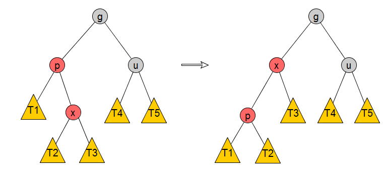
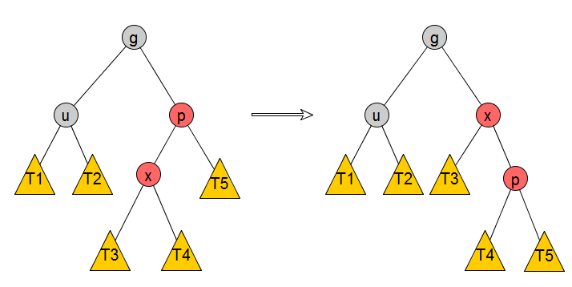

<!--more-->
本文争取用精简的文字描述清楚红黑树的各种基本操作：**插入**、删除、查询。

在开始下文之前，再次祭出红黑树的四大性质：

1. 根节点是黑色

2. 叶子节点（NULL）视为黑色节点

3. 如果一个节点是红色，那么它的2个孩子节点都是黑色

4. 对于每条从根节点出发、并到达叶子节点的路径，路径上黑色节点的数量一致（叶子节点也计算在内）

# Insert

插入操作的第一个准则是，**插入的节点先设置为红色**，插入后根据插入的节点在树中的**位置**以及树的**着色状态**，可以划分出多种情况，这些情况总结如下：

（注意，在以下所有情况中，在节点插入前红黑树是平衡的，即使从图片上看并不能看出平衡性）

1.插入的节点是根节点

**显然无需调整红黑树。**

2.插入的节点的父节点是**黑**色

**插入红节点，并不影响性质4。无需调整红黑树。**

3.插入的节点的父节点是**红**色

- 3a.叔节点（即父节点的兄弟节点）也是**红**色

这种情况下，需要把**父、叔节点变为黑色，并把祖父节点变为红色**，这样就保证了当前局部范围内红黑树性质能够被满足，但因为祖父节点被改变了颜色，所以事情还没完，需要**递归**本步骤（即把祖父节点当做是插入的节点），直到到达根节点。

这个步骤被称为**Recoloring**。

- 3b.叔节点是**黑**色

当处于这个情况下，根据**父节点相对祖父节点的位置（Left or Right）和  插入节点相对父节点的位置（Left or Right）**，总共有四种细分状态：

i) Left-Left

步骤：

1）**右**旋转g

2）交换g和p的颜色

ii) Right-Right

步骤：

1）**左**旋转g

2）交换g和p的颜色

可以注意到，整个步骤和Left-Left非常相似，其实就是Left-Left的水平镜像。

iii) Left-Right

可以用一个旋转操作把这个case转换成Left-Left的case，步骤如下：

1）**左**旋转p

iiii) Right-Left

可以用一个旋转操作把这个case转换成Right-Right的case，步骤如下：

1）**右**旋转p

## 资料

本文配图使用yEd编辑：http://www.yworks.com/products/yed/download

http://www.geeksforgeeks.org/red-black-tree-set-2-insert/