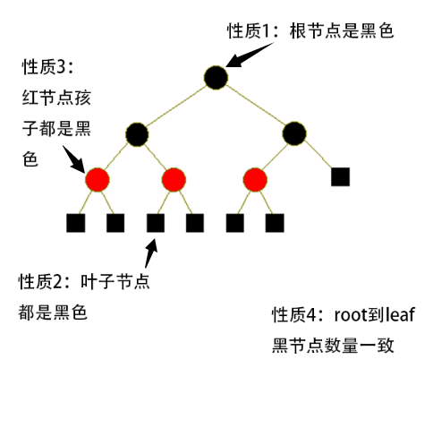

我一直觉得那些著名的数据结构，都是工程设计和数学的完美结合。

所有的数据**结构**都是被精心**设计**出来的，此所谓工程设计。但是，既然叫精心设计，就意味着有一套准则，这个准则就是数学。

没有数学基础的数据结构都是耍流氓。

红黑树拥有精巧的结构设计和强大的数学基础，但我总觉得有点过于复杂，故写本文来回顾下并重新思考，希望能有新的感悟。

<!--more-->

# 红黑树的定义

红黑树是一种特殊的二叉树，每个节点有颜色bit，要么红色要么黑色。红黑树必然满足以下4个**结构上**的性质：

1. 根节点是黑色

2. 叶子节点（NULL）视为黑色节点

3. 如果一个节点是红色，那么它的2个孩子节点都是黑色

4. 对于每条从根节点出发、并到达叶子节点的路径，路径上黑色节点的数量一致（叶子节点也计算在内）

这4个性质，稍微想一遍就知道是没有矛盾的。但是没有矛盾只是第一步，接着就是证明这4个性质为什么能使得红黑树变成牛逼的树。

牛逼指的是这棵树很**平衡**。平衡的定义是：设二叉树的节点数目为n，那么树的高度h和n必须满足：\\( h = O(\\log \_\{2\}n)\\)。这个就是要证明的东西。

# 红黑树的证明

所谓的证明，其实就是从上面的4个结构性质，分析出各种各样的数学上的性质，然后看下这些数学性质究竟能不能决定红黑树是不是平衡。

若能够证明平衡，就可以抽丝剥茧，找出最关键的几条数学性质，就可以总结出一份简短的证明过程了。

下面就是一份老外给出的最简单的证明过程。

## 定义BH(x)
首先需要定义一个函数BH(x)：x指红黑树的一个节点，BH(x)指这个x节点到叶子节点的路径上黑色节点的数量。

根据上面的性质4，可以知道无论x走哪条路径到达叶子节点，BH(x)都一样。

## 2个引理

### 引理1：对于以节点x为根节点的子树，设子树的总的节点数量n，那么有\\( n \\geq 2\^\{BH(x)\} - 1  \\)

要分2个情况来证明这个引理：

1. 树只有黑色节点。此时根据性质4，可以知道这树是完全二叉树，完全二叉树的节点数量等于\\( 2\^\{h\} - 1  \\)，而h又等于BH(x)
。所以此种情况满足引理。

2.树有黑色也有红色节点。可以把这种情况视作第一种情况下的红黑树被添加了一些红色节点，根据性质1-4，可知道红色节点并不会影响BH(x)值。所以满足引理。

综上，此引理没有问题。

### 引理2：设树的高度为h，那么有\\( BH(root) \\geq \\frac \{h\} \{2\} \\)

这个引理其实是在说，从根节点到叶子节点，黑色节点起码有高度的一半那么多。分2步来想：假如黑点节点数量是高度的一半，根据红黑树性质1-4，可以知道必然是黑红相间的排列方式：黑-红-黑-红 ···· ；当黑点节点数量是高度的一半再减一时，说明有一个黑色节点变红了，就说明出现了2个连在一起的红色节点了。就破坏了性质3。于是反证成功。

另外一种思路：

因为红黑树的性质3“红节点的2个孩子都是黑节点”，所以使得一条路径上红节点总数最大化的方法，必然是“黑(root)-红-黑-红-······-黑-红-黑-红-黑(leaf)”，注意，最后一个必然是叶子节点，根据性质2，这个叶子节点是黑节点，所以根据这个路径排列，就可以知道红节点必然比黑节点少，反而言之，黑节点数量必然大于等于高度的二分之一。

### 定理：任意一棵红黑树必然满足：\\( h \\leq 2log\_\{2\}(n+1) \\)

证明：

根据引理1，有：

\\[  n \\geq 2\^\{BH(root)\} - 1 \\]

再因为引理2，有：

\\[  n \\geq 2\^\{BH(root)\} - 1 \\geq 2\^\{\\frac \{h\} \{2\}\} - 1\\]

\\[  n \\geq 2\^\{\\frac \{h\} \{2\}\} - 1\\]

再变换一下：

\\[  n + 1 \\geq 2\^\{\\frac \{h\} \{2\}\} \\]

\\[  log\_\{2\}(n + 1) \\geq log\_\{2\}2\^\{\\frac \{h\} \{2\}\} \\]

\\[  log\_\{2\}(n + 1) \\geq \\frac \{h\} \{2\} \\]

\\[ h \\leq 2log\_\{2\}(n + 1)   \\]

得证。

这个定理的重要性在于，它保证了红黑树是**平衡**的。

## 总结

上面介绍的红黑树核心定理的证明过程，似乎并没有多么复杂。所以说伟大的东西往往不复杂是对的。

红黑树和一般的二叉树相比，在空间上只是多了一个bit，这个特性对红黑树的实际运用非常棒；而围绕“red or black"设计出来的4个性质，恰好使得红黑树获得了最后的不等式，这个不等式使得红黑树和最理想的平衡二叉树也相差无几了。

虽然红黑树能够简单地被理解，但是它的发明过程想必是不简单的，这需要天才般的想象力(红黑树只用一个标记位)和数学分析能力。也可以称为发明创造能力，这是不容易的。吾等只能膜拜大神。

除了红黑树平衡性证明之外，还有别的算法设计工作要做，也就是红黑树的插入、删除、调整运算，必须足够快，不然实际价值就会降低。

当然，上文只能证明红黑树**在理论上的优秀**。如果在工程上能够实现这套理论，才算是完美的，然而实际上不那么简单（要正确实现红黑树的插入、删除、旋转操作啊）。下一篇文章前我会自己实现一遍红黑树，再写下心得体会。

## 参考资料

http://www.dgp.toronto.edu/people/JamesStewart/378notes/16redBlack/