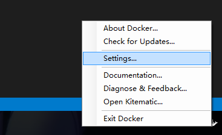
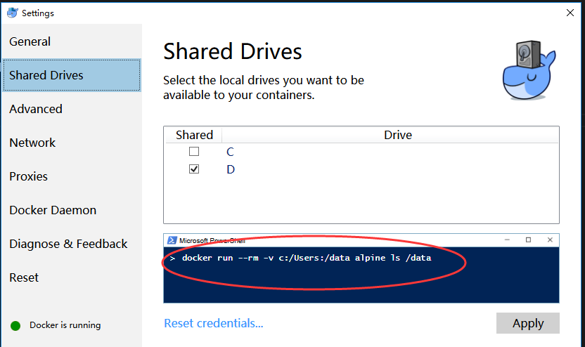

# cmake

### 1.windows下安装cmake

https://cmake.org/files/v3.7/cmake-3.7.0-rc1-win64-x64.msi

顺便可以下载cmake源码，源码里面有一个tests目录，有很多cmake工程可以参考，譬如官网的tutorials教程的代码都在tests里面了。


### 2.手写CMakeLists.txt

本文不谈cmake-gui的使用，原因是这东西界面有点怪，其次是cmake作为跨平台的构建系统，理应学习使用cmake的命令行模式，命令都是一致的，而cmake-gui是windows独有的。

那么，在执行cmake构建指令前，需要在forwarder项目根目录下手写一个CMakeLists.txt文件。

```c
cmake_minimum_required (VERSION 2.6)
project (forwarder)

# The version number.
set (FORWARDER_VERSION_MAJOR 1)
set (FORWARDER_VERSION_MINOR 0)

include_directories("${PROJECT_SOURCE_DIR}/include")

include_directories("${PROJECT_SOURCE_DIR}/enet")
add_subdirectory (enet)
set (EXTRA_LIBS ${EXTRA_LIBS} libenet)

# add the executable
add_executable(forwarder main.cpp)
target_link_libraries (forwarder  ${EXTRA_LIBS})
```

（这里推荐用vscode来编辑CMakeLists.txt，vscode有编辑CMakeLists.txt文件的插件，支持语法高亮和智能提示，很爽）


### 3.构建

forwarder项目目前用到了2个第三方库，一个是enet，一个是spdlog。

spdlog的源码都在头文件里，直接把源码包含进来就可以了。

enet则用静态链接的方式引入。需要把enet的源码都放在子目录**enet**里，然后在enet目录再手写一个CMakeLists.txt：

```c
cmake_minimum_required (VERSION 2.6)
project (libenet)

# The version number.
set (ENET_VERSION_MAJOR 1)
set (ENET_VERSION_MINOR 0)

include_directories("${PROJECT_SOURCE_DIR}/include")
include_directories("${PROJECT_SOURCE_DIR}/src")


file(GLOB libenet_SRC "src/*.c")
add_library(libenet STATIC ${libenet_SRC})


target_link_libraries (libenet winmm.lib ws2_32.lib)
```

（这个CMakeLists.txt是作为根目录CMakeLists.txt的孩子存在的，由根目录的CMakeLists.txt来调用。）

有了这2个个CMakeLists.txt后，在根目录新建一个文件夹叫build，然后cmd进入这个目录，并执行：

cmake ..

就会自动在build目录生成visual studio项目，启动forwarder.sln，点生成解决方案，如果没报错，就说明构建成功了。

# docker

用docker来测试forwarder在linux系统下的运行情况，非常方便。

### 1.首先windows安装docker：

https://www.docker.com/products/overview


### 2.然后设置share目录：

docker安装完毕后在任务栏会有一个图标，右键然后点setting：





注意红圈的内容，提示了我们开启share目录后，怎么在docker中用（其实就是-v指令）。


### 3.然后在cmd中执行：

docker run --rm -it -v D:/workplace/forwarder:/data ubuntu:latest

run代表启动一个container；

最后的参数ubuntu:latest代表使用ubuntu的最新版本镜像(image)

其中的-rm作用是exit时会自动删除这个container；

-it作用是设置成交互模式(interactive)；

-v D:/workplace/forwarder:/data，是把windows的共享目录D:/workplace/forwarder 映射到container中的/data目录。

第一次执行时，会从docker官方服务器下载ubuntu:latest镜像到本地，所以会比较慢。

执行成功后，就进入这个临时生成的ubuntu的控制台啦！

### 4.在ubuntu中构建forward

第三步建立的ubuntu镜像不是持久化的，需要永久保存的镜像的话，需要自行写Dockerfile。

在forwarder根目录下的docker目录我已经写了一个。cmd进入这个目录并执行：

docker build -t myubuntu  .

就开始在本地创建一个自定义的image镜像了。

如果update太慢，可考虑更换国内的soureces，访问：http://wiki.ubuntu.org.cn/%E6%A8%A1%E6%9D%BF:16.04source

把Dockerfile中的那些sources链接的地址替换成国内的镜像站点即可，例如我替换成阿里云的镜像站点。


### 5.apt-get的一些技巧

查询一个包的版本列表：

apt-cache policy <package name>


