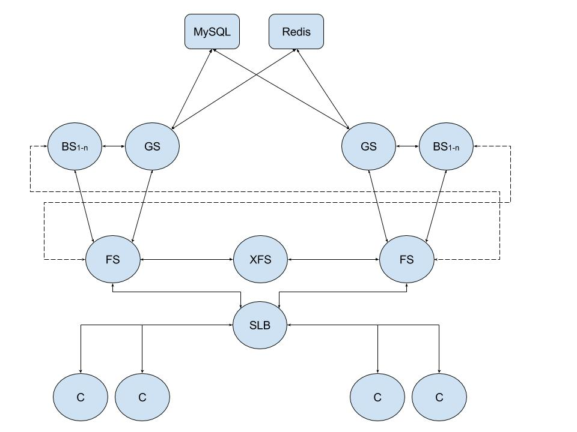

<!--more-->

这是我在开发的游戏的通信架构图。

这里面除开GS和数据库后端的连接，其他连接都基于forwarder。

下面的客户端C连接，涵盖了三大平台：web、ios、android客户端。都可以通过forwarder和服务器通讯。

这套系统已经熬过了压力测试。之前写了robot程序，几千机器人并发登录和战斗。刚开始压力测试时，确实forwarder崩了，经过几轮测试、调试、修bug，现在已经能完美运行。有信心可以做到超长时间不停机。单个服务器节点(16核16G内存)可以同时处理上万场战斗。增加cpu核心数和内存，还可以继续增大负载。

解决了通信问题后，这套架构剩下的问题就是用户规模问题。越高的用户规模，就越需要仔细思考架构的每个地方是否会出现负载瓶颈。

其实，我们的架构目标是**分布式**，分布式就是说，后端是一个服务器集群，服务器数量可随意增加减少，就像cpu的核心数，核心越多，并发性能越好。总之，我们的后端服务器可以横向扩展，用户增多->增加服务器。这样子是比较省事的。但实际上要做到这点很难。预期的最高同时在线用户数、预期的总注册用户总数，是做架构设计的2个指标。

另外，我们做的是**世界服**。玩家不需要选择服务器登录。对于玩家来说，只有一个服。不过对于后端来说，当然还是要分服的。这也是使得我们可以做分布式架构的原因。世界服若要做分服，就是分服务器集群。例如可以ios用户一个集群，android用户一个集群，两个集群完全隔离。

其实游戏服务器架构很看游戏设计，但不管怎么变，都是要做网络通信的，基于forwarder去做跨进程、跨机器、跨机房通信，非常简单。只需要设置host和port即可。

因为是公司项目，这里就不过多描述细节了。架构图仅供参考。
