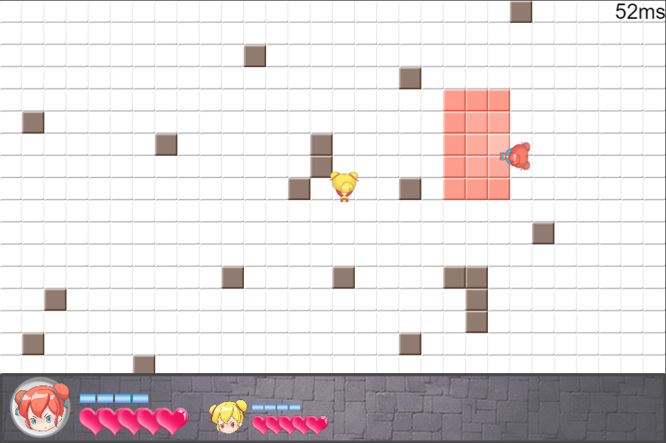

<!--more-->

在GGJ2017上，我做一个**局域网联机**对战小游戏：

本文将记录这个游戏的技术演化过程。

### 技术阶段1——局域网暴力帧同步

因为开发时间只有不到48小时，为了实现强一致性的复杂战斗（复杂之处主要在攻击方块上），我因此开发了一个暴力的帧同步系统。为什么说暴力呢？这是因为数据传输上相当不计开销：我每一个关键帧都要把整场战斗的数据打包广播给客户端。

实际上，要实现这么暴力的同步方案也是有前提的。前提就是要实现**数据驱动**的战斗，即战斗的每一逻辑帧的状态信息，可以简单提取成json之类的数据格式。也就是说，战斗需要实现save和load函数，save()返回战斗当前的状态数据data，load(data)则可以把任意战斗状态数据载入，使得战斗立即变成data的状态。

当时已经实现了这一技术点。使得这游戏的同步问题很简单：我只需要保证单个服务端、多个客户端的战斗的data都是一样的就行了。

也正因为暴力，我后来试了下把服务端放在阿里云上运行，非局域网联机的话，卡到飞起。

### 技术阶段2——只同步玩家操作输入

最近把代码翻了一遍，并换成使用我开发的forwarder库（之前用了npm上的websocket库），虽然对游戏表现没有什么实质的影响。另外，我把上一阶段里面的暴力同步代码干掉了，现在只需要同步玩家操作输入数据就可以了。

流程大概是：A客户端点击移动->A客户端向服务端发向前移动的操作包->服务端验证A的操作包->将操作包放到下一关键帧的玩家输入列表->服务端的帧逻辑系统更新到下一关键帧，处理该帧的玩家操作输入，并把操作输入广播到各个客户端->各个客户端收到广播包时，先缓存起来，当客户端自己的帧逻辑系统更新到这一关键帧时，也同样处理该帧的玩家操作输入。

这个流程其实和旧版区别不大。除了逻辑层，表现层没有改动，也就是所在画面表现上和旧版一致。唯一区别就是，现在这个版本在**非局域网**也能勉强运行了。因为服务端发包减少了不少，客户端处理数据包压力也小了，性能大大改善。

但仍然有2个问题：

1. 关键帧卡顿。这是因为服务端、客户端在按同个频率(目前LogicFPS=50)更新战斗时，客户端在到达关键帧后就会暂停并等待服务端的关键帧包，而因为非局域网网络有20-50ms的延迟，即使服务端更新游戏逻辑没有cpu计算上的延迟，也要受到这个网络延迟的制约，所以就会有卡顿感。

2. 操作响应有延迟。这是因为客户端的操作包要先发送到服务端，然后服务端在下一个关键帧再发回来，客户端才能处理到这个操作包。

### 技术阶段3——改善玩家体验的细节技术(开发ing)

技术阶段2的实现是正确的，当前阶段的目标是怎么优化那2个问题：

1. 关键帧如何不卡顿？我想象中的解决方案是，画面更新和逻辑更新要做一些分离。例如，在客户端等待服务端关键帧包的时间内，游戏画面不能静止不动，而是要做**预测**。所有具有速度矢量的游戏实体都可以按照速度方向在关键帧包到达前继续自行运动，当关键包收后时，逻辑层驱动表现层，校验并矫正下位置即可。

2. 操作响应必须无延迟！和解决卡顿感的方法类似，玩家点击前进键，表现层的player就开始按照**预测的**运动速度开始移动，并且需要应用我在上一篇文章里提到的技术：服务端需要尽可能相信客户端的位置。不然，即使客户端能够在操作发出时立即开始移动，但最终还是要以逻辑层的位置为主，而逻辑层的位置必然是有延迟的，也就是说，player虽然提前移动了，但最后又拉扯回去。

