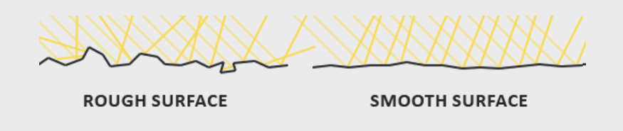
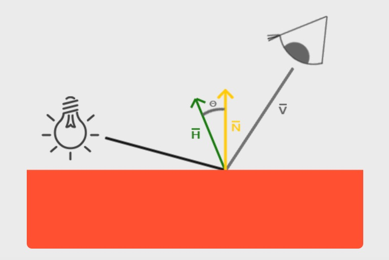

基于PBR做渲染，需要涉及到很多物理学、几何学、热辐射学概念，本文将逐一介绍每个关键概念，并给出相关重要公式。

<!--more-->

## 微平面(microfacets)理论

微观尺度下的任意一个平面(surface)都可以用多个微小的、完美反射的镜面来描述，这些微小镜面被称为**微平面**。

### 粗糙度(roughness)

平面的**粗糙度**决定了它的各个微平面的镜面反射情况：



粗糙度可以用0.0到1.0来近似。

### 中间方向矢量(halfway vector)

halfway vector(简称h)等于光线方向矢量l加上视角方向矢量v并单位化（即处于l和v的中间）：

\\[ \\mathbf h = \\frac \{ \\mathbf l + \\mathbf v\}\{ \parallel \\mathbf l + \\mathbf v \parallel \} \\]



 h的特性是：h与平面法线越靠近，那么镜面光越强。

 在这个微平面理论下，可以推出：**越多的微平面的法线与h对齐，这个平面的镜面反射就会越强**。


## 能量守恒(energy conservation)

不考虑自发光的平面，所有平面的出射光能量总和不能高于入射光能量总和。

观察下图，可以发现一个规律，粗糙度越高、镜面反射区域越大、镜面反射区域亮度越低。如果反射区域变大，然而亮度不变，那说明能量不守恒了。


在渲染里，简单地说，要做到能量守恒，就是要遵守一个原则：**平面接收到的光能量要么被反射，要么被吸收**，也就是说，吸收和反射，是互斥关系。

直接反射出去的光能量，也叫镜面光、反射光；吸收的光能量，大部分也会变成光发射出去（真正被吸收的就变成热能了），叫漫反射光、折射光。

镜面/反射光、漫反射/折射光的能量可以用2个系数kS、kD控制，两者满足关系式kD + kS = 1、kD > 0、kS > 0，从而确保发射的光能量不超过接收的光能量。

## 渲染方程

渲染方程的详细讨论已经写在[渲染基础理论的介绍](http://www.qiujiawei.com/rendering-equation/)一文。

## 双向反射分布函数BRDF(Cook-Torrance)


在[渲染基础理论的介绍](http://www.qiujiawei.com/rendering-equation/)一文里，没有详细讨论到的是brdf这个东西。简单地说，brdf是个控制系数，这个系数并不是常量，需要根据平面属性、光线属性计算得到，是个动态属性。基于PBR渲染，关键点就是选择合理的brdf函数。brdf函数将囊括上文提到的各个概念。

brdf很多种，最主流的是cook-Torrance BRDF，其基本框架公式是：

\\[ f\_\{r\} = k\_\{d\}f\_\{lambert\} + k\_\{s\}f\_\{cook−torrance\} \\]

 其中：

 \\[ f\_\{lambert\} = \frac \{c\}\{\pi \} \\]

\\( f\_\{lambert\} \\)被称为lambertian's reflectance，在我的[渲染基础理论的介绍(1)](https://www.qiujiawei.com/rendering-equation/)一文中有详细的推导过程。这里的c是指光源颜色。

 右边的部分才是最复杂的：

 \\[ f\_\{cook−torrance\} = \\frac \{ DFG \}\{ 4 (\omega \_\{o\} \\cdot \\mathbf n)(\omega \_\{i\} \\cdot \\mathbf n) \} \\]


 这条公式怎么来的，改天再写一篇数学推导文。现在需要重点关注右边的分子部分：DFG。DFG其实是3个函数，每个函数算出一个标量因子，3个因子得到后相乘。D、F、G有很多公式可以选择，下面会介绍几个常用的DFG函数。

### D， Normal Distribution Function，法线分布函数

这个函数其实不是正态分布函数，不要被normal这个单词搞懵了。在渲染一个mesh的一个fragment时，就是在渲染一个平面，这个平面又是由一堆更加小的**微平面**组成。这些微平面有自己的**微法线**，D函数就是用来近似算出究竟有多少微法线和h向量对齐。

#### Trowbridge-Reitz GGX

\\[ D(n, h, \alpha ) = \\frac \{ \alpha \^\{2\} \} \{ \\pi ( (n\\cdot h)\^\{2\}(\\alpha \^\{2\} - 1) + 1 )\^\{2\} \} \\]

输入参数：平面法线n、h向量、粗糙度\\( \alpha \\)。

shader：

```c
float DistributionGGX(vec3 N, vec3 H, float a)
{
    float a2     = a*a;
    float NdotH  = max(dot(N, H), 0.0);
    float NdotH2 = NdotH*NdotH;
	
    float nom    = a2;
    float denom  = (NdotH2 * (a2 - 1.0) + 1.0);
    denom        = PI * denom * denom;
	
    return nom / denom;
}
```

### F，Fresnel equation，菲涅尔方程

对于真实的物理材质，光照向量、视角向量不同，平面的反射情况就会不同。F函数能算出不同角度时的反射光情况，也是用一个比值(也叫做平面的真实的反射率）表示。这个比值能反应出有多少百分比的光被反射和被吸收(记住反射和吸收是互斥关系)。


#### Fresnel-Schlick approximation

\\[ F\_\{Schlick\}(n, v, F\_\{0\}) = F\_\{0\} + (1 - F\_\{0\})( 1- (n\\cdot v))\^\{5\} \\]


\\( F\_\{0\} \\)就是垂直观察平面时的**基本反射率**，一般要用一个vec3表示。注意，这条公式其实只适用于电介质（dielectric），对于金属/导体（metal/conductor）是不适用的。这时就有了些取巧的做法。

一是先预计算出各种常见材质的基本反射率，汇总成一个表，然后需要的时候查表即可。

有了表之后就会发现，对于绝缘体，基本反射率基本都在0.17这个水平线以下，且rgb分量一致；而对于导体，基本反射率都在0.5到1.0之间，且rgb分量值不一致（正是这个不一致性，使得不同的金属有显著的颜色差异，如金、铜、银颜色各异）。

综上,\\( F\_\{0\} \\)的求取实际上可以做得非常简化，用shader代码可以看出：

```c
vec3 F0 = vec3(0.04); 
F0 = mix(F0, surfaceColor.rgb, metalness); 
```

第一行是绝缘体基本反射率，0.04是统计了大部分绝缘体的基本反射率并取平均值得到。

第二行使用了一个新的参数叫金属性metalness，这是个十分人为的控制变量，范围为0.0到1.0；surfaceColor就是反射颜色值，例如黄金反射颜色为(1.00, 0.71, 0.29)。然后就可以使用mix函数和metalness做插值，metalness越接近0，那么就越接近绝缘体，metalness越接近1，那么就越接近surfaceColor。

有了\\( F\_\{0\} \\)后，就可以代入到菲涅尔方程做运算了：

```c

vec3 fresnelSchlick(vec3 n, vec3 v, vec3 F0)
{
    return F0 + (1.0 - F0) * pow(1.0 - dot(n, v), 5.0);
}
```

### G，Geometry function，几何属性函数

微平面的起伏不定，导致微平面之间产生了自阴影（self-shadowing）。G函数模拟计算的就是这个事情. 粗糙度越高，自阴影越多，反射出去的光就越少。G函数输出的是一个比值，0.0表示百分百自阴影（全黑掉），1.0表示没有任何自阴影（全白）。

#### Smith's Schlick-GGX

\\[ G(n, v, k) = \\frac \{ n\\cdot v \}\{ (n\\cdot v)(1 - k) + k \} \\]

输入参数：平面法线n、视角向量v、粗糙度\\( \alpha \\)的重新映射k。

k的公式要看情况做选择，例如对于方向光，有:

\\[ k = \\frac \{ (\\alpha + 1)\^\{2\} \}\{ 8 \} \\]

为了更加地近似模拟平面几何属性，可以再应用一条公式（Smith's method）:

\\[ G'(n,v,l,k) = G(n,v,k)G(n,l,k) \\]

Smith's method同时处理掉了微平面的高低起伏导致的对光线、对视角的障碍问题，如下图。图中左边，视角向量（红色）的路线上有一个微平面突起，导致接收不到左边的光线的反射，这种情况叫**几何障碍（geometry obstruction）**；图中右边，光线到达微平面后又反射到另一个微平面上（能量衰减了），没有直接反射到眼睛，这种情况叫**几何遮蔽（geometry shadowing）**。


shader：

```c
float GeometrySchlickGGX(float NdotV, float k)
{
    float nom   = NdotV;
    float denom = NdotV * (1.0 - k) + k;
	
    return nom / denom;
}
  
float GeometrySmith(vec3 N, vec3 V, vec3 L, float k)
{
    float NdotV = max(dot(N, V), 0.0);
    float NdotL = max(dot(N, L), 0.0);
    float ggx1 = GeometrySchlickGGX(NdotV, k);
    float ggx2 = GeometrySchlickGGX(NdotL, k);
	
    return ggx1 * ggx2;
}
```


## Cook-Torrance reflectance equation

有了brdf函数后，之前的渲染方程就可以变成：

\\[ L\_\{o\}(p, \omega \_\{o\}) = L\_\{e\}(p, \omega \_\{o\})  + \\int \_\{\Omega \} (k\_\{d\}\frac \{c\}\{\pi \} + k\_\{s\}\\frac \{ DFG \}\{ 4 (\omega \_\{o\} \\cdot \\mathbf n)(\omega \_\{i\} \\cdot \\mathbf n) \} ) L\_\{i\}(p, \omega \_\{i\}) |cos \theta \_\{i\}|d\omega \_\{i\} \\]


http://www.codinglabs.net/article_physically_based_rendering_cook_torrance.aspx

http://www.codinglabs.net/article_physically_based_rendering.aspx
