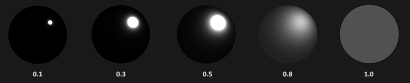

基于PBR做渲染，需要涉及到很多物理学、几何学、热辐射学概念，本文将逐一介绍每个关键概念，并给出相关重要公式。

<!--more-->

## 微平面(microfacets)理论

微观尺度下的任意一个平面(surface)都可以用多个微小的、完美反射的镜面来描述，这些微小镜面被称为**微平面**。

### 粗糙度(roughness)

平面的**粗糙度**决定了它的各个微平面的镜面反射情况：

粗糙度可以用0.0到1.0来近似。

### 中间方向矢量(halfway vector)

halfway vector(简称h)等于光线方向矢量l加上视角方向矢量v并单位化（即处于l和v的中间）：

\\[ \\mathbf h = \\frac \{ \\mathbf l + \\mathbf v\}\{ \parallel \\mathbf l + \\mathbf v \parallel \} \\]

 h的特性是：h与平面法线越靠近，那么镜面光越强。

 在这个微平面理论下，可以推出：**越多的微平面的法线与h对齐，这个平面的镜面反射就会越强**。

## 能量守恒(energy conservation)

不考虑自发光的平面，所有平面的出射光能量总和不能高于入射光能量总和。

观察下图，可以发现一个规律，粗糙度越高、镜面反射区域越大、镜面反射区域亮度越低。如果反射区域变大，然而亮度不变，那说明能量不守恒了。

在渲染里，简单地说，要做到能量守恒，就是要遵守一个原则：**平面接收到的光能量要么被反射，要么被吸收**，也就是说，吸收和反射，是互斥关系。

直接反射出去的光能量，也叫镜面光、反射光；吸收的光能量，大部分也会变成光发射出去（真正被吸收的就变成热能了），叫漫反射光、折射光。

镜面/反射光、漫反射/折射光的能量可以用2个系数kS、kD控制，两者满足关系式kD + kS = 1、kD > 0、kS > 0，从而确保发射的光能量不超过接收的光能量。

## 渲染方程

渲染方程的详细讨论已经写在[渲染基础理论的介绍](http://www.qiujiawei.com/rendering-equation/)一文。

## 双向反射分布函数BRDF

在[渲染基础理论的介绍](http://www.qiujiawei.com/rendering-equation/)一文里，没有详细讨论到的是brdf这个东西。简单地说，brdf是个控制系数，这个系数并不是常量，需要根据平面属性、光线属性计算得到，是个动态属性。基于PBR渲染，关键点就是选择合理的brdf函数。brdf函数将囊括上文提到的各个概念。

brdf很多种，最主流的是cook-Torrance BRDF，其基本框架公式是：

\\[ f\_\{r\} = k\_\{d\}f\_\{lambert\} + k\_\{s\}f\_\{cook−torrance\} \\]

 其中：

 \\[ f\_\{lambert\} = \frac \{c\}\{\pi \} \\]

 这里的c是指平面自身的颜色值，一般就是指采样纹理贴图出来的颜色。

 右边的镜面光部分才是最复杂的：

 \\[ f\_\{cook−torrance\} = \\frac \{ DFG \}\{ 4 (\omega \_\{o\} \\cdot \\mathbf n)(\omega \_\{i\} \\cdot \\mathbf n) \} \\]

 这条公式怎么来的，改天再写一篇数学推导文。现在需要重点关注右边的分子部分：DFG。DFG其实是3个函数，每个函数算出一个scalar因子，3个因子得到后相乘。

### D， Normal Distribution Function，法线分布函数

这个函数其实不是正态分布函数，不要被normal这个单词搞懵了。在渲染一个mesh的一个fragment时，就是在渲染一个平面，这个平面又是由一堆更加小的**微平面**组成。这些微平面有自己的**微法线**，D函数就是用来近似算出究竟有多少微法线和h向量对齐。D函数的输入数据包括：平面法线、h向量、粗糙度r。

### F，Fresnel equation，菲涅尔方程

对于真实的物理材质，光照向量、视角向量不同，平面的反射情况就会不同。F函数能算出不同角度时的反射光情况，也是用一个比值表示。

### G，Geometry function，几何属性函数

微平面的起伏不定，导致微平面之间产生了自阴影（self-shadowing）。G函数模拟计算的就是这个事情. 粗糙度越高，自阴影越多，反射出去的光就越少。