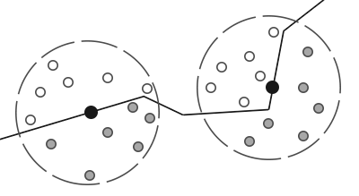
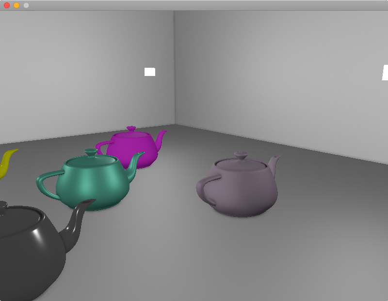

## AO，ambient occlusion

环境光遮蔽，大致上指的是几何物体的拐角处，因为受光不全面（被相邻的面挡光／遮蔽），导致变暗。

## SSAO，screen-space ambient occlusion

屏幕空间环境光遮蔽，简称SSAO，是一种让画面更‘真实’的后处理技术。该方法较为简单实用，但需要先获得view space的场景的几何信息，因此比较适合在defer rendering框架下应用。除了SSAO之外，还存在voxel based 的world space的AO技术。

<!--more-->

## SSAO的原理

实时渲染下做AO，基本做法都是计算出一张全屏的AO单通道(float)纹理，有了该纹理后，在做lighting pass时就可以逐像素采样该AO纹理，得到一个遮蔽率 （occlusion factor），对fragment的颜色值乘以该遮蔽率（遮蔽率越接近0，颜色更黑，遮蔽率越接近1，颜色则贴近原来的色），就完成了AO操作。

为了得到该AO纹理，需要先做G-Buffer pass，具体细节在此不表。

有了G-Buffer后，剩下问题就是**如何用G-Buffer算出准确的遮蔽率纹理**。

### 遮蔽率的计算方法：球采样／半球采样

遮蔽率算的就是一个0.0到1.0的值。SSAO方案下，计算这个值，无非就是对逐个fragment的周围的n个采样点做遮蔽测试，然后统计有百分之多少的采样点通过了测试，那么就得到了粗略的遮蔽率。

以下两张图可以形象地说明这个过程：




第一张是球型采样。从图中可以很清楚看出这个球采样的不足：即使一个平面没有被周围的平面遮蔽，该平面的遮蔽率也只是0.5。这样就会导致画面变灰。

第二张是半球采样，即限制采样点都在平面法向量同一侧。从图中可以看出这个方案更好。


然后就是采样点的生成问题。采样点需要在tangent space下计算，即默认normal向量指向z轴正方向。所以每一个采样点只需要随机在x、y轴上做一点偏移即可：

```c
static void generateSampleKernel(std::vector<Vector3dF>& ssaoKernel) {
    for (unsigned int i = 0; i < 64; ++i)
    {
        // 随机分布采样点，x、y在[-1.0, 1.0]随机，而z在[0.0, 1.0]范围随机
        // 确保采样点落在normal向量同一侧，即z必须大于0
        Vector3dF sample(
            random0_1<float>() * 2.0 - 1.0, 
            random0_1<float>() * 2.0 - 1.0, 
            random0_1<float>());
        sample = sample.Normalize();
        sample *= random0_1<float>(); // 单位化后随机分配距离 
        float scale = float(i) / 64.0; // 缩放因子，初始化为i/64是为了确保每一个点不会位置重复
        scale = lerp(0.1f, 1.0f, scale * scale); // 使得大部分采样点会更靠近原点
        sample *= scale; // 应用缩放因子
        ssaoKernel.push_back(sample);
    }
}
```

得到的采样点分布大致如下：


### 遮蔽率 occlusion factor


## 效果图

ssao纹理图（未做模糊处理）：


ssao纹理图（做了模糊处理）：


ssao + shading：




## 工程上遇到的坑

因为我做的是基于defer框架的ssao，所以一部分坑来自于defer。

### G-Buffer输出的position和normal需要位于什么空间？

G-Buffer的vertex shader需要对传入的postion和normal信息做矩阵变换操作并输出到frame buffer里。

这个矩阵变换有些坑，需要仔细思考下。首先，它必须要有object space到world space的变换，也就是model变换，这是每个object自有的。

到里world space后，是否需要到view space呢？即是否要再乘以view matrix。答案因应用情况而异。
 
- 如果是在G-Buffer就做了view变换：那么到了ssao pass，因为ssao本来就是view space下的计算，所以是ok的，但是对于deferred lighting pass，就不太友好，因为光照计算要在world space下算，position和normal都需要乘以view matrix的逆矩阵（可以在cpu先算好），从而恢复到world space。

- 如果不在G-Buffer做view变换：G-Buffer输出的就是干净的world space信息。ssao pass就需要自己做view变换，而deferred lighting pass则不用。

我自己是采用里第一种做法。


### G-Buffer的position和normal具体怎么做变换？

```c
    // position的变换
	vec4 WorldPos = model * vec4(position, 1.0f);
	FragPos = (view * WorldPos).xyz; // 输出
    gl_Position = proj * view * WorldPos;
    
    // normal的变换
	// mat3 normalMatrix = mat3(view * transpose(inverse(model))); // Wrong!
	// mat3 normalMatrix = mat3(transpose(inverse(view * mat4(mat3(model))))); // not good
	mat4 normalMatrix = view * mat4(transpose(inverse(mat3(model))));
	Normal = mat3(normalMatrix) * normal; // 输出
```

position的变换一目了然，没什么坑。但是normal的坑就大了。

首先，为了防止model矩阵的缩放属性影响到normal，需要把mat4的model直接裁剪成mat3，从而去掉缩放属性。

然后，需要计算normal matrix。公式推导另外成文。只需要记得公式是transpose(inverse(mat3(model)))即可。

最后再把mat3的normal matirx转成mat4，从而可以和mat4的view相乘，从而得到G-Buffer真正需要的normal matirx。

### G-Buffer的position纹理需要设置GL_CLAMP_TO_EDGE

```c
	glTexParameteri(GL_TEXTURE_2D, GL_TEXTURE_WRAP_S, GL_CLAMP_TO_EDGE);
	glTexParameteri(GL_TEXTURE_2D, GL_TEXTURE_WRAP_T, GL_CLAMP_TO_EDGE);
```

这样就能限制G-Buffer之后的pass采样position纹理时，position的范围不会超出[0.0, 1.0]。