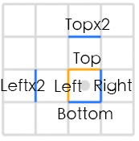
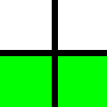
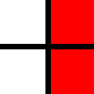
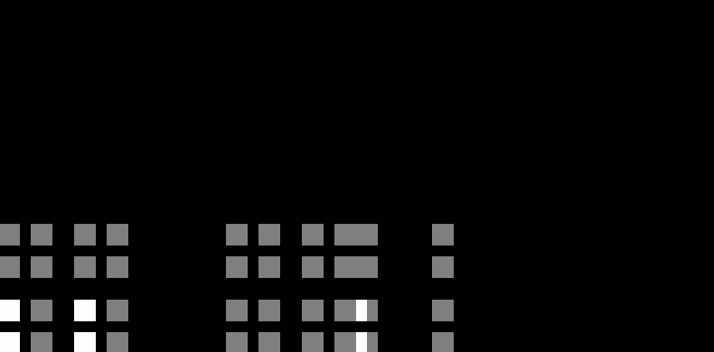
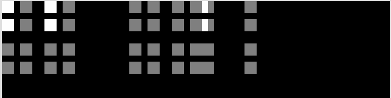
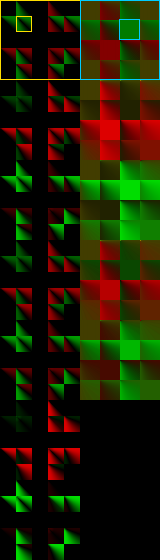
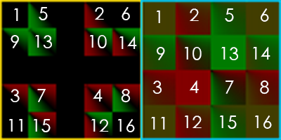
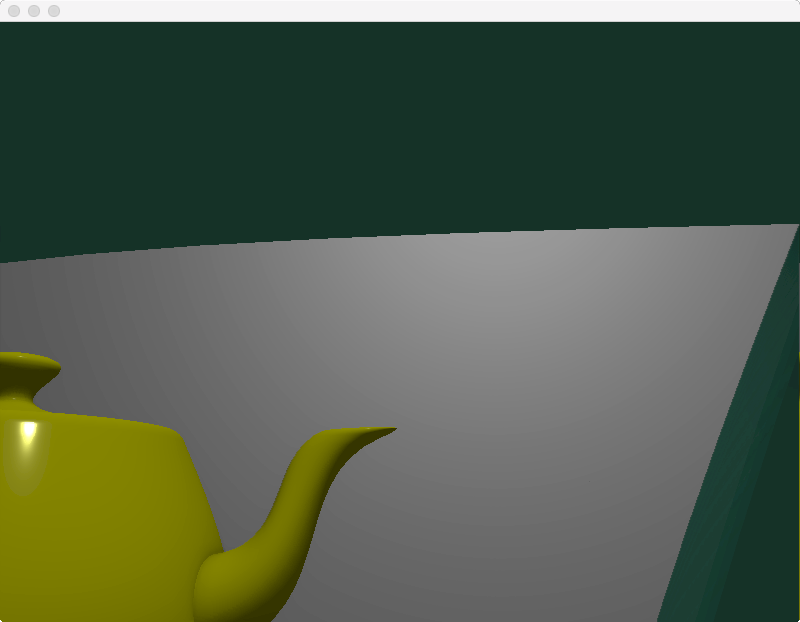
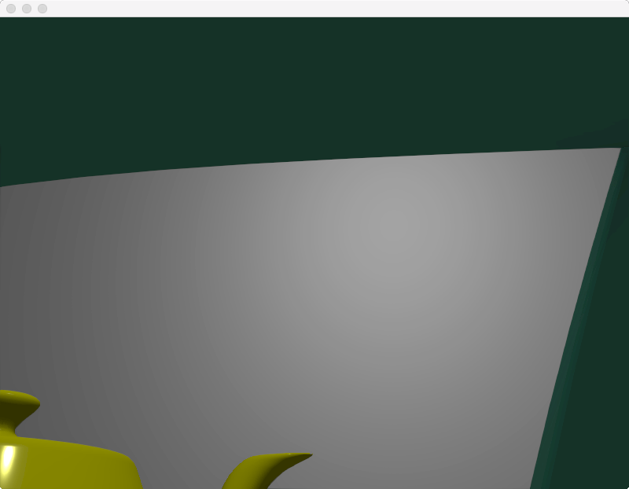

# PPAA

所谓PPAA（Post Process Antialiasing)，也叫FBAA（Filter-Based Antialiasing），是基于后处理的各种抗锯齿技术的统称。在PPAA之前，主流AA技术是MSAA（MultiSamples AA）、SSAA（SuperSamples AA）。SSAA是AA中最暴力也是最完美的解决方案，而MSAA是与硬件紧密结合的built-in AA。对于forward rendering来说，MSAA几乎是唯一的选择。

然而，MSAA这种古老的、built-in的技术，已经不太能满足现代渲染器的需求了。它有两大问题，一是MSAA会有多余的AA计算，二是MSAA不适用于deferred rendering。

鉴于MSAA的不足，PPAA就蓬勃发展起来了。PPAA强大之处在于可以自定义、且硬件无关、兼容forward／defer，所以基于PPAA的算法非常多。而其中的翘楚，SMAA(Subpixel Morphological Antialiasing)，性能以及AA质量都很不错。本文将着重介绍SMAA。

<!--more-->

值得一提的是，SMAA的前身是Jimenez's MLAA，也是同一个团队做出来的，SMAA可以认为是在质量和性能两方面都超越Jimenez's MLAA的一个进化版。所以可以先阅读Jimenez's MLAA的论文再来学习SMAA。

# SMAA

总共3个pass：

- Pass 1，算edgeTex
- Pass 2，用edgeTex算weightTex
- Pass 3，用weightTex混合原始图像，得到抗锯齿图像

## 边缘纹理的计算 Edge Detection (edgeTex)

锯齿问题体现在图像上几何物体的边缘处，也就是说，如果能准确地post process出图像上哪些地方是边，哪些地方不是。检测过少，锯齿边就会残留；检测过多，图像就会糊。为来更好地提升AA质量，SMAA边缘检测算法的选取非常关键。

相比基于normal map、depth map，基于颜色的边缘检测尤佳。一是因为，颜色信息容易获得，而深度图／法线图相对难获得，例如对于图像处理领取，用户提供的只有照片而已；二是因为它还有一个优点：对于做了shading后才产生的锯齿，也一样能处理（例如有梯度的toon shading）。

SMAA首推的是基于Luma（亮度）的边缘检测算法。
 
1，vertex shader，根据纹理坐标输出3组offset，每组2个边，总共6个边要检测：

```c
    vec4 SMAA_RT_METRICS = vec4(1.0 / imgSize.x, 1.0 / imgSize.y, imgSize.x, imgSize.y);
    Offsets[0] = fma(SMAA_RT_METRICS.xyxy, vec4(-1.0, 0.0, 0.0, -1.0), texCoord.xyxy); // Left / Top Edge
    Offsets[1] = fma(SMAA_RT_METRICS.xyxy, vec4( 1.0, 0.0, 0.0,  1.0), texCoord.xyxy); // Right / Bottom Edge
    Offsets[2] = fma(SMAA_RT_METRICS.xyxy, vec4(-2.0, 0.0, 0.0, -2.0), texCoord.xyxy); // Leftx2 / Topx2 Edge
```




2，fragment shader，先求出当前fragment的luma值：

```c
    // Calculate lumas:
    float3 weights = float3(0.2126, 0.7152, 0.0722);
    float L = dot(texture(colorTex, texcoord).rgb, weights);
```

（RGB->luma的公式来自wiki https://en.wikipedia.org/wiki/Relative_luminance  ）


3，算Left和Top的luma值，以及算Left和L的差值delta.x、Top和L的差值delta.y；如果delta.x < threshold.x，edges.x就等于0.0，代表不是边（因为差值很小，即亮度差异小），y方向同理：

```c
    float Lleft = dot(texture(colorTex, offsets[0].xy).rgb, weights);
    float Ltop  = dot(texture(colorTex, offsets[0].zw).rgb, weights);

    float4 delta;
    delta.xy = abs(L - float2(Lleft, Ltop));
    float2 edges = step(threshold, delta.xy);

    if (dot(edges, float2(1.0, 1.0)) == 0.0)
        discard; // 如果2个方向都没有边，就可以排除这个fragment了
```


4. 如果Left或Top至少有一个是边，就再进一步做检测。


```c

    // 计算Right Bottom的luma差值
    float Lright = dot(texture(colorTex, offsets[1].xy).rgb, weights);
    float Lbottom  = dot(texture(colorTex, offsets[1].zw).rgb, weights);
    delta.zw = abs(L - float2(Lright, Lbottom)); // 和算delta.xy过程差不多

    // 分别算出x、y方向的最大luma差值
    float2 maxDelta = max(delta.xy, delta.zw);

    // 算出 Left x2 and Top x2 的luma:
    float Lleftleft = dot(texture(colorTex, offsets[2].xy).rgb, weights);
    float Ltoptop = dot(texture(colorTex, offsets[2].zw).rgb, weights);
    // 算出Left和Left x2的luma差值、Top和Top x2的luma差值
    delta.zw = abs(float2(Lleft, Ltop) - float2(Lleftleft, Ltoptop));

    // Calculate the final maximum delta:
    // x、y方向分别最终的最大luma差值
    maxDelta = max(maxDelta.xy, delta.zw);
    // x、y两个方向中取其中最大的luma差值
    float finalDelta = max(maxDelta.x, maxDelta.y);

    // Local contrast adaptation:
    float SMAA_LOCAL_CONTRAST_ADAPTATION_FACTOR = 2.0;
    // Left、Top亮度差值*2后需超过finalDelta才真的是边
    edges.xy *= step(finalDelta, SMAA_LOCAL_CONTRAST_ADAPTATION_FACTOR * delta.xy);

    return edges;
```

## 权重纹理的计算 Blending Weight Calculation (weightTex)

最复杂的一个pass，需要分成多个部分讲解。

### 预生成searchTex

根据当前像素坐标，搜索当前这个像素对应的边的2个端点，求出2个距离值\\(d\_\{1\}、d\_\{2\}\\)，是实现模式分类的关键。

因为edgeTex已经包含了边的信息，如果直接暴力搜索端点，就需要对edgeTex做非常多次的纹理采样（我没搞错的话，次数应该等于\\(d\_\{1\} + d\_\{2\}\\)  ）。在Jimenez's MLAA中，使用一个叫bilinear filtering的搜索技巧，能大约减少一半的纹理采样数。原理大致如下：

假设有2个要采样的相邻像素点，现在目标是用一次采样得到这2个点的'边'值：\\(b\_\{1\}、b\_\{2\}\\) （要么等于0要么等于1，代表有无边）。首先得把这个edgeTex纹理的过滤设置，设置成GL_LINEAR。这样就可以利用GPU的插值机制，通过求2个像素点连线上的某一个中间点x的纹理坐标，做一次采样，得到一个[0,1]之间的值。有了这个值后，是能够恢复出\\(b\_\{1\}、b\_\{2\}\\) 的值的。是不是很神奇？数学原理是这样的：

\\[ f\_\{x\}(b\_\{1\},b\_\{2\},x) = x\cdot b\_\{1\} + (1 - x)\cdot b\_\{2\}，b\_\{1\} = 0／1，b\_\{2\} = 0／1 \\]

（值得一提的是，在shader里需要把 \\( x\cdot b\_\{1\} + (1 - x)\cdot b\_\{2\} \\)变换成 \\( x\cdot (b\_\{1\} - b\_\{2\} ) + b\_\{2\} \\)，即lerp形式，这样可以减少一次乘法运算）

假设我们先取x=0.5，那么f的取值范围为[0, 0.5, 1]，具体的映射关系为：

\\( b\_\{1\}\ \ \ b\_\{2\}\ \ \ —— \ \ \ f \\)

\\( 0\ \ \ \ \ 0\ \ \ \ —— \ \ \ 0 \\)

\\( 0\ \ \ \ \ 1\ \ \ \ —— \ \ \ 0.5 \\)

\\( 1\ \ \ \ \ 0\ \ \ \ —— \ \ \ 0.5 \\)

\\( 1\ \ \ \ \ 1\ \ \ \ —— \ \ \ 1 \\)

可以看到左右两边并不是一一对应的关系，0.5对应了2种情况。那么假设我们再取别的值，且满足\\(x \neq 0.5，x \neq 0 ，x \neq 1 \\)，那么有：

\\( b\_\{1\}\ \ \ b\_\{2\}\ \ \ —— \ \ \ f \\)

\\( 0\ \ \ \ \ 0\ \ \ \ —— \ \ \ 0 \\)

\\( 0\ \ \ \ \ 1\ \ \ \ —— \ \ \ 1 - x \\)

\\( 1\ \ \ \ \ 0\ \ \ \ —— \ \ \ x \\)

\\( 1\ \ \ \ \ 1\ \ \ \ —— \ \ \ 1 \\)

神奇的事情发生了，左右两边满足了一一对应关系！也就是说，只需要知道x的值，就能'解码'出\\(b\_\{1\}、b\_\{2\}\\)的值！


这个bilinear filtering虽好，但它只能搜索一个方向（一维）。而在SMAA中，因为需要进一步做好模式分类，需要支持二维的edgeTex搜索。所以SMAA拓展了bilinear filtering到了二维：


\\[ f\_\{xy\}(b\_\{1\},b\_\{2\},b\_\{3\},b\_\{4\},x,y) = f\_\{x\}(b\_\{1\},b\_\{2\},x) \cdot y + f\_\{x\}(b\_\{3\},b\_\{4\},x) \cdot (1 - y) \\]

这里增加了一个y，y和x是类似的，需要赋予一个不等于0.5的值，但需要附加一个限制是y = 0.5x（可以假设y!=0.5x去推导上面的公式，会得到无法一一对应的情况）。这样拓展后，就可以用2个常量值x、y，对\\(b\_\{1\}、b\_\{2\}、b\_\{3\}、b\_\{4\}\\)所有组合编码出\\(2\^\{4\} \\)共16种取值情况。也就是依然可以用一个f值，反向找出\\(b\_\{1\}、b\_\{2\}、b\_\{3\}、b\_\{4\}\\)！

这个映射关系可以打表到代码里减少shader计算，但这样还不够，SMAA做啦进一步的优化，减少了对这个映射表的访问。作者写了一个脚本来生成一个叫searchTex的东西。先讲一下生成步骤再说用法。

首先，确定了刚才提到的常量x，y的值，x等于0.25，y等于0.5x=0.125。然后枚举16种情况，调用bilinear函数，生成映射表:

```python

# Interpolates between two values:
def lerp(v0, v1, p):
    return v0 + (v1 - v0) * p

# Calculates the bilinear fetch for a certain edge combination:
def bilinear(e):
    # e[0]       e[1]
    #
    #          x <-------- Sample position:    (-0.25,-0.125)
    # e[2]       e[3] <--- Current pixel [3]:  (  0.0, 0.0  )
    a = lerp(e[0], e[1], 1.0 - 0.25)
    b = lerp(e[2], e[3], 1.0 - 0.25)
    return lerp(a, b, 1.0 - 0.125)

# This dict returns which edges are active for a certain bilinear fetch:
# (it's the reverse lookup of the bilinear function)
edge = {
    bilinear([0, 0, 0, 0]): [0, 0, 0, 0], # 0.0
    bilinear([0, 0, 0, 1]): [0, 0, 0, 1], # 0.65625
    bilinear([0, 0, 1, 0]): [0, 0, 1, 0], # 0.21875
    bilinear([0, 0, 1, 1]): [0, 0, 1, 1], # 0.875

    bilinear([0, 1, 0, 0]): [0, 1, 0, 0], # 0.09375
    bilinear([0, 1, 0, 1]): [0, 1, 0, 1], # 0.75
    bilinear([0, 1, 1, 0]): [0, 1, 1, 0], # 0.3125
    bilinear([0, 1, 1, 1]): [0, 1, 1, 1], # 0.96875

    bilinear([1, 0, 0, 0]): [1, 0, 0, 0], # 0.03125
    bilinear([1, 0, 0, 1]): [1, 0, 0, 1], # 0.6875
    bilinear([1, 0, 1, 0]): [1, 0, 1, 0], # 0.25
    bilinear([1, 0, 1, 1]): [1, 0, 1, 1], # 0.90625

    bilinear([1, 1, 0, 0]): [1, 1, 0, 0], # 0.125
    bilinear([1, 1, 0, 1]): [1, 1, 0, 1], # 0.78125
    bilinear([1, 1, 1, 0]): [1, 1, 1, 0], # 0.34375
    bilinear([1, 1, 1, 1]): [1, 1, 1, 1], # 1.0
}

```

然后观察16个bilinear值，发现它们有最大公约数0.03125，于是，可以设计一个大小为33 x 33的数组（这是因为33 = 1 / 0.03125 + 1），又因为搜索的是line，需要分左右（也只有左右2个方向），所以数组要乘2，变成66 x 33。

然后开始枚举所有pattern：

```python
# Calculate delta distances to the left:
image = Image.new("RGB", (66, 33))
for x in range(33):
    for y in range(33):
        texcoord = 0.03125 * x, 0.03125 * y
        if texcoord[0] in edge and texcoord[1] in edge:
            edges = edge[texcoord[0]], edge[texcoord[1]]
            val = 127 * deltaLeft(*edges) # Maximize dynamic range to help compression
            image.putpixel((x, y), (val, val, val))
            #debug("left: ", texcoord, val, *edges)

# Calculate delta distances to the right:
for x in range(33):
    for y in range(33):
        texcoord = 0.03125 * x, 0.03125 * y
        if texcoord[0] in edge and texcoord[1] in edge:
            edges = edge[texcoord[0]], edge[texcoord[1]]
            val = 127 * deltaRight(*edges) # Maximize dynamic range to help compression
            image.putpixel((33 + x, y), (val, val, val))
            #debug("right: ", texcoord, val, *edges)
```

其中的if texcoord[0] in edge and texcoord[1] in edge意思是当前这2个纹理坐标x y，都刚好是一个f，f就对应了某四个bool值，2个f就组成一个pattern。edges = edge[texcoord[0]], edge[texcoord[1]]，分别解码出了x y方向的4个bool值。接着是另外两个函数:

```python
# Delta distance to add in the last step of searches to the left:
def deltaLeft(left, top):
    d = 0
    # If there is an edge, continue:
    if top[3] == 1:
        d += 1
    # If we previously found an edge, there is another edge and no crossing
    # edges, continue:
    if d == 1 and top[2] == 1 and left[1] != 1 and left[3] != 1:
        d += 1
    return d
# Delta distance to add in the last step of searches to the right:
def deltaRight(left, top):
    d = 0
    # If there is an edge, and no crossing edges, continue:
    if top[3] == 1 and left[1] != 1 and left[3] != 1:
        d += 1
    # If we previously found an edge, there is another edge and no crossing
    # edges, continue:
    if d == 1 and top[2] == 1 and left[0] != 1 and left[2] != 1:
        d += 1
    return d
```

deltaLeft，就是根据x y方向2组bool值，算出一个长度补充值d，d的取值范围是0/1/2。top[3]是指当前像素在y方向上的bool值，如果为0，就是没边，d = 0；如果为1，就是有边，那么d = 1；再如果top[2]也有边，且x方向没有边(没有交叉边)，那么d = 2。deltaRight过程类似。

以下图为例，上面的是top，下面的是left，标绿色／红色的是边，那么经过deltaLeft运算后，下面的pattern会得到d=1(有交叉边)。





求出d后， val = 127 * d，把d映射到0／127/254，然后就可以填入到searchTex了，相当于是在生成一张三值的灰度值。



观察searchTex发现，这图有很大部分是全黑的。略显多余，于是作者补充了一个裁剪操作：

```python
image = image.crop([0, 17, 64, 33])
image = image.transpose(Image.FLIP_TOP_BOTTOM)
```
把上面的17行黑色区域都裁掉，searchTex就变成了64x16的大小，符合2的幂次方，更迷你更优雅。第二行代码做了个上下翻转，用意不明。最终的searchTex如下:



searchTex会用在横向和纵向的搜索中。

### 预生成areaTex

areaTex是用来快速算出面积比，即混合权重的。AreaTex的生成步骤比searchTex更复杂，作者更是用了多线程来做。为了破解areaTex的魔法原理，需要慢慢剖析AreaTex.py。尽管AreaTex.py已经有不少注释，但还是很难理解。

先来看areaTex长啥样：



它分左右两列，左边一列七个大格（黄色框代表第一个大格），每个大格包含16个pattern的area纹理，右边一列类似，但只有五个大格（蓝色框）。有意思的是黄框大格是有镂空的，理应可以放5*5=25个小格，但只放了16个，所以有个十字架的黑色区域（原因和binear filtering有关）。因为areaTex有4个维度： ortho还是diag、哪一个大格、哪一个小格、纹理坐标，所以areaTex是一个4D的纹理。

标记下16个pattern在大格里的位置：



（值得一提的是，对于SMAA 1x，只会用到第一排这2个大格。）

对于orhto、并且只用SMAA 1x的情况，查询areaTex需要这么些参数：当前像素点的edge line的left方向和right方向末尾的边值e1、e2以及长度值d1、d2。e1、e2用来定位大格中的小格，d1、d2用来定位小格里的像素点。

注意，因为areaTex分辨率有限，并且需要用长度值去索引，所以对于超长的锯齿边，就行不通了。作者也加了一个#define SMAA_MAX_SEARCH_STEPS 32。32就是小格的边长的一半，因为做了一个sqrt的压缩。

areaTex的使用地方极少，只有在pass2调用了两次SMAAArea。所以关键的地方是areaTex的原理和生成（AreaTex.py）、以及SMAAArea需要的参数的计算（pass 2）。

areaTex的生成是brute force的，遍历每一个subsample offset、每一个pattern、每一个left distance、每一个right distance，然后算出2个面积存起来（r和g通道）。

### search算法

SMAA的模式处理较之MLAA有了新的改进。MLAA的方法，对sharp物体的轮廓的"边角"和"锯齿角"并不能区分，导致边角也被当作锯齿角处理，导致边角被修成了圆角。而SMAA中，做了进一步的观察：对于锯齿角，大小不超过一个像素，而sharp的边角很大几率超过1个像素。

因此，SMAA判断锯齿角需要计算2个像素长度的范围，也从而识别出真的边角。

(待续)

## 用weightTex混合原图像

# 总结

SMAA的优点：

- 强配置性，可以根据需要决定使用SMAA 1x/SMAA t2x/SMAA 4x
- SMAA 4x的性能和质量足以抗衡SSAA，低配的SMAA 1x对低端机也足够用了
- 支持defer框架

SMAA的缺点：

- 流程太复杂，代码各种trick，仅读论文是看不懂代码的。只能边看代码边读论文，结合地去理解。
- 需要预生成areaTex、searchTex，维护shader之外还得维护2个py脚本，定制修改SMAA比较复杂。

我说的缺点可能比较naive，说不定对大佬来说这套SMAA并不复杂。

本文仅介绍SMAA 1x的技术原理，至于SMAA t2x和SMAA 4x需要用到temporal reprojection和supersampliing，就是更进一步的话题了。

# 最终效果

原始图像:



经过SMAA 1x过滤后:




# 资料

http://www.iryoku.com/smaa/

http://www.iryoku.com/mlaa/