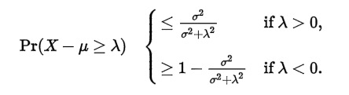
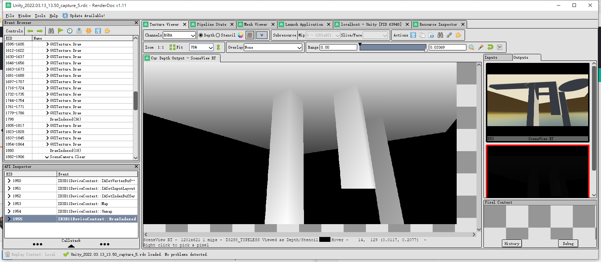
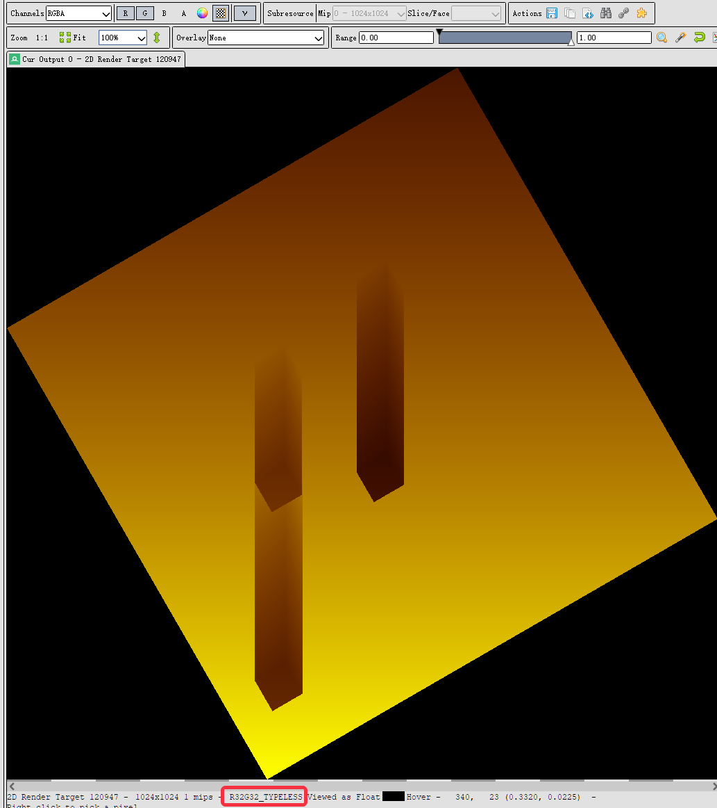
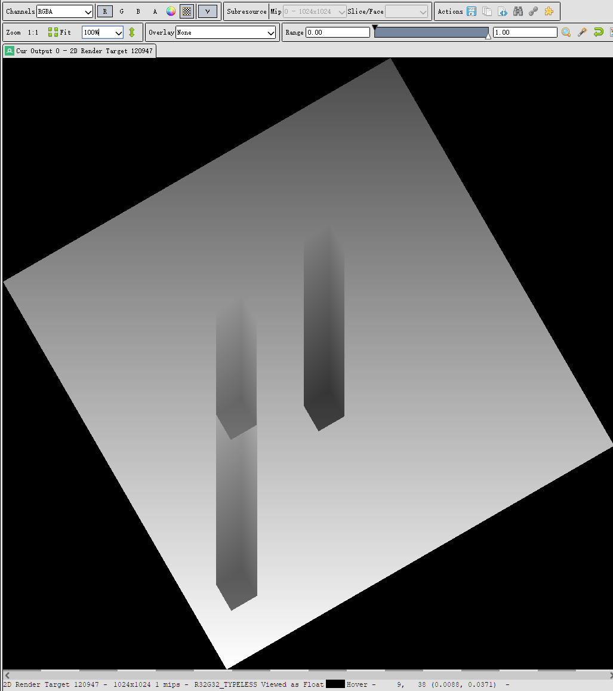
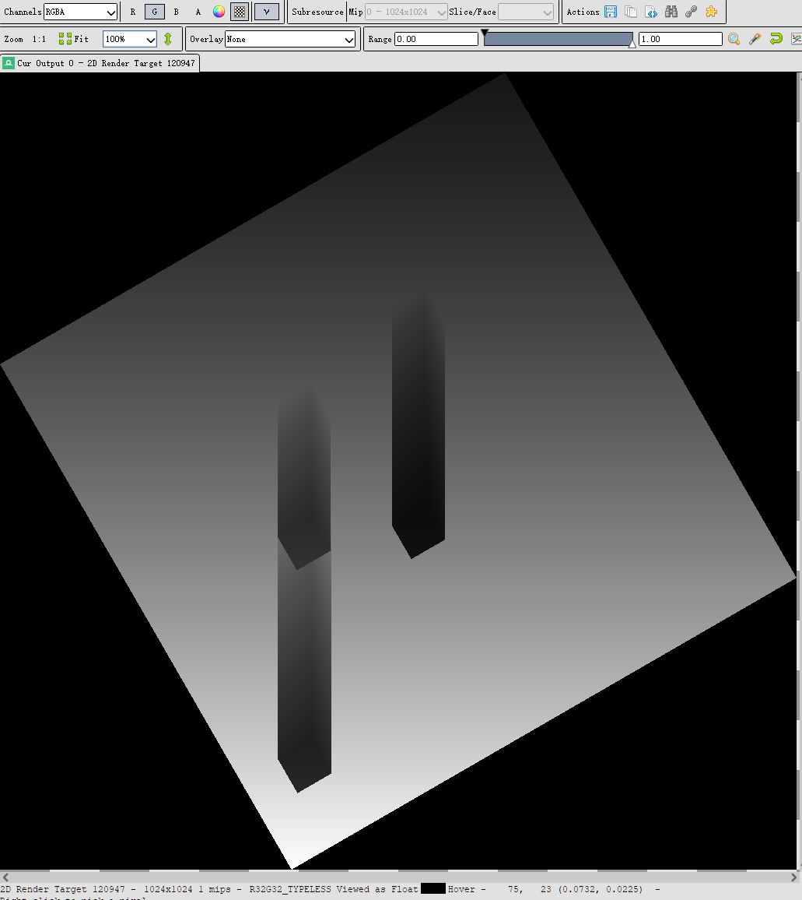
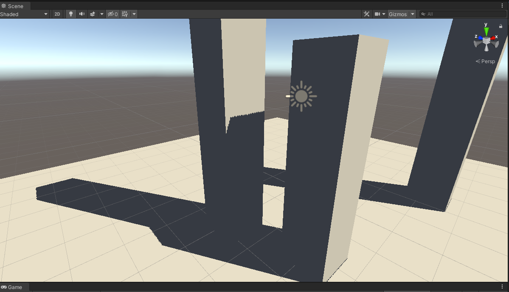
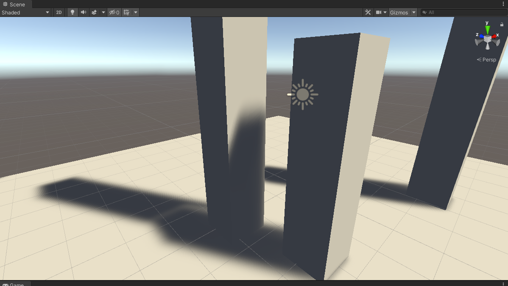
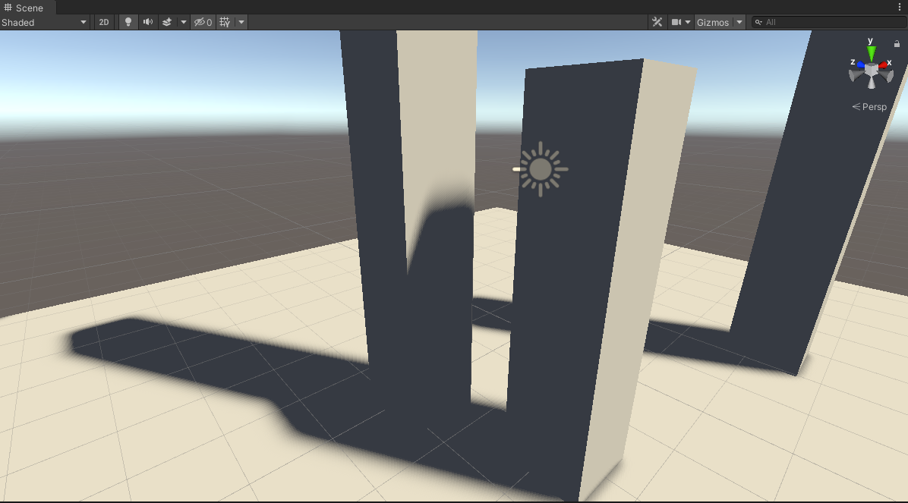
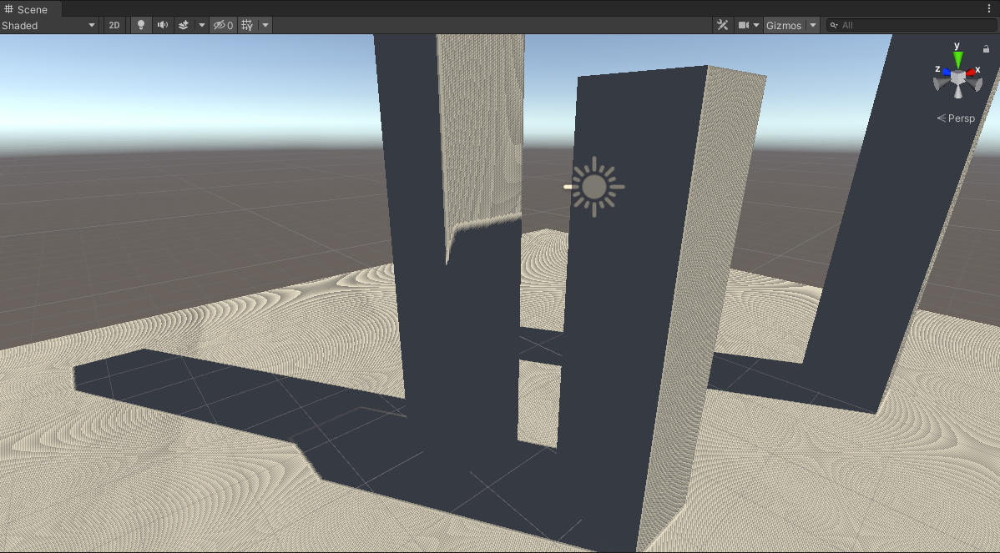

要理解方差阴影贴图的来龙去脉，必须先深刻理解概率论中的几个概念：

- 矩(Moment)
- 数学期望(Mean)
- 方差(Variance)
- 马可夫不等式 (Markov's Inequality)
- 切比雪夫不等式 (Chebyshev's inequality)
- 切比雪夫不等式的one-tailed版本 (one-tailed version of Chebyshev's inequality)

<!--more-->

# 相关数学概念

## 矩(Moment)

https://en.wikipedia.org/wiki/Moment_(mathematics)

给定关于实变量x、常数c的实值连续函数f(x)，它的n阶矩（n-th moment)的公式是：

\\[ \\mu \^\{n\} = \\int \_\{-\\infty \}\^\{ +\\infty  \} (x - c)\^\{n\} f(x) dx \\] 

## 数学期望(Mean)

当c = 0，n = 1时，上述公式变成：

\\[ \\mu = \\int \_\{-\\infty \}\^\{ +\\infty  \} x f(x) dx \\] 

这也就是数学期望(Mean)的积分公式。


## 方差(Variance)

当\\(c = \\mu\\)时，n阶矩可称为**n阶中心矩**；当\\(c = \\mu，n = 2\\)时，2阶中心矩的公式为：

\\[ \\mu \^\{2\} =  \\int \_\{-\\infty \}\^\{ +\\infty  \} (x - \\mu )\^\{ 2 \} f(x) dx \\] 

这其实就是方差(Variance)的积分公式。下面作简单推导。

方差的定义式为：

\\[ Var(X) = E[(X - \\mu)\^\{2\}] =  E[(X - E[X])\^\{2\}] = \\sigma \^\{2\}  \\]

可以推出：

\\[ Var(X) = E[X\^\{2\} - 2 X E[X] + E[X]\^\{2\} ] \\]

\\[ = E[X\^\{2\}] - 2 E[X] E[X] + E[X]\^\{2\} \\]

\\[ = E[X\^\{2\}] -  E[X]\^\{2\} \\]

而2阶中心矩公式可以推出：

\\[ \\int (x - \\mu )\^\{ 2 \} f(x) dx \\] 

\\[ = \\int x\^\{ 2 \} f(x) dx - 2\\mu \\int x f(x) dx + \\int \\mu \^\{ 2 \} f(x) dx \\] 

\\[ = \\int x\^\{ 2 \} f(x) dx - 2\\mu \\cdot \\mu + \\mu \^\{ 2 \} \\] 

\\[ = \\int x\^\{ 2 \} f(x) dx - \\mu \^\{ 2 \} \\] 

\\[ =E[X\^\{ 2 \}] - E[X] \^\{ 2 \} \\] 

## 马可夫不等式 (Markov's Inequality)

设X是非负的随机变量，且有a > 0，那么X大于等于a的概率不超过X的数学期望除以a：

\\[ P \_\{ X \\geq a \} \\leq \frac \{ E[X] \}\{ a \} \\]

（Note：这里的P是指概率）

### 证明：

证明前需要先理解一个概念：示性函数（Indicator）。对于任意事件e，当e发生时，\\( I \_\{e\}  = 1\\)， 当E没发生时，\\( I \_\{e\} = 0\\)。

那么把\\( X \\geq a \\)当作一个事件e，当e发生时，有：

\\[  I \_\{ X \\geq a \}  = 1  \\]

\\[   a I \_\{ X \\geq a \} \\leq X   \\]

两边同时变成数学期望，不等式依然成立：

\\[   E[a I \_\{ X \\geq a \}] \\leq E[X]   \\]

又因为数学期望的线性关系，有：

\\[  E[a I \_\{ X \\geq a \}] = a \\cdot E[I \_\{ X \\geq a \}]   \\]

又因为函数\\( I \_\{ X \\geq a \} \\)的取值只有2种，所以可直接得到：

\\[  a \\cdot E[I \_\{ X \\geq a \}] = a \\cdot ( 1\\cdot P \_\{ X \\geq a \} + 0\\cdot P \_\{ X \\lt a \}   ) \\]

\\[  = a \\cdot P \_\{ X \\geq a \} \\]

综上，就得到了：

\\[   a \\cdot P \_\{ X \\geq a \} \\leq E[X]   \\]

\\[ P \_\{ X \\geq a \} \\leq \frac \{ E[X] \}\{ a \} \\]

## 切比雪夫不等式 (Chebyshev's inequality)

设有随机变量X以及它的数学期望\\(\\mu \\) 、有限且不等于0的方差\\( \\sigma \^\{2\} \\)，对于任意>0的实数k，以下不等式成立：

\\[ P \_\{ | X - \\mu | \\geq k\\sigma \} \\leq \frac \{ 1 \}\{ k\^\{2\} \} \\]

（Note：这里的P是指概率）

这就是切比雪夫不等式。其中，因为概率P永远小于等于1，所以k值要大于1这个不等式才有意义。

### 证明：

设有随机变量\\( Y = (X - \\mu )\^\{2\} \\) 以及 \\( a = (k\\sigma )\^\{2\} \\)，代入马可夫不等式后：

\\[ P \_\{ Y \\geq a \} \\leq \frac \{ E[Y] \}\{ a \} \\]


\\[ P \_\{ (X - \\mu )\^\{2\} \\geq (k\\sigma )\^\{2\} \} \\leq \frac \{ E[(X - \\mu )\^\{2\}] \}\{ (k\\sigma )\^\{2\} \} \\]

回顾下方差公式：

\\[ Var(X) = E[(X - \\mu)\^\{2\}] = \\sigma \^\{2\} \\]

显然有：

\\[ P \_\{ (X - \\mu )\^\{2\} \\geq (k\\sigma )\^\{2\} \} \\leq \frac \{ E[(X - \\mu )\^\{2\}] \}\{ (k\\sigma )\^\{2\} \} = \frac \{ \\sigma \^\{2\} \}\{ (k\\sigma )\^\{2\} \} = \frac \{ 1 \}\{ k\^\{2\} \} \\]


左边的式子可以进一步简化：

\\[ (X - \\mu )\^\{2\} \\geq (k\\sigma )\^\{2\}  \\]


\\[ |X - \\mu | \\geq k\\sigma  \\]

（右边没有绝对值是因为有前提条件k>0，即使标准差\\(\\sigma < 0 \\)该等式依然成立 )

于是切比雪夫不等式成立：

\\[ P \_\{ | X - \\mu | \\geq k\\sigma \} \\leq \frac \{ 1 \}\{ k\^\{2\} \} \\]

## 切比雪夫不等式的one-tailed版本

切比雪夫不等式的one-tailed版本其实就是**坎泰利不等式**[Cantelli's inequality](https://en.wikipedia.org/wiki/Cantelli%27s_inequality)。坎泰利不等式公式如下：



(from wiki，Pr等价于上文的P）

而切比雪夫不等式的one-tailed版本如下：

\\[ P \_\{  X - \\mu  \\geq t \} \\leq \frac \{ \\sigma \^\{2\} \}\{ \\sigma \^\{2\} + t \^\{2\} \} ，t  > 0 \\] 

一模一样的。

### 证明：

要证明one-tailed公式，要用到马可夫不等式。首先定义\\(Y = X - \\mu \\)，那么就有\\(E[Y] = E[X - \\mu ] = E[X]- E[\\mu ] = \\mu - \\mu = 0\\)，以及：\\( Var[Y] = Var[X - \\mu ] = Var[X] - Var[\\mu ] = Var[X]  - 0 = Var[X] \\)。

于是：

\\[ P \_\{  Y \\geq t \} = P \_\{  Y + \\mu \\geq t + \\mu \} \leq P \_\{  (Y + \\mu)\^\{2\} \\geq (t + \\mu)\^\{2\}  \}  \\]

这时候用上马可夫不等式 \\( P \_\{ X \\geq a \} \\leq \frac \{ E[X] \}\{ a \} \\)，得到：


\\[ P \_\{  (Y + \\mu)\^\{2\} \\geq (t + \\mu)\^\{2\}  \} \\leq \frac \{ E[(Y + \\mu)\^\{2\}] \}\{ (t + \\mu)\^\{2\} \} \\]

再用上方差公式：

\\[ E[(Y + \\mu)\^\{2\}] = Var[Y + \\mu] + E[Y + \\mu]\^\{2\}   \\]

\\[ = Var[Y] + Var[\\mu] + E[Y + \\mu]\^\{2\}   \\]

\\[ = \\sigma \^\{2\} + 0 + (E[Y] + E[\\mu])\^\{2\}   \\]

\\[ = \\sigma \^\{2\} + (0 + E[\\mu])\^\{2\}   \\]

\\[ = \\sigma \^\{2\} + \\mu \^\{2\}   \\]

所以有：

\\[  P \_\{  Y \\geq t \} \leq \frac \{ \\sigma \^\{2\} + \\mu \^\{2\} \}\{ (t + \\mu)\^\{2\} \} \\]

接着令 \\( \\phi(\\mu ) = \frac \{ \\sigma \^\{2\} + \\mu \^\{2\} \}\{ (t + \\mu)\^\{2\} \} \\)，求导\\( \\phi '(\\mu ) = 0\\)时的\\( \\mu \\)值。这个导数算起来比较复杂，我找了个在线导数计算工具来辅助下（这不是广告）。

先进入[http://zh.numberempire.com/derivativecalculator.php](http://zh.numberempire.com/derivativecalculator.php)，输入： (a\^2+x\^2)/((b+x)\^2)，得到导数公式： (2*b*x-2*a\^2)/(x\^3+3*b*x\^2+3*b\^2*x+b\^3)。

a就是\\( \\sigma \\)，b就是t，x就是\\(\\mu \\)，把这个式子弄成latex：

\\[ \\phi '(\\mu ) = \frac \{ 2bx - 2a\^\{2\} \}\{ x\^\{3\} + 3bx\^\{2\} + 3b\^\{2\}x + b\^\{3\} \} = 0 \\]

这个方程也是复杂，继续用工具来算就好了。

进入[http://zh.numberempire.com/equationsolver.php](http://zh.numberempire.com/equationsolver.php)，

输入：(2*b*x-2*a\^2)/(x\^3+3*b*x\^2+3*b\^2*x+b\^3) = 0，

得到：\\( x = \\frac \{ a\^\{2\} \} \{ b \} \\) ，即：

\\[ \\mu = \\frac \{ \\sigma \^\{2\} \} \{ t \}  \\]


也就是说当\\( \\mu = \\frac \{ \\sigma \^\{2\} \} \{ t \}  \\)时，\\(  \\phi(\\mu ) \\)取得最小值。而又因为对任意的\\( \\mu \\)，概率\\( P \_\{  Y \\geq t \} \\) 都不超过\\(  \\phi(\\mu ) \\)，所以原先的不等式可以进一步简化成：


\\[  P \_\{  Y \\geq t \} \leq \frac \{ \\sigma \^\{2\} + \\mu\_\{ \* \} \^\{2\} \}\{ (t + \\mu \_\{ \* \} )\^\{2\} \}  = \frac \{ \\sigma \^\{2\} + (\\frac \{ \\sigma \^\{2\} \} \{ t \}) \^\{2\} \}\{ (t + \\frac \{ \\sigma \^\{2\} \} \{ t \} )\^\{2\} \} \\]

右边的式子继续简化；

\\[ \frac \{ \\sigma \^\{2\} + (\\frac \{ \\sigma \^\{2\} \} \{ t \}) \^\{2\} \}\{ (t + \\frac \{ \\sigma \^\{2\} \} \{ t \} )\^\{2\} \}  = \\frac \{  \frac \{ \\sigma \^\{2\}t\^\{2\} +\\sigma \^\{4\} \} \{ t\^\{2\} \}         \} \{  \frac \{ (t\^\{2\} + \\sigma \^\{2\})\^\{2\}  \} \{ t\^\{2\} \}     \}  = \frac \{ \\sigma \^\{2\}t\^\{2\} +\\sigma \^\{4\} \} \{ (t\^\{2\} + \\sigma \^\{2\})\^\{2\} \} =   \frac \{ \\sigma \^\{2\} \} \{ t\^\{2\} + \\sigma \^\{2\} \} \\]

所以：

\\[  P \_\{  Y \\geq t \} =  P \_\{  X - \\mu \\geq t \} \leq  \frac \{ \\sigma \^\{2\} \} \{ t\^\{2\} + \\sigma \^\{2\} \} \\]

得证。


# zbuffer范围问题

在继续分析前，先暂停一下，让我们搞清楚depth buffer的平台差异问题、reverse z问题、自定义depth问题。

## 平台差异问题

根据[unity的说明文档](https://docs.unity3d.com/540/Documentation/Manual/SL-PlatformDifferences.html)，可以知道不同的图形API，深度范围是不一样的：

1. DX、Metal、主机平台，clip space的depth范围是[0, 1]，0是near，1是far
2. GL、GL ES，clip space的depth范围是[-1, 1]，-1是near，1是far

从这2点可见，一般靠近摄像机的物体深度会偏黑，远离摄像机的物体深度会偏白。**越近越黑，越远越白**。

## reverse z问题

在下一节使用的[demo](https://github.com/gkjohnson/unity-custom-shadow-experiments)里，经过截帧，发现事实并不是如此：




可见，该demo使用的是DX11，且zbufer是**越近越白，越远越黑**。

这个是因为unity使用DX11时，默认开启了一种叫[reverse z](https://zhuanlan.zhihu.com/p/75517534)的优化技术。

因为clip space的深度是非线性的且float是越接近0精度越高，所以reverse z应运而生，reverse z可以减弱中远距离的z fighting问题。具体做法就是让near变成1，far变成0。

（题外话一下，根据平台差异性第二点，GL环境下，depth范围是[-1，1]，是不能直接应用reverse z的。所以这个技术有一定平台限制性，还需要一些特殊处理才能用到GL中）

reverse z开启时，depth范围变成[1, 0]，depth compare func变成Greater Equal，即新的深度大于已有深度时，才能通过深度测试并进行绘制，并把更大的深度值写入z buffer。

## 自定义depth问题

第三是自定义depth问题。既然默认的z buffer有平台差异，那么自定义一个depth RT，自己控制depth范围，不是很方便？确实是可以的，这个demo确实是这样做的。

为了不引起混乱，在此总结一下：下文所讨论的代码实现，**基于unity DX11环境的VSM，且打开了reverse z，默认的depth RT范围是非传统的[1, 0]，自定义VSM depth的范围是[0, 1]**。

# 方差阴影贴图(VSM)

生成VSM，相比SSM(Standard Shadow Map)，除了把深度d存到深度图，还要多存一个d\*d。似乎看起来有点蠢，明明有d了，要用d平方不就是运算的时候d\*d就行了嘛。其实VSM的原理还得结合一些硬件知识来理解。

相比SSM是单通道贴图，VSM则是双通道贴图，并且VSM在用于光照计算前，**允许做纹理过滤**，即模糊化（VSM能实现软阴影的关键之处）。而SSM是万万不能模糊的，不然做深度测试会出大问题。

VSM把zbuffer模糊后，d和d平方的值就在一定范围内做了偏移。那么我们可以设：

- 模糊前的深度d和d平方分别为x和\\( x\^\{2\} \\)

- 模糊后的深度d和d平方分别为一阶矩M1（x的数学期望）和一阶矩M2（\\( x\^\{2\} \\)的数学期望）

再用上前面给出的方差公式：

\\[ Var(X) = E[X\^\{2\}] -  E[X]\^\{2\} \\]

所以对于模糊前的x（真实深度），我们可以求出它的数学期望和方差：

\\[ \\mu = E(x) = M1 \\]

\\[ \\sigma \^\{2\} = Var(x) = E[x\^\{2\}] -  E[x]\^\{2\} = M2 - M1\^\{2\} \\]

到了这里，VSM的原理已经相当清楚了：先是存了原始的深度x和x平方，然后又对x和x平方做了一些坏事：把x和x平方稍微搅浑（模糊）了，模糊了后想恢复原始的x是不可能了，但是我们可以利用模糊后的x和x平方（一、二阶矩），算出x的**方差**，再结合模糊后的x（x的数学期望，一阶矩），就能对原始的x做概率估计。模糊操作可以用后处理或compute shader实现。


VSM的实现还需要用上切比雪夫不等式的one-tailed版本。首先拿出该公式：

\\[ P \_\{  X - \\mu  \\geq t \} \\leq \frac \{ \\sigma \^\{2\} \}\{ \\sigma \^\{2\} + t \^\{2\} \} ，t  > 0 \\] 

设\\( t' = t - \\mu ，t > \\mu > 0 \\)，代入上式：

\\[ P \_\{  X - \\mu  \\geq t' \} \\leq \frac \{ \\sigma \^\{2\} \}\{ \\sigma \^\{2\} + t' \^\{2\} \}  \\] 

\\[ P \_\{  X - \\mu  \\geq t - \\mu \} \\leq \frac \{ \\sigma \^\{2\} \}\{ \\sigma \^\{2\} + (t - \\mu) \^\{2\} \}  \\] 


\\[ P \_\{  X \\geq t \} \\leq \frac \{ \\sigma \^\{2\} \}\{ \\sigma \^\{2\} + (t - \\mu) \^\{2\} \}  \\] 

（在[Variance Shadow Maps](http://citeseerx.ist.psu.edu/viewdoc/download?doi=10.1.1.104.2569&rep=rep1&type=pdf) 论文中就会看到这个不等式）

这个公式很重要，会直接应用到shader中。

假定我们已经画出了VSM阴影贴图，此时我们要在真正的rendering pass的某个fragment shader里对某一个fragment做软阴影计算，不像SSM可以直接做深度比较，在VSM环境下，只能知道fragment **有概率被遮挡** 。

此时可设：

- fragment在light view space下的精确深度为t
- VSM里所对应的uv位置的未模糊前的深度为X（即最靠近光源的遮挡物深度）

因为上文已经说了VSM自定义depth的范围是[0, 1]，那么可知：

- 当X > t时，遮挡物的深度大于fragment的深度，fragment在遮挡物前面，没有阴影
- 当X < t时，遮挡物的深度小于fragment的深度，fragment在遮挡物后面，有阴影

那么\\( P \_\{  X \\geq t \} \\)这个东西的意思就是，**在light view space下，fragment没有被遮挡的概率**。

再设一个变量叫阴影强度（shadowIntensity），有以下关系式：

\\[ shadowIntensity = 1 - P \_\{  X \\geq t \} \\]

shadowIntensity的本质就是**fragment被遮挡的概率**。


下面是具体算法和工程实现部分。


首先把fragPos转换到light space下，获得clip space pos再转成uv坐标，就可以采样VSM深度图的depth值（模糊后），称为\\(d\_\{1\}\\)。而fragPos当前在light place的精确深度则称为\\(d\_\{2\} \\)。 

把\\(d\_\{2\} \\)代入t，就可以明确：

**fragment没有被遮挡的概率** \\( P \_\{  X \\geq d\_\{2\} \} \\) **小于等于** \\( \frac \{ \\sigma \^\{2\} \}\{ \\sigma \^\{2\} + (t - \\mu) \^\{2\} \}  \\)

再设\\( P\_\{  X \\geq d\_\{2\} \} \\)为p，那么VSM **未模糊前的d** 的数学期望可等于：

\\[ \\mu = E(X) = E(d) = p d\_\{2\} + (1 - p)d\_\{1\} \\]

这个式子可以这样理解：

- 当p=1时，framgment 100%不被遮挡物遮挡，遮挡物深度期望值为\\(d_\{2\}\\)，即遮挡物深度必然大于等于fragment在light view space的深度
- 当p=0时，framgment 100%被遮挡物遮挡，遮挡物深度期望值为\\(d_\{1\}\\)，即等于VSM采样深度（模糊后），VSM变成了SSM

这个p虽然还不能被准确算出来，但基于这条d的数学期望公式，不等式右边的部分，即p的上界，已经可以继续化简了！这个上界究竟是什么东西呢？


先写出\\(d\^\{2\}\\)的数学期望：

\\[  E(x\^\{2\}) = p d\_\{2\}\^\{2\} + (1 - p)d\_\{1\}\^\{2\} \\]

于是d的方差为：

\\[ \\sigma \^\{2\} = E[x\^\{2\}] -  E[x]\^\{2\}  = p d\_\{2\}\^\{2\} + (1 - p)d\_\{1\}\^\{2\} - (p d\_\{2\} + (1 - p)d\_\{1\} )\^\{2\} \\]

\\[ = p d\_\{2\}\^\{2\} + (1 - p)d\_\{1\}\^\{2\} - p\^\{2\} d\_\{2\}\^\{2\} - 2p(1 - p)d\_\{1\} d\_\{2\} - (1 - p)\^\{2\} d\_\{1\} \^\{2\} \\]

\\[ = (p - p\^\{2\}) d\_\{2\}\^\{2\} + (1 - p)(d\_\{1\}\^\{2\} - 2pd\_\{1\} d\_\{2\} - (1 - p)d\_\{1\}\^\{2\} ) \\]

\\[ = (p - p\^\{2\}) d\_\{2\}\^\{2\} + (1 - p)(d\_\{1\}\^\{2\} - 2pd\_\{1\} d\_\{2\} - d\_\{1\}\^\{2\} + pd\_\{1\}\^\{2\} ) \\]

\\[ = (p - p\^\{2\}) d\_\{2\}\^\{2\} + (1 - p)( - 2pd\_\{1\} d\_\{2\}  + pd\_\{1\}\^\{2\} ) \\]

\\[ = (p - p\^\{2\}) d\_\{2\}\^\{2\} + (p - p\^\{2\})( - 2d\_\{1\} d\_\{2\}  + d\_\{1\}\^\{2\} ) \\]

\\[ = (p - p\^\{2\})(d\_\{2\}\^\{2\}  - 2d\_\{1\} d\_\{2\}  + d\_\{1\}\^\{2\} ) \\]

\\[ = (p - p\^\{2\})(d\_\{2\} - d\_\{1\})\^\{2\} \\]


设p的上界（不等式右边部分）为\\( p\_\{max\} (d\_\{2\}) \\)，并把\\( \\mu 、\\sigma \^\{2\} \\)代入后化简：


\\[ p \\leq p\_\{max\} (d\_\{2\}) = \frac \{ \\sigma \^\{2\} \}\{ \\sigma \^\{2\} + (d\_\{2\} - \\mu) \^\{2\} \}  \\] 

\\[ = \frac \{ (p - p\^\{2\})(d\_\{2\} - d\_\{1\})\^\{2\} \}\{ (p - p\^\{2\})(d\_\{2\} - d\_\{1\})\^\{2\} + ( p d\_\{2\} + (1 - p)d\_\{1\}  - d\_\{2\} ) \^\{2\} \}  \\] 

\\[ = \frac \{ (p - p\^\{2\})(d\_\{2\} - d\_\{1\})\^\{2\} \}\{ (p - p\^\{2\})(d\_\{2\} - d\_\{1\})\^\{2\} +(1 - p) \^\{2\} (d\_\{2\} - d\_\{1\} ) \^\{2\} \}  \\] 

\\[ = \frac \{ p - p\^\{2\} \}\{ (p - p\^\{2\}) +(1 - p) \^\{2\} \}  \\] 

\\[ = \frac \{ p - p\^\{2\} \}\{ (p - p\^\{2\}) +(1 - p) \^\{2\} \}  \\] 

\\[ = \frac \{ p - p\^\{2\} \}\{ 1 - p \}  \\] 

\\[ = p \\] 

**也就是说，p的上界等于p本身 ！**

总结一下。原始的切比雪夫不等式的one-tailed版本：

\\[ P \_\{  X \\geq t \} \leq \frac \{ \\sigma \^\{2\} \}\{ \\sigma \^\{2\} + (t - \\mu) \^\{2\} \}  \\] 

在VSM这个特殊场景下，不等式是：

\\[ P \_\{  X \\geq d\_\{2\} \}  \leq \frac \{ \\sigma \^\{2\} \}\{ \\sigma \^\{2\} + (t - \\mu) \^\{2\} \}  \\]

根据以下假设：

\\[ \\mu = E(X) = E(d) = p d\_\{2\} + (1 - p)d\_\{1\} \\]

我们推出了p的上界等于p：

\\[   P \_\{  X \\geq d\_\{2\} \}  \\leq p\_\{max\} (d\_\{2\}) =  \frac \{ \\sigma \^\{2\} \}\{ \\sigma \^\{2\} + (t - \\mu) \^\{2\} \} =  P \_\{  X \\geq d\_\{2\} \} \\]

这意味着我们直接算出了准确的p值，不等式变成了等式。Amazing！

知道p的公式后有什么用呢？上文已经说了p的含义：**fragment没有被遮挡的概率**。这不就可以用来估算阴影强度了嘛。

理论到此为止，剩下的就是工程问题了。


# 工程实现

如果你的工程里已经实现了Standard Shadow Map，那么只需要几个步骤即可实现基本的VSM：

- 把Shadow Map Buffer改为输出depth和depth平方到颜色buffer。可能需要先修改RT的创建代码，下面以OpenGL 4.x为例：

```c
// 32位高精度双通道纹理 用来存moment1和moment2
glTexImage2D(GL_TEXTURE_2D, 0, GL_RG32F, width, height, 0, GL_RG, GL_FLOAT, NULL);
```

然后修改shadow map shader（在light位置画一遍场景）：

vs:

```c
v2f vert(appdata v)
{
    v2f o;
    o.vertex = UnityObjectToClipPos(v.vertex);
    o.uv = v.uv;
    return o;
}

fixed4 frag(v2f i) : SV_Target
{
    float depth = 1 - i.vertex.z; // DX11 reverse z范围是[1, 0], 这里自定义VSM depth范围到[0, 1]
    depth = i.vertex.z;
    float moment1 = depth;// 一阶矩
    float moment2 = depth * depth;// 二阶矩
    return float4(moment1, moment2, 0, 0);
}

```

debug下VSM：

rg通道一起输出：



只有r通道(moment1):



只有g通道(moment2):




注意到背景是黑色的，实际上应该改成白色：

```c
//_shadowCam.backgroundColor = new Color(0, 0, 0, 0);
_shadowCam.backgroundColor = new Color(1, 1, 1, 1);
```

为什么黑色和白色都能work的原因应该是那些区域没有被采样到，就没事。

然后是应用的问题，需要修改lighting shader里的阴影计算代码：

```c

// 我以前写的demo的代码
uniform sampler2D shadowMap;
// 这个函数是用来算出上文说的Pmax
float chebyshevUpperBound(sampler2D shadowMap, float d, vec2 coord)
{
	vec2 moments = texture(shadowMap, coord).rg;
	// Surface is fully lit. as the current fragment is before the light occluder
	if (d <= moments.x)
		return 1.0;

	// The fragment is either in shadow or penumbra. We now use chebyshev's upperBound to check
	// How likely this pixel is to be lit (p_max)
	float variance = moments.y - (moments.x * moments.x);
	//variance = max(variance, 0.000002);
	variance = max(variance, 0.00002);

	float d_minus_mean = d - moments.x;
	float p_max = variance / (variance + d_minus_mean * d_minus_mean);

	return p_max;
}

// 返回阴影百分比[0,1], 然后拿去乘以光照颜色即可
float ShadowCalculation_Dir(vec3 fragPos, Light light) {

    vec4 fragPosLightSpace = light.lightPV * vec4(fragPos, 1.0);
    // perform perspective divide
    vec3 projCoords = fragPosLightSpace.xyz / fragPosLightSpace.w;
    // transform to [0,1] range
    projCoords = projCoords * 0.5 + 0.5;
    float currentDepth = projCoords.z;
    shadow = 1 - chebyshevUpperBound(shadowMap, currentDepth, projCoords.xy);
    return shadow;
}

// 这是github demo的代码
fixed4 frag (v2f i) : COLOR
{
    // COLOR
    float4 color;
    。。。

    // SHADOWS
    // get distance to lightPos
    float4 lightSpacePos = mul(_LightMatrix, i.wPos);
    float depth = lightSpacePos.z / _ShadowTexScale.z;

    float2 uv;
    。。。
    float4 samp = tex2D(_ShadowTex, uv);
   
    // E(x) and E(x^2)
    float x = samp.r; 
    float x2 = samp.g;
    
    float var = x2 - x*x; 

    // calculate our initial probability based on the basic depths
    // if our depth is closer than x, then the fragment has a 100%
    // probability of being lit (p=1)
    float p = depth <= x; // 这里有点问题，这个x已经是模糊后的
    
    float delta = depth - x;
    float p_max = var / (var + delta*delta); // 概率上界

    // To alleviate the light bleeding, expand the shadows to fill in the gaps 处理漏光
    float amount = _VarianceShadowExpansion;
    p_max = clamp( (p_max - amount) / (1 - amount), 0, 1);

    shadowIntensity = 1 - max(p, p_max); // 1 - 没有被遮挡的概率 = 遮挡的概率 = 阴影强度

    color.xyz *= 1 - shadowIntensity * _MaxShadowIntensity; // 阴影强度越接近1，color越接近黑色
    color.xyz += UNITY_LIGHTMODEL_AMBIENT.xyz;

    return color;

}

```

## 最终demo效果

_VarianceShadowExpansion为0、关闭VSM blur：



_VarianceShadowExpansion为0、VSM做50次blur：




_VarianceShadowExpansion为0.213、VSM做50次blur：




可见_VarianceShadowExpansion值可以解决漏光问题。


把

```c
shadowIntensity = 1 - max(p, p_max);
```

改为：

```c
shadowIntensity = 1 -  p_max;
```

并把blur次数改为1，出现了acne：




所以demo的float p = depth <= x;可以解决acne问题。
