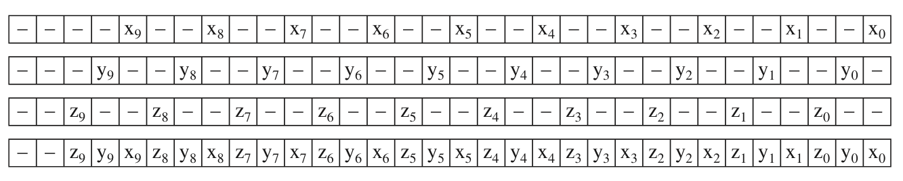

## HLBVH

上一篇文章介绍了recursiveBuild函数，它对静态场景做了一次自顶向下的BVH构造，且使用了一个叫SAH的切分技术。

recursiveBuild有2个缺点：

1. SAH的计算是\\(O(n\^\{2\}) \\)的，且几乎每一个节点都要做SAH，性能并不是很理想；

2. 自顶向下地构造BVH，很难应用并行计算来优先性能。

于是作者又发明了更复杂的HLBVHBuild，即 Hierarchical Linear Bounding Volume Hierarchy。

<!--more-->

## 莫顿码 [Morton Code](https://en.wikipedia.org/wiki/Z-order_curve)

要理解HLBVH，首先要学一下莫顿码。


### LeftShift3

LeftShift3函数： 输入一个32位正整数（这个数实际上必须小于等于1<<10即1024），函数会把第i位的值写入到第3i位，然后把其他无关的位清0。

因为输入的数小于等于1<<10，即只有10个有效bit[0,1,2,···,9]，最大的是第9bit，9*3=27，所以27bit之后的最后4个bits [28, 29, 30 ,31]，必然都是0。下面函数的注释也已标明。

示意图：


（from pbrt v3)


实现代码如下，用了位运算技巧，需要慢慢理解（看注释，每一轮变换都是一次分隔，变换后都给出了有效位的新位置）：

```c
inline uint32_t LeftShift3(uint32_t x) {
    Assert(x <= (1 << 10));
    if (x == (1 << 10)) --x;
    x = (x | (x << 16)) & 0b00000011000000000000000011111111;
    // x = ---- --98 ---- ---- ---- ---- 7654 3210
    x = (x | (x << 8)) & 0b00000011000000001111000000001111;
    // x = ---- --98 ---- ---- 7654 ---- ---- 3210
    x = (x | (x << 4)) & 0b00000011000011000011000011000011;
    // x = ---- --98 ---- 76-- --54 ---- 32-- --10
    x = (x | (x << 2)) & 0b00001001001001001001001001001001;
    // x = ---- 9--8 --7- -6-- 5--4 --3- -2-- 1--0
    return x;
}

```


### EncodeMorton3

理解了LeftShift3后再来理解EncodeMorton3就很简单了，就一行代码：

(LeftShift3(v.z) << 2) | (LeftShift3(v.y) << 1) | LeftShift3(v.x);

调用了三次LeftShift3，分别输入了向量v的x、y、z分量。因为LeftShift3作用是用2个0bit分割有效位，所以EncodeMorton3里，LeftShift3(v.y) 需要整体左移1个bit，LeftShift3(v.z)则是2个bit，填满了总共3 * 10 = 30个bit（还有2个0bit可不管）。

实现代码如下：

```c

inline uint32_t EncodeMorton3(const Vector3dF &v) {
    Assert(v.x >= 0 && v.x <= (1 << 10));
    Assert(v.y >= 0 && v.y <= (1 << 10));
    Assert(v.z >= 0 && v.z <= (1 << 10));
    return (LeftShift3(v.z) << 2) | (LeftShift3(v.y) << 1) | LeftShift3(v.x);
}

```

示意图：




## HLBVHBuild 概览

```c

BVHBuildNode *BVHSystem::HLBVHBuild(
    ComponentHandle<BVHAccel> bvhAccel,
    MemoryArena &arena,
    const std::vector<BVHObjInfo> &objInfo,
    int *totalNodes,
    std::vector<ObjectID> &orderedObjs)  {
    
    // 1. 计算所有物体中心坐标的包围盒
    BBox bounds;
    for (const BVHObjInfo &pi : objInfo)
        bounds = Union(bounds, pi.centroid);

    // 2. 并行计算每所有物体的MortonObj信息
    std::vector<MortonObj> mortonObjs(objInfo.size());
    ParallelFor([&](int i) {
        // 莫顿码共10位
        constexpr int mortonBits = 10;
        constexpr int mortonScale = 1 << mortonBits;
        mortonObjs[i].objIndex = objInfo[i].objNumber;
        // centroidOffset是该obj中心在包围盒里的百分比坐标
        Vector3dF centroidOffset = bounds.Offset(objInfo[i].centroid);
        // 把百分比坐标映射到[0, 1024]，然后编成莫顿码
        mortonObjs[i].mortonCode = EncodeMorton3(centroidOffset * mortonScale);
    }, objInfo.size(), 512);
		
    // 3. mortonObjs数组做基数排序
	RadixSort(&mortonObjs);

    // 4. 按照莫顿码的高位是否一样（都属于同一个grid），对所有物体分组
    // 如果物体分布很稀疏的话，就是一个物体一个treelets, nObjs为1
    // 被mask为1的bits有12个，所以总共有2^12=4096个grid
    // 因为有3个维度，所以单维度上是2^4=16个grid
    std::vector<LBVHTreelet> treeletsToBuild;
    for (int start = 0, end = 1; end <= (int)mortonObjs.size(); ++end) {
        uint32_t mask = 0b00111111111111000000000000000000;
        if (end == (int)mortonObjs.size() ||
            ((mortonObjs[start].mortonCode & mask) !=
            (mortonObjs[end].mortonCode & mask))) {
            int nObjs = end - start;
            int maxBVHNodes = 2 * nObjs;
            BVHBuildNode *nodes = arena.Alloc<BVHBuildNode>(maxBVHNodes, false);
            treeletsToBuild.push_back({ start, nObjs, nodes });
            start = end;
        }
    }

    // 5.开始构造BVH了
    // 5.1 这段代码最关键的就是并行调用emitLBVH，和统计totalNodes
    // 注意，这里构建了n个BVH子树，n=treeletsToBuild.size()
    // 下一个步骤会把这n个BVH子树当成n个物体，和recursiveBuild一样自顶向下构建BVH
    std::atomic<int> atomicTotal(0), orderedObjsOffset(0);
    orderedObjs.resize(bvhAccel->objs.size());
    ParallelFor([&](int i) {
        // Generate _i_th LBVH treelet
        int nodesCreated = 0;
        const int firstBitIndex = 29 - 12;
        LBVHTreelet &tr = treeletsToBuild[i];
        tr.buildNodes = emitLBVH(bvhAccel, tr.buildNodes, objInfo, &mortonObjs[tr.startIndex],
            tr.nObjs, &nodesCreated, orderedObjs,
            &orderedObjsOffset, firstBitIndex);
        atomicTotal += nodesCreated;
    }, treeletsToBuild.size());
    *totalNodes = atomicTotal;

    // 5.2 把std::vector<LBVHTreelet>的buildNodes 放进 finishedTreelets
    std::vector<BVHBuildNode *> finishedTreelets;
    finishedTreelets.reserve(treeletsToBuild.size());
    for (LBVHTreelet &treelet : treeletsToBuild)
        finishedTreelets.push_back(treelet.buildNodes);

    // 5.3 
    return buildUpperSAH(arena, finishedTreelets, 0, finishedTreelets.size(),
        totalNodes);
}

```


### RadixSort

```c

static void RadixSort(std::vector<MortonObj> *v) {
    std::vector<MortonObj> tempVector(v->size());
    constexpr int bitsPerPass = 6;
    constexpr int nBits = 30;
    Assert((nBits % bitsPerPass) == 0);
    constexpr int nPasses = nBits / bitsPerPass;
    for (int pass = 0; pass < nPasses; ++pass) {
        // Perform one pass of radix sort, sorting _bitsPerPass_ bits
        int lowBit = pass * bitsPerPass;

        // Set in and out vector pointers for radix sort pass
        std::vector<MortonObj> &in = (pass & 1) ? tempVector : *v;
        std::vector<MortonObj> &out = (pass & 1) ? *v : tempVector;

        // Count number of zero bits in array for current radix sort bit
        constexpr int nBuckets = 1 << bitsPerPass;
        int bucketCount[nBuckets] = { 0 };
        constexpr int bitMask = (1 << bitsPerPass) - 1;
        for (const MortonObj &mp : in) {
            int bucket = (mp.mortonCode >> lowBit) & bitMask;
            Assert(bucket >= 0 && bucket < nBuckets);
            ++bucketCount[bucket];
        }

        // Compute starting index in output array for each bucket
        int outIndex[nBuckets];
        outIndex[0] = 0;
        for (int i = 1; i < nBuckets; ++i)
            outIndex[i] = outIndex[i - 1] + bucketCount[i - 1];

        // Store sorted values in output array
        for (const MortonObj &mp : in) {
            int bucket = (mp.mortonCode >> lowBit) & bitMask;
            out[outIndex[bucket]++] = mp;
        }
    }
    // Copy final result from _tempVector_, if needed
    if (nPasses & 1) std::swap(*v, tempVector);
}

```


### emitLBVH

emitLBVH会递归调用自己，自顶向下构建BVH树。

注意，emitLBVH依然采用自顶向下的构建流程，但是却可以多线程并行构建n(1<=n<=4096)个grid的BVH，这是第一个性能优化点；第二个性能优化点，在于emitLBVH构造BVH是线性的，即O(n)时间复杂度，这归功于前面的莫顿码排序。

```c

BVHBuildNode *BVHSystem::emitLBVH(ComponentHandle<BVHAccel> bvhAccel,
    BVHBuildNode *&buildNodes,
    const std::vector<BVHObjInfo> &objInfo,
    MortonObj *mortonObjs, int nObjs, int *totalNodes,
    std::vector<ObjectID> &orderedObjs,
    std::atomic<int> *orderedObjsOffset, int bitIndex) {
    Assert(nObjs > 0);
    if (bitIndex == -1 || nObjs < bvhAccel->maxObjsInNode) {
        // Create and return leaf node of LBVH treelet
        (*totalNodes)++;
        BVHBuildNode *node = buildNodes++;
        BBox bounds;
        // 对orderedObjsOffset做原子操作：+=nObjs。并返回+=前的值
        int firstObjOffset = orderedObjsOffset->fetch_add(nObjs);
        for (int i = 0; i < nObjs; ++i) {
            int objIndex = mortonObjs[i].objIndex;
            orderedObjs[firstObjOffset + i] = bvhAccel->objs[objIndex];
            bounds = Union(bounds, objInfo[objIndex].bounds);
        }
        InitLeaf(node, firstObjOffset, nObjs, bounds);
        return node;
    }
    else {
        int mask = 1 << bitIndex;
        // 如果第一个物体和最后一个物体的mask bit是一样的，那么这批物体位置很集中，可直接进入下一个 mask bit
        if ((mortonObjs[0].mortonCode & mask) ==
            (mortonObjs[nObjs - 1].mortonCode & mask))
            return emitLBVH(bvhAccel, buildNodes, objInfo, mortonObjs, nObjs,
                totalNodes, orderedObjs, orderedObjsOffset,
                bitIndex - 1);

        // 二分查找切分位置，即mask bit发生‘突变’的物体的索引
        int searchStart = 0, searchEnd = nObjs - 1;
        while (searchStart + 1 != searchEnd) {
            Assert(searchStart != searchEnd);
            int mid = (searchStart + searchEnd) / 2;
            if ((mortonObjs[searchStart].mortonCode & mask) ==
                (mortonObjs[mid].mortonCode & mask))
                searchStart = mid;
            else {
                Assert((mortonObjs[mid].mortonCode & mask) ==
                    (mortonObjs[searchEnd].mortonCode & mask));
                searchEnd = mid;
            }
        }
        int splitOffset = searchEnd;
        Assert(splitOffset <= nObjs - 1);
        Assert((mortonObjs[splitOffset - 1].mortonCode & mask) !=
            (mortonObjs[splitOffset].mortonCode & mask));


        // 找到切分点了，现在建立一个内部节点node，并对切分点左右两批物体递归调用emitLBVH，建立子树
        (*totalNodes)++;
        BVHBuildNode *node = buildNodes++; // 内部节点
        // lbvh[0]和lbvh[1]分别是node的左右孩子节点
        BVHBuildNode *lbvh[2] = {
            emitLBVH(bvhAccel, buildNodes, objInfo, mortonObjs, splitOffset,
            totalNodes, orderedObjs, orderedObjsOffset,
            bitIndex - 1),
            emitLBVH(bvhAccel, buildNodes, objInfo, &mortonObjs[splitOffset], nObjs - splitOffset,
            totalNodes, orderedObjs, orderedObjsOffset,
            bitIndex - 1) };
        // 这个mask bit对应的是哪条坐标轴
        Axis axis = static_cast<Axis>(bitIndex % 3);
        InitInterior(node, axis, lbvh[0], lbvh[1]);
        return node;
    }
}
```


### buildUpperSAH

对所有treelet，自顶向下构建BVH的上层部分，用了递归。

第一次调用buildUpperSAH创建的是根节点，包含所有treelet；

如果nNodes为1，那么已经到达某个treelet，终止递归；

如果nNodes> 1，创建内部节点，并调用2次buildUpperSAH，创建该内部节点的左右子树。

```c

BVHBuildNode *BVHSystem::buildUpperSAH(MemoryArena &arena, std::vector<BVHBuildNode *> &treeletRoots,
    int start, int end,
    int *totalNodes) {
    Assert(start < end);
    int nNodes = end - start;
    if (nNodes == 1) return treeletRoots[start]; // 已经到底了，终止递归
    (*totalNodes)++;
    BVHBuildNode *node = arena.Alloc<BVHBuildNode>();

    // Compute bounds of all nodes under this HLBVH node
    BBox bounds;
    for (int i = start; i < end; ++i)
        bounds = Union(bounds, treeletRoots[i]->bounds);

    // Compute bound of HLBVH node centroids, choose split dimension _dim_
    BBox centroidBounds;
    for (int i = start; i < end; ++i) {
        Vector3dF centroid =
            (treeletRoots[i]->bounds.pMin + treeletRoots[i]->bounds.pMax) *
            0.5f;
        centroidBounds = Union(centroidBounds, centroid);
    }
    Axis dim = centroidBounds.MaximumExtent();
    // FIXME: if this hits, what do we need to do?
    // Make sure the SAH split below does something... ?
    Assert(centroidBounds.pMax[dim] != centroidBounds.pMin[dim]);

    // 计算buckets, 可参考recursiveBuild
    constexpr int nBuckets = 12;

    BucketInfo buckets[nBuckets];

    for (int i = start; i < end; ++i) {
        float centroid = (treeletRoots[i]->bounds.pMin[dim] +
            treeletRoots[i]->bounds.pMax[dim]) *
            0.5f;
        int b =
            nBuckets * ((centroid - centroidBounds.pMin[dim]) /
            (centroidBounds.pMax[dim] - centroidBounds.pMin[dim]));
        if (b == nBuckets) b = nBuckets - 1;
        Assert(b >= 0 && b < nBuckets);
        buckets[b].count++;
        buckets[b].bounds = Union(buckets[b].bounds, treeletRoots[i]->bounds);
    }

    float cost[nBuckets - 1];
    computeCosts(bounds, cost, buckets, nBuckets, .125f);
    float minCost;
    int minCostSplitBucket;
    findMinCost(cost, nBuckets, &minCost, &minCostSplitBucket);

    // 每个treelet拿自己的bucket值和minCostSplitBucket比较大小，切分成2部分
    BVHBuildNode **pmid = std::partition(
        &treeletRoots[start], &treeletRoots[end - 1] + 1,
        [=](const BVHBuildNode *node) {
        float centroid =
            (node->bounds.pMin[dim] + node->bounds.pMax[dim]) * 0.5f;
        int b = nBuckets *
            ((centroid - centroidBounds.pMin[dim]) /
            (centroidBounds.pMax[dim] - centroidBounds.pMin[dim]));
        if (b == nBuckets) b = nBuckets - 1;
        Assert(b >= 0 && b < nBuckets);
        return b <= minCostSplitBucket;
    });
    int mid = pmid - &treeletRoots[0];
    Assert(mid > start && mid < end);
    InitInterior(node,
        dim, buildUpperSAH(arena, treeletRoots, start, mid, totalNodes),
        buildUpperSAH(arena, treeletRoots, mid, end, totalNodes));
    return node;
}


```