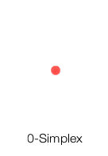
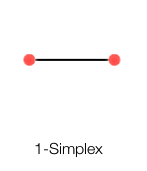
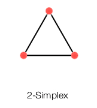
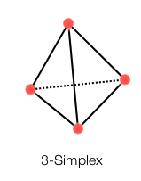
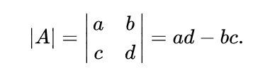
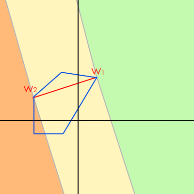

GJK的主要特性：

- 只适用于凸包几何体
- GJK算法与维度无关，2D、3D都可以用
- 不要求对顶点数组做排序
- 存在一些技巧可以大大优化GJK的性能

原始GJK包含的知识点：

- 闵可夫斯基和 Minkowski sum
- 向量混合积 vector triple product
- k阶单纯形 k-Simplex
- supporting point和Support函数

增强GJK的知识点:
- witness point
- [EPA](http://www.dyn4j.org/2010/05/epa-expanding-polytope-algorithm/)算法


原始GJK告诉调用者2个几何体有没发生碰撞，而增强GJK不仅告知有没碰撞，还返回了碰撞点、碰撞距离信息。

本文将详解原始GJK的来龙去脉。

### 目录：


- [数学知识点](#1)
	- [闵可夫斯基数学 Minkowski Math](#1.1)
	- [单纯形 Simplex](#1.2)
  - [向量混合积 Vector Triple Product](#1.3)
- [GJK算法原理](#2)
	- [GJK伪代码](#2.1)
  - [Support函数](#2.2)
  - [NearestSimplex函数](#2.3)
- [GJK算法实现](#3) 
	- [b2Distance核心逻辑](#3.1)
	- [b2Simplex::GetSearchDirection](#3.2)
	- [b2Simplex::Solve2](#3.3)
	- [b2Simplex::Solve3](#3.4)
	- [b2DistanceProxy::GetSupport](#3.5)
- [其他细节](#4) 
- [参考资料](#5) 
	- [GJK各种实现](#5.1)
   

<!--more-->

# <div id="1">数学知识点</div>

## <div id="1.1">闵可夫斯基数学 Minkowski Math</div>

### Minkowski扩大运算  [Minkowski Sum](https://en.wikipedia.org/wiki/Minkowski_addition)

\\[ A \oplus B = \\bigcup \_\{b \in B} A\^\{b\}  \\]

其中，\\(A\^\{b\} = \\{ a + b | a \\in A\\}  = A + b \\)，代表集合A整体移动b

（可以理解为几何形状的Union并集运算）

### Minkowski收缩运算 

\\[ A \ominus B = \\bigcap \_\{b \in B} A\^\{-b\}  \\]

其中，\\(A\^\{-b\} = \\{ a - b | a \\in A\\}  = A - b \\)，代表集合A整体移动-b

（可以理解为几何形状的Intersect交集运算）

### Minkowski减法运算（Minkowski差)

\\[ A - B =  A \oplus (-B)  \\]

这条公式才是真正应用到GJK算法里的公式。

可以理解为B先做了一次镜像，然后再和A做并集运算。

所以，说到GJK的Minkowski运算时，可以叫Minkowski和，也可以叫Minkowski差。anyway。

## 向量混合积 Vector Triple Product

曾经，我在我的[用线性代数知识解决光线和三角形的交点问题](http://127.0.0.1:4000/triangle-intersect/)一文中提到了一个数学公式，叫**标量混合积(Scalar Triple Product)**。

而在GJK中，需要用到相似的另一个东西——**[向量混合积(Vector Triple Product)](https://en.wikipedia.org/wiki/Triple_product)**, 同时也被称为**BAC-CAB特性**:

\\[ A\times (B\times C) = B(A\cdot C) - C(A\cdot B) \\]

\\[ (A\times B)\times C = -C\times (A\times B) \\]

\\[ (A\times B)\times C = B(A\cdot C) - A(B\cdot C)  \\]

Proof: [https://en.wikipedia.org/wiki/Triple_product#Proof](https://en.wikipedia.org/wiki/Triple_product#Proof)

GJK使用的第三条公式。


## <div id="1.2">单纯形 [Simplex](https://en.wikipedia.org/wiki/Simplex)</div>

按照wiki的解释，k阶单纯形，指的是k维空间中的多胞形，且多胞形是k+1个顶点组成的凸包。根据这个定义出发，就可以理解GJK算法中会提到的各种Simplex是什么东西：

### 0阶单纯形 0-Simplex



根据前面的定义，0阶单纯形是0维空间下的0+1=1个顶点组成的凸包，显然只能是一个点。

### 1阶单纯形 1-Simplex



1阶单纯形，1维空间，1+1=2个顶点，所以就是一条直线（1维空间）上的一个线段。

### 2阶单纯形 2-Simplex



2阶单纯形，2维空间，2+1=3个顶点，所以就是一个平面（2维空间）上的一个三角形，三角形我们就熟悉了，显然是一个凸包无误。

### 3阶单纯形 3-Simplex



3阶单纯形，3维空间，3+1=4个顶点，所以就是3维立体空间里的一个四面体(tetrahedron)，显然也是一个凸包。

### k>3阶单纯形

我想读者做的都是2D或3D的项目，2D项目最多用到2-Simplex，3D项目最多用到3-Simplex。k>3的Simplex，忽略吧。

#  <div id="2">GJK算法原理</div>


## <div id="2.1">划重点：来自wiki的GJK伪代码</div>

经过查阅大量资料，发现还是wiki对GJK的解释一语中的，所以下面介绍下wiki给出的GJK伪代码：

```js
function GJK_intersection(shape p, shape q, vector D):
    vector  A = Support(p, D) - Support(q, -D)
    simplex s = {A}
    D = -A
    loop:
        A = Support(p, D) - Support(q, -D)
        if dot(A, D) < 0:
          reject
        s = s ∪ A
        s, D, contains_origin = NearestSimplex(s)
        if contains_origin:
          accept
```

这份代码准确描述了**原始**GJK的核心逻辑：**只需要输入2个shape和一个初始方向，就能告诉你这2个shape有没碰撞**

1. 分别沿着初始方向D和反方向-D，求出p和q的supporting point，并计算Minkowski差，得到向量A。

2. 把A输入单纯形s，此时单纯形为0-simplex (如果你不知道是什么，说明没看上文)

3. D重新设置为-A (这一步操作不是很关键，可以不深究为什么)

4. 进入循环:

  1. 同步骤1类似，计算下一个Minkowski差，并依然赋值给A（这里要注意到，A永远是最新计算得到的Minkowski差向量）

  2. 判断A和D的点积是否小于0，实际上就是判断A和D的夹角是不是大于90度。或者换句话说，A在D方向上的投影距离，是否小于0，小于0说明投影在了D的反方向上。所以，如果点积小于0，说明不能在DO方向上找到离原点Origin更近的Minkowski差顶点，这个A被reject，GJK返回false，2个shape没有碰撞。

  3. 到了这里，说明新的A离原点更近了，那么把A加进单纯形，此时单纯形含有2个顶点，所以是1-simplex

  4. 经过NearestSimplex过滤，得到新的单纯形s，以及更新了方向向量D，contains_origin表示这个单纯形是否包含原点。

  5. 如果contains_origin为true，那么说明2个shape里分别存在2个点，坐标相同，使得Minkowski差为0（原点），也就意味着2个shape发生了碰撞，GJK返回true。


下面章节继续介绍伪代码里出现的**Support和NearestSimplex函数**。

## <div id="2.2">Support函数</div>

在不同的资料中，Support函数可能有不同的定义，函数声明如下：

- Point support(Shape& shape, Vector& d)

- Point support(Shape& shape1, Shape& shape2, Vector& d)

可以把上面的第二个support改名为supprot2，方便区分。supprot2其实是对supprot的一层封装。

先介绍support。用伪代码表示：

```c
// wiki：returns the point on shape which has the highest dot product with d
// 即找出shape里的一个点，把这个点投影到d方向向量上，它离原点的距离最大（要区分正负）
Point support(Shape& shape, Vector& d) {
  // 具体实现可以自行设计，这里展示的是暴力遍历算法，brute-force
  VertexID p, maxp;
  p = maxp = FirstVertex(shape);
  REAL maxv = dot(shape.vertices[maxp], d);
  while ( ++p != shape.end() ) {
    REAL v = dot(shape.vertices[p], d);
    if ( v > maxv ) {
      maxv = v;
      maxp = p;
    }
  }
  return shape.vertices[maxp];
}
```

support的返回值，就是所谓的supporting point。

有了support，就可以实现supprot2了：

```c
// 给定2个静态几何形状和一个方向向量，求出经过Minkowski减法运算得到的点（唯一）
Point support2(Shape& shape1, Shape& shape2, Vector& d) {
  // 沿着d方向找出shape1中最远的点p1
  Point p1 = support(shape1, d);
  // 沿着-d方向找出shape2中最远的点p2
  Point p2 = support(shape2, -d);
  // Minkowski减法运算（其实只是普通的向量运算）
  Point p3 = p1 - p2;
  // p3刚好就落在shape1、shape2闵可夫斯基差的凸包的边上
  return p3;
}
```

## <div id="2.3">NearestSimplex函数</div>

wiki:

>  takes a simplex **s** and returns the simplex on **s** closest to the origin, and a direction toward the origin normal to the new simplex. If **s** itself contains the origin, **NearestSimplex** accepts **s** and the two shapes are determined to intersect.

NearestSimplex很不凡，做了很多事情。一是NearestSimplex可以判定2个shape是否碰撞；二是更新单纯形s；三是给出新的迭代方向d。

1. 要判定2个shape是否碰撞，有前提条件：

- 对于2D空间，单纯形s需是2-simplex，即s要含有3个顶点，才能判断s是否包含原点origin；
- 对于3D空间，单纯形s需是3-simplex，即s要含有4个顶点，构成一个4面体，才能判断s是否包含原点origin。

所以执行到NearestSimplex时，如果s里只有不到3个顶点的话，肯定不算碰撞。

2. 更新单纯形，目的是保证s满足k-simplex的定义。

例如在2D空间，四边形并不是2-simplex，三角形才是2-simplex。假设s包含4个顶点的时候，就需要去掉1个顶点，才能构成2-simplex。

对于NearestSimplex函数，它有一些小动作。以2D空间为例：

因为构成2-simplex仅需要3个顶点，如果最新push进s的点，构成的2-simplex并没有包含原点，那么可以直接丢弃s里的上上个顶点，使得s退化到1-simplex，即s是一条线段。

而如果构成的2-simplex包含了原点，GJK_intersection就可以直接返回true了。所以就是说，**s变成2-simplex的时候，就是GJK_intersection返回true的时候**。

而因为算法的流程设计，执行到NearestSimplex的时候，s必然起码含有2个顶点。综上，NearestSimplex返回的s必然是2-simplex或1-simplex，而不可能是0-simplex。

3. 新的迭代方向d

根据第二点，如果s不能构成2-simplex（没有碰撞），就还需要继续迭代。

新的迭代方向是1-simplex里的2个顶点构成的线段的法向量。

法向量方向有2个，需要选择朝向origin的那一侧的法向。


# <div id="3">GJK算法实现</div>


为了学到真正靠谱的GJK算法，所以下面使用Box2D的b2Distance函数，作为学习对象。（找到的其他GJK代码都觉得奇奇怪怪的）

b2Distance不仅实现了GJK算法，还实现了Simplex Cache机制，即支持时间相干性，从而提升计算效率。

不过有个问题是，b2Distance不一定能直接改成支持3D，因为用到了一些2D几何公式，例如b2Cross。

下面将精简b2Distance代码（去掉了Simplex Cache、input->useRadii等），只保留和GJK相关的，来方便读者理解b2Distance。

## <div id="3.1">b2Distance核心逻辑</div>

```c++


void b2Distance(b2DistanceOutput* output,
				b2SimplexCache* cache,
				const b2DistanceInput* input)
{
	const b2DistanceProxy* proxyA = &input->proxyA;
	const b2DistanceProxy* proxyB = &input->proxyB;

	b2Transform transformA = input->transformA;
	b2Transform transformB = input->transformB;

  // 单纯形类实例！
	b2Simplex simplex;

	b2SimplexVertex* vertices = &simplex.m_v1;
	const int32 k_maxIters = 20;

  // saveA、saveB、saveCount保存上一轮迭代的结果，用来防止进入死循环
	int32 saveA[3], saveB[3];
	int32 saveCount = 0;

	// 这就是传说中的GJK迭代loop了
	int32 iter = 0;
	while (iter < k_maxIters)
	{
		saveCount = simplex.m_count;
		for (int32 i = 0; i < saveCount; ++i)
		{
			saveA[i] = vertices[i].indexA;
			saveB[i] = vertices[i].indexB;
		}

    // 根据当前的单纯形拥有的顶点数量，选择不同的处理流程
		switch (simplex.m_count)
		{
		case 1:
			break;

		case 2:
			simplex.Solve2();
			break;

		case 3:
			simplex.Solve3();
			break;

		default:
			b2Assert(false);
		}

		if (simplex.m_count == 3)
		{
      // 单纯形已经有3个顶点，说明原点已经在单纯形里面了
			break;
		}

    // 根据s计算新的搜索方向d
		b2Vec2 d = simplex.GetSearchDirection();


		if (d.LengthSquared() < b2_epsilon * b2_epsilon)
		{
      // d的长度几乎等于0，说明当前的单纯形很可能已经包含原点了
      // 可能是s的一条边压到，也可能是三角形区域包含了原点
			
      // 尽管很可能几何体重叠了，但不能认为几何体之间的距离为0
      // 因为simplex仅包含1或2个顶点，这时候会遇到浮点数精度问题，
      // 很难判断这2个几何体是碰撞了还是距离非常近
			break;
		}

    // 计算下一个Minkowski差vertex

    // simplex里的要被写入的顶点
		b2SimplexVertex* vertex = vertices + simplex.m_count;
    // 分别对2个几何体调用support函数
		vertex->indexA = proxyA->GetSupport(b2MulT(transformA.q, -d));
		vertex->wA = b2Mul(transformA, proxyA->GetVertex(vertex->indexA));
		vertex->indexB = proxyB->GetSupport(b2MulT(transformB.q, d));
		vertex->wB = b2Mul(transformB, proxyB->GetVertex(vertex->indexB));
    // Minkowski差 
		vertex->w = vertex->wB - vertex->wA; 

		// iter的值等同于被计算出来的support point数量
		++iter;

    // 判断是否重复，也是退出这个循环的主要条件
		bool duplicate = false;
		for (int32 i = 0; i < saveCount; ++i)
		{
			if (vertex->indexA == saveA[i] && vertex->indexB == saveB[i])
			{
				duplicate = true;
				break;
			}
		}
		if (duplicate)
		{
			break;
		}

    // 到了这里说明新的vertex符合期望
		++simplex.m_count;
	}

	// 计算witness point，下一篇GJK文章再介绍
  // 总之pointA pointB是距离原点最近的Minkowski差(一个顶点)对应的2个点
	simplex.GetWitnessPoints(&output->pointA, &output->pointB);
  // 这里调用的是重载函数
  // distance存储了pointA pointB之间的差值（>=0)
  // distance小于一个预期阈值时，就认为这2个几何体发生碰撞
	output->distance = b2Distance(output->pointA, output->pointB); 
	output->iterations = iter;

	// 缓存
	simplex.WriteCache(cache);
}
```

下面继续介绍这段代码里出现的GetSearchDirection、Solve2、Solve3、GetSupport函数。

## <div id="3.2">b2Simplex::GetSearchDirection</div>

根据算法上下文，执行到GetSearchDirection时，单纯形顶点数只能是1或2。

如果顶点数为1，下个搜索方向就是该顶点向量的反方向。so easy。

如果顶点数为2，需要判断原点在\\( e_{12} \\)的哪一侧，然后返回那一侧的垂向量。

这个问题的解决，需要用到2D叉积公式。现先从3D叉积公式说起。

叉积([cross product](https://en.wikipedia.org/wiki/Cross_product))运算\\( \times \\)，本是3D空间特有的一种向量二元运算。执行\\( \mathbf a \times \mathbf b \\)，会得到一个同时和\\( \mathbf a 、 \mathbf b \\)正交的向量\\( \mathbf c\\)，\\( \mathbf c\\)的方向可以按右手规则推知：


可把\\( \mathbf a 、 \mathbf b \\)用标准基[Standard basis](https://en.wikipedia.org/wiki/Standard_basis) \\( \mathbf i、  \mathbf j 、 \mathbf k\\)表示：

\\[ \mathbf a = u_1 \mathbf i + u_2 \mathbf j + u_3 \mathbf k \\]

\\[ \mathbf b = v_1 \mathbf i + v_2 \mathbf j + v_3 \mathbf k \\]

此时，\\( \mathbf a 、 \mathbf b \\)的叉积可以用矩阵秩(determinant)表示：


\\[ \mathbf a \times \mathbf b =   \\]

展开这个式子，得到向量形式的公式：






\\[ \mathbf a \times \mathbf b =   \mathbf i -   \mathbf j +   \mathbf k  \\]

对于2D空间下的\\( \mathbf a 、 \mathbf b \\)，可认为它们是z分部为0的3D向量，从而可以套进上述公式：

\\[ \mathbf a = u_1 \mathbf i + u_2 \mathbf j + 0 \mathbf k \\]

\\[ \mathbf b = v_1 \mathbf i + v_2 \mathbf j + 0 \mathbf k \\]

\\[ \mathbf a \times \mathbf b =   \mathbf i -   \mathbf j +   \mathbf k  \\]

\\[ = 0\mathbf i - 0\mathbf j +   \mathbf k \\]

\\[ =  \\]

\\[ = u_1 v_2 - u_2 v_1 \\]

最后一步用到了2阶的determinant公式：




对于给定的\\( \mathbf a 、 \mathbf b \\)

```c++

// 正常的2D向量叉积公式
inline float32 b2Cross(const b2Vec2& a, const b2Vec2& b)
{
	return a.x * b.y - a.y * b.x;
}

// 这条公式其实是为了得到和a正交的向量，s的值一般为1
inline b2Vec2 b2Cross(float32 s, const b2Vec2& a)
{
	return b2Vec2(-s * a.y, s * a.x);
}
```


```c
b2Vec2 GetSearchDirection() const
{
  switch (m_count)
  {
  case 1:
    return -m_v1.w;

  case 2:
    {
      b2Vec2 e12 = m_v2.w - m_v1.w;
      float32 sgn = b2Cross(e12, -m_v1.w);
      if (sgn > 0.0f)
      {
        // Origin is left of e12.
        return b2Cross(1.0f, e12);
      }
      else
      {
        // Origin is right of e12.
        return b2Cross(e12, 1.0f);
      }
    }

  default:
    b2Assert(false);
    return b2Vec2_zero;
  }
}
```

## <div id="3.3">b2Simplex::Solve2</div>


Solve2主要目的：找出原点在当前这个1-simplex的哪个区域。

以下图为例，区域总共有3个，w1、w2、w12：



w12就是w1和w2两个顶点夹住的那片黄色。

solve2的原理是，通过求原点在w1w2的投影点p（最近点），从而知道原点和线段w1w2的关系。

投影点p既然在w1w2上，那么可用[质心坐标公式](https://en.wikipedia.org/wiki/Barycentric_coordinate_system)表示：

\\[ (a\_\{1\} + a\_\{2\})\\mathbf p = a\_\{1\} \\mathbf w\_\{1\} + a\_\{2\} \\mathbf w\_\{2\}  \\]

为了唯一确定这个点p，再加入限制条件：

\\[ a\_\{1\} + a\_\{2\} = 1   \\]

上式简化：

\\[ \\mathbf p = a\_\{1\} \\mathbf w\_\{1\} + a\_\{2\} \\mathbf w\_\{2\}  \\]

op（即向量\\(\\mathbf p\\)）必然垂直于w1w2，所以有：

\\[  \\mathbf e\_\{12\} = \\mathbf w\_\{2\} - \\mathbf  w\_\{1\} \\]

\\[ \\mathbf p \cdot \\mathbf e\_\{12\} = 0\\]

把上面的\\(\\mathbf p\\)代入，得到：


\\[ (a\_\{1\} \\mathbf w\_\{1\} + a\_\{2\} \\mathbf w\_\{2\}) \cdot \\mathbf e\_\{12\} = 0\\]

\\[ a\_\{1\} (\\mathbf w\_\{1\} \cdot \\mathbf e\_\{12\}) + a\_\{2\} (\\mathbf w\_\{2\} \cdot \\mathbf e\_\{12\}) = 0\\]


解得：

\\[ a\_\{1\} = \\frac \{ \\mathbf w\_\{2\} \cdot \\mathbf e\_\{12\} \} \{ -\\mathbf w\_\{1\} \cdot \\mathbf e\_\{12\}  + \\mathbf w\_\{2\} \cdot \\mathbf e\_\{12\} \} \\]

\\[ a\_\{2\} = \\frac \{ -\\mathbf w\_\{1\} \cdot \\mathbf e\_\{12\} \} \{ -\\mathbf w\_\{1\} \cdot \\mathbf e\_\{12\} + \\mathbf w\_\{2\} \cdot \\mathbf e\_\{12\} \} \\]

设:

\\[ d12\\_2 = -\\mathbf w\_\{1\} \cdot \\mathbf e\_\{12\} \\]

\\[ d12\\_1 = \\mathbf w\_\{2\} \cdot \\mathbf e\_\{12\} \\]

\\( a\_\{1\} 、 a\_\{2\} \\) 就可以表示成:

\\[ a_1 = \frac { d12\\_1 } { d12\\_2  + d12\\_1 } \\]

\\[ a_2 = \frac { d12\\_2 } { d12\\_2 + d12\\_1 } \\]


```c++

void b2Simplex::Solve2()
{
	b2Vec2 w1 = m_v1.w;
	b2Vec2 w2 = m_v2.w;
	b2Vec2 e12 = w2 - w1;

	// w1 region
	float32 d12_2 = -b2Dot(w1, e12);
	if (d12_2 <= 0.0f)
	{
    // p在w1区域，那么保留w1，干掉w2，单纯形退化成0-simplex
		// a2 <= 0, so we clamp it to 0
  	m_v1.a = 1.0f;
		m_count = 1;
		return;
	}

	// w2 region
	float32 d12_1 = b2Dot(w2, e12);
	if (d12_1 <= 0.0f)
	{
    // p在w2区域，那么保留w2，干掉w1，单纯形退化成0-simplex
		// a1 <= 0, so we clamp it to 0
    // p在w2区域
		m_v2.a = 1.0f;
		m_count = 1;
		m_v1 = m_v2; // 保留下来的顶点需要放到数组第一个位置
		return;
	}
  // p必然在w1w2中间了，求出a1、a2，并分别保存进m_v1 m_v2里
	float32 inv_d12 = 1.0f / (d12_1 + d12_2);
	m_v1.a = d12_1 * inv_d12;
	m_v2.a = d12_2 * inv_d12;
	m_count = 2;
}


```


## <div id="3.4">b2Simplex::Solve3</div>

```c++

// Possible regions:
// - points[2]
// - edge points[0]-points[2]
// - edge points[1]-points[2]
// - inside the triangle
void b2Simplex::Solve3()
{
	b2Vec2 w1 = m_v1.w;
	b2Vec2 w2 = m_v2.w;
	b2Vec2 w3 = m_v3.w;

	// Edge12
	// [1      1     ][a1] = [1]
	// [w1.e12 w2.e12][a2] = [0]
	// a3 = 0
	b2Vec2 e12 = w2 - w1;
	float32 w1e12 = b2Dot(w1, e12);
	float32 w2e12 = b2Dot(w2, e12);
	float32 d12_1 = w2e12;
	float32 d12_2 = -w1e12;

	// Edge13
	// [1      1     ][a1] = [1]
	// [w1.e13 w3.e13][a3] = [0]
	// a2 = 0
	b2Vec2 e13 = w3 - w1;
	float32 w1e13 = b2Dot(w1, e13);
	float32 w3e13 = b2Dot(w3, e13);
	float32 d13_1 = w3e13;
	float32 d13_2 = -w1e13;

	// Edge23
	// [1      1     ][a2] = [1]
	// [w2.e23 w3.e23][a3] = [0]
	// a1 = 0
	b2Vec2 e23 = w3 - w2;
	float32 w2e23 = b2Dot(w2, e23);
	float32 w3e23 = b2Dot(w3, e23);
	float32 d23_1 = w3e23;
	float32 d23_2 = -w2e23;
	
	// Triangle123
	float32 n123 = b2Cross(e12, e13);

	float32 d123_1 = n123 * b2Cross(w2, w3);
	float32 d123_2 = n123 * b2Cross(w3, w1);
	float32 d123_3 = n123 * b2Cross(w1, w2);

	// w1 region
	if (d12_2 <= 0.0f && d13_2 <= 0.0f)
	{
		m_v1.a = 1.0f;
		m_count = 1;
		return;
	}

	// e12
	if (d12_1 > 0.0f && d12_2 > 0.0f && d123_3 <= 0.0f)
	{
		float32 inv_d12 = 1.0f / (d12_1 + d12_2);
		m_v1.a = d12_1 * inv_d12;
		m_v2.a = d12_2 * inv_d12;
		m_count = 2;
		return;
	}

	// e13
	if (d13_1 > 0.0f && d13_2 > 0.0f && d123_2 <= 0.0f)
	{
		float32 inv_d13 = 1.0f / (d13_1 + d13_2);
		m_v1.a = d13_1 * inv_d13;
		m_v3.a = d13_2 * inv_d13;
		m_count = 2;
		m_v2 = m_v3;
		return;
	}

	// w2 region
	if (d12_1 <= 0.0f && d23_2 <= 0.0f)
	{
		m_v2.a = 1.0f;
		m_count = 1;
		m_v1 = m_v2;
		return;
	}

	// w3 region
	if (d13_1 <= 0.0f && d23_1 <= 0.0f)
	{
		m_v3.a = 1.0f;
		m_count = 1;
		m_v1 = m_v3;
		return;
	}

	// e23
	if (d23_1 > 0.0f && d23_2 > 0.0f && d123_1 <= 0.0f)
	{
		float32 inv_d23 = 1.0f / (d23_1 + d23_2);
		m_v2.a = d23_1 * inv_d23;
		m_v3.a = d23_2 * inv_d23;
		m_count = 2;
		m_v1 = m_v3;
		return;
	}

	// Must be in triangle123
	float32 inv_d123 = 1.0f / (d123_1 + d123_2 + d123_3);
	m_v1.a = d123_1 * inv_d123;
	m_v2.a = d123_2 * inv_d123;
	m_v3.a = d123_3 * inv_d123;
	m_count = 3;
}

```

## <div id="3.5">b2DistanceProxy::GetSupport</div>

b2DistanceProxy的GetSupport和上面章节给出的support伪代码，几乎是一样的：

```c++
inline int32 b2DistanceProxy::GetSupport(const b2Vec2& d) const
{
	int32 bestIndex = 0;
	float32 bestValue = b2Dot(m_vertices[0], d);
	for (int32 i = 1; i < m_count; ++i)
	{
		float32 value = b2Dot(m_vertices[i], d);
		if (value > bestValue)
		{
			bestIndex = i;
			bestValue = value;
		}
	}

	return bestIndex;
}
```


# <div id="4">GJK的其他细节</div>

## 2D/3D泛化实现

虽然说GJK原理没有对维度有什么限制，但2D版本的GJK代码还是很难直接泛化成2D+3D的。因为其中有一些细节，很难用维数参数化。具体有什么坑，等我踩一遍再回来更新。

## 几何体的定义：连续or离散

从GJK用到的数学知识来看，GJK并不要求输入的2个几何体必须是离散顶点定义的几何体。

所以GJK的一个优点是，GJK是支持非离散几何体的碰撞检测的，例如参数方程\\(x\^\{2\} + y\^\{2\} = r\^\{2\} \\)定义的圆，或者样条曲线、NURBS曲线定义的曲面几何体。

至于如何抽象，切入点就是GJK的support函数。只有support函数使用到了输入参数Shape p和q，所以，可以针对非离散Shape设计特殊的support函数，从而泛化GJK算法。

## GJK的时间复杂度问题

GJK中的方向向量\\(d\\)，\\(d\\)如何选取，基本就决定了GJK的收敛速度。


# <div id="5">参考资料</div>

## 文字资料

[Gilbert–Johnson–Keerthi distance algorithm](https://en.wikipedia.org/wiki/Gilbert%E2%80%93Johnson%E2%80%93Keerthi_distance_algorithm)

[Algorithms for the computation of the
Minkowski difference](file:///Users/wyman/Downloads/Tomiczkova.pdf)

http://www.dyn4j.org/2010/04/gjk-gilbert-johnson-keerthi/

[Visualizing the GJK Collision detection algorithm](https://www.haroldserrano.com/blog/visualizing-the-gjk-collision-algorithm)


PPT：

http://slideplayer.com/slide/689954/

## Youtube视频资料

1个小时的课程：

https://caseymuratori.com/blog_0003


# <div id="5.1">GJK各种实现</div>

(Warning: 如果不能先参透GJK的原理，看下面这些代码的时候是非常折磨人的)

## 2D

- 一份来自2000年左右的代码，巨复杂，阅读起来很有心理障碍：

[Computing the Distance between Objects](http://www.cs.ox.ac.uk/people/stephen.cameron/distances/)

http://www.cs.ox.ac.uk/people/stephen.cameron/distances/gjk2.4/

- Box2D：

https://github.com/erincatto/Box2D/blob/master/Box2D/Box2D/Collision/b2Distance.cpp

- gjk.c，200多行纯C代码实现GJK：

https://github.com/kroitor/gjk.c

- dyn4j，一个java写的物理引擎：

https://github.com/dyn4j/dyn4j/blob/master/src/main/java/org/dyn4j/collision/narrowphase/Gjk.java

- js实现，这个自带演示程序，很厉害：

https://github.com/juhl/collision-detection-2d

## 3D

- Bullet，重量级引擎，全局搜btGjkPairDetector可找到GJK代码

https://github.com/bulletphysics/bullet3
