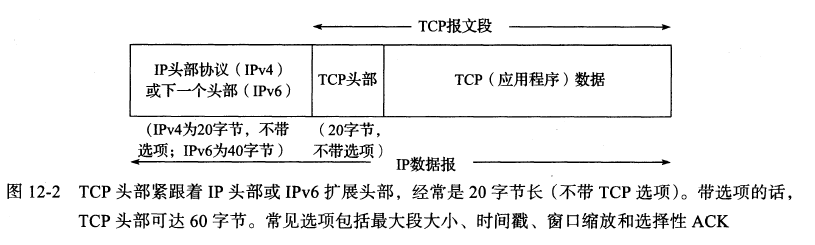
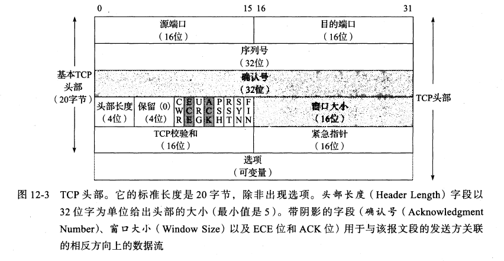
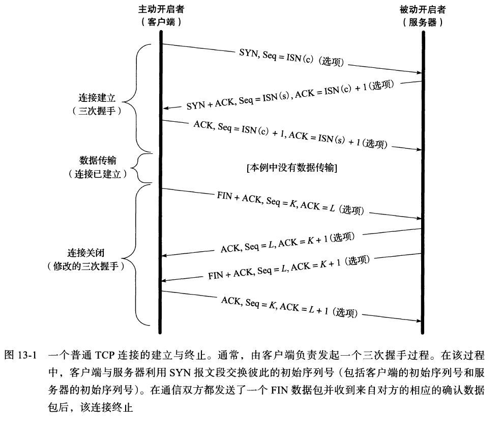
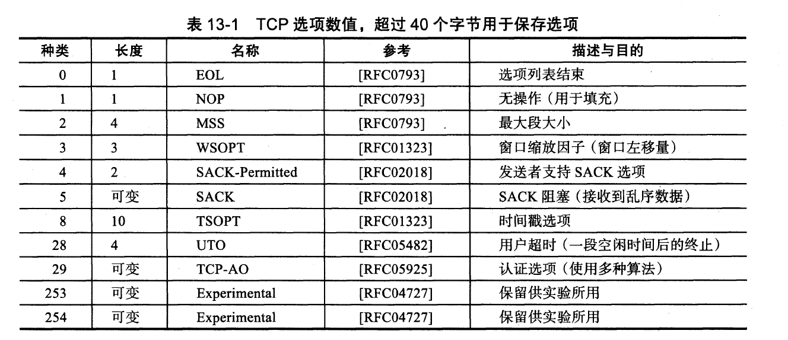
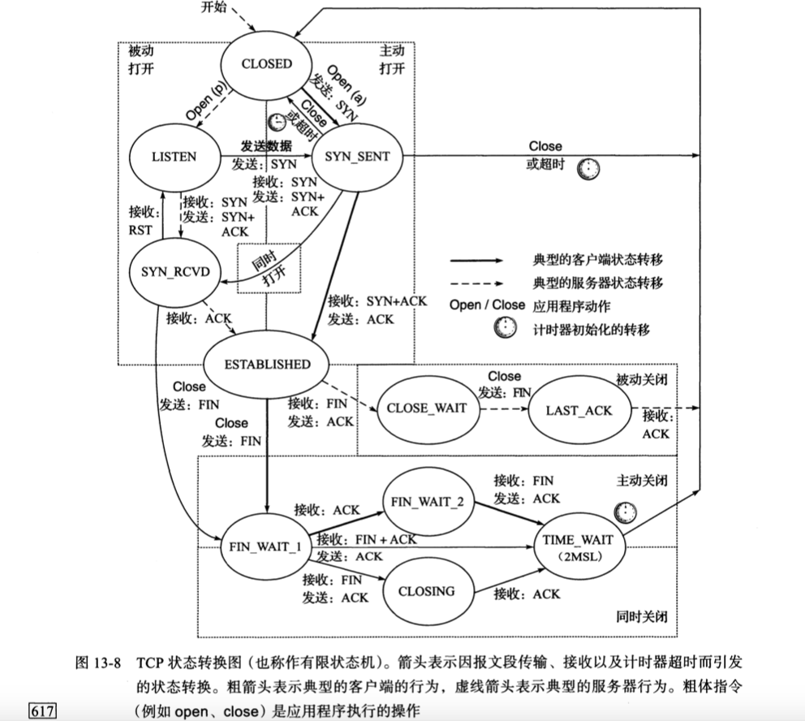
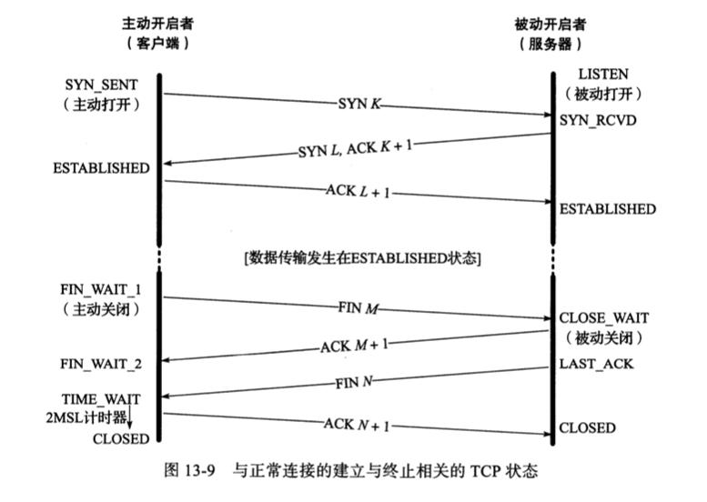

<!--more-->

## 12章 TCP初步

- tcp有差错纠正。ip udp只有差错检测(CRC)，出错了就重发。
- 差错纠正一般是用差错纠正码，此外还有别的方法即ARQ协议（Automatic Repeat Request 自动重复请求）

### 12.1 入门介绍

#### 12.1.1 ARQ和重传

考虑多跳通信信道，有这些差错种类：

- 分组丢失
- 比特差错
- 分组重新排序
- 分组复制

最直接处理分组丢失、比特差错(无法自动纠正的那种)的方法：**重发分组直到正确接收**。

前提是**发送方**需要能够判断：

- 接收方是否已收到分组
- 接收方收到的分组是否与之前发送方发送的一样

接收方因此需要给发送方一个信号来表明已接收到一个分组，这个方法就是**ACK**。但有几个问题：

- 发送方等待ACK应多长时间才重传（简单办法，设为RTT均值。具体看第14章）
- ACK丢失怎么办（简单办法，等待超时后重传）
- 分组已接收，但有差错怎么办（丢弃分组即可）

对于分组复制、分组乱序问题，解决方法则很简单：每个分组加序列号。

目前为止，上面这套**简单ACK**机制，就可以实现**可靠通信**了，然而效率不高。

主要问题是停等问题：每次发送一个分组后都会停止继续发分组并且等待这个分组的ACK，网络的使用率很低。吞吐量约等于 M（分组大小）/R（RTT），若有丢包，只会更低。

解决停等问题关键是，**允许往网络注入更多的分组**。但这又会引起大量的问题：

- 发送方要决定什么时间注入、注入多少个
- 多分组时的定时器的维护变复杂
- 要维持多个未ACK的分组副本以防重传
- ACK机制变复杂：ACK要支持区分，区分哪些分组已收到哪些没有
- 接收方要维护复杂的缓存机制，因为分组会乱序到达或者部分丢失
- 发送速率大于接收速率的问题
- 中间路由器也有速率问题，一般远低于两端的速率

下面的机制就是为了解决这些问题存在的。

#### 12.1.2 分组窗口和窗口滑动

滑动窗口协议：

- 窗口要分发送方和接收方（发送窗口和接收窗口），如果算上全双工通讯，那么有4个窗口
- 窗口：窗口里分组数量的大小限制了网络利用率（吞吐量）
- 窗口滑动：收到ACK时，窗口可能会向右滑动

#### 12.1.3 流量控制和拥塞控制

流量控制：

- 在接收方跟不上时会强迫发送方慢一来
- 分类：
    - 基于速率的流控：给发送方指定某个速率，确保数据永远不能超过这个速率发送
    - 基于窗口的流控：窗口大小不再固定，为了让接收方可以通知发送方应使用多大的窗口，出现了**窗口更新**概念。窗口更新信息是包含在ACK分组里的，因此ACK使得窗口优化、同时窗口更新使得窗口变大变小。

拥塞控制：

- 原因：中间网络是低速网络时，发送方速率可能超过某个路由器的能力，导致丢包
- 分类：
    - 显式发信：即上面说的窗口更新协议，由接收方显式地告诉发送方正在发生什么
    - 隐式发信：发送方根据其他证据减慢发送速率

### 12.2 TCP的引入

#### 12.2.1 TCP服务模型

- tcp是字节流模型
- 没有消息边界
- tcp不需要知道传输的字节流里面是什么东西

#### 12.2.2 TCP中的可靠性

这一节正式谈及TCP的可靠性，12.1讲的只是一个概念，和真实的TCP区别很大。

组包(packetization)：

- 把字节流转换成一组IP可以携带的TCP分组
- TCP分组包含序列号，表示的是第一个字节相对于整个字节流的字节偏移
- 序列号的机制使得分组在传送中是可变大小的
- TCP分组可以重新组合，称为**重新组包（repacketization)**
- 应用程序数据被打散成TCP认为的最佳大小的块来发送

报文段：由TCP传给IP的块称为报文段

可靠性保障关键点：

- 校验和：校验和覆盖范围是TCP、IP头部+承载数据，但TCP校验和可能会不够强壮，所以最好要有自己的差错保护机制
- 重传定时器：并不是每个报文段就对应一个定时器
- ACK：可能会延迟发送；如果是双向通讯，那么ACK可能会由数据分组捎带；ACK是累积的，收到N号ACK就表示<N的字节都成功接收了（而N是未接收！），累积性增强了ACK的robustness；

### 12.3 TCP头部和封装

tcp头部：

头部结构：

- 2字节：源端口
- 2字节：目的端口
- 4字节：序列号seq
- 4字节：ACK
- 4位：头部长度
- 4位：保留
- 8位：flags
- 2字节：窗口大小
- 2字节：校验和
- 2字节：紧急指针
- 0~40字节：选项

关键词：

- 头部长度范围：至少20字节，带选项的话最多60字节
- 四元组：客户端主机IP+socket端口号、服务端主机IP+socket端口号
- Seq：序列号，32位无符号整数，到达2^32-1后回到0
- ACK：确认号，确认号表示的是该确认号的发送方期待接收的下一个序列号
- SACK：Seletive地ACK，要比普通ACK高效，因为可以对次序杂乱的报文先ACK。前提是发送方有**选择重发**能力
- 头部长度自表示：虽然只有4位，但是单位是word（32bits），所以可表示(2^4 - 1)* 4bytes = 60字节的头部长度。
- 窗口大小：占2字节，单位是字节，所以最大窗口大小字节数为2^16 - 1 = 65535字节
- ISN：发送SYN的报文段里的Seq就是ISN，随机选定，第一个数据字节的Seq是ISN+1。因为SYN消耗一个序列号，所以SYN是可靠传输的（FIN也是），而ACK不是
- ISN是双向的：双方都要随机一个ISN

要记住的：

- ACK只有在flags的ACK位置1时才有效，握手和断开报文段之外的报文段都是置1的（待考证）
- 默认窗口大小最大才65KB，需要用窗口缩放选项来放大，才能满足高速和大延迟网络
- 通信速率SW/R (bits/s)：S是分组比特总大小，W是窗口大小（分组数量），R是RTT
- **不带数据的包可能没有可靠性保证，如Window Update ACK包**

重要性能问题：重传超时时间

- 往返时间估计（RTT estimation）：采样最近的多个RTT并取平均
- 超时并不能等于RTT均值，因为可能有很多RTT是超过均值的，从而导致不断超时重传
- 超时应略大于RTT均值，但也不能过大，否则网络会变得空闲

## 13章 TCP连接管理

### 13.2 TCP连接的建立与终止

建立连接：

- C发送ISN(c)（主动打开）
- S收到ISN(c)，发送ACK=ISN(c)+1 、 ISN(s) （被动打开）
- C收到ACK和ISN(s)

断开连接：

- 一方发送FIN（主动关闭者），要发送当前序列号K，且带有一个ACK（序列号L，代表最近一次收到的数据）
- 另一方收到FIN后，发送ACK=k+1作为响应（被动关闭者），同时通知上层应用程序
- 另一方应用程序发FIN（转变为主动关闭者），序列号为L
- 一方收到FIN，发给另一方ACK确认

两次半关闭：两边都要发FIN，才能变成完全关闭

半关闭：close、shutdown双方都可以调用，close是全关闭，shutdown能实现半关闭

建立连接为什么要三次握手：

这个问题最好用逆向思维来思考。假设只做一次握手，那么就是C发SYN给S后，就开始发数据了，根本不管S是否收到SYN甚至不管S是否存在，这肯定是不行的，都没确定对方是否存在就发数据，既不能保证数据送到对方，也浪费了带宽；接着假设只做二次握手，那么就是C发SYN给S，S发ACK给C，S马上就开始发送数据，这就有个问题，S发出的针对C的SYN的ACK，可能会丢失，导致客户端没收到SYN的ACK，就开始接收数据，因为缺少ISN(s)，所以C不能知道究竟有没丢数据（并不能根据第一个收到的数据报文段来判断）。

断开连接为什么要四次握手：

因为tcp是全双工通信，断开通信等于要关闭2个方向的数据流，即要做2次半关闭（2个FIN），一次半关闭就是2次握手。半关闭可能是自然发生的，例如客户端发了FIN，服务端收到FIN时，可能还有一些数据在tcp发送缓冲区，于是只能发送ACK而不能发FIN，就进入了半关闭状态；半关闭也可能是用户用shutdown强制要求的，例如服务端收到FIN后，还是可以继续往发送缓冲区继续填入数据，无法知道服务端什么时候会停止发送数据。综上，半关闭的情况不可避免。不过有可能第二个FIN和第一个FIN的ACK是一起发送的（前提是本地的缓存队列的数据都发送出去了不然不能发FIN），就变成了三次握手（本质上还是四次握手）。

#### 13.2.3 初姑序列号ISN

- 32位
- 4微秒+1
- 伪造包问题：只要四元组一样，就能伪造发包。ISN需要设计成难以被猜出，方法是：随机、散列、加密。

#### 13.2.5 连接建立超时：

- syn重发次数：cat /proc/sys/net/ipv4/tcp_syn_retries（或sysctl net.ipv4.tcp_syn_retries），一般等于6
- synack重发次数：cat /proc/sys/net/ipv4/tcp_synack_retries，一般等于2
- 指数回退：syn每次重发的间隔是上一次的一倍

#### 13.2.6 连接与转换器

NAT通过探查TCP的头部来跟踪连接的建立情况，主要就是通过flags的SYN ACK FIN位。NAT还可以修改报文段，但是有更复杂的问题。

### 13.3 TCP选项

MSS：

- 最大段大小，记录数据（不包括头部）长度，占2个字节。最小保证536字节（默认值），一般是1460字节
- 最大段大小不是协商值，而是限定值，
- MTU：最大传输单元。路径MTU为1500字节。ipv4：1460+40字节，ipv6：1440+60字节。
- 65535的MSS是特殊值，ipv6网络中超长数据报会用到。但实际MSS仍受路径MTU限制，所以MSS值为MTU-(40 IPv6头+20 tcp头）

（上面三个是最基本的）

SACK和SACK-Permitted：

- 发SYN/SYNACK时就得发SACK-Permitted选项告诉对方支持SACK（双向）
- 当接收到乱序的数据时，可向发送方发送SACK选项
- SACK选项长度为8n+2，2个字节一个表示选项种类一个表示n，n等于SACK块数量
- SACK块：已经成功接收的序列号范围（序列号32位，需要start和end，所以总共要8个字节）
- 最大n为3，SACK最多占8*3 + 2 = 26字节（因为一般还有个时间戳）

WSOPT窗口缩放因子：

- 字节：16bits
- 范围： 0-14，0表示没有缩放。
- 最大窗口大小：65535 x 2\^14 ，约1GB。
- tcp终端内部会维护这个真实的窗口大小
- 主动打开者发WSCALE，被动打开者接收到WSCALE才能在SYNACK中发WSCALE
- 如果主动打开者没接收到被动打开者的WSCALE，就设为0
- 自己的为S，发窗口大小给对方时，右移S位后将16数值填充到头部
- 对方的为R，收到对方的窗口大小时，左移R位才是真实大小
- 缩放大小是根据接收缓存的大小自动选取的

TSOPT时间戳选项：

- 作用1：估算RTT
- 作用2：用来防止序列号回绕导致的旧包无法去除问题
- TSV：发送报文时放自己的当前时间戳 （Timestamp Value)
- TSER：发ACK的时候把最新的TSV（TsRecent）复制进去（Timesatamp Echo Reply）
- TsRecent并不是来自最新到达的报文段，而是来自最早的一个未经确认的报文段
- RTT = current time - TSER

### 13.4 路径MTU发现

- 主要方案是：发大包，收到PTB（packet too big）消息后，调整自己MSS
- 黑洞问题：防火墙导致无法收到PTB消息，无法知道是网络不通还是包太大
- 黑洞探测：报文重传失败多次后，尝试改成较小报文段（分片）
- 路由是动态变化的，所以每10分钟要尝试一个更大的MSS（接近初始的发送方MSS）
- MSS大小影响吞吐量和窗口大小

### 13.5 TCP状态转换

TIME_WAIT：

- MSL：最大段生存期，代表任何报文段在被丢弃前在网络中被允许存在的最长时间
- TIME_WAIT一般要持续2个MSL（60秒）(加倍等待)
- 静默时间：如果TIME_WAIT主机崩溃重启，需要等待2MSL后才能建立新连接（但一般操作系统不会这样做）
- net.ipv4.tcp_fin_timeout：记录了2MSL需要等待的超时时间（秒）（执行sysctl net.ipv4.tcp_fin_timeout输出了60）
- 对于服务器而言，如果当前有连接、且主动关闭了服务器，那么正常是不能重新建立一个对同端口的监听socket的，一样要等2MSL，

TIME_WAIT作用：

- 为了可以重传最终的ACK，或者叫**可靠地实现TCP全双工连接的终止**。本质上是因为对端会重传FIN如果收不到ACK的话。重传成功，服务器收到ACK，就可以从LAST_ACK进入CLOSED。但客户端即使重传成功也不能结束TIME_WAIT（或者说客户端无法确定ACK是否重传成功）。假如不能够发ACK，那么收到FIN时只能是发RST，这样会导致服务器生成一个错误。
- 让老的重复报文可以在网络中消失，即是说处于2MSL时，收到的数据报文都是要丢弃的。这也是为了防止新连接错误接收旧报文引发数据异常。有的实现允许设一个大于所有旧的Seq的ISN，忽略2MSL状态直接创建新连接，但有的实现是不允许，必须等到2MSL结束。

TIME_WAIT状态其实不做什么事情，就是限制1分钟内这条连接的其中一端不能发起对另一端的新连接，这也是为什么只有一端进入TIME_WAIT而另一端可以直接CLOSED的原因，对端相信TIME_WAIT一端不会立即重新连接，

FIN_WAIT_2无限等待问题：

- 主动关闭方发送fin并收到finack就进入了FIN_WAIT_2
- 处于FIN_WAIT_2时需要等另一方发送fin（永久等待）
- close系统调用会自动启动定时器，60秒(net.ipv4.tcp_fin_timeout)后强制进入CLOSED状态
- 用shutdown的半关闭不会启动定时器
- FIN_WAIT_1不会无限等待，因为不断重发FIN直到收到ACK进入FIN_WAIT_2

同时打开同时关闭：

- 是可以正确处理的，并且只会建立一条连接

### 13.6 RST重置报文段

当发现一个到达的报文段对于相关连接而言是不正确的时, TCP就会发送一个重置报文段。

重置报文段通常会导致TCP连接的快速拆卸。

发送时机：

- 客户端连接请求没有对应的监听socket时
- 主动发RST强制终止连接时。发RST同时排队报文会被丢弃。也被称为**终止释放**。发FIN是**有序释放**。
- 一端崩溃重启，收到正常工作（半开连接）的另一端的报文时
- TIME_WAIT错误时，TIME_WAIT端收到迷途的报文并发送ACK但被CLOSED的对端RST

 TIME_WAIT错误：是一种需要避免的错误，TIME_WAIT状态需要忽略RST，否则就会过早地进入CLOSED

强制终止方法：SO_LINGER设0（socket逗留选项），含义是，不会为了确定数据是否到达另一端而逗留任何时间。

接收到的RST，必然要带ACK，且序列号要在对端窗口范围内，否则可能会遭到伪造RST攻击。

发送RST，不需要一个RSTACK。对端收到RST就自然重置连接了（可能对端会丢失RST）。

UDP没有RST，但是有ICMP目的地不可达消息

## 14章 TCP超时和重传

tcp_retries1：连接已经建立后，基本重传次数。次数达到后，会先尝试让网络层更新路由再继续发包。一般为3次.

tcp_retries2：连接已经建立后，最大重传次数。次数达到后，会断开连接。

重传超时<RTT：对网络引入不必要的重复数据

重传超时>RTT：网络利用率(吞吐量)下降

RTT是每个tcp连接独立计算的。

### RTO估算方法：

经典方法：

SRTT = a(SRTT) + (1-a)RTT，a一般为0.8~0.9，称为指数加权移动平均/低通过滤器（EWMA）

RTO = min(ubound, max(lbound, (SRTT)b))，b为时延离散因子，推荐值1.3 ～ 2.0

ubound：1分钟，lbound：1秒。

适用于稳定RTT的网络。

标准方法：

srtt = (1-g)srtt + (g)M
rttvar = (1-h)rttvar + (h)(|M - srtt|)
RTO = srtt + 4(rttvar)

M就是经典方法里的RTT；srtt和SRTT等价；|M - srtt|为平均偏差，所以rttvar为平均偏差的EWMA。

g：新样本M占srtt估计值的权重，1/8

h：新平均偏差样本|M-srtt|占rttvar的权重，1/4

最终，RTO为srtt加上4倍rttvar，4是一个研究出来的常量值。

当M变化时，|M-srtt|越大，rttvar也越大，RTO增长越快

时钟粒度：

Linux计时器时钟粒度为1ms，设为G。

RTO = srtt + max(G，4(rttvar))

Linux RTO默认RTO最小值200ms

收到第一个RTT测量值时再次初始化：

srtt = M

rttvar = M/2

RTO = srtt + 4(rttvar) = 3M 

重传二义性：

发生重传时，若收到ACK，并不能知道是对第一次还是第二次发包的确认，所以无法计算RTT，需要跳过。(Karn算法第一部分)

若用了时间戳选项则可以处理二义性，因为ACK包附带了发包的时间戳，就可以知道ACK是对第一次还是第二次发包的确认。

退避系数(backoff factor)：每当重传计时器出现超时，退避系数加倍，**直到接收到非重传数据时重设为1**。

### 基于定时器的重传：

需要记录被计时的报文段序列号，若及时收到该报文段的ACK，那么计时器被取消。

没丢包的话计时器不会超时。

若在设定的RTO内，没收到ACK，就会触发超时重传。

此时需要降低发送速率：

- 减小发送窗口大小
- 重传大于1次时，增大RTO退避因子，RTO = γRTO，γ = 1 2 4 8 ··· 。但RTO不会TCP_RTO_MAX
- 一旦收到ACK，γ重置为1

基于定时器的重传不是好东西，会导致网络利用率下降。

### 快速重传

基于对端的反馈信息来引发重传。（和基于计时器的重传的本质区别）

更加及时。

tcp一般都实现了基于计时器的重传和快速重传。

重点：接收端收到失序报文段时，需要**立即**生成**重复ACK**并**立即发送**，失序情况表明出现了丢段（接收缓存出现空洞）。

重复ACK：这个ACK可以表明是哪一个分组没有收到。但因为是用了tcp的seq段，所以一个RTT内只能填补一个空缺。

立即发送重复ACK是为了让发送端尽早得知有失序报文段，并告知空缺在哪。

当接收端收到**当前期望序列号的后续分组**时，当前期望的包可能丢失了，也可能是延迟到达，2者无法区分。

因此需要等待一定数目的重复ACK（重复ACK阈值 dupthresh，一般为3，也有动态的），才能判断数据是否丢失并快速重传。

总之，发送端收到至少3个重复ACK后，马上重传**可能丢失的分组**，而不必等计时器超时。

### 带选择确认的重传SACK

http://packetlife.net/blog/2010/jun/17/tcp-selective-acknowledgments-sack/

SACK是指已接收的失序报文段，并不是指丢失的报文段。

SACK会重复发，例如收到连续的2个报文段3和4，返回2个ACK，ACK都为1（duplicate ACK），但第一个包带了SACK=3，第二个包带了SACK=3、4。发送端收到这2个ACK时，就会知道报文段2丢失，那么重传2。

一个tcp头的SACK最多3块。

收到SACK并重传了包，也不能清空重传缓存的该包（食言问题）。只有接收端发来的普通tcp ACK号大于发送端最大序列号值才可清除。

RTT较大，丢包严重时，SACK的优势就能体现出来。因为一个RTT可以填补多个空缺很重要。

### 伪超时与重传

GBN：连续发了n个报文段，如果网络突然缓慢，最前面的那个超时了，会触发重传，此时后面的n-1个包也没被确认，那么n个报文段都重传（回退）。

伪重传：没有丢包也发生了重传，叫伪重传。原因：网络延迟、包失序、包重复、ACK丢失。

RTT增加，超过当前RTO时，就有可能出现伪超时（重传）。

重要任务：检测出伪重传，几种方法：D-SACK、F-RTO、Eifel检测

D-SACK：重复SACK，一个操作系统的选项。

开启后，可在第一个SACK块中告知接收端收到的重复报文段序列号。

允许tcp一端开启D-SACK而另一端没有D-SACK，不需要对称，没有开启D-SACK的一端不能使用D-SACK。

原理是，SACK接收端允许了包含seq<=累计ACK的SACK块。

和通常的SACK的区别：DSACK只包含在单个ACK中，并且不会在多个SACK中重复。鲁棒性比SACK低。

Eifel检测算法：发生超时重传时，Eifel算法等待接收下一个ACK，若为针对第一次传输（即原始传输）的ACK（用时间戳判断），则可以知道该重传是伪重传（利用TSOPT来检测伪重传）。

Forward RTO-recovery（路由转发延迟导致的RTO的恢复机制，简称F-RTO）：

- 检测伪重传的标准算法
- 不需要任何tcp选项
- 是发送端自己的算法
- 接收端不支持时间戳选项，也能工作
- 只检测由重传计时器超时引发的伪重传，别的无法判断
- **F-RTO会修改TCP的行为**。其实就是GBN的问题。在超时重传后收到第一个ACK时，改成发送新数据。等到下一个ACK到达时，如果2个ACK中至少有一个是**重复ACK**，则认为此次重传没问题（确实发生了丢包，重复ACK指出了丢失的报文段）。如果2个都不是重复ACK，那么就是伪重传。

用上面的任意检测算法检测到伪重传后，要应用Eifel响应算法：

说白了就是更新srtt和rttvar。因为伪超时导致临时修改了srtt和rttvar（RTO变了），检测发现伪超时，那就得恢复到正常的srtt、rttvar。

1. 计时器超时时，记录srtt_prev = srtt+2(G)、rttvar_prev = rttvar。但直到发现有伪超时前，都不会使用它们。
2. 执行某种伪超时检测。
3. 检测到伪超时，设置**伪恢复**为SPUR_TO（spurious timeout)
4. 若伪恢复为SPUR_TO，把下一个要发送的报文段的序列号改为最新的未发送过的报文段。就可以避免GBN。
5. 更新srtt、rttvar、RTO：srtt = max(srtt_prev，m)，rttvar = max(rttvar_prev, m/2)，RTO = srtt + max(G, 4(rttvar))。为了抛弃RTT历史值。另外，RTO更新方式不变。

### 包失序与包重复

包的问题有三种：丢失、失序、重复。tcp需要区分。

失序：

- 如果发生在反向链路（ACK），发送端收到的ACK是乱序，那么可能先收到后面的ACK，导致发送窗口快速前移（并且后面收到的ACK被丢弃）。快速前移会导致**流量突发**。
- 发生在正向链路，tcp可能无法正确识别失序or丢包。失序程度不大时，可以迅速得到处理；反之，tcp可能会误认为数据丢失，也就导致伪重传（主要是指快速重传）。

区分丢失和失序不是重要问题；互联网中严重的失序并不常见，dupthresh设3就足够了。

重复：

链路层重传时会生成重复副本。会导致接收端生成一系列重复的ACK，触发伪快速重传。

但DSACK能处理这种情况，因为重复ACK没有包含失序信息，意味着ACK是重复数据。

### 目的度量

即操作系统在tcp断开连接后依然缓存了该条路径的rtt之类的信息。方便下次和该地址建立连接时，初始化srtt rttvar。

### 重新组包

当发生重传，并不需要完全重传相同的报文段，而可以重新组包，发送一个更大的报文段来提高性能。

### 重传相关的攻击

低速率DoS攻击：

每次受害tcp重传时，就发一堆数据给它并导致重传超时，进而导致对方减小发送速率、退避发送，最终导致无法正常使用网络带宽。

预防方法是，随机随选RTO，使得攻击者无法预知确切的重传时间。

减慢受害tcp的发送并使RTT估计值过大（过分被动）：

导致丢包后不会立即重传。

伪造ACK使受害tcp的RTT估计值过小（过分积极）：

导致过分发送，造成大量的无效传输。

## 15章 TCP数据流和窗口管理

### Nagle算法：

算法要求：

1. 当一个tcp连接中有在传数据（已发送但未确认），小的报文段（长度小于SMSS）就不能被发送，直到所有的在传数据都收到ACK。
2. 并且，在收到ACK后，tcp需要收集这些小数据，将其整合到一个报文段中发送。

特点：

- 迫使tcp遵循停等规程（stop-and-wait）。发一个包就得等到收到ACK后再发下一个包，发包间隔等于RTT。
- 因此每一时刻最多只有一个包在传
- 因此减少了小包数，同时也增大了延迟。
- 实现了自时钟控制（self-clocking）。ACK返回越快，数据传输也越快。

在高延迟网络中，需要减少🛰报文数。算法使得单位时间内发送的报文段数目更少。

### 延时ACK和Nagle算法结合：

简单来说就是会死锁：

- 服务端（Nagle）发一个包后开始等待ACK
- 客户端（延时ACK）收包后不马上发送ACK而是等待一段时间再发

因为客户端最终会发出ACK，所以死锁可解。但等待过程中，连接处于空闲状态（明明有事忙），性能变差。

禁用Nagle：

- 对socket设置TCP_NODELAY
- 整个系统设置nodelay

### 流量控制和窗口管理

发送窗口：

- 字节为单位
- SND.UNA，发送窗口左边界
- SND.WND，发送窗口大小
- SND.UNA + SND.WND，发送窗口右边界
- SND.NXT，下个要发送的数据序列号
- SND.UNA + SND.WND - SND.NXT，可用发送窗口

窗口运动术语：

- close：左边界右移（窗口缩小）。发生在已发送数据得到ACK确认。
- open：右边界右移（窗口变大）。可发送数据量变大。同样发生在已发送数据得到ACK确认。
- shrink：收缩，右边界左移。

Note：左边界不可能左移。

接收窗口：类似发送窗口。但窗口中间因为SACK选项，可能会有被ACK的序列号（未确认的就是空洞）。但必须RCV.NXT接收了，窗口才能右移。

零窗口导致的问题：

左右边界相等时，叫零窗口。此时发送端不能发数据。

接收端重新获得可用空间时，会给发送端发送一个窗口更新（window update），当然还是用通告窗口。但这个发包不带数据（因为这是接收端，若发了数据就变成全双工的发送端了），所以是一个典型的ACK消息。这个ACK是可能丢失的。

如果丢失了，就会进入死锁状态。发送端不知道接收端已经可以接收数据。

所以发送端会定时探测probe对方窗口，用来伺机增大发送窗口，接收端收到时必须返回ACK（包含了窗口大小字段）。

探测时机为一个RTO超时后，然后指数间隔发送。

probe是带有一个字节的数据的（用户的数据），所以tcp会可靠传输它。不过如果接收端依然没有可用缓存空间，就会丢掉这个包。

#### 糊涂窗口综合征(silly window syndrome，SWS)：

百度百科解释：

> 糊涂窗口综合症是指当发送端应用进程产生数据很慢、或接收端应用进程处理接收缓冲区数据很慢，或二者兼而有之；就会使应用进程间传送的报文段很小，特别是有效载荷很小； 极端情况下，有效载荷可能只有1个字节；传输开销有40字节(20字节的IP头+20字节的TCP头) 这种现象。

- 接收端通告窗口较小
- 发送端发送的数据段较小

解决方案：

- 接收端：不应通告小的窗口值
- 发送端：不应发送小的报文段

发送端需满足以下条件才能发送：

- 全长（MSS）的报文段
- 数据段长度>=接收端通告过的**最大窗口值**的一半。（要记录一个最大值，发送端才可猜测接收缓存大小）
- ACK不是目前期望的（或者说没有未经确认的数据，那么发送端立即发送新数据是合理的） 或 禁用了Nagle算法 

第三点反过来说就是：如果启用了Nagle或者有未确认的在传数据，那么不应该发送小包

#### 大容量缓存与自动调优

- 在相似环境下，使用较小接收缓存的tcp吞吐量会较差
- 即使接收端指定了大容量缓存，但发送端指定了小缓存，性能还是差

这2个问题很关键，并且因为第二个问题，很多tcp协议栈中应用层是不能指定缓存大小的。操作系统会自己定一个定值或弄成动态值。

窗口大小的自动调优：只能按类型选，没有具体值，disabled、 highlyrestricted、 reStricted、 normal、experimental。

缓存大小的动态调整：通过估算发送方的拥塞窗口的大小，来动态设置TCP接收缓存的大小。

### 紧急机制

虽然tcp的紧急机制调用用了一个叫MSG_OOB的flag，但是其实并不是带外数据，这个紧急数据一样是在用户的数据流中传输，只是优先级更高。

发送的紧急数据只能是一个字节，并放进当前缓冲区末尾。因为用了tcp的可靠传输，所以只需要插入一次。

因为窗口大小原因，可能不能立即发出这个字节，但是tcp会知道已经进入紧急状态，所有发出去的包都打开了URG标志。

对接收端来说，收到URG的包头，不等于该报文段里就有紧急数据（还在收到）。要用紧急指针来判断。在收到紧急数据前可能有多个包头，包头里的紧急指针都一样。

为了让用户及时recv拿到紧急数据，需要用信号SIGURG的方式通知。SIGURG在第一次收到URG包头时触发一次。

带外数据缓冲区：到达的紧急数据不能混在用户数据缓冲区，所以另外用这个来存，等用户来读取。

send(sockfd, 'x', 1, MSG_OOB);

recv(sockfd, &ch, 1, MSG_OOB);

recv：在紧急状态下，带外数据仍未到达，函数返回EWOULDFBLOCK；非紧急状态下，调用上述函数，返回EINVAL。

## TCP拥塞控制

回顾：流量控制机制是基于通告窗口大小字段来实现，明确地告诉了发送端，接收端的缓存大小，避免了接收端缓存溢出。发送端降低了发送速率。

对路由器而言：超负荷时，降低发送速率或丢弃部分数据。原因是，即使路由器能缓存一部分数据，然后慢慢发出去，但源源不断的数据到达，到达速率高于发出速率，任何容量都得溢出。（排队理论！）

拥塞：路由器无法处理高速率到达的流量而被迫丢弃数据信息的现象

拥塞控制机制：是为了缓解拥塞情况，tcp连接两端都要进行

### tcp拥塞检测：

回顾：对于丢包，tcp采取首要机制是重传：超时重传和快速重传。

但当网络拥塞时，重传会导致火上浇油。所以要避免这个情况。

当拥塞情况出现时的处理措施：

- 减缓发送速率
- 拥塞情况好转时，检测和使用新的可用带宽

然而很难做到：因为对于tcp发送方而言，没有一个准确的方法去知晓路由器的状态。

只能用一些信息来推断：

- 出现丢包
- 时延测量
- 显式拥塞通知（ECN）

检测出拥塞后，就是对拥塞的处理。其实就是when减速和how减速、how恢复速率。

### 减缓TcP发送

拥塞窗口：反映网络传输能力的变量，cwnd

接收端通知窗口：awnd

发送端实际可用窗口：W = min(cwnd, awnd)

在外数据大小（flight size）：发送端发送的数据中，未收到ACK的数据不能多于W（字节）。

cwnd无法拿到准确值：缺乏显示拥塞的信号

W、cwnd、awnd需要根据经验设定并动态调节。

所以，W的值不能过大或过小，应接近BDP（bandwidth-delay prodcut），带宽延迟积，也称作最佳窗口大小（optimal window size）。

W反映网络中可存储的待发送数据量大小。

实际计算方法：W = RTT * 链路中最小通行速率

W越接近BDP，网络资源利用得越高效。

确定BDP是难点。

### 经典方法

同时只运行一个，可以互相切换。

基于包守恒。

1. 建立tcp时执行慢启动
2. 直至有丢包时，执行拥塞避免算法

#### 慢启动

原因：由于未知网络传输能力，需要缓慢探测可用传输资源，防止短时间内大量数据注入导致拥塞。

作用：

1. 使TCP在用拥塞避免探寻更多可用带宽之前得到cwnd值
2. 帮助tcp建立ack时钟

时机：

- 新连接
- 检测到RTO导致的丢包时
- 长时间处于空闲状态

原理：

SMSS: 发送方的最大段大小 = min（接收方MSS，路径MTU）

IW：初始窗口，一开始发送的数据段大小（SYN交换后）

- IW = 2 * SMSS，if SMSS > 2190
- IW = 3 * SMSS，if 2190 >= SMS > 1095
- IW = 4 * SMSS，else

初始cwnd = IW = 1 * SMSS（简单起见，设1）

每次收到ACK，cwnd会慢慢增加：cwnd += min(N, SMSS)

N：未ACK的数据，通过这一”好的ACK“能确认的数据大小

好的ACK：新收到ACK大于之前收到的ACK

这样设计是因为：如果每次收到ACK都直接+=SMSS，可能会遭到“ACK分裂”攻击，通过发送小ACK导致发送方加速发送。

如果N大于SMSS，说明正在发送大量数据，那么就只+=SMSS，cwnd = 2 * SMSS.

此时就可以发送2个数据段，如果继续接收ACK成功（2个ACK），则2变4、4变8，指数增加。

k：k轮后，W = 2^k，k = log2(W)，需要k个RTT时间，窗口才能达到W。

指数增长看似快，但还是比一开始就以最大速率（接收方最大窗口）慢（W不会超过awnd）。

另外，如果接收端开启了ACK时延，接收端就不会发2个ACK，而是合并1个，那么增速变得更慢。

非交互式tcp流：其实就是指单方发送大数据的情况，不是短消息的一问一答（http）。

对于非交互式tcp流来说，delayed ACK是不好的，此时接收端是不会发数据的，所以没可能在数据包里带上ACK。此时可以使用Quick ACK机制。

通过QuickACK，接收端recv后可以立即发送ACK，没有delay。

但tcp本身很难知道是不是非交互式的流。可以这样做：

- 新tcp连接开启quick ACK，直到检测到该tcp有交互式特征时关闭。（Linux默认如此）
- 新tcp连接关闭quick ACK，当连接不是交互式时，开启。

http://www.jauu.net/2010/10/02/tcp-quick-ack-versus-packet-overhead/

#### 拥塞避免

当指数增长到一定程度，就会开始丢包。

此时设置一个慢启动阈值（ssthresh），公式下面说；当前拥塞窗口大小（cwnd）减到一半（不一定，只是经典做法）。

只留一半是避免占满全部带宽，导致路由器其他连接丢包。

拥塞避免：

当确立了慢启动阈值，tcp就进入拥塞避免阶段。cwnd不再翻倍，而是线性增大。这就可以得到更多的传输资源而不至于影响其他连接。

\\( cwnd\_\{t+1\} = cwnd_t  + SMSS * SMSS/cwnd_t \\)

其实就是每次收到ACK就增加（1/k）倍 (次线性)

#### 慢启动和拥塞避免的选择

慢启动和拥塞避免之间的区别：当新的ACK到达时，cwnd怎样增长。

- 当cwnd < ssthresh：慢启动
- 当cwnd > ssthresh：拥塞避免

ssthresh在整个连接中不是保持不变的。没有丢包时，记住上一次最好的窗口估计值。有丢包时，按下面公式更新：

ssthresh=max (cwnd/2, 2*SMSS)

#### Tahoe、 Reno以及快速恢复算法

Tahoe：有丢包时，cwnd直接变1，重新慢启动。会导致带宽利用率低下。

解决办法：

- 超时丢包：cwnd = 1
- 重复ACK引起的丢包：cwnd = 上一个ssthresh（快速重传就会有这种丢包）

Reno快速恢复：

因为丢包进入的慢启动阶段，可以快速恢复，方法是每接收到一个ACK（重复ACK），cwnd就增长1 SMSS（急速），直到接收到一个”好的ACK“。

### 标准TCP

可以小结出一套标准算法：

在TCP连接建立之初首先是慢启动阶段(cwnd = IW), ssthresh通常取一较大值(至少为awnd)。当接收到一个好的ACK (表明新的数据传输成功),
cwnd会相应更新。

- cwnd += SMSS (若cwnd<ssthresh)慢启动
- cwnd += SMSS*SMSS/cwnd (若cwnd>ssthresh)拥塞避免

当收到三次重复ACK (或其他表明需要快速重传的信号)肘，会执行以下行为：

1. ssthresh更新为大于等式 ssthresh = max(在外数据值/2, 2*SMSS) 中的值
2. 启用快速重传算法，将cwnd设为(ssthresh + 3*SMSS)
3. 每接收一个重复ACK, CWnd值暂时增加1 SMSS
4. 当接收到一个好的ACK，将cwnd重设为ssthresh（收缩）

以上第2步和第3步构成了快速恢复。

### 对标准算法的改进

NewReno：

因为Reno需要收到重复ACK才能快速恢复，但如果先收到了好的ACK（局部ACK）（但还有别的包已发送未确认），导致了窗口膨胀过早结束，此时传输通道就会很空闲。且如果重复ACK不足三个（网络中没有足够的数据表在传输就会这样)，不会进入快速重传，而确实又有丢包，那么最终就是RTO超时，进行超时重传，并慢启动。

Reno记录了一个最高序列号来解决。效果就是避免过早结束膨胀。

（其他改进之后再学习）

### 共享拥塞状态信息

其实就是操作系统的本地优化。新连接可以利用旧连接的信息，来优化。

net.ipv4.tcp_no_metrics_save = 0，默认开启

每个tcp关闭前，保存信息：srtt、rttvar、重排估计值、cwnd、ssthresh

### TCP友好性

就是多条tcp连接对资源的竞争问题。有一条很复杂的公式。篇幅很短，应该不是重点。

### 高速环境下的TCP

### 基于延迟的拥塞控制算法

### 缓冲区膨胀

网络中的路由设备，其缓冲区的大小不是越大越好，过大的缓冲区反而会导致网络拥塞。

缓冲区过小：

很容易就被写满，丢包率变高，导致传输效率差

缓冲区过大： 

如果路由器接收速率大于发送速率，就会有大量数据在路由器排队，延迟很大，此时还不算是丢包。丢包要等到发送端超时才算，然后又往路由器塞入了重复报文段。

拥塞信号反馈过慢。

https://blog.csdn.net/zerooffdate/article/details/77688460

积极队列管理和ECN：

一般，路由器没有义务把拥塞信息发给tcp发送端。就不利于拥塞控制。

路由器默认只有FIFO和尾部丢弃机制，先到的包会发出去，后到的包如果塞不下了，就丢弃。

应用FIFO和尾部丢弃以外的调度算法和缓存管理策略被认为是积极的。

AQM：积极队列管理

ECN：非常依赖路由器、交换机的拥塞通知机制。

路由器会给发送中的报文打上ECN标识，报文送到接收端后，接收端再通过ACK包告诉发送端ECN。发送端就可以降低发送速率。

### 与TCP拥塞控制相关的攻击

1. ACK分裂攻击：拆分ACK，从而让发送端的cwnd加速增长。解决办法：前面说到了。
2. 重复ACK攻击：就是本来没重复ACK，强行发重复的，也是导致发送端在快速恢复阶段增长得更快。解决办法：限制发送端在恢复阶段的在外数据值
3. 乐观响应攻击：对还没有收到的报文段产生ACK。导致发送端计算出来的RTT变小，发送端就会比正常情况下发得更快。解决办法：发送报文大小加一点随机，使得接收端难以猜出。

## TCP保括机制

这一章很短，不是很重点。

keepalive是一种不怎么纳入标准的技术。因为keepalive是有问题的：对于一个长连接，如果发送保活探测的时候，刚好这段时间中间网络出了点问题（例如路由器重启），就会导致好的连接被中断掉。

保活功能是为服务器提供的。服务器需要知道客户端是否崩溃或离开，才能释放连接资源。

一般，长时间交互式服务就不期望保活功能（ssh）；短时间非交互式服务就期望保活功能（Web服务器）。

默认关闭。

非对称，两端都可以各自做keepalive。

组成：

- keepalive time：保活时间，即发送保活探测的计时器的timeout时间。一般为无数据传输后2小时。
- keepalive interval：第一个探测发送后，如果没收到回包，就需要紧跟着再次发送探测。一般为75秒。
- keepalive probe：探测多少次后才认为对端不可达，中断连接。

探测报文：

一个空报文段或带一个字节（垃圾数据）的报文段。序列号等于对端发送的ACK最大序列号减1，因为这个序列号已经被成功接收，所以不会对对端造成影响。

探测报文返回的响应可以确定连接是否在工作。

响应报文也是不带数据或者只带垃圾数据。

2种报文丢失了都不会重传。（所以需要重复探测）

探测前后，对端可能的四种状态：

1. 对端正常工作，正常响应了探测。探测定时器重置。
2. 对端已崩溃或重启中，此时不会响应探测。探测端会一直探测直到超过探测次数，就认为对端已经关闭，断开这个连接。
3. 对端已崩溃但已重启，会发送RST重置报文段作为响应。探测端会断开连接。
4. 对端正常工作，但因其他原因探测报文不能到达。4和2相同，因为tcp无法区分开。

Note：对端正常关闭然后重启，是没问题的。对端会发送FIN，正常断开连接。

欺骗攻击：因为保活报文不包含用户数据，加密强度有限。容易伪造。导致连接一直保持，浪费服务端资源。

