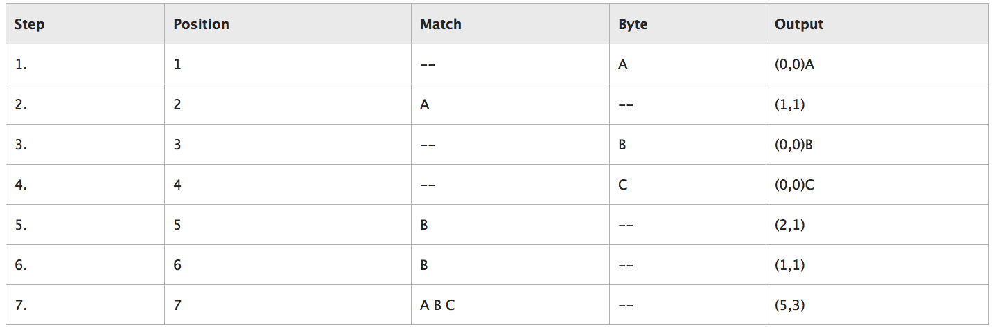

<!--more-->


## 名词解释

[defalte](https://en.wikipedia.org/wiki/DEFLATE)：这个东西是压缩算法关键中的关键。

[.zip]( https://en.wikipedia.org/wiki/Zip_(file_format) )：archive format，使用了deflate压缩算法

[.gz](https://en.wikipedia.org/wiki/Gzip)(或gzip格式）: single file compress format，也是使用了deflate压缩算法

[.tar.gz]( https://en.wikipedia.org/wiki/Tar_(computing) )或.tgz：archive format，可认为.gz文件的集合，但又不止是多个.gz的集合，因为tgz利用了文件之间的关联信息，提升了压缩率。

[zlib](https://zlib.net/)：一个通用库，只有源代码，不提供可执行文件，只提供了deflate压缩和解压缩算法代码。linux内核、gzip、7-Zip、libpng、git等等都用了它。

[gzip](https://www.gnu.org/software/gzip/manual/gzip.html)：GNU Gzip，一个工具，提供了gzip和gunzip可执行文件，直接可以用来压缩、解压缩。

7-Zip：类似gzip，也是工具。


## deflate算法 = Huffman Coding + LZ77


### Huffman Coding

### LZ77（Lempel–Ziv Coding）


LZ77是基于**字典**的算法。思路是，把数据中的重复（冗余）部分，用更短的metadata元信息代替。

wiki：[LZ77 and LZ78](https://en.wikipedia.org/wiki/LZ77_and_LZ78#LZ77)

根据wiki所说，作者是发明了2个算法LZ77和LZ78。这2个算法是其他LZ算法变种的基础（LZW、LZSS、LZMA）。

下面重点介绍LZ77。

#### LZ77关键词：

- input stream：待压缩的字节序列串
- byte：字节，是input stream的基本元素
- coding position：相当于一个指针，指向当前编码位置；也是lookahead buffer的起始位置
- lookahead buffer：就是指coding position为起点，input stream末端为终点的这段字节序列
- window：最大长度为W的滑动窗口，也是以coding position为起点，但是窗口方向是**反向往左**；窗口初始长度为0，随着编码的进行，长度会增长到W，然后就开始往右滑动
- match：当前匹配串
- pointer：当前匹配串的信息，一般用（B，L）表示，B表示Go **B**ack多少个字节（从coding position往左），因为也叫starting offset；L指匹配串从starting offset往右延伸的长度。 pointer为（0，0）时，表示匹配失败。

#### LZ77要注意的点：

- pointer的L是可能比B还大的，即匹配串从window区域，延伸进了lookahead buffer区域，又因为匹配串的起点就是lookahead buffer的起点，所以此时出现了**repeat**现象。这个repeat是没问题的，甚至是有用的，可以对不断重复的数据大大压缩。
- pointer有匹配成功和匹配失败2种情况，所以把pointer信息输出时，还得在pointer前用一个bit表示是哪种pointer。
- pointer里2个信息：B和L，它们的位数一般是固定的。位数大小可以是任意的N bits，但显然，位数太少的话，说明最大匹配长度就受限，即对于超长串是无法高度压缩的。
- **重点**：有的文章会把pointer表示成（B，L，C）。C就是一个byte数据，这是因为任意一个byte第一次出现时，肯定是找不到匹配串的，所以会输出（0，0，byte）；并且，为了输出缓冲区的结构一致性，当匹配成功时，也得输出（B，L，C），C相当于一个空的占位符，有点浪费，所以有的LZ77算法会再成功匹配后，把下一个byte存到占位符里，因此encoding position要移动L+1。
- B和L耗用的位数不需要一样。
- 既然固定了B和L的位数大小，那么最大窗口大小W也是可以固定的，例如当W为32KB时，那么15 bits就可以表达32KB的任意一个值。
- window的最大长度W影响到压缩比率和压缩效率。显然W越大，匹配得越充分，但也越慢。
- 需要定一个**最小匹配长度**，只有当当前匹配串大于最小匹配长度时，这个匹配才成立。例如B用15位，L用8位，差不多就用了3个字节，如果当前匹配串不足3个字节，例如1个字节，那就导致encoding后长度反而更长了。
- 显然LZ77的compress做的工作量要比decompress多得多，因为做了大量的匹配查找。所以LZ77特别适合于**一次压缩，多次解压缩**的情景。

#### 实例：

这种算法用实例来理解是最快的。微软[这篇文章](
https://msdn.microsoft.com/en-us/library/ee916854.aspx
)就给出了一个例子，这里拿来用一下。

待压缩字节串（流）：AABCBBABC

字节串中每个字节记一个位置标记position（上面的encoding position也是指这个），从1开始数，不是从0哦：

<pre>

Position    1    2    3    4    5    6    7    8    9

Byte        A    A    B    C    B    B    A    B    C

</pre>

开始LZ77编码：



LZ77编码后，就输出了最右边一列，注意，这里只是方便理解，实际上不会存成文本形式，没有（ ），这些字符。

这里重点要搞懂output这一列是怎么来的，用人话来描述下：

0. 设定一个叫滑动窗口（window）的概念，初始时，window是空的：【】
1. 读入第1个字符A，然后在window里match一下，找不到A，match失败，于是输出(0,0)A。window更新为【A】
2. 读入第2个字符A，window里match一下，此时要注意，match的方向是右到左（逆向）。因为在window右起第1个位置就找到了A（叫做go back 1 bytes），所以输出(1, 1)
3. 第一次遇到B，同步骤1，输出(0,0)B，window更新为【AB】

这一列从上往下看，发现其中只有3个格有“数据”，(0,0)A、(0,0)B、(0,0)C。其他格子都只有数字（meta信息），说明其他格子的原文信息都和这3个数据格子有关。

接下来，看看如何把这一列output再解码回原文：


1. 输入(0,0)A，表示直接往输出缓冲区push一个A字符。 【A】
2. 输入(1,1)，只有meta信息，(1,1)意思是它的位置等于1，长度为1，**注意，位置是逆向数，长度是正向数**。显然，(1,1)等于缓冲区的字符A，于是push了一个一样的A。【AA】
3. (0,0)B，和步骤1一样，直接push一个B。【AAB】
4. (0,0)C，同上。【AABC】
5. (2,1)，又是meta信息，位置为2，长度为1，倒着数当前缓冲区，发现起点是B字符，长度为1，所以push一个B。【AABCB】
6. (1,1)，参考步骤5，也是push一个B。【AABCBB】
7. (5,3)，长度终于不为1了，首先在缓冲区倒着数5下，发现是左起第二个A，然后长度3，于是往右再获取2个字符，得到ABC，push到缓冲区，得到【AABCBBABC】


#### LZ77伪代码(from wiki)：

```
begin
     fill view from input
     while (view is not empty) do 
     begin
          find longest prefix p of view starting in coded part
          i := position of p in window
          j := length of p
          X := first char after p in view
          output(i,j,X)
          add j+1 chars
     end
end
```


### 其他资料

wiki：https://en.wikipedia.org/wiki/DEFLATE

官方解释：https://zlib.net/feldspar.html

[LZ77压缩算法编码原理详解(结合图片和简单代码)](https://www.cnblogs.com/junyuhuang/p/4138376.html )


## zlib

## adler32 和 CRC32
