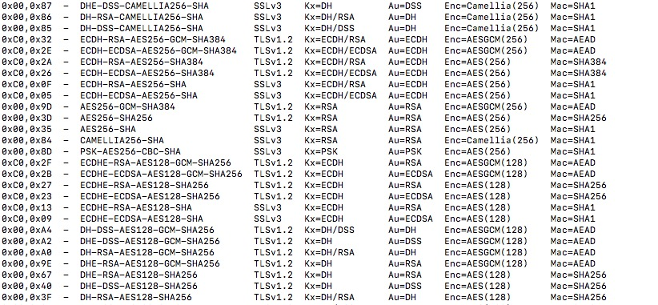

<!--more-->

# 常见加密算法

## [RSA](https://en.wikipedia.org/wiki/RSA_(cryptosystem)) （Rivest–Shamir–Adleman)（1977年）

基于大数（1024bits以上)的质因数分解问题。

## [ECC](https://en.wikipedia.org/wiki/Elliptic-curve_cryptography)（Elliptic-curve cryptography） （1985年）

基于在椭圆曲线上的离散对数的求取问题。

## [AES（Rijndael）](https://en.wikipedia.org/wiki/Advanced_Encryption_Standard) （2001年）

AES的意思是高级加密标准（Advanced Encryption Standard），使用的算法是Rijndael，Rijndael是当时加密算法竞赛的top 1。

## [DH](https://en.wikipedia.org/wiki/Diffie%E2%80%93Hellman_key_exchange)（Diffie-Hellman key exchange）（1976年）

密钥交换算法。

基于离散对数问题。

# DH算法

## key exchange例子（ [from here](https://scotthelme.co.uk/perfect-forward-secrecy/) )：

1. Alice和Bob首先线下商量好，使用**p (prime, 质数) = 23、g (generator, 生成器) = 5**作为通讯基础（p和g不需要绝对的保密，泄露了也没事）
2. 每次Alice和Bob想要建立通讯(连接)时，Alice自己随机生成一个在范围[1, p - 1]的数：a = 6
3. 同样，Bob自己也随机一个：b = 15
4. Alice计算： \\( A = ( g\^\{a\} ) \% p = ( 5\^\{6\} ) \% 23 =  15625 \% 23 = 8 \\)，把A发给Bob
5. Bob计算： \\( B = ( g\^\{b\} ) \% p = ( 5\^\{15\} ) \% 23 =  30517578125 \% 23 = 19 \\)，把B发给Alice
6. Alice收到B后，可计算出**对称密钥**：\\( s\_\{Alice\} = ( B\^\{a\} ) \% p = ( 19\^\{6\} ) \% 23 = 47045881 \% 23 = 2 \\)
7. Bob收到A后，可计算出**对称密钥**：\\( s\_\{Bob\} = ( A\^\{b\} ) \% p = ( 8\^\{15\} ) \% 23 = 35184372088832 \% 23 = 2 \\)

## 数学原理

其中，用到了**模幂运算**的基本定理，对于任意自然数a、b、n，有：

\\[ ab\  \%\  n =  ( ab\ \%\  n) \  \%\  n =  ( (a\ \%\  n)  (b\ \%\  n) ) \ \%\  n \\]

应用到幂运算：

\\[ a\^\{b\}\  \%\  n =  ( a \\cdots  a ) \  \%\  n =  ( (a\ \%\  n) \\cdots  (a\ \%\  n) ) \  \%\  n =  ( \ (a\ \%\  n)  \^\{b\}\  ) \ \%\  n \\]

于是有：

\\[ s\_\{Alice\} = ( B\^\{a\} ) \% p =  (\  (\  g\^\{b\} ) \% p\  ) \^\{a\}\   ) \% p =   (  \ g \% p\  ) \^\{ab\} \  ) \% p =  \ g \^\{ab\} \% p \\]

同理：

\\[ s\_\{Bob\} = ( A\^\{b\} ) \% p =  (\  (\  g\^\{a\} ) \% p\  ) \^\{b\}\   ) \% p =   (  \ g \% p\  ) \^\{ab\} \  ) \% p =  \ g \^\{ab\} \% p \\]

显然：

\\[  s\_\{Alice\} = s\_\{Bob\}  \\]

这样就协商出了对称的密钥。

## 为什么可行

从攻击者角度看，攻击者最多只能获得以下信息：

- p：23
- g：5
- A：8
- B：19

攻击者目标是获得s（serect）。要计算s，就是算2条式子：

\\[ s = ( B\^\{a\} ) \% p \\]

\\[ s = ( A\^\{b\} ) \% p \\]

显然，攻击者只需要破解出a或b，就能得到s。

又因为有：

\\[ A = ( g\^\{a\} ) \% p \\]

\\[ B = ( g\^\{b\} ) \% p \\]

所以破解a或b的方法是：

\\[ a = log\_\{g\}\^\{A\} \% p \\]

\\[ b = log\_\{g\}\^\{B\} \% p \\]

这看似很简单的算术（对数运算和取模运算），其实是很难算的。目前为止没有找到一个快速计算对数的算法。

关键在于**p这个素数要足够大**，那么以现在的计算机计算速度，就很难通过A（或B）、g、p这3个参数算出a，这被称为[离散对数难题](https://en.wikipedia.org/wiki/Discrete_logarithm)。

这里需要注意，难的是**离散对数**，即有log和mod运算并且参数是整数；若单单只有log运算，是不难的。

## p、g的选取问题

涉及到了一些数论的概念：

- [最大公约数gcd](https://en.wikipedia.org/wiki/Greatest_common_divisor)
- [数论阶](https://en.wikipedia.org/wiki/Multiplicative_order)
- [原根](https://en.wikipedia.org/wiki/Primitive_root_modulo_n)

首先明确下：

- p必须是素数，且必须是大数(1024-2048bits)，算法才安全
- g不需要是素数，且不需要很大

p、g不需要自己挑选，可以直接用[rfc5114](https://tools.ietf.org/html/rfc5114)给定的值。

例如[1024-bit MODP Group with 160-bit Prime Order Subgroup](https://tools.ietf.org/html/rfc5114#section-2.1):

再讲下去就是深入密码学、数论了，按住不表。

# 分组加密算法的模式

分组加密算法，都需要考虑wrap模式（【Block Cipher Modes（https://en.wikipedia.org/wiki/Block_cipher_mode_of_operation））。

模式多种多样，也很容易查到介绍资料。选择模式时主要考察几个点：

- 并发性：
    - 如CTR、GCM计数器模式
- 安全性：
    - 如ECB模式对重复出现的明文分组加密后结果是一样的，容易被猜出
    - 如CBC模式，会遇到[padding oracle attacks](https://en.wikipedia.org/wiki/Padding_oracle_attack)，这篇写得很详细：https://blog.csdn.net/qq_35078631/article/details/78484980
- 完整性(integrity)和可验证性(authenticity)：
    - 其实就是指消息验证码MAC。加了MAC后，解密时，验证MAC，防止密文被篡改（tamper），保持完整。
    - CCM模式，等于CTR加上CBC-MAC，不过做了2重加密，速度慢。
    - OCB，有版权问题据说。
    - GCM，等于CTR加上GHASH。这个是NIST官方标准了，绝对靠谱，性能据说很可以，openssl里面有一堆GASH的汇编代码，硬件级别上也有相应支持。
    - 这2个性质不一定要由分组加密完成。也可以外部套一个非对称加密，用数字签名来保证完整性。

AES各种模式的选择问题，参考:

https://stackoverflow.com/questions/1220751/how-to-choose-an-aes-encryption-mode-cbc-ecb-ctr-ocb-cfb

此回答近300赞，在stackoverflow上算很多了。

如果没耐心看，就看作者的最后总结：

**如果数据已经在外部做了非对称加密数字签名以支持验证，那么用CBC即可，否则用GCM**。

# **完全前向保密** PFS(Perfect Forward Secrecy)

## 没有PFS之前：

- 如果攻击者曾经窥探并保存了用户和服务器的加密数据流，且包括被公钥加密的对称密钥
- 如果有一天攻击者通过某种办法获得了服务器私钥
- 攻击者同时拥有了：“用公钥加密的对称密钥”、“私钥”
- 攻击者用“私钥”对“用公钥加密的对称密钥”解密，获得了对称密钥
- 攻击者此时就可以用破解出来的对称密钥对已存的历史加密数据做解密

## 基于DH的PFS：

- 不再使用公钥加密对称密钥的方案
- 改为用DH密钥交换算法（key exchange），协商对称密钥，可以直接明文传输协商时需要的信息（并不怕这些信息被窃取）
- 每次会话都协商新的对称密钥
- 因为公钥私钥没有用来加密对称密钥了，所以即使服务器私钥被盗了也不会导致历史对称密钥被破解
- 即使单次会话的对称密钥被破解了，也不会影响到别的会话

## 为什么可行

关键在于，用于生成会话密钥的“数据”，根本就没通过网络发送出去。而用公钥加密的密钥，本身就是通过网络传输的。

后者显然更容易被攻击，主要获得私钥并记录了整个会话的数据流，就可以破解了。

而前者，对称密钥的协商，根本没有用到公钥私钥，经过网络的也不是什么被加密后的密钥，而只是协商信息。攻击者要想破解某次会话的内容，只能从该次会话的加密数据流入手，没有他法。

## 问题

要做到perfect，意味着每次会话都要协商密钥，意味着增加了计算开销，不然不能保证密钥的转瞬即逝性质（ephemeral）。

# 通讯的认证

认证问题是指，如何确定和自己通讯的对方不是其他假冒者？

目前有2个主要的解决方案：消息验证码（message authentication code，MAC）和数字签名（digital signature）。

## 消息验证码

前提：

1. 通讯双方需要先约定好一个密钥，称为**共享密钥**，双方都把它安全地存起来
2. 对任意长度的消息数据，用共享密钥可以计算出对应的固定长度的MAC
2. 计算MAC必须用到共享密钥，除非密钥泄露，否则第三者无法计算出MAC值

流程：

1. 协商密钥
2. 发送方对消息计算MAC值
3. 发送方把消息和MAC值都发给对方
4. 对方收到消息后，也用共享密钥计算MAC值，并与收到的MAC值比对
5. 如果2个MAC值一致，那么消息确实来自于发送方

### 各种问题：

一，密钥协商问题（上面已提过）。

二，重放攻击(replay attack)：攻击者窃听通讯双方（例如2个银行）的数据，把汇款消息保存了下来（带有MAC值），然后重复发送这个汇款消息，接收方就会重复地向发送方发起汇款。其中，攻击者并不需要破解消息。

解决方法：每条消息都加序号，序号必须保证递增，从而每条消息的序号唯一；消息加时间戳，但时钟同步和时钟精度又是新的问题；每个消息加nonce，一个只能用一次的随机数。

三，密钥推测攻击：应确保攻击者不能通过MAC值逆向出共享密钥，否则攻击者就可以伪造发包了。

四，对第三方证明问题：共享密钥只能保证2个人之间的通讯认证，但是如果多于2个人时，理论上共享密钥无法解决认证问题。

例子：用户A向银行B用共享密钥传输了一个取款消息，如果B取款前需要告知C“A申请取款”，C是否可以相信A真的发出了取款消息，还是说消息是B杜撰的？答案是C没有办法知道。

五，防止否认问题：就上面的取款例子，如果A真的发起了取款消息，但是事后又矢口否认，A认为是B杜撰了这个消息，此时事实就说不清了，A和B都有共享密钥，无法知道消息是A说的还是B说的。

## 数字签名

简单来说，数字签名是公钥加密的逆向过程。

对比一下：

- 公钥加密
    - 公钥：发送者加密时使用
    - 私钥：接收者解密时使用

- 数字签名
    - 公钥：验证者验证签名时使用
    - 私钥：签名者生成签名时使用

这里面的公钥私钥是一样的东西，只是用法不一样。私钥依然需要保密地持有，而公钥依然可以任意地公开。

为什么公钥加密反过来就是数字签名，而不是反方向的加密呢？用心琢磨下就知道了：用私钥去加密消息，而谁都能拿到公钥去解密，有什么保密意义可言？

其中还有一个关键点是由公钥的数学原理保证的：用私钥加密的消息，只能用配套的公钥才能解密。

### 数字签名使用方法：

1. 发送方计算消息的摘要（MD5，SHA-1）
2. 发送方对摘要用自己的私钥加密，生成数字签名
3. 发送方把消息和数字签名同时发出
4. 任何人都可以用发送方公布的公钥对数字签名解密
5. 通过对比解出来的摘要和自己算出来的摘要，就可以知道消息是不是来自发送方（识别修改）

注意，上面说的消息，可以是明文也可以是密文，也就是说数字签名支持对明文做签名。

### 公钥证书：

对签名用到的公钥私钥对中的公钥也进行签名，就得到了公钥证书。（是不是有一种递归的感觉。）

公钥证书可以用来判断收到的公钥是不是发送方的公钥。因为有可能收到假的公钥（中间人攻击）。

签名公钥时，用到的公钥密钥对，本身又要认证。这就产生了CA的概念。

一般公钥证书会简称证书。

### 数字签名的主要问题：

抛开一些攻击问题不讲，最主要的问题就是上面刚提到的中间人攻击。

因为要正确地使用数字签名，有一个大前提：**用于验证签名的公钥必须属于真正的发送者**。

这就陷入了死循环：数字签名是用来**防止伪冒**，但同时又必须从非伪冒的发送者拿到没有被篡改的公钥。

所以就得用上刚刚提过的**公钥证书**，给公钥附加一个第三方的签名，这样就把问题转移到了第三方。

第三方的背后也可以存在别的第三方，于是需要构造一个**数字签名链条**。

链条的末端，就是所谓的根证书了。

### 公钥基础设施：PKI（Public-Key Infrasture）

PKI的组成结构：

- 用户，使用PKI的人
- 认证机构（CA，Certification Authority），颁发证书的实体
- 仓库（Repo），也叫证书目录，保存证书的数据库

PKI可以有无数个。

重点要理解CA是怎么回事。

CA主要做三件事：

1. 生成公钥密钥对。其实是可选的，如果由CA生成，那么需要安全地把私钥发给用户；如果是PKI用户生成，就简单多了。
2. 生成颁发证书。需要用到CA自己的私钥来对第一步的公钥进行数字签名，**同时还需要对用户身份进行认证**。
3. 作废（revoke）证书。作废比较复杂，因为用户会在本地缓存证书副本。于是就有了CRL，证书作废清单，（Certification Revocation List）。相当于是一个作废证书的公示榜单。其中每个证书有一个序列号可以作为id对应。用户通过查看CRL就可以知道证书有没作废。

CA可以形成层级关系，最顶层的叫根CA。验证某个公钥证书时，需要从根CA开始，一层层往下验证，确保整条链上的证书都是合法的。

### 对证书的攻击

有社会学的攻击也有非社会学的，具体建议看《图解密码技术》的第十章。

### 为什么要搞得这么复杂

- 如果用户有办法能够取得可信的公钥，则不需要CA
- 当持有可信的CA公钥，并相信这个CA，则可以相信该CA颁发的证书，从而获得可信的公钥。

我的理解是，目前的技术瓶颈导致只能如此，没有更靠谱的方法。

不过存在替代CA模式的其他解决方案：信任网络（web of trust），这个概念来源于PGP。

信任网络就好像人与人之间的关系网（六度分隔理论），通过**熟人推荐**，就可以建立起信任链，从而解决公钥认证问题。

PGP就是建立在信任网络的协议和软件。鉴于PGP的设计，PGP特别适合用于电子邮件传输，当然电子邮件又不仅限用PGP，还可以用基于CA的S/MIME。

# 《计算机网络-自顶向下方法》网络安全章节

# 加密通讯的设计

## 先介绍下[nonce](https://en.wikipedia.org/wiki/Cryptographic_nonce)这个东西

nonce本质就是一段随机码，因为不一定是数字，可能是字符，所以不能叫随机数。因此取了个名字叫nonce。

nonce的存在是为了对付**彩虹表(raintable)**、**重放攻击(replay attack)**，或者说为了制造**请求唯一性(request unique)**。

nonce有server nonce、client nonce之分：

- 需要client nonce的原因：阻止邪恶的客户端做重放攻击。
- 需要server nonce的原因：阻止中间人攻击。

nonce的生成策略有讲究：

- 可以是时间相关变量
- 可以是一个通过强随机算法生成的足够长的bits

### 例子：登录与登录密码

#### 方案1

直接经过无加密的tcp或者http，发password到服务器进行登录。

问题：登录包一被截取，密码就泄露了，攻击者想怎么搞就怎么搞了。

#### 方案2

对password做一个经典的hash：

secret = Hash(password);

客户端只发secret给服务器，服务器执行（这里假设存了密码原文）：

secrect_server = Hash(password_server)；

得到secret_server即可做校验。

问题：攻击者还是截包，就获得了secret，因为每次登录都是发一样的secret，所使攻击者首先可以做**重放攻击**，直接copy用户的登录包，发给服务器，就可以登录了；其次，因为Hash函数无非md5、SHA256这些，完全可以用raintable暴力查表，获得password。

#### 方案3

改进：客户端每次登录前，服务器会生成一个nonce并发给客户端，客户端计算：

secret = Hash(nonce_server, password);

客户端只发secret给服务器，服务器执行：

secrect_server = Hash(nonce_server, password_server)；

然后比较secret和secret_server是否一致即可。

优点：每次登录hash出来的secret都不一样，用户密码比较安全了，要破解密码，得根据secret、nonce_server、Hash，逆向出password，可行，但耗时。

问题：服务端发送的nonce可以被攻击者篡改成固定的nonce，从而导致nonce特性还是被消去了，攻击者就还是可以弄raintable，暴力破解密码。不过因为篡改的nonce和服务器的nonce对不上，客户端发的错误的登录信息，是过不了服务器这一关的。总之，攻击者并不能完美而透明地实现中间人攻击，但可以破解密码。

#### 基于方案3的方案4

既然方案3中，客户端接收了攻击者篡改出来的固定nonce，并发送了符合攻击者raintable预期的secret，导致密码容易被破解，那么客户端是否可以做一些保护措施，使得发到网络中的secret是随机的呢？

方法是有的，就是客户端也生成nonce， 称之为nonce_client，secret的计算变成：

secret = nonce_client || Hash(nonce_client, nonce_server, password)

（Note：||表示concat操作）

服务器收到secret后拆出nonce_client和hash值，本地也执行一遍这条公式，就能做登录校验。

这样处理后，攻击者即使篡改了nonce_server，攻击者收到的客户端secret依然是随机的。并不能直接查raintable获得password，而必须根据客户端的nonce_client，即时算出一份新的raintable表（计算量巨大），才能破解密码。

问题：在登录过程中，本质上还是发送了password，就依然有被猜出密码的可能。如果这个密码是用户的常用密码，例如生日，那后果还是很可怕的。

进一步的思路：既然发送加密的密码不妥，那就是用DH密钥交换了，就不会有密钥在网络中传输的问题。当然对于用户输入密码登录的场景，DH应该是用不了了。

## 简单版本的加密通讯

首先以一个较为简单的例子来说明：某客户端想和某服务器建立tcp加密通讯。

首先需要一个工具：公钥私钥对（非对称加密技术）。

1. 服务器在本地或数据库中存放了用于和任意客户端建立通讯的公钥私钥对。
2. 客户端想和服务器通讯时，服务器发送公钥给客户端。客户端确信用这个公钥加密的数据只有这个服务器能解密。（暂时不考虑中间人攻击问题）
3. 客户端计算一个master key，这个key可能真的是本地算出来的，也可能用DH算法和服务器交换出来的。如果是本地算出来的，那就必须用刚刚的非对称加密通讯信道，发给服务器。总之，master key是客户端服务器都得持有。
4. 客户端服务器各自生成nonce，互发给对方。此时双方都持有master key、cnonce、snonce。
5. 客户端服务器各自本地计算Hash(master key，cnonce，snonce)获得真正用于通讯的对称密钥encrypt key。
6. 另外的，客户端服务器还可以计算Hash2(master key，cnonce，snonce)，获得用于别的用途的key，例如integrity protection key，验证消息用的key。

其中，master key后的步骤其实不是必须的，因为master key是用安全的非对称加密信道协商了，没有泄露key的问题。

然而，如果每次建立通讯都要走1-3步骤的话，开销会比较大，所以master key其实是要复用的。例如客户端可以缓存在本机，服务器就缓存到数据库，设个过期时间。

之后如果客户端想再次发起通讯，那么就可以跳过1-3步，直接执行4-6步，算出用于本次通讯的加密密钥。

## 完整版本的加密通讯

### 一，CA证书

首先，上面说的CA那套公钥证书的东西，是必要的。因为在互联网中通讯，只有依靠公钥证书这个机制，才能确认正在握手的对端是不是你所预期的对端。简要地回顾下：

- 服务器向客户端出示由某CA签发的公钥证书，即CA用**CA私钥**加密了服务器公钥，导出来的东西，称之为公钥证书
- 在握手前，用户的浏览器已经安装了该CA的证书，该证书里面有CA的公钥
- 客户端用本地CA公钥，**解密**收到的公钥证书得到服务器公钥。解得出来，那就说明这个服务器公钥（证书）确实是这个CA曾经用私钥加密过的。
- 当然，公钥证书是有过期问题的，例如服务器把私钥泄露了，那相应的公钥证书就得从CA里删掉，这就涉及到了**证书撤销列表CRL**。CRL就是一个数据库，这个数据库显然得支持分布式，否则全世界的用户都涌到中心化的服务器去验证证书是否已被撤销，那是做不到的。而分布式数据库，显然就有个更新同步延迟问题，中心数据库更新了CRL，什么时候本地能更新CRL缓存，就决定了安全度有多高。

第4步骤先不说，前3步骤才是最关键的。这些流程，完全是为了**确认正在握手的服务器是不是自己所信任的CA签名了的服务器**。信任的根基是CA，客户端只相信CA，CA说什么就是什么。

值得思考的问题：

- 客户端会不会装了不可靠的CA证书。如果是，那后面的所有流程都是白搭了。
- 通讯双端没有CA基础设施怎么办？例如手机游戏，没有什么浏览器CA，只有tcp udp可用。答案是直接把服务器公钥硬编码到客户端安装包里，只要用户确保是从正规途径下载的安装包，那么就可以保证客户端里的公钥是真实服务器的公钥。例如从app store下载游戏。

### 二，都是为了加密性能

第一步中，客户端和服务器已经建立了可靠的**非对称加密通讯**，客户端持有服务器的公钥，客户端用公钥加密自己数据，只有服务器才能解密，不就万事大吉了吗？

然而很可惜的是，非对称加密算法，性能一般都差强人意，远不如**对称加密算法**。所有用户要发送大量隐私数据给服务器，只用非对称加密的话，先不说客户端耗能，服务器的CPU首先就炸了。

性能是关键，接下来的步骤，都得归咎于非对称加密算法的性能。

### 三，有时效限制的通讯密令：master key

因为性能问题，我们希望尽可能不使用非对称加密通讯信道，甚至不去建立非对称加密通讯。

最终的，非对称加密通讯所要负责的事情，被精简成一件事：协商一个master key。

master key前文也介绍过了，说白了就是一段password，master key只能是通讯的两端持有，不能告诉其他人，否则就不安全了。

master key，用非对称加密信道协商，可以本机随机生成，也可以用DH算法和服务器交换。

然后是时效性问题，一般master key要设个过期时间，一天、一个星期、一个月，加了限时，就保证了要定期更换，一定程度降低了master key泄露的风险。一般是服务器设置过期时间，客户端只缓存，如果用了过期的master key，那服务器应有反馈，并重新协商新的master key。

### 四，基于master key，得到对称加密密钥，建立对称加密通讯

刚才的简化例子有一点没有说清楚的，就是nonce怎么发送。

实际上，nonce_client, nonce_server，都可以不经过加密通讯信道直接发送，泄露了也没关系。

因为需要的对称加密密钥基于三个参数：

encrypt key = Hash(master key，nonce_client, nonce_server)

我们不怕泄露后2个，因为第一个master key已经保证保密了。这样子hash出来的encrypt key也依然是保密的。

有了双方一致的encrypt key，就可以拿出各种对称加密算法，来建立加密通讯了。

要注意的点：

- nonce_client, nonce_server存在的意义前文也说过了，主要是防止重放攻击、中间人攻击，所以每次想要用master key建立加密通讯，都是即时地重新协商nonce。
- encrypt key实际上要2个，因为tcp是全双工连接，有2个数据流方向，2个方向的encrypt key如果一样，安全系数就降低了，详情不表。最好就是一个方向一个encrypt key。

### 五，加密数据的完整性保证

前四步骤已经几乎建立了绝对可靠的性能不错的加密通讯，但还有一个问题：客户端发出去的包，依然还是有被截包篡改的可能。

例如A用encrypt key加密了原文a得到密文b，用tcp把b发出去，b被攻击者截取，攻击者可能用各种奇奇怪怪的方法尝试篡改这个密文b变成密文c，亦或者替换了b变成密文d（很可能是通讯早期截获的包！），然后继续发向服务器，那么就还是不安全，因为客户端想要发给服务器的密文b并没有真正送到，服务器还处理了别的密文！

还有一种情况是，客户端和服务器的对称密钥因为某种原因不同步了，这样会导致服务器用错误的对称密钥解密数据得到了“乱码”，但服务器是完全感知不到用了错误的密钥，服务器无法知道乱码是不是乱码。

那怎么办呢？答案是再给密文b加一层**认证**。

简单理解就是，客户端给密文b做个hash，得到消息验证码MAC（前文介绍过的)，把密文b和MAC一起发给服务器，服务器也对收到的密文做一样的hash，如果服务器得到的MAC值和客户端的MAC值不一致，那就说明数据不是客户端发来的。

hash函数刚才也提到过了，需要一个integrity key，也是基于master key的。攻击者没有办法获得一样的hash函数。

MAC的安全隐患前文也说到过了。最经典的是重放攻击，就是攻击者并不篡改密文和MAC，而只是原样地保存下来，并伺机重复发送给服务器。这个问题的解决办法就是对每条消息加一个递增的序号。同样的消息就不可能收到两次。

P.S. 用一个额外的MAC（其实应该叫做MtE，EtM，E&M）来保证完整性已经是一种过时的思路，有安全缺陷。取而代之的是AEAD。所谓AEAD，含义是在对称加密算法里添加了完整性验证的功能，例如AES-128-GCM、ChaCha20-IETF-Poly1305。所以AEAD并不是一种算法，而只是方案的代名词。

### 六，算法选取

上面的五大步骤，其实都没有谈到具体用什么算法。据我了解，可以这么弄：

- 非对称加密：RSA 或 ECC
- master key：randomBytes() 或者 DH
- 对称加密：AES
- encrypt key：MD5 或者 SHA256
- integrity key：MD5 或者 SHA256 with salt
- 消息验证码生成函数：HMAC with integrity key

这些东西的选取，已经有规范了，叫做cipherSuite，例如可以执行openssl ciphers -V | column -t，看到系统支持的cipherSuites：

第一列2个十六进制值相当于ID。

以其中最常见的0xC0,0x2F为例：

0xC0,0x2F  -  ECDHE-RSA-AES128-GCM-SHA256    TLSv1.2  Kx=ECDH        Au=RSA    Enc=AESGCM(128)    Mac=AEAD

含义：

- 用于TLSv1.2版本
- kx = key exchange，使用ECDHE做秘钥交换（就是上文说的DH的变种）
- Au = authenticity，使用RSA做认证
- Enc = encryption，使用AES-128-GCM做对称加密。GCM意味着加密算法支持认证功能。
- MAC = AEAD（authenticated encryption with associated data），一种同时具备保密性(confidentiality)，完整性(integrity)和可认证性(authenticity assurances)的加密形式。 MAC=AEAD意思是说“把这些认证问题交给对称加密算法就行了，不需要MAC”。

# 总结

密码学算法难以被正确使用，究其原因是数学。要对密码学有一定了解，才能搞清楚那些加密套件各种参数和选项。

# 参考资料

https://scotthelme.co.uk/perfect-forward-secrecy/
