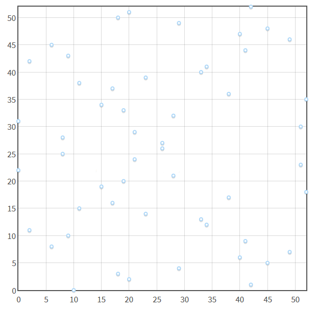

<!--more-->

# 常见加密算法

## [RSA](https://en.wikipedia.org/wiki/RSA_(cryptosystem)) （Rivest–Shamir–Adleman)（1977年）

基于大数（1024bits以上)的质因数分解问题。


## [ECC](https://en.wikipedia.org/wiki/Elliptic-curve_cryptography)（Elliptic-curve cryptography） （1985年）

基于在椭圆曲线上的离散对数的求取问题。


## [AES（Rijndael）](https://en.wikipedia.org/wiki/Advanced_Encryption_Standard) （2001年）

AES的意思是高级加密标准（Advanced Encryption Standard），使用的算法是Rijndael，Rijndael是当时加密算法竞赛的top 1。

## [DH](https://en.wikipedia.org/wiki/Diffie%E2%80%93Hellman_key_exchange)（Diffie-Hellman key exchange）（1976年）

密钥交换算法。

基于离散对数问题。

## [ECDH](https://en.wikipedia.org/wiki/Elliptic-curve_Diffie%E2%80%93Hellman) (21世纪)

DH的变种，基于椭圆曲线算法的DH算法。

# ECC算法

## 直观认识什么是椭圆曲线

椭圆曲线，指的是满足这个**维尔斯特拉斯通用式**的曲线：

\\[ y\^\{2\} = x\^\{3\} + ax + b , 且 4a\^\{3\} + 27 b\^\{2\} ≠ 0 \\]

判别式([discriminant](https://en.wikipedia.org/wiki/Discriminant) )不为0时，曲线才没有奇异点，才能用于加密。


到这里就能发现椭圆曲线第一个特点：**整个曲线是关于x轴对称的**。

各类加密货币使用的椭圆曲线代号是secp256k1，长这样子：


用这个[在线工具](https://hub.mybinder.org/user/ipython-ipython-in-depth-qhl9ondm/notebooks/binder/Untitled1.ipynb?kernel_name=python3)可以打印椭圆曲线：

```python
import numpy as np
import pylab as pl

def f(x):
    return x**3 - x  # 替换掉这个方程，然后重新run

Y, X = np.mgrid[-10:10:100j, -10:10:100j]
pl.contour(X, Y, Y**2 - f(X), levels=[0])
pl.show()

```


## ECC算法细节

### 曲线基本特点

- 如果一条（不垂直于x轴的）直线与椭圆曲线相交（有2个相交点），那么必然存在第三个相交点。（证明过程？）
- 第三个点相当于公钥
- 椭圆曲线关于x轴镜像对称

### 无穷远点：0

无穷远点，或理想点，指理想化地认为一条直线在无穷远处有一个终点，一般以0表示。

### 椭圆曲线上的点的取反操作

因为椭圆曲线关于x轴对称，所以可定义：

对于任意椭圆曲线上的点P，对P取反后得到-P，-P为P关于x轴镜像对称点。

### P + Q = R

前面已经提到，任意直线与椭圆曲线如果相交，那么必然有3个相交点。（记得相交线不能和x轴垂直）

在椭圆曲线加密算法中，定义了一个阿贝尔群，该群的的加法操作定义如下：

对于任意相交点P、Q、-R（这里取反是有意义的），若P!=-Q，有等式 P + Q + (-R) = 0 成立，即 P + Q = R。

- 首先要注意，这个加法并不是欧氏几何加法，例如看下图， P + Q在欧氏几何中的结果是（-2.45，-1.024），而不是（3.89，5.62）
- 该定义中，要求P!=-Q，也是有深意的：如果P=-Q，说明P和Q是关于x轴对称的2个点，那么P和Q应是R和-R，所以P!=-Q这个前提条件保证了P和Q不是那个特殊的R


### base point P

在椭圆曲线加密算法中，第一步是定一个基准点P。

第二步是，找出从P到P的直线方程。此时会疑惑2个一样的点怎么构成直线，当然是可以的，这个直线是**经过P点的和椭圆曲线相切的切线**：


根据前面小节的说明，这条切线必然会与椭圆曲线相交于另外一点-R，又因为P + Q = R（-R的镜像点），所以有 P + P = 2P = R：


这一个过程还可以迭代下去：因此此时已有P和2P两个点，如果让它们相加，即 P + 2P，那么又会得到新的一个镜像点3P：


继续迭代这个过程，就能得到4P、5P、6P······


### nP + rP = (n+r)P

假设现在要求出10P，那么按上一节的迭代算法，就需要计算：

\\[ P+P+P+P+P+P+P+P+P+P \\]

这是很慢的过程，不过可以用群加法其中一个性质来加速：

\\[ nP + rP = (n+r)P \\]

当然还是不能一步到位，而是从9次加法变成了4次加法：

\\[ P + P = 2P \\]

\\[ 2P + 2P = 4P \\]

\\[ 4P + 4P = 8P \\]

\\[ 2P + 8P = 10P \\]

### x为大数时，xP的计算问题

假设x是一个超大正整数，例如有256bits，32个字节这么大。那么要得到xP，得做多少次群加法呢？

这是个二进制的问题。首先假设x等于十进制的246（值很小，只用一个字节就能表示，是为了讨论方便），并把x二进制展开（binary expansion，是叫二进制展开吧？）：

\\[ 2\^\{7\} + 2\^\{6\} + 2\^\{5\} + 2\^\{4\} + 2\^\{2\}  + 2\^\{1\}  = 128 + 64 + 32 + 16 + 4 + 2 = 246 \\]

等式两边都乘以P：

\\[ 2\^\{7\}P + 2\^\{6\}P + 2\^\{5\}P + 2\^\{4\}P + 2\^\{2\}P  + 2\^\{1\}P  = 246 P \\]

此时x=246的xP问题就解决了：先算出一系列\\(2\^\{n\} P\\)，n从0到255（255次群加法），然后用5次群加法就得到了246P，总共需要260次群加法。

当x的256bits都为1，即x取最大值时，也只需要做255+255=510次群加法。

### 逆向求xP的x

假设Bob和Alice玩一个椭圆曲线的游戏：Bob先保密地随机取一个256bits的x，并算出X = xP，把X点坐标告诉Alice；Alice也知道这个椭圆曲线方程以及P点，那么Alice是否可以求出x的值？

再复述下Alice掌握的信息：

- 椭圆曲线方程，如：\\(y\^\{2\} = x\^\{3\} - 7x \\)
- P点坐标，如：（-2.35, -1.86）
- X点坐标，如：（123.456，789.123）（瞎写的）

Alice是否可以知道X是做了多少次对P的群加法得到的？如果能，需要多久？

答案是，现在世界上并没有一个快速算法求出x。唯一可行的笨办法是，遍历整个256bits范围的整数集，从1P开始，不断+P，直到发现nP=X，此时的n就是要求的x。

也有同样复杂度的逆算法：不断对X减P，直到减完时刚好就是P，此时统计减的次数，就是x了。

x落在\\( \[0, 2\^\{256\} - 1\] \\)，平均值为\\( 2\^\{128\} \\)。因此平均需要暴力地做2^128次群加法。

### 公钥私钥

基于上一节的讨论，x和X适合用来做非对称加密的私钥公钥：

- 私钥：大数x
- 公钥：椭圆曲线上的坐标X

非对称加密的公钥私钥必然要满足一个性质：给定一个公钥，很难去推导出它对应私钥。可见，x和X满足这个性质。

但X、x公钥私钥对并不能直接用于加密数据。这个事情后面再说。

### 谁才是主人公？持有私钥证明 part1

Bob持有私钥x，是事实，但Bob怎么向别人证明自己持有X对应的私钥x呢？

这个事情有点复杂，首先要改进下椭圆曲线的模型。

上面的椭圆曲线模型有个问题：xP这个点的坐标x、y可能会超大，x和y加起来可能大过一个公钥的存储极限，例如512bits。

解决方案是：在有限域上定义一个椭圆曲线。为此有2个新的限制：

- 坐标点的分量限制为整数
- 坐标点的分量取值范围不是无穷远

公式上的改变如下：

把 \\( y\^\{2\} = x\^\{3\} + ax + b\\) 改成：

\\[ \( y\^\{2\} \) \% p = \( x\^\{3\} + ax + b \) \% p\\]

p是一个大质数，例如在secp256k1椭圆曲线中，p的取值是【0, \\( 2\^\{256\} \\) 】范围内的最大质数。

这么一转换后，椭圆曲线就变成大概这样子的东西：



离散的点集，但仍然有关于x轴的对称性。

而且，前面讨论的东西仍然是有效的。

### 谁才是主人公？持有私钥证明 part2

如何才能在不暴露x的前提下告诉别人“我”持有私钥呢？

首先拿出前面提到的加法结合律：

\\[ n \cdot P + r \cdot P = ( n + r ) \cdot P \\]

然后把n替换为这个东西：

\\[ hash(m, \ r \cdot P) \cdot n \\]

得到：

\\[ hash(m, r \cdot P) \cdot n \cdot P + r \cdot P = ( hash(m, r \cdot P) \cdot n + r ) \cdot P \\]

引入了一个新的m，以及关于m和rP的hash函数。

假设\\(n \cdot P = X \\)（X就是公钥X），代入上式，得到：

\\[ hash(m, r \cdot P) \cdot X + r \cdot P = ( hash(m, r \cdot P) \cdot n + r ) \cdot P \\]

又因为\\(n \cdot P = X \\)，所以有n = x（x就是私钥x），继续代入，得到：

\\[ hash(m, r \cdot P) \cdot X + r \cdot P = ( hash(m, r \cdot P) \cdot x + r ) \cdot P \\]

此时再设2个新的对象R和s：

\\[ R = r\cdot P \\]

\\[ s = hash(m, R)\cdot x + r \\]

把R代入上面的方程，变成：

\\[ hash(m, R) \cdot X + R = ( hash(m, R) \cdot x + r ) \cdot P \\]

然后再代入s，最终得到：

\\[ hash(m, R) \cdot X + R = s \cdot P （持有私钥证明方程）\\] 

这条方程就是**持有私钥证明**了：谁能够给出任意m、R、s，使得m、R、s代入上述方程使得等式成立，那么这个人就必然持有私钥x。

那么对持有人来说，怎么得到m、R、s呢？很简单：

1. 随机生成m
2. 随机生成r
3. 计算\\( R = r\cdot P \\)
4. 计算\\( s = hash(m, R)\cdot x + r \\)

这里提2个问题。一个是私钥安全问题：

对第三者来说，未知数是r和x，假设r泄露了给第三者，那么第三者就可以根据第4步的式子的变换，导出私钥x：

\\[ x =  \frac \{ s - r \} \{ hash(m, R) \} \\]

所以r必须是用完就丢的。因为持有者只需要给出R就足够用予持有私钥证明。

另一个是暴力破解问题：

第三者是否可以暴力地找到合适的m、R、s代入持有私钥证明方程，使得方程成立？

假设可行，那么第一步应是先任意找出一组合适的参数：h( h = hash(m, R) )、R、s，使得\\( hash(m, R) \cdot X + R = s \cdot P \\) 成立，这肯定是办得到的。

然后下一步是，解出一个m，使得hash(m, R) = h成立。然而，如果选择了一个优质的[cryptographic hash functions](https://en.wikipedia.org/wiki/Cryptographic_hash_function)，是很难办到的。这也被称为原像攻击（[Preimage attack](https://en.wikipedia.org/wiki/Preimage_attack) )，即给定hash值，找出能hash出这个值得输入。

### ECC的应用：数字签名

前面已经论证了只有私钥持有者能给出m、R、s三元组，那么当m是一段有意义的消息(依然是一段字节序），而与这个m匹配的R、s，就成为这个消息m的**签名**了。

因为攻击者理论上并不能用自己随意篡改的m'，使得m'、R、s能成功代入持有私钥证明方程。


### ECC的应用：比特币

简单来说，要生成一个新的比特币钱包，需要先随机生成一个256bits的私钥x，然后根据比特币所用的椭圆曲线参数（secp256k1），计算X = xP，X就是这个钱包的公钥。

然后呢，X大有所为，X可以随便公开，X相当于钱包的银行账号，例如比特币转入这个钱包，就需要用到X。

转入问题是解决了，但怎么证明你是这个钱包的主人，并转出（消费）比特币呢？答案就是用上一节的方法，做一个持有私钥声明（即数字签名），转出事务广播开后，每个人都可以简单地验证这个持有声明的真伪性。

如果去观察比特币的事务消息，就会发现他它的数字签名部分就是一个椭圆曲线上的某坐标R和一个随机的256bits的s的组合。

### ECC的应用：加密通讯

要用ECC来加密数据，那么就要用到[ECIES](https://en.wikipedia.org/wiki/Integrated_Encryption_Scheme)这个。

ECIES，即基于椭圆曲线的整合加密方案，与其类似的还有基于离散对数的整合加密方案 (DLIES)。

ECIES，也被称为Elliptic Curve Augmented Encryption Scheme（基于椭圆曲线的增强加密方案） 或简单地叫 Elliptic Curve Encryption Scheme（基于椭圆曲线的加密方案）。

Anyway，先以一个例子介绍下ECIES。首先，纠正下前面介绍ECC相关参数的命名。

椭圆曲线算法有很多常数，被称为Elliptic Curve Domain Parameters：

- a：椭圆曲线方程\\( y\^\{2\}  = x\^\{3\} + ax + b \\) 里的a
- b：椭圆曲线方程\\( y\^\{2\}  = x\^\{3\} + ax + b \\) 里的b
- G：即上文说的P，椭圆曲线上任意取得基准点坐标
- 


Alice和Bob要进行加密通讯，

加密流程；

1. 生成随机数r，计算R = rP
2. 

解密流程：

1.

资料： 

https://crypto.stackexchange.com/questions/31602/how-does-encryption-work-in-elliptic-curve-cryptography

# DH算法

## key exchange例子（ [from here](https://scotthelme.co.uk/perfect-forward-secrecy/) )：

1. Alice和Bob首先线下商量好，使用**p (prime, 质数) = 23、g (generator, 生成器) = 5**作为通讯基础（p和g不需要绝对的保密，泄露了也没事）
2. 每次Alice和Bob想要建立通讯(连接)时，Alice自己随机生成一个在范围[1, p - 1]的数：a = 6
3. 同样，Bob自己也随机一个：b = 15
4. Alice计算： \\( A =  g\^\{a\}  \% p =  5\^\{6\}  \% 23 =  15625 \% 23 = 8 \\)，把A发给Bob
5. Bob计算： \\( B =  g\^\{b\}  \% p =  5\^\{15\}  \% 23 =  30517578125 \% 23 = 19 \\)，把B发给Alice
6. Alice收到B后，可计算出**对称密钥**：\\( s\_\{Alice\} =  B\^\{a\}  \% p =  19\^\{6\}  \% 23 = 47045881 \% 23 = 2 \\)
7. Bob收到A后，可计算出**对称密钥**：\\( s\_\{Bob\} =  A\^\{b\}  \% p =  8\^\{15\}  \% 23 = 35184372088832 \% 23 = 2 \\)

## 数学原理

其中，用到了**模幂运算**的基本定理，对于任意自然数a、b、n，有：

\\[ ab\  \%\  n =  ( ab\ \%\  n) \  \%\  n =  ( (a\ \%\  n)  (b\ \%\  n) ) \ \%\  n \\]

应用到幂运算：

\\[ a\^\{b\}\  \%\  n =  ( a \\cdots  a ) \  \%\  n =  ( (a\ \%\  n) \\cdots  (a\ \%\  n) ) \  \%\  n =  ( \ (a\ \%\  n)  \^\{b\}\  ) \ \%\  n \\]

\\[ a\^\{b\}\  \%\  n =  ( a\^\{b\}\ \%\  n) \  \%\  n \\]

观察这2个式子最右边，发现b的位置是可以移动的：

\\[ ( \ (a\ \%\  n)  \^\{b\}\  ) \ \%\  n  =  ( a\^\{b\}\ \%\  n) \  \%\  n \\]

套进上一节的例子里的推导公式，得到：

\\[ s\_\{Alice\} = B\^\{a\} \% p = (\  (\  g\^\{b\} \% p\  ) \^\{a\}\   ) \% p = (  \ g\^\{ab\} \% p\  \  ) \% p =  \ g \^\{ab\} \% p \\]

同理：

\\[ s\_\{Bob\} = A\^\{b\} \% p = (\  (\  g\^\{a\}  \% p\  ) \^\{b\}\   ) \% p = (  \ g\^\{ab\} \% p\  \  ) \% p  =  \ g \^\{ab\} \% p \\]

显然有：

\\[  s\_\{Alice\} = s\_\{Bob\}  \\]


这样就协商出了对称的密钥，密钥实质等于：

\\[ g \^\{ab\} \% p \\]

其中，g、p可公开、a、b保密。

## 为什么可行

从攻击者角度看，攻击者最多只能获得以下信息：

- p：23
- g：5
- A：8
- B：19

攻击者目标是获得s（serect）。要计算s，就是算2条式子：

\\[ s = ( B\^\{a\} ) \% p \\]

\\[ s = ( A\^\{b\} ) \% p \\]

显然，攻击者只需要破解出a或b，就能得到s。

又因为有：

\\[ A = ( g\^\{a\} ) \% p \\]

\\[ B = ( g\^\{b\} ) \% p \\]


所以破解a或b的方法是：

\\[ a = log\_\{g\}\^\{A\} \% p \\]

\\[ b = log\_\{g\}\^\{B\} \% p \\]

这看似很简单的算术（对数运算和取模运算），其实是很难算的。目前为止没有找到一个快速计算对数的算法。


关键在于**p这个素数要足够大**，那么以现在的计算机计算速度，就很难通过A（或B）、g、p这3个参数算出a，这被称为[离散对数难题](https://en.wikipedia.org/wiki/Discrete_logarithm)。

这里需要注意，难的是**离散对数**，即有log和mod运算并且参数是整数；若单单只有log运算，是不难的。

## p、g的选取问题

涉及到了一些数论的概念：

- [最大公约数gcd](https://en.wikipedia.org/wiki/Greatest_common_divisor)
- [数论阶](https://en.wikipedia.org/wiki/Multiplicative_order)
- [原根](https://en.wikipedia.org/wiki/Primitive_root_modulo_n)

首先明确下：

- p必须是素数，且必须是大数(1024-2048bits)，算法才安全
- g不需要是素数，且不需要很大

p、g不需要自己挑选，可以直接用[rfc5114](https://tools.ietf.org/html/rfc5114)给定的值。

例如[1024-bit MODP Group with 160-bit Prime Order Subgroup](https://tools.ietf.org/html/rfc5114#section-2.1):


再讲下去就是深入密码学、数论了，按住不表。


# 分组加密算法的模式


分组加密算法，都需要考虑wrap模式（【Block Cipher Modes（https://en.wikipedia.org/wiki/Block_cipher_mode_of_operation））。

模式多种多样，也很容易查到介绍资料。选择模式时主要考察几个点：

- 并发性：
    - 如CTR、GCM计数器模式
- 安全性：
    - 如ECB模式对重复出现的明文分组加密后结果是一样的，容易被猜出
    - 如CBC模式，会遇到[padding oracle attacks](https://en.wikipedia.org/wiki/Padding_oracle_attack)，这篇写得很详细：https://blog.csdn.net/qq_35078631/article/details/78484980
- 完整性(integrity)和可验证性(authenticity)：
    - 其实就是指消息验证码MAC。加了MAC后，解密时，验证MAC，防止密文被篡改（tamper），保持完整。
    - CCM模式，等于CTR加上CBC-MAC，不过做了2重加密，速度慢。
    - OCB，有版权问题据说。
    - GCM，等于CTR加上GHASH。这个是NIST官方标准了，绝对靠谱，性能据说很可以，openssl里面有一堆GASH的汇编代码，硬件级别上也有相应支持。
    - 这2个性质不一定要由分组加密完成。也可以外部套一个非对称加密，用数字签名来保证完整性。


AES各种模式的选择问题，参考:

https://stackoverflow.com/questions/1220751/how-to-choose-an-aes-encryption-mode-cbc-ecb-ctr-ocb-cfb

此回答近300赞，在stackoverflow上算很多了。

如果没耐心看，就看作者的最后总结：

**如果数据已经在外部做了非对称加密数字签名以支持验证，那么用CBC即可，否则用GCM**。

# **完全前向保密** PFS(Perfect Forward Secrecy)

## 没有PFS之前：

- 如果攻击者曾经窥探并保存了用户和服务器的加密数据流，且包括被公钥加密的对称密钥
- 如果有一天攻击者通过某种办法获得了服务器私钥
- 攻击者同时拥有了：“用公钥加密的对称密钥”、“私钥”
- 攻击者用“私钥”对“用公钥加密的对称密钥”解密，获得了对称密钥
- 攻击者此时就可以用破解出来的对称密钥对已存的历史加密数据做解密

## 基于DH的PFS：

- 不再使用公钥加密对称密钥的方案
- 改为用DH密钥交换算法（key exchange），协商对称密钥，可以直接明文传输协商时需要的信息（并不怕这些信息被窃取）
- 每次会话都协商新的对称密钥
- 因为公钥私钥没有用来加密对称密钥了，所以即使服务器私钥被盗了也不会导致历史对称密钥被破解
- 即使单次会话的对称密钥被破解了，也不会影响到别的会话

## 为什么可行

关键在于，用于生成会话密钥的“数据”，根本就没通过网络发送出去。而用公钥加密的密钥，本身就是通过网络传输的。

后者显然更容易被攻击，主要获得私钥并记录了整个会话的数据流，就可以破解了。

而前者，对称密钥的协商，根本没有用到公钥私钥，经过网络的也不是什么被加密后的密钥，而只是协商信息。攻击者要想破解某次会话的内容，只能从该次会话的加密数据流入手，没有他法。

## 问题

要做到perfect，意味着每次会话都要协商密钥，意味着增加了计算开销，不然不能保证密钥的转瞬即逝性质（ephemeral）。


# 通讯的认证

认证问题是指，如何确定和自己通讯的对方不是其他假冒者？

目前有2个主要的解决方案：消息验证码（message authentication code，MAC）和数字签名（digital signature）。

## 消息验证码

前提：

1. 通讯双方需要先约定好一个密钥，称为**共享密钥**，双方都把它安全地存起来
2. 对任意长度的消息数据，用共享密钥可以计算出对应的固定长度的MAC
2. 计算MAC必须用到共享密钥，除非密钥泄露，否则第三者无法计算出MAC值

流程：

1. 协商密钥
2. 发送方对消息计算MAC值
3. 发送方把消息和MAC值都发给对方
4. 对方收到消息后，也用共享密钥计算MAC值，并与收到的MAC值比对
5. 如果2个MAC值一致，那么消息确实来自于发送方

### 各种问题：


一，密钥协商问题（上面已提过）。


二，重放攻击(replay attack)：攻击者窃听通讯双方（例如2个银行）的数据，把汇款消息保存了下来（带有MAC值），然后重复发送这个汇款消息，接收方就会重复地向发送方发起汇款。其中，攻击者并不需要破解消息。

解决方法：每条消息都加序号，序号必须保证递增，从而每条消息的序号唯一；消息加时间戳，但时钟同步和时钟精度又是新的问题；每个消息加nonce，一个只能用一次的随机数。


三，密钥推测攻击：应确保攻击者不能通过MAC值逆向出共享密钥，否则攻击者就可以伪造发包了。

四，对第三方证明问题：共享密钥只能保证2个人之间的通讯认证，但是如果多于2个人时，理论上共享密钥无法解决认证问题。

例子：用户A向银行B用共享密钥传输了一个取款消息，如果B取款前需要告知C“A申请取款”，C是否可以相信A真的发出了取款消息，还是说消息是B杜撰的？答案是C没有办法知道。

五，防止否认问题：就上面的取款例子，如果A真的发起了取款消息，但是事后又矢口否认，A认为是B杜撰了这个消息，此时事实就说不清了，A和B都有共享密钥，无法知道消息是A说的还是B说的。

## 数字签名

简单来说，数字签名是公钥加密的逆向过程。

对比一下：

- 公钥加密
    - 公钥：发送者加密时使用
    - 私钥：接收者解密时使用

- 数字签名
    - 公钥：验证者验证签名时使用
    - 私钥：签名者生成签名时使用

这里面的公钥私钥是一样的东西，只是用法不一样。私钥依然需要保密地持有，而公钥依然可以任意地公开。

为什么公钥加密反过来就是数字签名，而不是反方向的加密呢？用心琢磨下就知道了：用私钥去加密消息，而谁都能拿到公钥去解密，有什么保密意义可言？

其中还有一个关键点是由公钥的数学原理保证的：用私钥加密的消息，只能用配套的公钥才能解密。


### 数字签名使用方法：

1. 发送方计算消息的摘要（MD5，SHA-1）
2. 发送方对摘要用自己的私钥加密，生成数字签名
3. 发送方把消息和数字签名同时发出
4. 任何人都可以用发送方公布的公钥对数字签名解密
5. 通过对比解出来的摘要和自己算出来的摘要，就可以知道消息是不是来自发送方（识别修改）

注意，上面说的消息，可以是明文也可以是密文，也就是说数字签名支持对明文做签名。

### 公钥证书：

对签名用到的公钥私钥对中的公钥也进行签名，就得到了公钥证书。（是不是有一种递归的感觉。）

公钥证书可以用来判断收到的公钥是不是发送方的公钥。因为有可能收到假的公钥（中间人攻击）。

签名公钥时，用到的公钥密钥对，本身又要认证。这就产生了CA的概念。

一般公钥证书会简称证书。

### 数字签名的主要问题：

抛开一些攻击问题不讲，最主要的问题就是上面刚提到的中间人攻击。

因为要正确地使用数字签名，有一个大前提：**用于验证签名的公钥必须属于真正的发送者**。

这就陷入了死循环：数字签名是用来**防止伪冒**，但同时又必须从非伪冒的发送者拿到没有被篡改的公钥。

所以就得用上刚刚提过的**公钥证书**，给公钥附加一个第三方的签名，这样就把问题转移到了第三方。

第三方的背后也可以存在别的第三方，于是需要构造一个**数字签名链条**。

链条的末端，就是所谓的根证书了。

### 公钥基础设施：PKI（Public-Key Infrasture）

PKI的组成结构：

- 用户，使用PKI的人
- 认证机构（CA，Certification Authority），颁发证书的实体
- 仓库（Repo），也叫证书目录，保存证书的数据库

PKI可以有无数个。

重点要理解CA是怎么回事。

CA主要做三件事：

1. 生成公钥密钥对。其实是可选的，如果由CA生成，那么需要安全地把私钥发给用户；如果是PKI用户生成，就简单多了。
2. 生成颁发证书。需要用到CA自己的私钥来对第一步的公钥进行数字签名，**同时还需要对用户身份进行认证**。
3. 作废（revoke）证书。作废比较复杂，因为用户会在本地缓存证书副本。于是就有了CRL，证书作废清单，（Certification Revocation List）。相当于是一个作废证书的公示榜单。其中每个证书有一个序列号可以作为id对应。用户通过查看CRL就可以知道证书有没作废。


CA可以形成层级关系，最顶层的叫根CA。验证某个公钥证书时，需要从根CA开始，一层层往下验证，确保整条链上的证书都是合法的。

### 对证书的攻击

有社会学的攻击也有非社会学的，具体建议看《图解密码技术》的第十章。

### 为什么要搞得这么复杂

- 如果用户有办法能够取得可信的公钥，则不需要CA
- 当持有可信的CA公钥，并相信这个CA，则可以相信该CA颁发的证书，从而获得可信的公钥。

我的理解是，目前的技术瓶颈导致只能如此，没有更靠谱的方法。

不过存在替代CA模式的其他解决方案：信任网络（web of trust），这个概念来源于PGP。

信任网络就好像人与人之间的关系网（六度分隔理论），通过**熟人推荐**，就可以建立起信任链，从而解决公钥认证问题。

PGP就是建立在信任网络的协议和软件。鉴于PGP的设计，PGP特别适合用于电子邮件传输，当然电子邮件又不仅限用PGP，还可以用基于CA的S/MIME。

# 参考资料

https://zhuanlan.zhihu.com/p/38920372

https://scotthelme.co.uk/perfect-forward-secrecy/


[Elliptic Curve Crypto , The Basics](https://hackernoon.com/eliptic-curve-crypto-the-basics-e8eb1e934dc5)

[What is the math behind elliptic curve cryptography?](https://hackernoon.com/what-is-the-math-behind-elliptic-curve-cryptography-f61b25253da3)

https://www.certicom.com/content/certicom/en/21-elliptic-curve-addition-a-geometric-approach.html

https://www.cnblogs.com/block2016/p/5623902.html