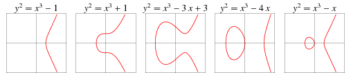
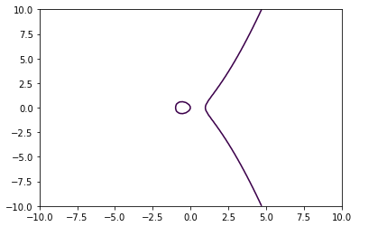
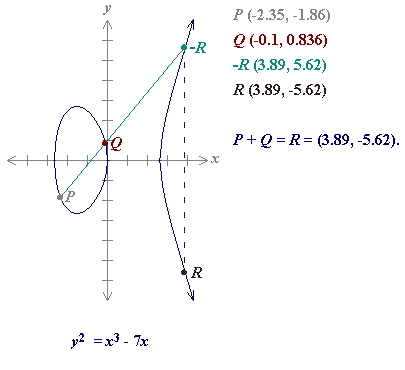
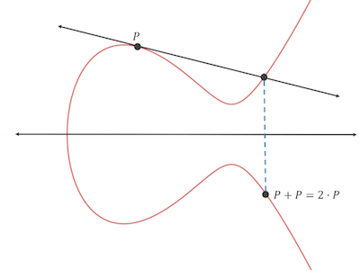
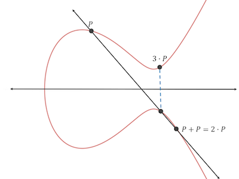

<!--more-->

# ECC算法

## 直观认识什么是椭圆曲线

椭圆曲线，指的是满足这个**维尔斯特拉斯通用式**的曲线：

\\[ y\^\{2\} = x\^\{3\} + ax + b , 且 4a\^\{3\} + 27 b\^\{2\} ≠ 0 \\]

判别式([discriminant](https://en.wikipedia.org/wiki/Discriminant) )不为0时，曲线才没有奇异点，才能用于加密。



到这里就能发现椭圆曲线第一个特点：**整个曲线是关于x轴对称的**。

各类加密货币使用的椭圆曲线代号是secp256k1，长这样子：


用这个[在线工具](https://hub.mybinder.org/user/ipython-ipython-in-depth-qhl9ondm/notebooks/binder/Untitled1.ipynb?kernel_name=python3)可以打印椭圆曲线：

```python
import numpy as np
import pylab as pl

def f(x):
    return x**3 - x  # 替换掉这个方程，然后重新run

Y, X = np.mgrid[-10:10:100j, -10:10:100j]
pl.contour(X, Y, Y**2 - f(X), levels=[0])
pl.show()

```



## ECC算法细节

### 曲线基本特点

- 如果一条（不垂直于x轴的）直线与椭圆曲线相交（有2个相交点），那么必然存在第三个相交点。（证明过程？）
- 第三个点相当于公钥
- 椭圆曲线关于x轴镜像对称

### 无穷远点0 [Point at infinity](https://en.wikipedia.org/wiki/Point_at_infinity)

无穷远点，或理想点，指理想化地认为一条直线在无穷远处有一个终点，一般以0表示。

### 椭圆曲线上的点的取反操作

因为椭圆曲线关于x轴对称，所以可定义：

对于任意椭圆曲线上的点P，对P取反后得到-P，-P为P关于x轴镜像对称点。

### P + Q = R

前面已经提到，任意直线与椭圆曲线如果相交，那么必然有3个相交点。（记得相交线不能和x轴垂直）

在椭圆曲线加密算法中，定义了一个阿贝尔群，该群的的加法操作定义如下：

对于任意相交点P、Q、-R（这里取反是有意义的），若P!=-Q，有等式 P + Q + (-R) = 0 成立，即 P + Q = R。

- 首先要注意，这个加法并不是欧氏几何加法，例如看下图， P + Q在欧氏几何中的结果是（-2.45，-1.024），而不是（3.89，5.62）
- 该定义中，要求P!=-Q，也是有深意的：如果P=-Q，说明P和Q是关于x轴对称的2个点，那么P和Q应是R和-R，所以P!=-Q这个前提条件保证了P和Q不是那个特殊的R



### base point P

在椭圆曲线加密算法中，第一步是定一个基准点P。

第二步是，找出从P到P的直线方程。此时会疑惑2个一样的点怎么构成直线，当然是可以的，这个直线是**经过P点的和椭圆曲线相切的切线**：


根据前面小节的说明，这条切线必然会与椭圆曲线相交于另外一点-R，又因为P + Q = R（-R的镜像点），所以有 P + P = 2P = R：




这一个过程还可以迭代下去：因此此时已有P和2P两个点，如果让它们相加，即 P + 2P，那么又会得到新的一个镜像点3P：



继续迭代这个过程，就能得到4P、5P、6P······


### nP + rP = (n+r)P

假设现在要求出10P，那么按上一节的迭代算法，就需要计算：

\\[ P+P+P+P+P+P+P+P+P+P \\]

这是很慢的过程，不过可以用群加法其中一个性质来加速：

\\[ nP + rP = (n+r)P \\]

当然还是不能一步到位，而是从9次加法变成了4次加法：

\\[ P + P = 2P \\]

\\[ 2P + 2P = 4P \\]

\\[ 4P + 4P = 8P \\]

\\[ 2P + 8P = 10P \\]

### x为大数时，xP的计算问题

假设x是一个超大正整数，例如有256bits，32个字节这么大。那么要得到xP，得做多少次群加法呢？

这是个二进制的问题。首先假设x等于十进制的246（值很小，只用一个字节就能表示，是为了讨论方便），并把x二进制展开（binary expansion，是叫二进制展开吧？）：

\\[ 2\^\{7\} + 2\^\{6\} + 2\^\{5\} + 2\^\{4\} + 2\^\{2\}  + 2\^\{1\}  = 128 + 64 + 32 + 16 + 4 + 2 = 246 \\]

等式两边都乘以P：

\\[ 2\^\{7\}P + 2\^\{6\}P + 2\^\{5\}P + 2\^\{4\}P + 2\^\{2\}P  + 2\^\{1\}P  = 246 P \\]

此时x=246的xP问题就解决了：先算出一系列\\(2\^\{n\} P\\)，n从0到255（255次群加法），然后用5次群加法就得到了246P，总共需要260次群加法。

当x的256bits都为1，即x取最大值时，也只需要做255+255=510次群加法。

### 逆向求xP的x

假设Bob和Alice玩一个椭圆曲线的游戏：Bob先保密地随机取一个256bits的x，并算出X = xP，把X点坐标告诉Alice；Alice也知道这个椭圆曲线方程以及P点，那么Alice是否可以求出x的值？

再复述下Alice掌握的信息：

- 椭圆曲线方程，如：\\(y\^\{2\} = x\^\{3\} - 7x \\)
- P点坐标，如：（-2.35, -1.86）
- X点坐标，如：（123.456，789.123）（瞎写的）

Alice是否可以知道X是做了多少次对P的群加法得到的？如果能，需要多久？

答案是，现在世界上并没有一个快速算法求出x。唯一可行的笨办法是，遍历整个256bits范围的整数集，从1P开始，不断+P，直到发现nP=X，此时的n就是要求的x。

也有同样复杂度的逆算法：不断对X减P，直到减完时刚好就是P，此时统计减的次数，就是x了。

x落在\\( \[0, 2\^\{256\} - 1\] \\)，平均值为\\( 2\^\{128\} \\)。因此平均需要暴力地做2^128次群加法。

### 公钥私钥

基于上一节的讨论，x和X适合用来做非对称加密的私钥公钥：

- 私钥：大数x
- 公钥：椭圆曲线上的坐标X

非对称加密的公钥私钥必然要满足一个性质：给定一个公钥，很难去推导出它对应私钥。可见，x和X满足这个性质。

但X、x公钥私钥对并不能直接用于加密数据。这个事情后面再说。

### 谁才是主人公？持有私钥证明 part1

Bob持有私钥x，是事实，但Bob怎么向别人证明自己持有X对应的私钥x呢？

这个事情有点复杂，首先要改进下椭圆曲线的模型。

上面的椭圆曲线模型有个问题：xP这个点的坐标x、y可能会超大，x和y加起来可能大过一个公钥的存储极限，例如512bits。

解决方案是：在有限域上定义一个椭圆曲线。为此有2个新的限制：

- 坐标点的分量限制为整数
- 坐标点的分量取值范围不是无穷远

公式上的改变如下：

把 \\( y\^\{2\} = x\^\{3\} + ax + b\\) 改成：

\\[ \( y\^\{2\} \) \% p = \( x\^\{3\} + ax + b \) \% p\\]

p是一个大质数，例如在secp256k1椭圆曲线中，p的取值是【0, \\( 2\^\{256\} \\) 】范围内的最大质数。

这么一转换后，椭圆曲线就变成大概这样子的东西：


离散的点集，但仍然有关于x轴的对称性。

而且，前面讨论的东西仍然是有效的。

### 谁才是主人公？持有私钥证明 part2

如何才能在不暴露x的前提下告诉别人“我”持有私钥呢？

首先拿出前面提到的加法结合律：

\\[ n \cdot P + r \cdot P = ( n + r ) \cdot P \\]

然后把n替换为这个东西：

\\[ hash(m, \ r \cdot P) \cdot n \\]

得到：

\\[ hash(m, r \cdot P) \cdot n \cdot P + r \cdot P = ( hash(m, r \cdot P) \cdot n + r ) \cdot P \\]

引入了一个新的m，以及关于m和rP的hash函数。

假设\\(n \cdot P = X \\)（X就是公钥X），代入上式，得到：

\\[ hash(m, r \cdot P) \cdot X + r \cdot P = ( hash(m, r \cdot P) \cdot n + r ) \cdot P \\]

又因为\\(n \cdot P = X \\)，所以有n = x（x就是私钥x），继续代入，得到：

\\[ hash(m, r \cdot P) \cdot X + r \cdot P = ( hash(m, r \cdot P) \cdot x + r ) \cdot P \\]

此时再设2个新的对象R和s：

\\[ R = r\cdot P \\]

\\[ s = hash(m, R)\cdot x + r \\]

把R代入上面的方程，变成：

\\[ hash(m, R) \cdot X + R = ( hash(m, R) \cdot x + r ) \cdot P \\]

然后再代入s，最终得到：

\\[ hash(m, R) \cdot X + R = s \cdot P （持有私钥证明方程）\\] 

这条方程就是**持有私钥证明**了：谁能够给出任意m、R、s，使得m、R、s代入上述方程使得等式成立，那么这个人就必然持有私钥x。

那么对持有人来说，怎么得到m、R、s呢？很简单：

1. 随机生成m
2. 随机生成r
3. 计算\\( R = r\cdot P \\)
4. 计算\\( s = hash(m, R)\cdot x + r \\)

这里提2个问题。一个是私钥安全问题：

对第三者来说，未知数是r和x，假设r泄露了给第三者，那么第三者就可以根据第4步的式子的变换，导出私钥x：

\\[ x =  \frac \{ s - r \} \{ hash(m, R) \} \\]

所以r必须是用完就丢的。因为持有者只需要给出R就足够用予持有私钥证明。

另一个是暴力破解问题：

第三者是否可以暴力地找到合适的m、R、s代入持有私钥证明方程，使得方程成立？

假设可行，那么第一步应是先任意找出一组合适的参数：h( h = hash(m, R) )、R、s，使得\\( hash(m, R) \cdot X + R = s \cdot P \\) 成立，这肯定是办得到的。

然后下一步是，解出一个m，使得hash(m, R) = h成立。然而，如果选择了一个优质的[cryptographic hash functions](https://en.wikipedia.org/wiki/Cryptographic_hash_function)，是很难办到的。这也被称为原像攻击（[Preimage attack](https://en.wikipedia.org/wiki/Preimage_attack) )，即给定hash值，找出能hash出这个值得输入。


### ECC的应用：数字签名（ECDSA）

前面已经论证了只有私钥持有者能给出m、R、s三元组，那么当m是一段有意义的消息(依然是一段字节序），而与这个m匹配的R、s，就成为这个消息m的**签名**了。

因为攻击者理论上并不能用自己随意篡改的m'，使得m'、R、s能成功代入持有私钥证明方程。


### ECC的应用：比特币

简单来说，要生成一个新的比特币钱包，需要先随机生成一个256bits的私钥x，然后根据比特币所用的椭圆曲线参数（secp256k1），计算X = xP，X就是这个钱包的公钥。

然后呢，X大有所为，X可以随便公开，X相当于钱包的银行账号，例如比特币转入这个钱包，就需要用到X。

转入问题是解决了，但怎么证明你是这个钱包的主人，并转出（消费）比特币呢？答案就是用上一节的方法，做一个持有私钥声明（即数字签名），转出事务广播开后，每个人都可以简单地验证这个持有声明的真伪性。

如果去观察比特币的事务消息，就会发现他它的数字签名部分就是一个椭圆曲线上的某坐标R和一个随机的256bits的s的组合。


### ECC的参数集合（Elliptic Curve Domain Parameters）

纠正下前面介绍ECC相关参数的命名。

椭圆曲线算法有很多参数，被称为Elliptic Curve Domain Parameters：

- a：椭圆曲线方程\\( y\^\{2\}  = x\^\{3\} + ax + b \\) 里的a
- b：椭圆曲线方程\\( y\^\{2\}  = x\^\{3\} + ax + b \\) 里的b
- G：即上文说的P，椭圆曲线上任意取得基准点坐标
- p：质数p，用来控制值域范围的
- n：基准点G的阶(order)，即使得nG=0(无穷远点)的最小正整数。
- h：辅因子(cofactor)，h等于\\( \frac \{1\}\{n\} | E(F\_\{p\}) | \\)。当h为最理想的1时，整个点群#E都可以被使用，否则，可用的点群大小只有#E/h。


可以这样理解n：nP = iP + jP = 0, 即椭圆曲线上某2个点iP、jP，它们的和nP为无穷远点，即经过iP、jP的直线垂直于x轴，当i+j=n取到最小值时，即为G点的阶。


（观察此图，发现5P + P = 6P = 0，P点的阶为6。[进一步阅读](https://math.stackexchange.com/questions/704202/order-of-a-point-on-an-elliptic-curve) ）

当阶数n和#E一样大时，h取到最佳值1。h的计算，必然要先理解透彻群论的知识，这里不做展开，可以阅读这2个链接：

https://math.stackexchange.com/questions/1394251/calculating-elliptic-curve-cofactor-h

https://en.wikipedia.org/wiki/Hasse%27s_theorem_on_elliptic_curves


### ECC的应用：加密通讯 [ECDH](https://en.wikipedia.org/wiki/Elliptic-curve_Diffie%E2%80%93Hellman)

要仅仅用ECC来加密数据，那么就要用到[ECIES](https://en.wikipedia.org/wiki/Integrated_Encryption_Scheme)这个。

ECIES，即基于椭圆曲线的整合加密方案，与其类似的还有基于离散对数的整合加密方案 (DLIES)。

ECIES，也被称为Elliptic Curve Augmented Encryption Scheme（基于椭圆曲线的增强加密方案） 或简单地叫 Elliptic Curve Encryption Scheme（基于椭圆曲线的加密方案）。

Anyway，先以一个例子介绍下ECIES：Alice和Bob进行加密通讯。

通讯前准备：

- 一个椭圆曲线和参数集合(p,a,b,G,n,h)
- Bob的公钥\\( K\_\{B\} \\)。\\( K\_\{B\} = k\_\{B\}G , k\_\{B\} \in [1, n - 1] \\), \\( k\_\{B\} \\)是Bob自己随机生成的私钥。注意，\\( k\_\{B\} \\)是值, 而\\( K\_\{B\} \\)是一个椭圆曲线上的点。
- 双方共享信息： \\( S\_\{1} ，S\_\{2}\\) （nonce）

加密流程；


1. 生成随机数r，计算R = rG
2. 计算\\(P = (P\_\{x\}, P\_\{y\}) = rK\_\{B\} \\)，取P的x分量\\(P\_\{x\}\\)作为共享密钥S。
3. 用KDF密钥导出函数，导出定长的对称加密密钥\\(k\_\{E\} \\)和MAC密钥\\(k\_\{M\} \\)，\\( k\_\{E\} || k\_\{M\} = KDF(S || S\_\{1}) \\)
4. 加密消息：\\( c = E( k\_\{E\}, m) \\)，E代表Encrypt函数。
5. 计算MAC：\\( d = MAC(k\_\{M\}, c|| S\_\{2}) \\)
6. 输出\\(R || c || d\\)


解密流程： （ Bob已收到\\(R || c || d\\) ）

1. Bob先求出Alice也在使用的共享密钥\\(P\_\{x\}\\), \\(P = (P\_\{x\}, P\_\{y\}) = rK\_\{B\} = rk\_\{B\}G = k\_\{B\}R \\)，R是Alice发来的，\\( k\_\{B\} \\)是本地的。
2. Bob也用一样的方法求出2个密钥，\\( k\_\{E\} || k\_\{M\} = KDF(S || S\_\{1}) \\)
3. 检查收到的d和自己算的d‘是否一致，不一致的话说明c被中间人篡改了：\\( d' = MAC(k\_\{M\}, c|| S\_\{2}) \\) 
4. 此时就可以用对称加密密钥，解出消息m：\\( m = E\^\{-1}(k\_\{E\}, c) \\) ，\\(E\^\{-1}\\)代表Decrypt函数（一般等同于Encrypt函数）。


其实这个流程就是非常著名的**ECDH算法**了。Alice和Bob利用ECC算法，进行了**密钥交换**，得到了\\( P\_\{x\} \\)。

资料： 

https://crypto.stackexchange.com/questions/31602/how-does-encryption-work-in-elliptic-curve-cryptography

### 补充：已知P、Q，怎么求R

这个问题其实是解方程组问题，一个是直线的方程: \\(y = kx + c\\)，一个是椭圆曲线的方程：\\( y\^\{2\} = x\^\{3\} + ax + b  \\)。

（推荐一个在线解方程组的工具：[wolframalpha](http://www.wolframalpha.com/) )

以这幅图为例：


假设已知的只有：

- 椭圆曲线方程：\\( y\^\{2\} = x\^\{3\} - 7x \\)
- P(-2.35089, -1.86107)
- Q(-0.0999884, 0.836014)

现在目标是求，直线与曲线的第三个交点R(应该叫-R）的坐标。

第一步，化解方程组:

\\[ y = kx + m， y\^\{2\} = ax\^\{3\} + bx\^\{2\} + cx + d \\]

\\[ (kx + m)\^\{2\} = ax\^\{3\} + bx\^\{2\} + cx + d \\]

\\[ 0 = ax\^\{3\} + (b - k\^\{2\}) x\^\{2\} + (c - 2km)x + d -  m\^\{2\}\\]

本例的椭圆方程的系数为：

\\[ a = 1, b = 0, c = -7, d = 0\\]

代入上式，得到：

\\[ 0 = x\^\{3\} - k\^\{2\}x\^\{2\} - (7 + 2km)x - m\^\{2\}\\]


第二步，搬出[韦达公式](https://en.wikipedia.org/wiki/Vieta%27s_formulas)，对于一元三次方程，它的根之间有如下关系式：


用到我们这里，就是：

\\[ x\_\{1\} + x\_\{2\} + x\_\{3\} = -\frac \{b\}\{a\} =  -\frac \{ -k\^\{2\} \}\{1\} = k\^\{2\} \\]

\\[ x\_\{1\} * x\_\{2\} * x\_\{3\} = -\frac \{d\}\{a\}  = -\frac \{ -m\^\{2\} \}\{1\} = m\^\{2\} \\]

\\[ x\_\{1\}x\_\{2\} + x\_\{2\}x\_\{3\} + x\_\{1\}x\_\{3\} = \frac \{c\}\{a\} = \frac \{- (7 + 2km)\}\{1\} = - (7 + 2km) \\]

又因为\\(x\_\{1\}、x\_\{2\}、x\_\{3\}\\)其实就是\\( P\_\{x\}、Q\_\{x\}、R\_\{x\} \\) ，所以有：

\\[ R\_\{x\} =  k\^\{2\} - (P\_\{x\} + Q\_\{x\}) \\]

这样就求出了\\(R\_\{x\} \\)。而R的y分量可以用斜率公式推出：

\\[ \frac \{ R\_\{y\} - P\_\{y\} \} \{  R\_\{x\} - P\_\{x\} \} = k \\]

\\[ R\_\{y\} = k (R\_\{x\} - P\_\{x\} ) + P\_\{y\} \\]

这里面还有个未知数斜率k，也是用斜率公式求出：

\\[ k = \frac \{ Q\_\{y\} - P\_\{y\} \} \{  Q\_\{x\} - P\_\{x\} \} = 1.19822222 \\]

最终的：

\\[ R\_\{x\} =  (1.19822222)\^\{2\} - ((-2.35089) + (-0.0999884)) = 3.8866148938271605 \approx 3.89 \\]

\\[ R\_\{y\} = (1.19822222) (3.8866148938271605 - (-2.35089) ) + (-1.86107) = 5.6128469750035 \approx 5.61 \\]

\\[ -R = (3.89, 5.61)，R = (3.89, -5.61) \\]

和图片里的数值一样。
