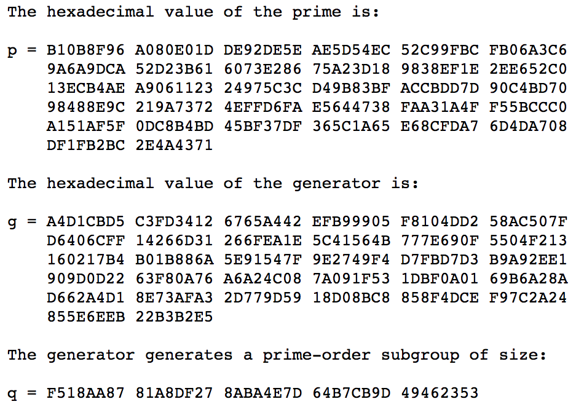

<!--more-->

# DH算法

## key exchange例子（ [from here](https://scotthelme.co.uk/perfect-forward-secrecy/) )：

1. Alice和Bob首先线下商量好，使用**p (prime, 质数) = 23、g (generator, 生成器) = 5**作为通讯基础（p和g不需要绝对的保密，泄露了也没事）
2. 每次Alice和Bob想要建立通讯(连接)时，Alice自己随机生成一个在范围[1, p - 1]的数：a = 6
3. 同样，Bob自己也随机一个：b = 15
4. Alice计算： \\( A =  g\^\{a\}  \% p =  5\^\{6\}  \% 23 =  15625 \% 23 = 8 \\)，把A发给Bob
5. Bob计算： \\( B =  g\^\{b\}  \% p =  5\^\{15\}  \% 23 =  30517578125 \% 23 = 19 \\)，把B发给Alice
6. Alice收到B后，可计算出**对称密钥**：\\( s\_\{Alice\} =  B\^\{a\}  \% p =  19\^\{6\}  \% 23 = 47045881 \% 23 = 2 \\)
7. Bob收到A后，可计算出**对称密钥**：\\( s\_\{Bob\} =  A\^\{b\}  \% p =  8\^\{15\}  \% 23 = 35184372088832 \% 23 = 2 \\)

## 数学原理

其中，用到了**模幂运算**的基本定理，对于任意自然数a、b、n，有：

\\[ ab\  \%\  n =  ( ab\ \%\  n) \  \%\  n =  ( (a\ \%\  n)  (b\ \%\  n) ) \ \%\  n \\]

应用到幂运算：

\\[ a\^\{b\}\  \%\  n =  ( a \\cdots  a ) \  \%\  n =  ( (a\ \%\  n) \\cdots  (a\ \%\  n) ) \  \%\  n =  ( \ (a\ \%\  n)  \^\{b\}\  ) \ \%\  n \\]

\\[ a\^\{b\}\  \%\  n =  ( a\^\{b\}\ \%\  n) \  \%\  n \\]

观察这2个式子最右边，发现b的位置是可以移动的：

\\[ ( \ (a\ \%\  n)  \^\{b\}\  ) \ \%\  n  =  ( a\^\{b\}\ \%\  n) \  \%\  n \\]

套进上一节的例子里的推导公式，得到：

\\[ s\_\{Alice\} = B\^\{a\} \% p = (\  (\  g\^\{b\} \% p\  ) \^\{a\}\   ) \% p = (  \ g\^\{ab\} \% p\  \  ) \% p =  \ g \^\{ab\} \% p \\]

同理：

\\[ s\_\{Bob\} = A\^\{b\} \% p = (\  (\  g\^\{a\}  \% p\  ) \^\{b\}\   ) \% p = (  \ g\^\{ab\} \% p\  \  ) \% p  =  \ g \^\{ab\} \% p \\]

显然有：

\\[  s\_\{Alice\} = s\_\{Bob\}  \\]

这样就协商出了对称的密钥，密钥实质等于：

\\[ g \^\{ab\} \% p \\]

其中，g、p可公开、a、b保密。

## 为什么可行

从攻击者角度看，攻击者最多只能获得以下信息：

- p：23
- g：5
- A：8
- B：19

攻击者目标是获得s（serect）。要计算s，就是算2条式子：

\\[ s = ( B\^\{a\} ) \% p \\]

\\[ s = ( A\^\{b\} ) \% p \\]

显然，攻击者只需要破解出a或b，就能得到s。

又因为有：

\\[ A = ( g\^\{a\} ) \% p \\]

\\[ B = ( g\^\{b\} ) \% p \\]

所以破解a或b的方法是：

\\[ a = log\_\{g\}\^\{A\} \% p \\]

\\[ b = log\_\{g\}\^\{B\} \% p \\]

这看似很简单的算术（对数运算和取模运算），其实是很难算的。目前为止没有找到一个快速计算对数的算法。

关键在于**p这个素数要足够大**，那么以现在的计算机计算速度，就很难通过A（或B）、g、p这3个参数算出a，这被称为[离散对数难题](https://en.wikipedia.org/wiki/Discrete_logarithm)。

这里需要注意，难的是**离散对数**，即有log和mod运算并且参数是整数；若单单只有log运算，是不难的。

## p、g的选取问题

涉及到了一些数论的概念：

- [最大公约数gcd](https://en.wikipedia.org/wiki/Greatest_common_divisor)
- [数论阶](https://en.wikipedia.org/wiki/Multiplicative_order)
- [原根](https://en.wikipedia.org/wiki/Primitive_root_modulo_n)

首先明确下：

- p必须是素数，且必须是大数(1024-2048bits)，算法才安全
- g不需要是素数，且不需要很大

p、g不需要自己挑选，可以直接用[rfc5114](https://tools.ietf.org/html/rfc5114)给定的值。

例如[1024-bit MODP Group with 160-bit Prime Order Subgroup](https://tools.ietf.org/html/rfc5114#section-2.1):

再讲下去就是深入密码学、数论了，按住不表。

