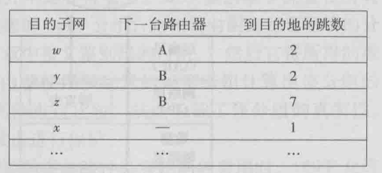
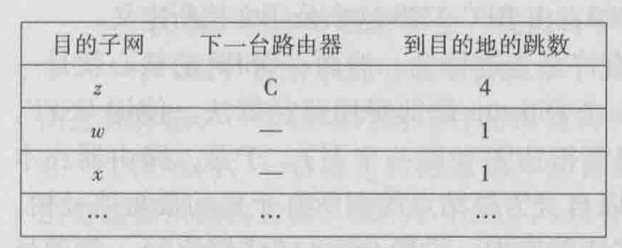
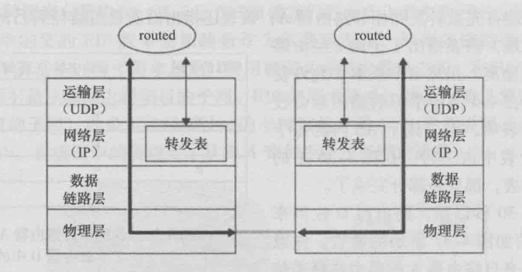

<!--more-->

# 网络层

- 是否对ip包分片，取决于输出链路的mtu，如果包大小大于mtu（可能500多到1500字节），那么就会自动分片
- 分片有3个不可或缺字段：ip包的唯一标识（ID)、字节偏移offset、结束标志（0或1，1表示还没结束，0表示当前已是最后一个片）
- 分片是ipv4的机制，且有安全问题，ipv6没有分片，杜绝了安全隐患
- 分片重组是在目的地端主机上进行的，路由器只可能做分片，而不会做重组

- 主机和物理链路之间的边界叫做接口
- 每个接口有自己的ip地址，所以ip地址技术是与接口关联，而不是和主机或路由器
- 子网：直接互联并与其他网络岛隔离的主机接口+路由器接口组成子网
- 子网掩码：例如223.1.1.0/24，/24就是子网掩码

- 网络层有三个主要组件：IP协议、路由选择协议(RIP、OSPF、BGP）、因特网控制报文协议ICMP

查看和修改系统的mtu值：

查看：

ifconfig eth0

修改：

ifconfig eth0 mtu 1460

## DHCP动态主机配置协议

四大步骤：

1. DHCP发现报文，用UDP，端口67，src ip为0.0.0.0，dst ip为255.255.255.255，广播一个发现报文，报文里包含一个事物ID。
2. DHCP提供报文，DHCP服务器收到广播而来的发现报文后，用一个提供报文做响应，src ip为自己的ip，dst ip为255.255.255.255，也是广播。因为DHCP服务器不一定唯一，所以客户机有选择权。提供报文包含，收到的发现报文的事物ID、向客户推荐的IP地址、IP地址的掩码、IP地址租用期（address lease time），租用期一般为几小时到几天。
3. DHCP请求报文，客户机从1到多个提供报文中选择一个，并向该服务器发送DHCP请求报文。
4. DHCP ACK报文，就是第三步的响应报文，告诉客户配置参数。

第四步完成后，客户就可以在租用期里使用这个ip。另外，DHCP也有延长租用期的办法。

## NAT网络地址转换

- NAT是用来解决ipv4的ip地址不够用问题的
- NAT会使得外部主机不能直接访问内网主机（内网主机不可见），因为内网主机没有自己的全球唯一ip地址
- NAT用一张转换表来双向转发数据包
- 内网主机可以主动访问外网，反过来就不行
- NAT的存在对实现p2p应用很不好
- 应用NAT穿越技术，可以改善p2p应用的通讯问题

NAT穿越：https://www.jianshu.com/p/84e8c78ca61d

## ICMP控制报文协议

- 常用于差错报告，例如目的地不可达时，中间路由器就会返回类型3的ICMP报文
- ICMP协议是建立在IP协议上面的，因为是用IP分组承载的。类似TCP、UDP。但一般认为ICMP是属于网络层的协议。
- ICMP报文组成：类型、编码。编码可理解为大类型里的子类型。[wiki](https://en.wikipedia.org/wiki/Internet_Control_Message_Protocol)

ping程序： 发一个ICMP[8,0]报文，目的主机发回一个ICMP[0,0]的报文。

源抑制报文：从wiki可以看到已经deprecated了，最初是用来做拥塞控制的，不过tcp自己有拥塞控制，所以没卵用。

traceroute：原理就是发送一系列IP数据报，每个数据报携带UDP报文，目的地ip为目标主机，端口号设置为不可达的端口号。关键的，第一个数据报的TTL设为1，第二个的TTL为2，以此类推。当第n个数据报到达第n台路由器时，第n台路由器发现这个数据报的TTL正好过期，然后就会发给源主机一个ICMP[11,0]，携带了该路由器的ip地址。然后每个数据报都设置了定时器，收到回复时就可以算出往返延迟RTT。

traceroute还有个问题是何时停止发送udp报文，这是通过ICMP的类型和编码字段判断的，因为如果目的地主机在线，那么最终会返回一个ICMP[3,3]，表示目的主机端口不可达。

## ipv6

改进：

- 去掉了分片功能，因为分片功能是耗时操作，去掉后能提高路由器性能
- 没有分片后，如果包太大，就无法发进链路层，只能丢弃，并返回ICMP差错报文，让发送方重新发一个小的
- 去掉了首部校验和，因为传输层协议、链路层协议也会做校验和，所以多余了。另外，因为IP头部有个动态的跳数，会导致每次修改跳数都得重新计算校验和，影响性能。
- 选项字段从IP首部去掉，但依然可以存在选项，方法是用“下一个头部”字段来实现，就是说选项信息是一个可选的头部。
- 去掉了选项后，ipv6的头部就是定长的40字节，非常高效。

2个ipv6主机之间通讯，可能会经过一段由仅支持ipv4的主机组成的路径，这时可以用隧道技术，把ipv6分组，放到ipv4分组的有效载荷里。

## 路由选择算法

全局式算法：路由器拥有网络拓扑信息、连通信息、链路费用信息，从而算出最优路径。也称为链路状态算法。链路费用一般取决于链路承载流量。

分散式算法：路由器没有网络链路信息，而只需要拥有和路由器直接相连链路的费用信息就可开始工作。通过迭代、和邻居交换信息，就能逐渐计算出到达某目的地结点的最低费用路径。

静态算法：依靠人工。

动态算法：拓扑或负载变化时更新。不过容易受**路由选择循环、路由震荡**影响。

负载敏感算法：链路费用会动态地变化，以反映链路拥塞情况。

负载迟钝算法：相反的，对拥塞不敏感，费用固定。更普遍可行的方法。

路由震荡：用随机化的链路通告时间，可以改善震荡。

LS链路状态算法：基于无向图最短路算法。最坏情况n平方。

DV距离向量算法：是一种迭代、异步、分布式的算法。

## 互联网当前的路由算法

### RIP，**路由选择信息协议**

- 路由选择表（routing table），也叫RIP表，包含该路由器的距离向量、转发表。
- 目的子网，就是把目的地路由器当成一个子网网络
- 跳数，理解为到目的子网的链接边数即可

转发表的结构：目的子网，下一台路由器，到目的子网的跳数。每个子网占一行。

转发表的状态是迭代的，不可能是实时获得整个网络的状态信息。

邻居路由器之间会互相通告最新的转发表信息。大概30秒一次。

如果邻居超过180秒没有发来报文，认为不可达，更新自己的路由表，并向其他存活的邻居发公告。

每次收到转发表信息，都可能导致当前路由器的所知的到达某个子网的跳数、下一跳路由器信息，产生更新，因为新的路径（跳数）可能会更短。

路由器可以主动询问邻居**到指定目的地的费用**（RIP请求报文）。基于UDP 520端口。

**RIP是一个基于传输层UDP协议的应用层进程（叫routed），用UDP来控制IP路由。**这也是一个特殊进程，因为它可以操作系统内核的转发表。

routed会和邻居路由器的routed进程相互联系。

### OSPF

- 被设想为RIP的后继者，因为有许多先进特性
- 洪泛链路状态信息的链路状态协议 + Dijkstra最低费用路径算法
- 是基于完整信息状态的算法
- 各条链路费用可用网络管理员配置，如果都设为1，则退化成**最少跳数路由选择（RIP）**
- 管理员可以根据带宽大小来设置链路费用，反比，带宽越大，费用越低。
- 路由选择信息是广播到整个网络的，而不仅仅是邻居
- 当一跳链路状态（费用、连接/中断）变化时，更新并广播
- 即使无变化，也要定期广播
- OSPF报文直接承载于IP层，所以OSPF要自行实现可靠传输，链路状态广播功能。

