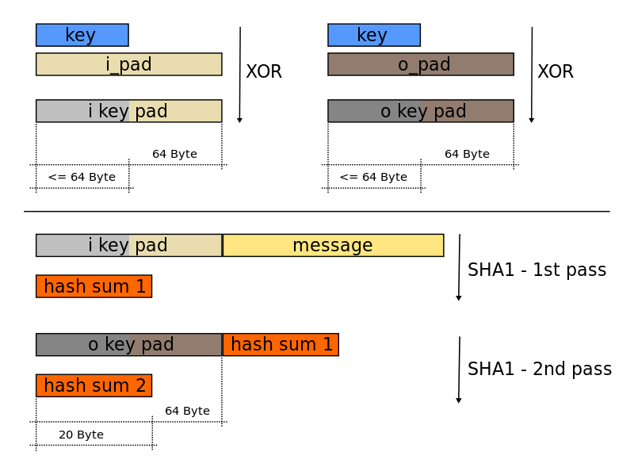

本文将简单介绍[rfc5869](https://tools.ietf.org/html/rfc5869)提出的HKDF。

<!--more-->

# HKDF = HMAC + KDF

## [HMAC](https://en.wikipedia.org/wiki/HMAC)，基于Hash的MAC算法

HMAC是指Hash-based的MAC算法，hash函数是可选的，例如存在这些HMAC实现：

- HMAC_MD5
- HMAC_SHA1
- HMAC_SHA256

虽然hash函数可选，但HMAC是有严格的定义的：

\\[ HMAC(k, m) = H ( (k \oplus opad) || H( (k \oplus ipad) || m) ) \\]

伪代码:

```js
function hmac (key, message)
    opad = [0x5c * blocksize] // Where blocksize is that of the underlying hash function
    ipad = [0x36 * blocksize]

    if (length(key) > blocksize) then
        key = hash(key) // Where 'hash' is the underlying hash function
    end if

    for i from 0 to length(key) - 1
        ipad[i] = ipad[i] XOR key[i]
        opad[i] = opad[i] XOR key[i]
    end for

    return hash(opad || hash(ipad || message)) // Where || is concatenation
end function

```

代码逻辑和上面的公式是一致的，一共调用了2次hash函数，2次异或操作，2次concat操作。

唯一特别的是多了一个if的判断：如果key的长度比要求的blocksize还长，那么需要缩短，方法是用hash函数hash一下这个key，从而变成blocksize长度。

HMAC的图解如下(from wiki)：




## [KDF](https://en.wikipedia.org/wiki/HKDF)， key derivation function, 密钥导出函数

KDF是加密系统中十分基本和必要的组件。KDF的任务是，**给定某初始密钥材料(IKM，initial keying material)，以及可选的salt，导出1或多个密码级强度的密钥**。

## HKDF

HKDF是基于HMAC的KDF，功能上和其他KDF没什么区别。

HKDF分两个步骤：

1. extract
2. expand

### extract

接口定义：

```c
HKDF_Extract(salt, IKM) -> PRK
```

   Options:
      Hash     a hash function; HashLen denotes the length of the
               hash function output in octets

输入：

- salt: 可选的“盐”，如果不提供，则默认为0串
- IKM: 初始密钥材料

输出：

- PRK: 定长的伪随机密钥


用HMAC_Hash(key, message)实现HKDF_Extract：

```c
HMAC_Hash(salt, IKM) -> PRK
```


### expand


接口定义：

```c
HKDF_Expand(PRK, info, L) -> OKM
```

输入：
- PRK：HKDF_Extract的输出
- info：可选的上下文信息，默认是空字符串“”
- L：指定输出的OKM的字节长度，不能超过255*HashLen

输出:

- OKM: 输出密钥材料

HKDF_Expand的伪代码：

```c
   N = ceil(L/HashLen)
   T = T(1) | T(2) | T(3) | ... | T(N)
   OKM = first L octets of T

   where:
   T(0) = empty string (zero length)
   T(1) = HMAC_Hash(PRK, T(0) || info || 0x01)
   T(2) = HMAC_Hash(PRK, T(1) || info || 0x02)
   T(3) = HMAC_Hash(PRK, T(2) || info || 0x03)
   ...

   // 0x01 0x02 0x03是递增的单字节常量
```

