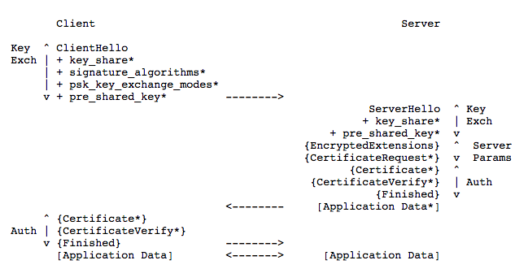

直到此时，TLS1.3的RFC已更新到版本[28](https://tools.ietf.org/html/draft-ietf-tls-tls13-28)，更新于2018年3月。本文是阅读RFC过程中产生的一些笔记。本文仅关注TLS1.3，和兼容TLS1.2相关的内容将忽略。

## 内容结构

- 介绍
	- [和TLS1.2的区别](#1.3)
- 协议概览
	- [不正确的DHE Share](#2.1)
    - [会话恢复和PSK](#2.2)
    - [0-RTT 数据](#2.3)

<!--more-->

## 介绍

### 
和TLS1.2的区别

- 仅认可支持AEAD的对称加密算法。
- 0-RTT模式被加入规范。代价是损失一定的安全性。
- 静态RSA和DH加密套件已经被移除；现在所有基于公钥的密钥交换机制都提供了前向安全
- 在ServerHello后的所有握手消息都被加密（EncryptedExtension）
- 密钥导出函数被重新设计。其实就是指HKDF。
- 握手状态机被重构，并移除ChangeCipherSpec这个多余的东西。
- 椭圆曲线算法被列入规范，并移除了对point format的协商。
- 移除了压缩机制（这个对web应用挺伤啊）、自定义DHE组、改了RSA的padding、移除了DSA。
- TLS1.2版本协商机制已废弃，改为用版本列表扩展机制。
- 会话恢复（Session resumption）统一改为用新的PSK交换机制。

## 协议概览

TLS支持三种基本的密钥交换模式：

- (EC)DHE 
- PSK-only
- PSK with (EC)DHE

下图展示了TLS全握手过程：

握手有3个阶段：

- 密钥交换（Key Exchange）: 建立共享的密钥材料，以及选定加密参数。这个阶段之后的所有消息都是加密的。

- 服务器参数（Server Parameter）: 建立其他握手参数，如客户端是否需要被认证、支持什么应用层协议···

- 认证（Authentication）: 认证服务器（客户端的认证可选）、密钥二次确认、验证握手信息完整性

#### 密钥交换：

客户端发送ClientHello，其中包括：

- random nonce(ClientHello.random); 
- 客户端支持的协议版本; 
- 客户端支持的{对称加密算法、HKDF哈希}pair列表;
- a set of Diffie-Hellman keyshares或a set of pre-shared key labels或都有
- 可能的附加扩展potentially additional extensions

服务端处理ClientHello：

- 确定该连接的恰当的加密参数
- 发送ServerHello，包含连接参数

结合ClientHello和ServerHello，就能确定共享密钥了。

如果走的是(EC)DHE，那么ServerHello包含一个key_share扩展，其中含有服务器的DHE共享信息；

如果走都是PSK key，那么ServerHello包含一个pre_shared_key扩展，扩展里标识了服务器选定了客户端提供的哪个PSK。
  

#### 确定服务器参数:

   EncryptedExtensions:  responses to ClientHello extensions that are
      not required to determine the cryptographic parameters, other than
      those that are specific to individual certificates.
      [Section 4.3.1]

   CertificateRequest:  if certificate-based client authentication is
      desired, the desired parameters for that certificate.  This
      message is omitted if client authentication is not desired.
      [Section 4.3.2]

   Finally, the client and server exchange Authentication messages.  TLS
   uses the same set of messages every time that certificate-based
   authentication is needed.  (PSK-based authentication happens as a
   side effect of key exchange.)  Specifically:

   Certificate:  the certificate of the endpoint and any per-certificate
      extensions.  This message is omitted by the server if not
      authenticating with a certificate and by the client if the server
      did not send CertificateRequest (thus indicating that the client
      should not authenticate with a certificate).  Note that if raw
      public keys [RFC7250] or the cached information extension
      [RFC7924] are in use, then this message will not contain a

Rescorla               Expires September 21, 2018              [Page 20]
 
Internet-Draft                     TLS                        March 2018

      certificate but rather some other value corresponding to the
      server's long-term key.  [Section 4.4.2]

   CertificateVerify:  a signature over the entire handshake using the
      private key corresponding to the public key in the Certificate
      message.  This message is omitted if the endpoint is not
      authenticating via a certificate.  [Section 4.4.3]

   Finished:  a MAC (Message Authentication Code) over the entire
      handshake.  This message provides key confirmation, binds the
      endpoint's identity to the exchanged keys, and in PSK mode also
      authenticates the handshake.  [Section 4.4.4]

   Upon receiving the server's messages, the client responds with its
   Authentication messages, namely Certificate and CertificateVerify (if
   requested), and Finished.

   At this point, the handshake is complete, and the client and server
   derive the keying material required by the record layer to exchange
   application-layer data protected through authenticated encryption.
   Application data MUST NOT be sent prior to sending the Finished
   message, except as specified in [Section 2.3].  Note that while the
   server may send application data prior to receiving the client's
   Authentication messages, any data sent at that point is, of course,
   being sent to an unauthenticated peer.

### 
不正确的DHE Share

### 
会话恢复和PSK

### 
0-RTT 数据

