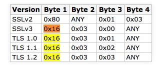

本文记录下如何用openSSL来学习TLS1.3。


<!--more-->

## 编译

1， 先下载openssl-1.1.1-pre8, 解压，进目录执行make，等生成libcrypto.a、libssl.a；

2， 创建一个my_demo目录，并创建一个test.c文件，代码如下：

```c
#include <openssl/ssl.h>

int main() {
    if (!OPENSSL_init_ssl(OPENSSL_INIT_ENGINE_ALL_BUILTIN
                          | OPENSSL_INIT_LOAD_CONFIG, NULL))
        return -1;
    printf("init success\n");
}
```

3，编译：clang（或gcc) test.c -I../include  -L../ -lcrypto -lssl

4，运行：./a.out，输出init success即正常。


为了使用openssl命令行工具，执行make install


## 调试

### [s_server](https://www.openssl.org/docs/manmaster/man1/s_server.html)和[s_client](https://www.openssl.org/docs/manmaster/man1/s_client.html)

openssl提供的测试工具，教程在[这里](https://blog.jorisvisscher.com/2015/07/22/create-a-simple-https-server-with-openssl-s_server/)。

因为本机Mac不好更新openSSL，所以我是在docker里测试TLS1.3。

先搞定安装了openSSL 1.1.1的container，跑起来，然后执行：

```
openssl req -x509 -newkey rsa:2048 -keyout key.pem -out cert.pem -days 365 -nodes -subj '/CN=www.mydom.com/O=My Dom, Inc./C=US/ST=Oregon/L=Portland' 
```

生成了自签名的公钥证书cert.pem和对应的私钥key.pem，然后启动简易服务器：

```
openssl s_server -key key.pem -cert cert.pem -www  
```

然后在浏览器打开以下地址：

https://127.0.0.1:14433/

chrome的话会提示不是安全连接，这是因为自签名公钥证书的问题。点继续，强行打开这个地址，就能访问到docker里的s_server了：

```
s_server -key key.pem -cert cert.pem -www 
Secure Renegotiation IS supported
Ciphers supported in s_server binary
TLSv1.3    :TLS_AES_256_GCM_SHA384    TLSv1.3    :TLS_CHACHA20_POLY1305_SHA256 
TLSv1.3    :TLS_AES_128_GCM_SHA256    TLSv1.2    :ECDHE-ECDSA-AES256-GCM-SHA384 
TLSv1.2    :ECDHE-RSA-AES256-GCM-SHA384 TLSv1.2    :DHE-RSA-AES256-GCM-SHA384 
TLSv1.2    :ECDHE-ECDSA-CHACHA20-POLY1305 TLSv1.2    :ECDHE-RSA-CHACHA20-POLY1305 
（略）  
---
Ciphers common between both SSL end points:
TLS_AES_128_GCM_SHA256     TLS_AES_256_GCM_SHA384     TLS_CHACHA20_POLY1305_SHA256
ECDHE-ECDSA-AES128-GCM-SHA256 ECDHE-RSA-AES128-GCM-SHA256 ECDHE-ECDSA-AES256-GCM-SHA384
ECDHE-RSA-AES256-GCM-SHA384 ECDHE-ECDSA-CHACHA20-POLY1305 ECDHE-RSA-CHACHA20-POLY1305
ECDHE-RSA-AES128-SHA       ECDHE-RSA-AES256-SHA       AES128-GCM-SHA256         
AES256-GCM-SHA384          AES128-SHA                 AES256-SHA
Signature Algorithms: ECDSA+SHA256:RSA-PSS+SHA256:RSA+SHA256:ECDSA+SHA384:RSA-PSS+SHA384:RSA+SHA384:RSA-PSS+SHA512:RSA+SHA512:RSA+SHA1
Shared Signature Algorithms: ECDSA+SHA256:RSA-PSS+SHA256:RSA+SHA256:ECDSA+SHA384:RSA-PSS+SHA384:RSA+SHA384:RSA-PSS+SHA512:RSA+SHA512:RSA+SHA1
Supported Elliptic Groups: 0xEAEA:X25519:P-256:P-384
Shared Elliptic groups: X25519:P-256:P-384
---
No server certificate CA names sent
---
New, TLSv1.2, Cipher is ECDHE-RSA-AES128-GCM-SHA256
SSL-Session:
    Protocol  : TLSv1.2
    Cipher    : ECDHE-RSA-AES128-GCM-SHA256
    Session-ID: 
    Session-ID-ctx: 01000000
    Master-Key: 3FF0D7A74290173761702ABE91C08C67B43B6ED54BE69F48F11976C4AE5C209E5EE7E097326F5726063E8121000142BA
    PSK identity: None
    PSK identity hint: None
    SRP username: None
    Start Time: 1531989327
    Timeout   : 7200 (sec)
    Verify return code: 0 (ok)
    Extended master secret: yes
---
   0 items in the session cache
   0 client connects (SSL_connect())
   0 client renegotiates (SSL_connect())
   0 client connects that finished
  13 server accepts (SSL_accept())
   0 server renegotiates (SSL_accept())
  13 server accepts that finished
   0 session cache hits
   0 session cache misses
   0 session cache timeouts
   0 callback cache hits
   0 cache full overflows (128 allowed)
---
no client certificate available
```

**因为我的chrome开启了draft28，所以能看到上面显示支持TLSv1.3**

如果本机是Mac，可以用s_client访问这个简易服务器：

openssl s_client -connect localhost:14433

返回：

```
CONNECTED(00000005)
depth=0 CN = www.mydom.com, O = "My Dom, Inc.", C = US, ST = Oregon, L = Portland
verify error:num=18:self signed certificate
verify return:1
depth=0 CN = www.mydom.com, O = "My Dom, Inc.", C = US, ST = Oregon, L = Portland
verify return:1
---
Certificate chain
 0 s:/CN=www.mydom.com/O=My Dom, Inc./C=US/ST=Oregon/L=Portland
   i:/CN=www.mydom.com/O=My Dom, Inc./C=US/ST=Oregon/L=Portland
---
Server certificate
-----BEGIN CERTIFICATE-----
MIIDoTCCAomgAwIBAgIUH0Fpo...略
-----END CERTIFICATE-----
subject=/CN=www.mydom.com/O=My Dom, Inc./C=US/ST=Oregon/L=Portland
issuer=/CN=www.mydom.com/O=My Dom, Inc./C=US/ST=Oregon/L=Portland
---
No client certificate CA names sent
Server Temp Key: ECDH, X25519, 253 bits
---
SSL handshake has read 1554 bytes and written 293 bytes
---
New, TLSv1/SSLv3, Cipher is ECDHE-RSA-AES256-GCM-SHA384
Server public key is 2048 bit
Secure Renegotiation IS supported
Compression: NONE
Expansion: NONE
No ALPN negotiated
SSL-Session:
    Protocol  : TLSv1.2
    Cipher    : ECDHE-RSA-AES256-GCM-SHA384
    Session-ID: 418F508D841D1B9F574A7AF0B7C4C555E56199CCBA9D8D5051D44736674C5DB7
    Session-ID-ctx: 
    Master-Key: 64AFECF1FEE891647EF174B417DF960DA6C8A137958075E1AB7F423F9154EBAF0CC0AEE53F0E4176881FD12AC128C1E8
    TLS session ticket lifetime hint: 7200 (seconds)
    TLS session ticket:
    0000 - 85 7c e6 ba 9c 02 b9 c0-e9 6c c6 6c 02 3f 81 0c   .|.......l.l.?..
    0010 - e3 14 bb 65 76 4f a0 cd-64 a7 ff ff 02 73 b9 dc   ...evO..d....s..
    0020 - e6 4d 7f 57 52 ee dc 18-eb 05 8a ed b2 f4 18 44   .M.WR..........D
    0030 - 0f c1 90 88 f6 30 7b 20-eb 87 f0 39 5e a6 37 fd   .....0{ ...9^.7.
    0040 - ff 5f 92 7b da 61 7e 83-30 7a 04 a8 ef ef 5b 24   ._.{.a~.0z....[$
    0050 - fa a4 b2 86 55 fd ed 42-9f e6 b7 09 ed f6 2e 3b   ....U..B.......;
    0060 - a7 d9 89 3f 27 de d1 b8-c8 98 aa e3 32 e0 96 9c   ...?'.......2...
    0070 - 67 d9 69 2f 0c ed f1 d2-09 fe f8 8f 9f b1 77 67   g.i/..........wg
    0080 - f3 55 31 07 bb 4e 2e a4-df f5 1f 9d 51 df a4 35   .U1..N......Q..5
    0090 - 5c 54 71 c0 3c f6 b3 41-e7 4f 07 c4 54 dd a4 d3   \Tq.<..A.O..T...

    Start Time: 1531989017
    Timeout   : 7200 (sec)
    Verify return code: 18 (self signed certificate)
---
```


**而因为命令行的openSSL还是旧的，所以显示的是TLSv1.2**。

可以在s_server指令最后面加上-msg -state，打印调试信息，来分析TLS握手过程。不过这样子只能看到状态信息，具体的通讯数据是Hex的，可以再加一个 -trace选项，把Hex信息都打印出来。

不过要支持-trace，需要重新编译openSSL：./config enable-ssl-trace && make && make install


### 分析TLS1.3 握手日志

先开一个tcpdump的进程：

```
tcpdump -i lo host localhost and port 4433 -nn -vvv -X
```

然后开2个bash分别执行：

```
openssl s_server -key key.pem -cert cert.pem -msg -state -trace -tls1_3
```

```
openssl s_client -connect localhost:4433 -msg -state -trace
```

输出：

[server.out](../images/2018.7/server.out)

[client.out](../images/2018.7/client.out)

[tcpdump.out](../images/2018.7/tcpdump.out)


根据tcpdump.out，发现在三次握手后的第一个包是从client发到服务器的，数据长度315字节。这个就是ClientHello。

然后看client.out和server.out，发现315字节的头5个字节是独立出来的：

```
16 03 01 01 36
```

这5个字节要分成3部分：

- 0x16，这个字节指出了包的类型（Content Type），0x16是handshake。
- 0x0301，这2个字节指示SSL/TLS版本（Version），0x0301代表TLSv1.0。
- 0x36，这个字节没有意义，是兼容SSLv2用的。



( [图片来源](https://wand.net.nz/trac/libprotoident/wiki/SSL) )

然后就是正文310个字节，按顺序解读下：

- 4字节，01 00 01 32，未知，可能是子协议类型
- 2字节，03 03，这个是client_version，0x303表示TLS 1.2
- 4字节，97 43 BD 8C，gmt_unix_time，时间戳
- 28字节，64 5F F0 AF DE 17 8C F5 BA 06 AA 64 AC A3 03 8E 1A E4 93 50 CE EE A6 BA 5D F3 A2 81，random_bytes
- 1字节，20，未知，可能是padding用的
- 32字节，1b41 7614 428f e9ab 215c 1fb8 c898 038d 4a42 b01c 3a10 86cc b9e7 f0ce 9dbc 4e35，session_id
- 2字节，003e，未知
- 62字节，cipher_suites，31个加密套件的id
- 1字节，010，未知
- 1字节，compression_methods，选择什么压缩算法，0x00表示不压缩
- 2字节，00ab，未知
- 171字节，各种extensions，每个extension的长度各不一样。在这里面给出了终端支持的算法列表。

310 = 4 + 2 + 4 + 28 + 1 + 32 + 2 + 62 + 1 + 1 + 2 + 171，这样就齐了。虽然里面有一些字节从抓下来的log看不出来。
