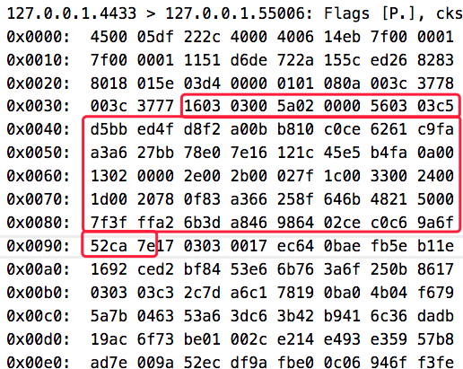
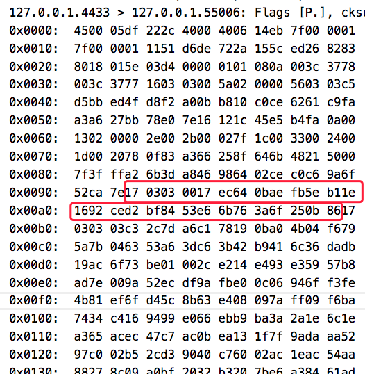

本文记录下如何用openSSL来学习TLS1.3。


<!--more-->

## 编译

[官方教程](https://wiki.openssl.org/index.php/Compilation_and_Installation?)

1, 先下载openssl-1.1.1-pre8, 解压，进目录

2, 配置编译参数：./config ， 我用的参数： enable-ssl-trace no-ssl no-dtls no-tls1 no-tls1_1 no-tls1_2，在INSTALL文件里有说明这些参数

3, 执行make，等生成libcrypto.a、libssl.a；

4, 创建一个my_demo目录，并创建一个test.c文件，代码如下：

```c
#include <openssl/ssl.h>

int main() {
    if (!OPENSSL_init_ssl(OPENSSL_INIT_ENGINE_ALL_BUILTIN
                          | OPENSSL_INIT_LOAD_CONFIG, NULL))
        return -1;
    printf("init success\n");
}
```

5, 编译：clang（或gcc) test.c -I../include  -L../ -lcrypto -lssl

6, 运行：./a.out，输出init success即正常。

7, 为了使用openssl命令行工具，执行make install

## 用openSSL测试TLS连接

[s_server](https://www.openssl.org/docs/manmaster/man1/s_server.html)和[s_client](https://www.openssl.org/docs/manmaster/man1/s_client.html) 是openssl提供的测试工具，教程在[这里](https://blog.jorisvisscher.com/2015/07/22/create-a-simple-https-server-with-openssl-s_server/)。

因为本机Mac不好更新openSSL，所以我是在docker里测试TLS1.3。

先搞定安装了openSSL 1.1.1的container，跑起来，然后执行：

```
openssl req -x509 -newkey rsa:2048 -keyout key.pem -out cert.pem -days 365 -nodes -subj '/CN=www.mydom.com/O=My Dom, Inc./C=US/ST=Oregon/L=Portland' 
```

生成了自签名的公钥证书cert.pem和对应的私钥key.pem，然后启动简易服务器：

```
openssl s_server -key key.pem -cert cert.pem -www  
```

然后在浏览器打开以下地址：

https://127.0.0.1:14433/

chrome的话会提示不是安全连接，这是因为自签名公钥证书的问题。点继续，强行打开这个地址，就能访问到docker里的s_server了：

```
s_server -key key.pem -cert cert.pem -www 
Secure Renegotiation IS supported
Ciphers supported in s_server binary
TLSv1.3    :TLS_AES_256_GCM_SHA384    TLSv1.3    :TLS_CHACHA20_POLY1305_SHA256 
TLSv1.3    :TLS_AES_128_GCM_SHA256    TLSv1.2    :ECDHE-ECDSA-AES256-GCM-SHA384 
TLSv1.2    :ECDHE-RSA-AES256-GCM-SHA384 TLSv1.2    :DHE-RSA-AES256-GCM-SHA384 
TLSv1.2    :ECDHE-ECDSA-CHACHA20-POLY1305 TLSv1.2    :ECDHE-RSA-CHACHA20-POLY1305 
（略）  
---
Ciphers common between both SSL end points:
TLS_AES_128_GCM_SHA256     TLS_AES_256_GCM_SHA384     TLS_CHACHA20_POLY1305_SHA256
ECDHE-ECDSA-AES128-GCM-SHA256 ECDHE-RSA-AES128-GCM-SHA256 ECDHE-ECDSA-AES256-GCM-SHA384
ECDHE-RSA-AES256-GCM-SHA384 ECDHE-ECDSA-CHACHA20-POLY1305 ECDHE-RSA-CHACHA20-POLY1305
ECDHE-RSA-AES128-SHA       ECDHE-RSA-AES256-SHA       AES128-GCM-SHA256         
AES256-GCM-SHA384          AES128-SHA                 AES256-SHA
Signature Algorithms: ECDSA+SHA256:RSA-PSS+SHA256:RSA+SHA256:ECDSA+SHA384:RSA-PSS+SHA384:RSA+SHA384:RSA-PSS+SHA512:RSA+SHA512:RSA+SHA1
Shared Signature Algorithms: ECDSA+SHA256:RSA-PSS+SHA256:RSA+SHA256:ECDSA+SHA384:RSA-PSS+SHA384:RSA+SHA384:RSA-PSS+SHA512:RSA+SHA512:RSA+SHA1
Supported Elliptic Groups: 0xEAEA:X25519:P-256:P-384
Shared Elliptic groups: X25519:P-256:P-384
---
No server certificate CA names sent
---
New, TLSv1.2, Cipher is ECDHE-RSA-AES128-GCM-SHA256
SSL-Session:
    Protocol  : TLSv1.2
    Cipher    : ECDHE-RSA-AES128-GCM-SHA256
    Session-ID: 
    Session-ID-ctx: 01000000
    Master-Key: 3FF0D7A74290173761702ABE91C08C67B43B6ED54BE69F48F11976C4AE5C209E5EE7E097326F5726063E8121000142BA
    PSK identity: None
    PSK identity hint: None
    SRP username: None
    Start Time: 1531989327
    Timeout   : 7200 (sec)
    Verify return code: 0 (ok)
    Extended master secret: yes
---
   0 items in the session cache
   0 client connects (SSL_connect())
   0 client renegotiates (SSL_connect())
   0 client connects that finished
  13 server accepts (SSL_accept())
   0 server renegotiates (SSL_accept())
  13 server accepts that finished
   0 session cache hits
   0 session cache misses
   0 session cache timeouts
   0 callback cache hits
   0 cache full overflows (128 allowed)
---
no client certificate available
```

**因为我的chrome开启了draft28，所以能看到上面显示支持TLSv1.3**

如果本机是Mac，可以用s_client访问这个简易服务器：

openssl s_client -connect localhost:14433

返回：

```
CONNECTED(00000005)
depth=0 CN = www.mydom.com, O = "My Dom, Inc.", C = US, ST = Oregon, L = Portland
verify error:num=18:self signed certificate
verify return:1
depth=0 CN = www.mydom.com, O = "My Dom, Inc.", C = US, ST = Oregon, L = Portland
verify return:1
---
Certificate chain
 0 s:/CN=www.mydom.com/O=My Dom, Inc./C=US/ST=Oregon/L=Portland
   i:/CN=www.mydom.com/O=My Dom, Inc./C=US/ST=Oregon/L=Portland
---
Server certificate
-----BEGIN CERTIFICATE-----
MIIDoTCCAomgAwIBAgIUH0Fpo...略
-----END CERTIFICATE-----
subject=/CN=www.mydom.com/O=My Dom, Inc./C=US/ST=Oregon/L=Portland
issuer=/CN=www.mydom.com/O=My Dom, Inc./C=US/ST=Oregon/L=Portland
---
No client certificate CA names sent
Server Temp Key: ECDH, X25519, 253 bits
---
SSL handshake has read 1554 bytes and written 293 bytes
---
New, TLSv1/SSLv3, Cipher is ECDHE-RSA-AES256-GCM-SHA384
Server public key is 2048 bit
Secure Renegotiation IS supported
Compression: NONE
Expansion: NONE
No ALPN negotiated
SSL-Session:
    Protocol  : TLSv1.2
    Cipher    : ECDHE-RSA-AES256-GCM-SHA384
    Session-ID: 418F508D841D1B9F574A7AF0B7C4C555E56199CCBA9D8D5051D44736674C5DB7
    Session-ID-ctx: 
    Master-Key: 64AFECF1FEE891647EF174B417DF960DA6C8A137958075E1AB7F423F9154EBAF0CC0AEE53F0E4176881FD12AC128C1E8
    TLS session ticket lifetime hint: 7200 (seconds)
    TLS session ticket:
    0000 - 85 7c e6 ba 9c 02 b9 c0-e9 6c c6 6c 02 3f 81 0c   .|.......l.l.?..
    0010 - e3 14 bb 65 76 4f a0 cd-64 a7 ff ff 02 73 b9 dc   ...evO..d....s..
    0020 - e6 4d 7f 57 52 ee dc 18-eb 05 8a ed b2 f4 18 44   .M.WR..........D
    0030 - 0f c1 90 88 f6 30 7b 20-eb 87 f0 39 5e a6 37 fd   .....0{ ...9^.7.
    0040 - ff 5f 92 7b da 61 7e 83-30 7a 04 a8 ef ef 5b 24   ._.{.a~.0z....[$
    0050 - fa a4 b2 86 55 fd ed 42-9f e6 b7 09 ed f6 2e 3b   ....U..B.......;
    0060 - a7 d9 89 3f 27 de d1 b8-c8 98 aa e3 32 e0 96 9c   ...?'.......2...
    0070 - 67 d9 69 2f 0c ed f1 d2-09 fe f8 8f 9f b1 77 67   g.i/..........wg
    0080 - f3 55 31 07 bb 4e 2e a4-df f5 1f 9d 51 df a4 35   .U1..N......Q..5
    0090 - 5c 54 71 c0 3c f6 b3 41-e7 4f 07 c4 54 dd a4 d3   \Tq.<..A.O..T...

    Start Time: 1531989017
    Timeout   : 7200 (sec)
    Verify return code: 18 (self signed certificate)
---
```


**而因为命令行的openSSL还是旧的，所以显示的是TLSv1.2**。

可以在s_server指令最后面加上-msg -state，打印调试信息，来分析TLS握手过程。不过这样子只能看到状态信息，具体的通讯数据是Hex的，可以再加一个 -trace选项，把Hex信息都打印出来。

要支持-trace，需要重新编译openSSL，参数是 enable-ssl-trace


## 抓包分析TLS1.3握手过程

首先，为了屏蔽旧协议，需要修改/include/openssl/ssl.h里的一个宏：


```c
/*
 * Enable TLSv1.3 Compatibility mode. This is on by default. A future version
 * of OpenSSL may have this disabled by default.
 */
# define SSL_OP_ENABLE_MIDDLEBOX_COMPAT                  0x00100000U
```

改为:

```c
# define SSL_OP_ENABLE_MIDDLEBOX_COMPAT                  0x00000000U
```


然后重新编译openssl。

接着开一个tcpdump的进程：

```
tcpdump -i lo host localhost and port 4433 -nn -vvv -X
```

然后开2个bash分别执行：

```
openssl s_server -key key.pem -cert cert.pem -msg -state -tls1_3 -trace no_middlebox -no_ssl3 -no_tls1 -no_tls1_1 -no_tls1_2 no_comp
```

```
openssl s_client -connect localhost:4433 -msg -state -trace -tls1_3
```

三个进程的输出：

[server.out](../images/2018.7/server.out)

[client.out](../images/2018.7/client.out)

[tcpdump.out](../images/2018.7/tcpdump.out)

然后就可以开始分析了。

## ClientHello

根据tcpdump.out，发现在三次握手后的第一个包是从client发到服务器的，数据长度205字节(不含IP header）。这个就是ClientHello。

然后看client.out和server.out，发现205字节的头5个字节是独立出来的：

```
16 03 01 00 c8
```

这5个字节要分成3部分：

- 0x16，这个字节指出了包的类型（Content Type），0x16是handshake。
- 0x0301，这2个字节指示SSL/TLS版本（Version），0x0301代表TLSv1.0。
- 0x00c8，转10进制后是200，显然是正文长度(205 - 5)


( [图片来源](https://wand.net.nz/trac/libprotoident/wiki/SSL) )


ContentType在/include/openssl/ssl3.h里定义：

```c
# define SSL3_RT_CHANGE_CIPHER_SPEC      20
# define SSL3_RT_ALERT                   21
# define SSL3_RT_HANDSHAKE               22
# define SSL3_RT_APPLICATION_DATA        23
# define DTLS1_RT_HEARTBEAT              24
```

然后就是正文200个字节，根据tcpdump.out，按顺序解读下：

- 4字节，0100 00c4，未知，可能是子协议类型
- 2字节，0303，这个是client_version，0x303表示TLS 1.2
- 4字节，9AC0 E522，gmt_unix_time，时间戳
- 28字节，65 1348 2735 f2d9 ac8c bc83 1850 a0c3 c3f0 a681 ceff 4876 4d1b 80ba 1e，random_bytes
- 1字节，00，session_id，表示长度为0，没有session id
- 2字节，00 08，表示接下来有4个cipher suites（每个要占2个字节，2*4=8）
- 8字节，1302 1303 1301 00ff，4个cipher_suites，撇除最后一个TLS_EMPTY_RENEGOTIATION_INFO_SCSV，实则只有3个cipher_suites
- 1字节，01，未知，可能是分隔符
- 1字节，compression_methods，选择什么压缩算法，0x00表示不压缩
- 2字节，0093，等于10进制147，表示接下来有147字节的extensions
- 147字节，各种extensions，每个extension的长度各不一样。在这里面给出了终端支持的算法列表。

200 = 4 + 2 + 4 + 28 + 1 + 2 + 8 + 1 + 1 + 2 + 147。虽然里面有一些字节从抓下来的log看不出来。


## 服务端收到ClientHello后的响应

接下来看tcpdump.out，发现服务器收到ClientHello后发了个很长的回包，足足有1451字节（不包含IP header）。看起来很长， 实则是几个协议包被tcp合并发送了。先看第一个协议包。

### ServerHello（95字节）

头5字节：16 03 03 00 5a

协议包头部和ClientHello类似，也是5字节。

0303表示这个分组的版本是TLSv1.2的。

最后2字节是005a，十进制是90，表示正文是90字节。


正文结构和ClientHello很像，除了几点要说的：

- 和ClientHello一样没有session_id
- ClientHello的Version是TLSv1.0，这是为了应付低版本的服务器，实际上在client_version里指出自己能支持TLS 1.2。ServerHello于是把Version填成TLS1.2，以告诉客户端自己支持1.2。
- cipher_suite字段不再是列表，而是指出了一个加密套件：TLS_AES_256_GCM_SHA384，这就完成了加密套件的协商。
- extensions里面有一个extension_type=supported_versions的扩展，用这个扩展告诉客户端自己其实还支持到TLS1.3（draft 28）
- extensions里还有一个extension_type=key_share，指出了秘钥协商算法为ecdh_x25519并且给出了一个key_exchange参数





### write encrypted extensions（28字节）

头5字节：17 03 03 00 17

最后2字节是0017，十进制是23，表示正文是23字节。

看server.out，发现Inner Content Type = Handshake (22)，说明握手还在进行中。

23个正文字节，实际上是21+2，2是EncryptedExtensions。



### write certificate（968字节）

头5字节：17 03 03 03 c3

最后2字节是03c3，十进制是963，表示正文是963字节。这么长是因为这个分组包含了服务端的公钥证书！

看server.out，发现Inner Content Type = Handshake (22)，说明握手还在进行中。

963个正文字节，实际上是21+942，942字节是Certificate。


### write server certificate verify（286字节）


头5字节：17 03 03 01 19

最后2字节是0119，十进制是281，表示正文是281字节。

看server.out，发现Inner Content Type = Handshake (22)，说明握手还在进行中。

281个正文字节，实际上是21+260，260字节是CertificateVerify。

CertificateVerify的组成部分：

- Signature Algorithm，4字节，告诉客户端用了什么签名算法（rsa_pss_rsae_sha256）
- Signature，256字节，对Certificate的签名

注意，CertificateVerify这260个字节是加密了的。

### write finished（74字节）

头5字节：17 03 03 00 45

最后2字节是0045，正文是69字节。

看server.out，发现Inner Content Type = Handshake (22)，说明握手还在进行中。

69个正文字节，实际上是21+48，表示握手Finished，48字节存了一个verify_data。

verify_data也是加密了的。


### 综上

服务端收到ClientHello后，总共响应了5个分组，总共占1451字节（不包含IP header）：1451 = 95 + 28 + 968 + 286 + 74。


## Client收到ServerHello5个分组后的响应

### early data（Client Finished 74字节）

客户端发了一个和服务端的Finished同等结构的Finished。区别在于verify_data。

正文一样是69字节。

这是用来告诉服务端，客户端也完成握手了。

## Server收到Client Finished后的响应

### write session ticket (两次255字节)

服务端发了2个[NewSessionTicket](https://tools.ietf.org/html/draft-ietf-tls-tls13-28#section-4.6.1)协议分组。

每个协议是5 + 250 = 255字节。

第一个是在04:06:58.702027时发送，第二个是在04:06:58.703919。

这2个分组发完，就没有和TLS有关的分组了。抓包到这里结束。

服务端会看情况发1到多个session ticket，作用如下：

- 允许打开多个并行的HTTP连接（Opening multiple parallel HTTP connections）

- 执行跨网卡接口和地址族的连接竞争（Performing connection racing across interfaces and address families）

## 回顾整个流程

server.out最后面打印了关于此次连接的TLS信息：


- Shared ciphers，共享的加密套件列表，TLS_AES_256_GCM_SHA384、TLS_CHACHA20_POLY1305_SHA256、TLS_AES_128_GCM_SHA256
- Signature Algorithms，签名算法列表，ECDSA+SHA256、ECDSA+SHA384、ECDSA+SHA512、Ed25519、Ed448、RSA-PSS+SHA256、RSA-PSS+SHA384、RSA-PSS+SHA512、RSA-PSS+SHA256、RSA-PSS+SHA384、RSA-PSS+SHA512、RSA+SHA256、RSA+SHA384、RSA+SHA512
- Shared Signature Algorithms，共享的签名算法列表（同上）
- Supported Elliptic Groups，支持的椭圆曲线组，X25519、P-256、X448、P-521、P-384
- Shared Elliptic groups，共享的椭圆曲线组（同上）
- No server certificate CA names sent
- CIPHER is TLS_AES_256_GCM_SHA384，最终协商出来的加密套件
- Secure Renegotiation IS supported