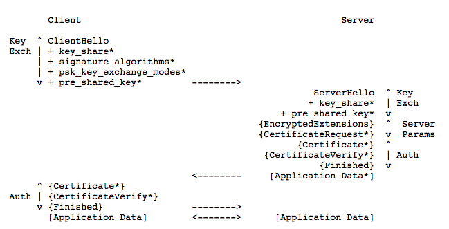

直到此时，TLS1.3的RFC已更新到版本[28](https://tools.ietf.org/html/draft-ietf-tls-tls13-28)，更新于2018年3月。本文是阅读RFC过程中产生的一些笔记。本文仅关注TLS1.3，和兼容TLS1.2相关的内容将忽略。

## 内容结构

- 介绍
	- [和TLS1.2的区别](#1.3)
- 协议概览
	- [不正确的DHE Share](#2.1)
    - [会话恢复和PSK](#2.2)
    - [0-RTT 数据](#2.3)

<!--more-->

## 介绍

### 
和TLS1.2的区别

- 仅认可支持AEAD的对称加密算法。
- 0-RTT模式被加入规范。代价是损失一定的安全性。
- 静态RSA和DH加密套件已经被移除；现在所有基于公钥的密钥交换机制都提供了前向安全
- 在ServerHello后的所有握手消息都被加密（EncryptedExtension）
- 密钥导出函数被重新设计。其实就是指HKDF。
- 握手状态机被重构，并移除ChangeCipherSpec这个多余的东西。
- 椭圆曲线算法被列入规范，并移除了对point format的协商。
- 移除了压缩机制（这个对web应用挺伤啊）、自定义DHE组、改了RSA的padding、移除了DSA。
- TLS1.2版本协商机制已废弃，改为用版本列表扩展机制。
- 会话恢复（Session resumption）统一改为用新的PSK交换机制。

## 协议概览

TLS支持三种基本的密钥交换模式：

- (EC)DHE 
- PSK-only
- PSK with (EC)DHE

下图展示了TLS全握手过程：

握手有3个阶段：

- 密钥交换（Key Exchange）: 建立共享的密钥材料，以及选定加密参数。这个阶段之后的所有消息都是加密的。

- 服务器参数（Server Parameter）: 建立其他握手参数，如客户端是否需要被认证、支持什么应用层协议···

- 认证（Authentication）: 认证服务器（客户端的认证可选）、密钥二次确认、验证握手信息完整性

#### 密钥交换：

客户端发送ClientHello，其中包括：

- random nonce(ClientHello.random); 
- 客户端支持的协议版本; 
- 客户端支持的{对称加密算法、HKDF哈希}pair列表;
- a set of Diffie-Hellman keyshares或a set of pre-shared key labels或都有
- 可能的附加扩展potentially additional extensions

服务端处理ClientHello：

- 确定该连接的恰当的加密参数
- 发送ServerHello，包含连接参数

结合ClientHello和ServerHello，就能确定共享密钥了。

如果走的是(EC)DHE，那么ServerHello包含一个key_share扩展，其中含有服务器的DHE共享信息；

如果走都是PSK key，那么ServerHello包含一个pre_shared_key扩展，扩展里标识了服务器选定了客户端提供的哪个PSK。
  

#### 确定服务器参数:

接着服务器发送2个消息来确定服务器参数

- EncryptedExtensions:  告诉客户端哪些参数不是必要的，对于确定加密参数来说。
- CertificateRequest:  如果需要基于证书的客户端认证，那么服务器请求和该证书有关的参数。（可选）

#### 交换认证信息：

以下的步骤是对称的，但一般服务端不对客户端做认证，而仅是客户端认证服务端：

- Certificate: 证书信息
- CertificateVerify: 用该证书对应的私钥对所有握手信息的签名。
- Finished:  对整个握手阶段信息的MAC。 主要是提供了密钥二次确认。

到了Finished，握手就完成了，在Finished之前，不应该发送应用数据。但如果是0-RTT则例外。

### 
不正确的DHE Share

如果服务端收到不正确的密钥共享信息，需要发送HelloRetryRequest，让客户端重新发起握手。

如果最终没能协商出合适的加密参数，那么服务器必须中止握手（Alert）。

### 
会话恢复和PSK

当握手完成时，服务器可以发送PSK Id给客户端，对应一个独一无二的加密密钥。客户端把PSK Id保存起来，之后如果又发起了和服务器的连接，可以发给服务端并最终恢复会话。

### 
0-RTT 数据

原理就是第一个包就发送了应用层数据，用的是PSK的信息来加密数据以及认证服务器。

这一个数据不是前向安全的。

