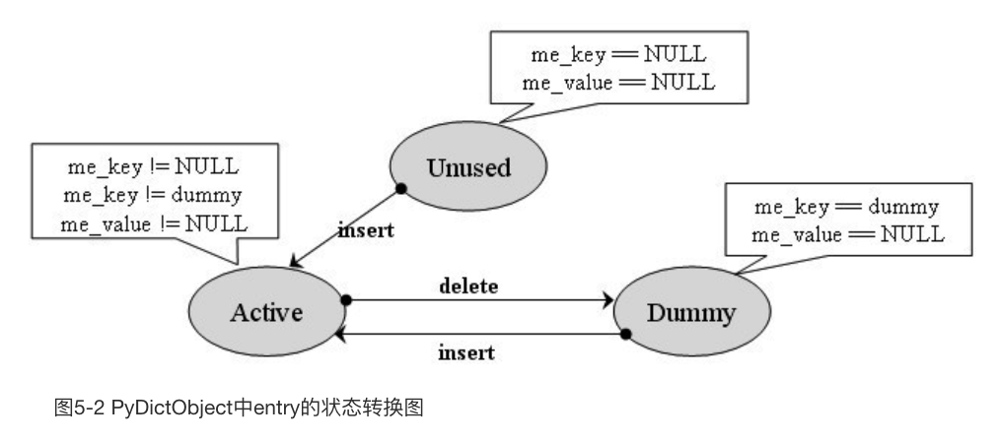

<!--more-->

以前看过python源码，没记笔记，忘光了，现在重新瞧瞧。

# 各种对象的实现

## 通用部分

### PyObject_HEAD 和 PyObject_VAR_HEAD


```c
/* PyObject_HEAD defines the initial segment of every PyObject. */
#define PyObject_HEAD                   \
    _PyObject_HEAD_EXTRA                \
    Py_ssize_t ob_refcnt;               \
    struct _typeobject *ob_type;

#define PyObject_VAR_HEAD               \
    PyObject_HEAD                       \
    Py_ssize_t ob_size; /* Number of items in variable part */
```

这2个东西会出现在各种对象的结构定义里。obj_refcnt显然是引用计数，ob_type是类型元信息的指针，ob_size是变长对象的对象数量信息。

## PyIntObject 普通整数（long）

文件：

- intobject.h
- intobject.c

```c
typedef struct {
    PyObject_HEAD
    long ob_ival;
} PyIntObject;
```

应该是最简单的对象类型了，用一个long存数据信息。

下面是整数对象的类型元信息，其实就是自定义实现了object.h里的_typeobject：

```c
PyTypeObject PyInt_Type = {
    PyVarObject_HEAD_INIT(&PyType_Type, 0)
    "int", // tp_name 用于打印
    sizeof(PyIntObject), // tp_basicsize 
    0, // tp_itemsize 因为不是变长类型，所以为0
    // 下面是各种函数指针
    (destructor)int_dealloc,                    /* tp_dealloc */
    (printfunc)int_print,                       /* tp_print */
    ···  
    &int_as_number,                             /* tp_as_number */
    ···
    Py_TPFLAGS_DEFAULT | Py_TPFLAGS_CHECKTYPES |
        Py_TPFLAGS_BASETYPE | Py_TPFLAGS_INT_SUBCLASS,          /* tp_flags */
    ···
};
```

PyIntObject的代数运算过程中，可能会转换成PyLongObject。


### 创建

总共4个C API：

```c
PyAPI_FUNC(PyObject *) PyInt_FromString(char*, char**, int);
PyAPI_FUNC(PyObject *) PyInt_FromLong(long);
PyAPI_FUNC(PyObject *) PyInt_FromSize_t(size_t);
PyAPI_FUNC(PyObject *) PyInt_FromSsize_t(Py_ssize_t);
```

第1、3、4个API会根据传入的值的大小，选择创建PyIntObject还是PyLongObject。

所以主要看PyInt_FromLong。

```c
PyObject *
PyInt_FromLong(long ival)
{
    register PyIntObject *v;
    // small_ints
#if NSMALLNEGINTS + NSMALLPOSINTS > 0
    if (-NSMALLNEGINTS <= ival && ival < NSMALLPOSINTS) {
        v = small_ints[ival + NSMALLNEGINTS];
        Py_INCREF(v);
        ···
        return (PyObject *) v;
    }
#endif
    if (free_list == NULL) {
        if ((free_list = fill_free_list()) == NULL)
            return NULL;
    }
    /* Inline PyObject_New */
    v = free_list;
    free_list = (PyIntObject *)Py_TYPE(v);
    (void)PyObject_INIT(v, &PyInt_Type);
    v->ob_ival = ival;
    return (PyObject *) v;
}
```

这段代码涉及到了2大机制，一个是small_ints:

```c
#define NSMALLPOSINTS           257
#define NSMALLNEGINTS           5
static PyIntObject *small_ints[NSMALLNEGINTS + NSMALLPOSINTS];
```

python最多会缓存262个小整数，PyInt_FromLong每次检测val是不是在小整数范围，是的话就复用small_ints里的对象。


small_ints是在python启动的时候就先初始化的：

```c
int
_PyInt_Init(void)
{
    PyIntObject *v;
    int ival;
#if NSMALLNEGINTS + NSMALLPOSINTS > 0
    for (ival = -NSMALLNEGINTS; ival < NSMALLPOSINTS; ival++) {
        if (!free_list && (free_list = fill_free_list()) == NULL)
            return 0;
        /* PyObject_New is inlined */
        v = free_list;
        free_list = (PyIntObject *)Py_TYPE(v);
        (void)PyObject_INIT(v, &PyInt_Type);
        v->ob_ival = ival;
        small_ints[ival + NSMALLNEGINTS] = v;
    }
#endif
    return 1;
}
```

这里面已经用到了free_list。

另一个机制是内存池，一块内存放几百个整数，并且会复用内存，改善了性能：

```c
#define BLOCK_SIZE      1000    /* 1K less typical malloc overhead */
#define BHEAD_SIZE      8       /* Enough for a 64-bit pointer */
#define N_INTOBJECTS    ((BLOCK_SIZE - BHEAD_SIZE) / sizeof(PyIntObject))

// 连续存放多个PyIntObject的内存块
// 块与块之间用next指针串起来
struct _intblock {
    struct _intblock *next;
    PyIntObject objects[N_INTOBJECTS];
};


typedef struct _intblock PyIntBlock;

// 当前int内存块的头节点
static PyIntBlock *block_list = NULL;
// 可用的PyIntObject链表的头
static PyIntObject *free_list = NULL;

static PyIntObject *
fill_free_list(void)
{
    PyIntObject *p, *q;
    /* Python's object allocator isn't appropriate for large blocks. */
    p = (PyIntObject *) PyMem_MALLOC(sizeof(PyIntBlock));
    if (p == NULL)
        return (PyIntObject *) PyErr_NoMemory();
    ((PyIntBlock *)p)->next = block_list;
    block_list = (PyIntBlock *)p;
    /* Link the int objects together, from rear to front, then return
       the address of the last int object in the block. */
    // 这里用Py_TYPE指针，把内存块里的所有对象都串成链表，
    // 不过要注意，串的方向是逆的，从后往前，函数最后返回的是最后一个对象
    p = &((PyIntBlock *)p)->objects[0];
    q = p + N_INTOBJECTS;
    while (--q > p)
        Py_TYPE(q) = (struct _typeobject *)(q-1);
    Py_TYPE(q) = NULL;
    return p + N_INTOBJECTS - 1;
}
```

每次一个PyIntObject被回收，就会放进free_list的头：

```c
static void
int_dealloc(PyIntObject *v)
{
    if (PyInt_CheckExact(v)) {
        Py_TYPE(v) = (struct _typeobject *)free_list;
        free_list = v;
    }
    else
        Py_TYPE(v)->tp_free((PyObject *)v);
}
```

## PyLongObject 任意大整数

文件：

- longobject.h
- longobject.c
- longintrepr.h

这个longObject反而不是用long实现了，而是用了复杂的大数运算技巧。

```c
struct _longobject {
	PyObject_VAR_HEAD
	digit ob_digit[1];
};

typedef PY_UINT32_T digit;

typedef struct _longobject PyLongObject; /* Revealed in longintrepr.h */
```


PyLongObject的创建和销毁都是直接在堆内存中发生，没有什么复杂优化：

```c
// _PyLong_New是根据数字digit的数量来创建的，而不是数值上的大小
PyLongObject *
_PyLong_New(Py_ssize_t size)
{
    if (size > (Py_ssize_t)MAX_LONG_DIGITS) {
        PyErr_SetString(PyExc_OverflowError,
                        "too many digits in integer");
        return NULL;
    }
    /* coverity[ampersand_in_size] */
    /* XXX(nnorwitz): PyObject_NEW_VAR / _PyObject_VAR_SIZE need to detect
       overflow */
    return PyObject_NEW_VAR(PyLongObject, &PyLong_Type, size);
}


static void
long_dealloc(PyObject *v)
{
    Py_TYPE(v)->tp_free(v);
}
```


## PyFloatObject 普通浮点数(double)

```c
typedef struct {
    PyObject_HEAD
    double ob_fval;
} PyFloatObject;
```

可见对于double范围内的浮点数，都是用double实现的。

```c
PyObject *
PyFloat_FromDouble(double fval)
{
    register PyFloatObject *op;
    if (free_list == NULL) {
        if ((free_list = fill_free_list()) == NULL)
            return NULL;
    }
    /* Inline PyObject_New */
    op = free_list;
    free_list = (PyFloatObject *)Py_TYPE(op);
    (void)PyObject_INIT(op, &PyFloat_Type);
    op->ob_fval = fval;
    return (PyObject *) op;
}
```

观察创建函数，发现也有free_list对象池机制。不过就没有small_ints了，毕竟是实数。


## PyStringObject

```c
typedef struct {
    PyObject_VAR_HEAD
    long ob_shash;
    int ob_sstate;
    char ob_sval[1];

    /* Invariants:
     *     ob_sval contains space for 'ob_size+1' elements.
     *     ob_sval[ob_size] == 0.
     *     ob_shash is the hash of the string or -1 if not computed yet.
     *     ob_sstate != 0 iff the string object is in stringobject.c's
     *       'interned' dictionary; in this case the two references
     *       from 'interned' to this object are *not counted* in ob_refcnt.
     */
} PyStringObject;
```

根据注释看，ob_sval存了ob_size+1个字符字节，+1是为了存'\0'；ob_shash相当于这个字符串的id，用来快速比对字符串；ob_sstate和缓冲池设计有关。

### intern机制

- 这个机制**默认**只对长度为0或1的字符串有用。如果相对更长的字符串启用，那么要使用PyString_InternFromString。
- intern里的字符串是会销毁的，条件是引用计数降到0，因此intern里的PyObject并不持有引用（因为有k、v2个引用，所以是-2）
- 普通创建的intern字符串是SSTATE_INTERNED_MORTAL的，即会销毁，不过IMMORTAL的intern字符串并没有使用到，所以可认为所有都是mortal的。
- 实际上intern机制并不会减少字符串内存分配开销，因为intern机制是发生在内存分配之后的。
- 之所以要创建临时的对象，是因为PyDict_GetItem(PyObject *op, PyObject *key)，查找参数是PyObject，必须创建一个临时对象来作为参数去调用PyDict_GetItem。
- 唯一不会创建临时对象的情况是，空字符串或单字符串，这是通过记录static的characters数组和*nullstring实现的。


### 连接字符串问题

一句话总结，用+号来连接字符串是低效的，要做N-1次内存分配；正确的做法是用join函数。


## PyListObject

```c
typedef struct {
    PyObject_VAR_HEAD
    /* Vector of pointers to list elements.  list[0] is ob_item[0], etc. */
    PyObject **ob_item;

    /* ob_item contains space for 'allocated' elements.  The number
     * currently in use is ob_size.
     * Invariants:
     *     0 <= ob_size <= allocated
     *     len(list) == ob_size
     *     ob_item == NULL implies ob_size == allocated == 0
     * list.sort() temporarily sets allocated to -1 to detect mutations.
     *
     * Items must normally not be NULL, except during construction when
     * the list is not yet visible outside the function that builds it.
     */
    Py_ssize_t allocated;
} PyListObject;
```

### 基本特点

- 也有free_list对象池优化，默认80个
- list的设计像STL的vector
- 因为存的是指针，所以移动元素的开销比较小，插入元素，就会发生大量元素挪动
- list_dealloc会销毁元素列表并回收内存，以及尝试把list对象放进free_list里

### list_resize

- 如果newsize在[allocated, allocated/2]范围，那么不用动内存
- 如果newsize小于allocated/2，还会发生内存收缩，以节省内存


## PyDictObject

### 基本特点

- 基于散列表而不是二叉树
- 冲突解决基于开放定址法，而不是开链


### 结构

```c

// 表示每个dict至少有8个entry
#define PyDict_MINSIZE 8

typedef struct {
    /* Cached hash code of me_key.  Note that hash codes are C longs.
     * We have to use Py_ssize_t instead because dict_popitem() abuses
     * me_hash to hold a search finger.
     */
    Py_ssize_t me_hash;
    PyObject *me_key;
    PyObject *me_value;
} PyDictEntry;

/*
To ensure the lookup algorithm terminates, there must be at least one Unused
slot (NULL key) in the table.
The value ma_fill is the number of non-NULL keys (sum of Active and Dummy);
ma_used is the number of non-NULL, non-dummy keys (== the number of non-NULL
values == the number of Active items).
To avoid slowing down lookups on a near-full table, we resize the table when
it's two-thirds full.
*/
typedef struct _dictobject PyDictObject;
struct _dictobject {
    PyObject_HEAD
    Py_ssize_t ma_fill;  /* # Active + # Dummy */
    Py_ssize_t ma_used;  /* # Active */
    // slots等于2的幂，而ma_mask = slots - 1，mask除了记录了slots数之外还有别的用途  
    Py_ssize_t ma_mask;
    PyDictEntry *ma_table;
    PyDictEntry *(*ma_lookup)(PyDictObject *mp, PyObject *key, long hash);
    PyDictEntry ma_smalltable[PyDict_MINSIZE];
};
```

### entry的状态机

- active: 被使用中
- dummy：已移除，但因为还在冲突链中，所以不可使用
- unused：未使用




### PyDict_New

```c
PyObject *
PyDict_New(void)
{
    register PyDictObject *mp;
    if (dummy == NULL) { /* Auto-initialize dummy */
        dummy = PyString_FromString("<dummy key>");
        if (dummy == NULL)
            return NULL;
    }
    if (numfree) {
        mp = free_list[--numfree];
        assert (mp != NULL);
        assert (Py_TYPE(mp) == &PyDict_Type);
        _Py_NewReference((PyObject *)mp);
        if (mp->ma_fill) {
            EMPTY_TO_MINSIZE(mp);
        } else {
            /* At least set ma_table and ma_mask; these are wrong
               if an empty but presized dict is added to freelist */
            INIT_NONZERO_DICT_SLOTS(mp);
        }
        assert (mp->ma_used == 0);
        assert (mp->ma_table == mp->ma_smalltable);
        assert (mp->ma_mask == PyDict_MINSIZE - 1);
    } else {
        mp = PyObject_GC_New(PyDictObject, &PyDict_Type);
        if (mp == NULL)
            return NULL;
        EMPTY_TO_MINSIZE(mp);
    }
    mp->ma_lookup = lookdict_string;
    return (PyObject *)mp;
}
```

主要做了三件事：

- 初始化dummy
- 判断有无free_list，有的话从free_list拿mp，没有的话new一个mp，并重置
- 设置ma_lookup


### lookdict和lookdict_string

lookdict_string是针对string作为key的那些dict的，而lookdict则是一般化的。

区别在于比较字符串不会引发异常，而比较一般化的key可能会引发异常。

共同点是，如果找不到目标key，那么会返回一个entry对象，entry里的me_value为NULL，这个entry不是临时的，而是dict里对应这个key的entry。所以caller可以增加kv到这个entry里。

一个dict默认是用lookdict_string的，只有遇到lookdict_string的key参数不是string，才会提升到lookdict。

lookdict_string是比lookdict高效的，所以能用字符串当key就尽量用字符串。

观察通用的lookdict，发现有一个freeslot变量，它指向第一个dummy的entry，当lookdict找不到目标key对应的entry时，就会返回freeslot，如果没有freeslot，那么就返回第一个被发现的unused的entry。


### 插入元素

insert接口：

```c
static int
insertdict_by_entry(register PyDictObject *mp, PyObject *key, long hash,
                    PyDictEntry *ep, PyObject *value)
{
    PyObject *old_value;

    MAINTAIN_TRACKING(mp, key, value);
    if (ep->me_value != NULL) { // 替换操作
        old_value = ep->me_value;
        ep->me_value = value;
        Py_DECREF(old_value); /* which **CAN** re-enter */
        Py_DECREF(key);
    }
    else {
        // 要么是unused，要么是dummy
        // unused的话，fill统计值+1
        // dummy的话，dummy对象引用-1
        if (ep->me_key == NULL)
            mp->ma_fill++;
        else {
            assert(ep->me_key == dummy);
            Py_DECREF(dummy);
        }
        ep->me_key = key; // 此时已经处理完me_key的引用计数了，可以直接赋值
        ep->me_hash = (Py_ssize_t)hash;
        ep->me_value = value;
        mp->ma_used++;
    }
    return 0;
}
```

调用insertdict_by_entry的主要入口：

```c
static int
dict_set_item_by_hash_or_entry(register PyObject *op, PyObject *key,
                               long hash, PyDictEntry *ep, PyObject *value)
{
    register PyDictObject *mp;
    register Py_ssize_t n_used;

    mp = (PyDictObject *)op;
    assert(mp->ma_fill <= mp->ma_mask);  /* at least one empty slot */
    n_used = mp->ma_used;
    Py_INCREF(value);
    Py_INCREF(key);
    if (ep == NULL) {
        if (insertdict(mp, key, hash, value) != 0)
            return -1;
    }
    else {
        if (insertdict_by_entry(mp, key, hash, ep, value) != 0)
            return -1;
    }
    // 这里有个控制是否resize的规则：
    // 如果插入了新元素且填充率（fill / (mask+1））大于2/3 那么要resize
    if (!(mp->ma_used > n_used && mp->ma_fill*3 >= (mp->ma_mask+1)*2))
        return 0;
    // resize，新的size和used数有关
    // Note: 这里可能是发生收缩的
    return dictresize(mp, (mp->ma_used > 50000 ? 2 : 4) * mp->ma_used);
}
```

# 内存管理策略

## 第一层

相关文件：

- pymem.h

这一层的名字叫PYMEM。

这个文件定义了最底层的内存管理接口：

- PyMem_MALLOC: 实际调用C的malloc
- PyMem_REALLOC: 实际调用C的realloc
- PyMem_FREE: 实际调用C的free

C的接口可以认为是第0层。

这3个接口的目标是做到平台无关，加了各种参数检查。

```c
#define PyMem_MALLOC(n)		((size_t)(n) > (size_t)PY_SSIZE_T_MAX ? NULL \
				: malloc(((n) != 0) ? (n) : 1))
#define PyMem_REALLOC(p, n)	((size_t)(n) > (size_t)PY_SSIZE_T_MAX  ? NULL \
				: realloc((p), ((n) != 0) ? (n) : 1))
#define PyMem_FREE		free
```

有了这3个后，又定义了面向对象的接口：

```c
#define PyMem_New(type, n) \
  ( ((size_t)(n) > PY_SSIZE_T_MAX / sizeof(type)) ? NULL :	\
	( (type *) PyMem_Malloc((n) * sizeof(type)) ) )
#define PyMem_NEW(type, n) \
  ( ((size_t)(n) > PY_SSIZE_T_MAX / sizeof(type)) ? NULL :	\
	( (type *) PyMem_MALLOC((n) * sizeof(type)) ) )
```

new接口很适合用来做数组的内存分配，例如这样：

```c
unsigned int *blocks = PyMem_New(unsigned int, len);
```

## 第二层

相关文件：

- objimpl.h
- obmalloc.c

这一层的名字叫PYMALLOC。

这一层关于内存管理的是这么三个接口：

```c
PyAPI_FUNC(void *) PyObject_Malloc(size_t);
PyAPI_FUNC(void *) PyObject_Realloc(void *, size_t);
PyAPI_FUNC(void) PyObject_Free(void *);

#define PyObject_MALLOC         PyObject_Malloc
#define PyObject_REALLOC        PyObject_Realloc
#define PyObject_FREE           PyObject_Free
```

这3个接口的实现很复杂，并不能直接理解。而是得先理解更基础的几个东西：block、pool、arena。


### block

- block按8字节内存对齐 (ALIGNMENT)
- 按照单block的size，总共有64种block，size分别是8、16、24、···、512字节,sizeClassIdx分别是0、1、···、63 (INDEX2SIZE)
- 小于等于512字节的内存分配请求，都是用block（SMALL_REQUEST_THRESHOLD）

实际上block是个抽象的概念，通过有限的几个宏表达了这个概念。没有很具体的地方，所以直接看pool即可。

### pool

基本特点：

- pool是block的集合
- 每个pool大小都是4KB
- pool里的block的大小取决于szidx

首先是POOL_SIZE的定义：

```c
#define SYSTEM_PAGE_SIZE        (4 * 1024)
#define SYSTEM_PAGE_SIZE_MASK   (SYSTEM_PAGE_SIZE - 1)
#define POOL_SIZE               SYSTEM_PAGE_SIZE        /* must be 2^N */
#define POOL_SIZE_MASK          SYSTEM_PAGE_SIZE_MASK
```

可见，POOL_SIZE等于系统页大小，默认4KB。

然后是pool_header：

```c
/* Pool for small blocks. */
struct pool_header {
    union { block *_padding; // 没有被使用的，只是为了让count也是按8字节对齐
            uint count; } ref;  // 每次取用freeblock加1，在PyObject_Free里可能会减1
    block *freeblock;
    struct pool_header *nextpool;       
    struct pool_header *prevpool;       
    uint arenaindex;                   
    uint szidx;                         
    uint nextoffset;  // 相当于指向pool内的下一个未曾用过的block的地址
    uint maxnextoffset;  // nextoffset的最大有效值
};

typedef struct pool_header *poolp;
```

- pool是一块4KB的内存块，pool_header是这块内存块的地址头。
- 每个pool会对应某一种类型的block，这是通过pool_header的szidx来对应的。
- pool的初始化代码在init_pool里
- maxnextoffset，实际上可以基于szidx实时计算得到，缓存在header里是为了性能考虑


nextoffset的唯一用途是获得freeblock地址：

```c
if (pool->nextoffset <= pool->maxnextoffset) {
    //nextoffset还没超出maxnextoffset，说明还有空闲block
    pool->freeblock = (block*)pool +
                        pool->nextoffset;
    // 继续指向下一个偏移地址（可能会超过maxnextoffset）
    pool->nextoffset += INDEX2SIZE(size);
    // 这一行就比较迷了
    *(block **)(pool->freeblock) = NULL;
    UNLOCK();
    return (void *)bp;
}
```

（注意，nextoffset是只增不减的）


nextpool、prevpool字段则是用来把同类型的pool串成链表的（链表头暂时先不表）。
例如，当pool->nextoffset > pool->maxnextoffset时，会执行下面的代码，把这个pool从链表中移除：

```c
    /* Pool is full, unlink from used pools. */
    next = pool->nextpool;
    pool = pool->prevpool;
    next->prevpool = pool;
    pool->nextpool = next;
```

pool有三个状态：

- used: pool中至少有一个block被使用，且至少有一个block未使用
- full: pool中所有block都被使用了
- empty:pool中所有block都未被使用

### arena

基本特点：

- arena是pool的集合
- arena数量是否有限看三个宏：WITH_MEMORY_LIMITS、SMALL_MEMORY_LIMIT、MAX_ARENAS，默认无限制
- arena里的各个pool虽然都是4KB，但pool的szidx不一定一样
- 单个arena默认为256KB

先看arena_object:

```c
/* Record keeping for arenas. */
struct arena_object {
    uptr address;

    block* pool_address; // 指向这个arena的第一个pool

    uint nfreepools; // 可用pool数 free的 + 未分配的

    uint ntotalpools; // 总pool数

    struct pool_header* freepools; // 可用free pool的单向链表

    struct arena_object* nextarena;
    struct arena_object* prevarena;
};
```

arena_object的实例不是随便存放的，而是用一个数组来组织：

```c
static struct arena_object* arenas = NULL;
static uint maxarenas = 0;
// 初始化默认创建16个arena_object 总共占16*256KB = 4MB内存
#define INITIAL_ARENA_OBJECTS 16
```


new_arena函数，是唯一会修改arenas地址的地方，当unused_arena_objects == NULL时会执行以下代码：

```c
        // numarenas表示总共要分配多少个arena，最后会存进maxarenas
        // 每次翻一番
        numarenas = maxarenas ? maxarenas << 1 : INITIAL_ARENA_OBJECTS;
        if (numarenas <= maxarenas)
            return NULL;                // 溢出判断
#if SIZEOF_SIZE_T <= SIZEOF_INT
        if (numarenas > PY_SIZE_MAX / sizeof(*arenas))
            return NULL;                // 溢出判断
#endif
        nbytes = numarenas * sizeof(*arenas); // arenas数组总共占多少字节
        arenaobj = (struct arena_object *)realloc(arenas, nbytes);
        if (arenaobj == NULL)
            return NULL;
        arenas = arenaobj;// 指向该内存块首地址
        ···
        maxarenas = numarenas;
```

···省略的是arenas内部的初始化逻辑，目的是让新分配的arena_object之间串成链表，并让unused_arena_objects指向这些新对象的第一个：

```c
    for (i = maxarenas; i < numarenas; ++i) {
        arenas[i].address = 0; 
        arenas[i].nextarena = i < numarenas - 1 ?
                                &arenas[i+1] : NULL;
    }
    unused_arena_objects = &arenas[maxarenas];
```


arena_object有2种状态：

- unused：arena_object未关联内存块。用unused_arena_objects组织成**单向**链表。表头arena_object在new_arena被取出，在PyObject_Free被放回。简单地说，当address字段为0时，arena_objectt就在unused链表里
- usable：arena_object已关联内存块。用usable_arenas组织成**双向**链表。这个链表是有排序的，按照nfreepools大小，升序，意味着下一次内存分配，会优先使用nfreepools最小的。这就使得nfreepools最大的arena有机会被清空，并把内存归还给系统。


下面看new_arena中unused_arena_objects的取用：

```c
    assert(unused_arena_objects != NULL);
    // 表头arena_object被取出
    arenaobj = unused_arena_objects;
    unused_arena_objects = arenaobj->nextarena; // 指向链表下一节点，可能为NULL
    assert(arenaobj->address == 0); //  unused链表的arenaobj必然是没有关联内存块的
    address = malloc(ARENA_SIZE); // 分配内存 256KB
    err = (address == 0);
    ···
    arenaobj->address = (uptr)address;


    arenaobj->freepools = NULL; // 经过free回收的pool，初始当然是null
    arenaobj->pool_address = (block*)arenaobj->address;
    arenaobj->nfreepools = ARENA_SIZE / POOL_SIZE;
    assert(POOL_SIZE * arenaobj->nfreepools == ARENA_SIZE);
    excess = (uint)(arenaobj->address & POOL_SIZE_MASK);
    if (excess != 0) {// 处理对齐，会导致实际少一个pool（部分空间是浪费掉的）
        --arenaobj->nfreepools;
        arenaobj->pool_address += POOL_SIZE - excess;
    }
    arenaobj->ntotalpools = arenaobj->nfreepools;

    return arenaobj;
```

unused_arena_objects的分析到此为止。下面是usable_arenas，在理解usable_arenas之前需要先理解usedpool。


usedpool面向一个需求：用户给定一个内存分配需求nbytes，怎么从arena、pool这些东西里得到合适的内存块？

首先第一点是，arena没有size属性，arena只是pool的集合。所以不能直接请求一个nbytes的arena。因此，应该是寻找一个pool。


前面说过pool有三种状态，现在可以深入分析下：

- used: pool中至少有一个block被使用，且至少有一个block未使用。这种pool会被usedpools数组控制。
- full: pool中所有block都被使用了。full状态的pool并不会组织成链表。
- empty:pool中所有block都未被使用。这种pool的集合，它们之间通过pool_header的nextpool组织成一个链表，链表表头就是arena_object的freepools


当申请内存时，入手点是usedpools，在其中找到和nbytes匹配的pool，并从中分配一个block。

这里面的玄机非常复杂，先搬出usedpools观摩下：

```c
#define ALIGNMENT               8               /* must be 2^N */
#define ALIGNMENT_SHIFT         3
#define ALIGNMENT_MASK          (ALIGNMENT - 1)
// NB_SMALL_SIZE_CLASSES等于64         ( 512 / 8 )
#define NB_SMALL_SIZE_CLASSES   (SMALL_REQUEST_THRESHOLD / ALIGNMENT)

#define PTA(x)  ((poolp )((uchar *)&(usedpools[2*(x)]) - 2*sizeof(block *)))
#define PT(x)   PTA(x), PTA(x)

static poolp usedpools[2 * ((NB_SMALL_SIZE_CLASSES + 7) / 8) * 8] = {
    PT(0), PT(1), PT(2), PT(3), PT(4), PT(5), PT(6), PT(7)
    , PT(8), PT(9), PT(10), PT(11), PT(12), PT(13), PT(14), PT(15)
    , PT(16), PT(17), PT(18), PT(19), PT(20), PT(21), PT(22), PT(23)
    , PT(24), PT(25), PT(26), PT(27), PT(28), PT(29), PT(30), PT(31)
    , PT(32), PT(33), PT(34), PT(35), PT(36), PT(37), PT(38), PT(39)
    , PT(40), PT(41), PT(42), PT(43), PT(44), PT(45), PT(46), PT(47)
    , PT(48), PT(49), PT(50), PT(51), PT(52), PT(53), PT(54), PT(55)
    , PT(56), PT(57), PT(58), PT(59), PT(60), PT(61), PT(62), PT(63)
};
```

usedpools总共有128个元素PT(0)、PT(1)、···、PT(63)，或者说是PTA(0)、PTA(0)、PTA(1)、PTA(1)、···、PTA(63)、PTA(63)。每相邻的2个元素的值是一样的。


i of usedpools: 0 1 2 3 4 5 6 7 8 9

x of PTA:&nbsp;&nbsp;&nbsp;&nbsp;&nbsp;&nbsp;&nbsp;&nbsp; 0 0 1 1 2 2 3 3 4 4


以PT(5)为例：

PT(5) <=> PTA(5), PTA(5) <=> usedpools[10]，usedpools[11] 

usedpools[10] = PTA(5) = &usedpools[10] - 2

usedpools[11] = PTA(5) = &usedpools[10] - 2


也就是说，PT(5)使得usedpools[10]和usedpools[11]存了(&usedpools[10] - 2)的地址。

更一般地说，PT(x)使得usedpools[2 * x]和usedpools[2 * x + 1]存了(&usedpools[2 * x] - 2)的地址。

这么折腾，是和pool_header有关：

```c
struct pool_header { // (&usedpools[2 * x] - 2)
    union { block *_padding;
            uint count; } ref;     
    block *freeblock; 
    struct pool_header *nextpool; // 这个就是 usedpools[2 * x]
    struct pool_header *prevpool; // 这个就是 usedpools[2 * x + 1]
    ···
};
```

也就是每2个usedpools中的元素，都相当于nextpool和prevpool指针，2个元素的值都存了对应的“pool_header"的地址。

**usedpools是next、prev的集合，也是各个pool的双向链表的头节点**。


usedpools初始结构先理解到这里，现在要先看看usedpools是怎么使用的。

假设要分配的内存大小是28字节，那么第一步是算出sizeClassIdx：

```c
// 在 void * PyObject_Malloc(size_t nbytes)
size = (uint)(nbytes - 1) >> ALIGNMENT_SHIFT;
// 即 size class idx = (28 - 1) >> 3 = 3
```

下一行是查询usedpools数组了：

```c
pool = usedpools[size + size];
```

前面已经分析过了usedpools, 每个usedpools的元素的值其实都是一个地址（指向对应的pool_header）。所以可以推知：


pool = usedpools[3 + 3] = PTA(3) = &usedpools[2*3] - 2


(&usedpools[2*sizeClassIdx] - 2)就是聚合了所有处于used态的、对应这个sizeClassIdx的pools链表的首个pool。

**所以这一行操作，就是为了拿到目标used链表的表头。**

（纵观usedpools的所有调用代码，都是usedpools[size + size]这样的调用）

接着下一行代码是：

```c
if (pool != pool->nextpool) {
}
```

第一次分配时，pool和pool->nextpool是相等的（usedpools的初始值），并不会进入这个if。换句话说，就是没有处于used状态的对应这个sizeClassIdx的pool。


跳过这个if后，接着会new一个arena，然后获取它的freepool：

```c
pool = usable_arenas->freepools;
```

然后直接进入init_pool逻辑段：

```c
init_pool:
    /* Frontlink to used pools. */
    next = usedpools[size + size];
    pool->nextpool = next;
    pool->prevpool = next;
    next->nextpool = pool;
    next->prevpool = pool;
    ···
    return (void *)bp;
}
```

这4行骚操作，是在维护一个used双向链表，且是把pool插入了next（next含义是头节点）的nextpool（叫frontlink），当然这里因为已知链表是空的，所以nextpool也是prevpool。

在PyObject_Free里有一个是插在nex他的prev：

```c
    --pool->ref.count;
    size = pool->szidx;
    next = usedpools[size + size];
    prev = next->prevpool;
    /* insert pool before next:   prev <-> pool <-> next */
    pool->nextpool = next;
    pool->prevpool = prev;
    next->prevpool = pool;
    prev->nextpool = pool;
```

这是把pool插在next的prevpool位置。

然后是移除操作，在PyObject_Free里：

```c
pool = POOL_ADDR(p);
/* Pool is now empty:  unlink from usedpools, and
* link to the front of freepools.  This ensures that
* previously freed pools will be allocated later
* (being not referenced, they are perhaps paged out).
*/
next = pool->nextpool;
prev = pool->prevpool;
next->prevpool = prev;
prev->nextpool = next;
```

很经典的双向链表移除节点操作。

翻译下usedpools的注释：

```c
/*

Pool table -- headed, circular, doubly-linked lists of partially used pools.
Pool table就是usedpools，它是有头部的、有环的、双向链接的部分使用pools。

This is involved.  For an index i, usedpools[i+i] is the header for a list of
all partially used pools holding small blocks with "size class idx" i. So
usedpools[0] corresponds to blocks of size 8, usedpools[2] to blocks of size
16, and so on:  index 2*i <-> blocks of size (i+1)<<ALIGNMENT_SHIFT.
对于一个索引i，usedpools[i+i]是，聚合了所有处于used态的、对应i这个sizeClassIdx的
pools链表的头节点。例如，usedpools[0]对应size8的blocks，usedpools[2]对应size16
的blocks。
用公式表示这种对应关系：index 2*i <-> blocks of size (i+1)<<ALIGNMENT_SHIFT


Pools are carved off an arena's highwater mark (an arena_object's pool_address
member) as needed.  Once carved off, a pool is in one of three states forever
after:
有需要时，pools会从arena里割除(carved off)，当被割除时，这个pool处于以下三个状态之一：

used：上文已经介绍过了。

full: 当pool变成full时（没有freeblock），会从usedpools中移除，并且poolnextpool、
prevpool指针会变得无意义。

empty: 这个状态也会导致把pool从usedpools中移除。
*/
```


# 引用计数与GC

C++也有引用计数，不过C++没有GC机制，计数降为0就立即回收内存，且C++不会自动处理循环引用，避免在C++中出现循环引用的办法是使用weak指针，且需要程序员自己管理好指针才行。

而python的循环引用，是通过GC来处理的，并不需要什么weak指针。


## 标记-清除和分代收集

## 基本概念

- 循环引用出现在容器类的对象之间
- GC只需要考虑这些容器对象，而不用操心int、string之类的对象
- 为了跟踪这些容器对象，python用一个双向链表来跟踪这些容器对象

## 支持GC的对象的创建

这种对象都得用PyObject_GC_New来创建，否则就跟踪不到了。

这个函数定义如下：

```c
// objimpl.h
#define PyObject_GC_New(type, typeobj) \
                ( (type *) _PyObject_GC_New(typeobj) )
#define PyObject_GC_NewVar(type, typeobj, n) \
                ( (type *) _PyObject_GC_NewVar((typeobj), (n)) )


// gcmodule.c

// 非var的
PyObject *
_PyObject_GC_New(PyTypeObject *tp)
{
    PyObject *op = _PyObject_GC_Malloc(_PyObject_SIZE(tp));
    if (op != NULL)
        op = PyObject_INIT(op, tp);
    return op;
}

// var的
PyVarObject *
_PyObject_GC_NewVar(PyTypeObject *tp, Py_ssize_t nitems)
{
    const size_t size = _PyObject_VAR_SIZE(tp, nitems);
    PyVarObject *op = (PyVarObject *) _PyObject_GC_Malloc(size);
    if (op != NULL)
        op = PyObject_INIT_VAR(op, tp, nitems);
    return op;
}
```

其中重点的_PyObject_GC_Malloc：

```c
PyObject *
_PyObject_GC_Malloc(size_t basicsize)
{
    PyObject *op;
    PyGC_Head *g;
    if (basicsize > PY_SSIZE_T_MAX - sizeof(PyGC_Head))
        return PyErr_NoMemory();
    g = (PyGC_Head *)PyObject_MALLOC(
        sizeof(PyGC_Head) + basicsize);
    if (g == NULL)
        return PyErr_NoMemory();
    g->gc.gc_refs = GC_UNTRACKED;
    generations[0].count++; /* number of allocated GC objects */
    if (generations[0].count > generations[0].threshold &&
        enabled &&
        generations[0].threshold &&
        !collecting &&
        !PyErr_Occurred()) {
        collecting = 1;
        collect_generations();
        collecting = 0;
    }
    op = FROM_GC(g);
    return op;
}
```

出现一个未知的结构PyGC_Head：

```c
/* GC information is stored BEFORE the object structure. */
typedef union _gc_head {
    struct {
        // 上文说的双向链表
        union _gc_head *gc_next;
        union _gc_head *gc_prev;
        Py_ssize_t gc_refs; // gc专用的引用计数
    } gc;
    double dummy; /* Force at least 8-byte alignment. */
    char dummy_padding[sizeof(union _gc_head_old)];
} PyGC_Head;
```

忽略那些对齐的东西，其实就是让这个object多了几个字段，用来做GC。


上面的还有别的东西要注意：


用来做指针转换的宏：

```c
/* Get an object's GC head */
#define AS_GC(o) ((PyGC_Head *)(o)-1)
/* Get the object given the GC head */
#define FROM_GC(g) ((PyObject *)(((PyGC_Head *)g)+1))
```

enabled和collecting全局变量：

```c
// 是否开启自动垃圾收集
static int enabled = 1;
// 实际是bool变量，用来表示是否正在收集垃圾
static int collecting = 0;

```
