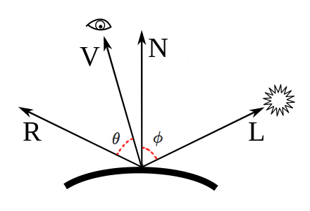
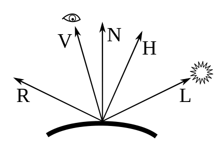
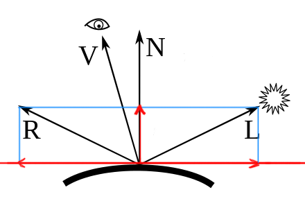

<!--more-->

光照模型一般按照真实感和非真实感，分2大类；在真实感类里，再细分经验模型和基于物理的模型。

本文将不断更新关于各种光照模型的内容。

- 真实感
    - Phong(经验模型)
    - Blinn-Phong(经验模型)
    - Lafortune
    - Torrance-Sparrow
    - Cook-Torrance（基于物理）
    - Ward anisotropy
    - Oren-Nayar
- 非真实感
    - Cel shading 
    - Gooch shading

列表来源: [List of common shading algorithms](https://en.wikipedia.org/wiki/List_of_common_shading_algorithms)

# [Phong lighting model](https://en.wikipedia.org/wiki/Phong_reflection_model) （1975年）

Phong模型是针对局部光照的经验模型。先过一遍原理，从wiki给出的2条公式入手：


（第二条公式在本文最后面补充了推导过程）

解释下里面的各个符号：

- \\(k\_\{s\} \\)，镜面反射系数，常量
- \\(k\_\{d\} \\)，漫反射系数，常量
- \\(k\_\{\\alpha \} \\)，环境光反射系数，常量
- \\(\alpha \\) , 表示物体材质光滑程度，由材质决定（材质越光滑系数越大），常量
- \\(\\hat L\_\{m\} \\)，从物体表面上的p点到某光源m的方向向量
- \\(\\hat N \\)，该点的法线
- \\(\\hat R\_\{m\} \\)，出射(反射)光线的方向，相对于\\(\\hat L\_\{m\} \\)而言的。也是从物体表面出发
- \\(\\hat V \\)，摄像机的方向，也是从物体表面出发
- \\(i\_\{\\alpha \} \\)，环境光光照，理解为RGB颜色即可（i表示illumination）
- \\(i\_\{m,d \} \\)，光源m的漫反射光照, RGB
- \\(i\_\{m,s \} \\)，光源m的镜面反射光照，RGB
- \\(I\_\{p \} \\)，p点的总的光照，RGB

直观地理解这些方向



公式中只有2个东西是要特别说明的：

- \\(\\hat L\_\{m\}\cdot \\hat N \\)即\\( cos \\phi \\)，夹角越小，cos值越大，反射光越强；
- \\( (\\hat R\_\{m\}\cdot V )\^\{\alpha \}  \\)即\\( cos \^\{\alpha \} \\theta \\)，夹角越小，说明反射光方向和视角方向越靠近，对于光滑平面，显然越靠近越亮，Phong用了一个乘方运算来模拟亮度的急剧变化；

根据公式可知，Phong模型实质上是三个小模型的叠加：

- ambient lighting：环境光，模拟像月光这种弱光对物体的影响
- diffuse lighting：漫反射光，被(直接)光源照射后反射出来的光
- specular lighting：镜面光，模拟了光滑物体或物体的部分光滑表面被光照时产生的高光现象

除此之外，还有一个object color的概念，是指物体自发光，一般是用纹理表示这种color。


(from wiki)

下面给出单光源下的phong shader。

## ambient lighting

```js
// fs
void main()
{
    float ka = 0.1;
    vec3 ambient = ka * lightColor;

    vec3 result = ambient * objectColor;
    FragColor = vec4(result, 1.0);
}
```


## ambient+diffuse lighting

```js
// vs
void main()
{
    gl_Position = projection * view * model * vec4(aPos, 1.0);
    FragPos = vec3(model * vec4(aPos, 1.0));
    Normal = aNormal;
}

// fs
void main()
{
    float ka = 0.1;
    vec3 ambient = ka * lightColor;

    float kd = 1.0;
    vec3 N = normalize(Normal);
    vec3 L = normalize(lightPos - FragPos);  
    float NdotL = max(dot(N, L), 0.0);
    vec3 diffuse = kd * NdotL * lightColor;

    vec3 result = (ambient + diffuse) * objectColor;
    FragColor = vec4(result, 1.0);
}
```


## ambient+diffuse+specular lighting

```js
// vs
void main()
{
    gl_Position = projection * view * model * vec4(aPos, 1.0);
    FragPos = vec3(model * vec4(aPos, 1.0));
    Normal = aNormal;
}

// fs
void main()
{
    float ka = 0.1;
    vec3 ambient = ka * lightColor;

    float kd = 1.0;
    vec3 N = normalize(Normal);
    vec3 L = normalize(lightPos - FragPos);  
    float NdotL = max(dot(N, L), 0.0);
    vec3 diffuse = kd * NdotL * lightColor;
    
    float ks = 0.5;
    float alpha = 32;
    vec3 V = normalize(viewPos - FragPos);
    vec3 R = reflect(-L, N); 
    float spec = pow(max(dot(V, R), 0.0), alpha);
    vec3 specular = ks * spec * lightColor;  

    vec3 result = (ambient + diffuse + specular) * objectColor;
    FragColor = vec4(result, 1.0);
}
```


# [Blinn-Phong](https://en.wikipedia.org/wiki/Blinn%E2%80%93Phong_shading_model) (1977年)

Blinn-Phong模型简单来说只是对Phong模型的改进。既然是改进，那么就得先搞清楚改进了什么问题：**在Phong模型中，R和V的夹角不能超过90度，超过90度，cos就会变负数，进而会出现光照错误**。

例如说观察者站在平面上观察平面远处的某点（V会贴近地面），且同时有一个方向光源光照方向L和V接近，那么L的镜像R，就和V形成钝角，就光照错误了。例如这样：


(from [learnopengl.com](https://learnopengl.com/Advanced-Lighting/Advanced-Lighting))


既然钝角不好，那么有什么办法弄成锐角？答案是定义一个新的向量H（halfway vector）：

\\[ \\hat H = \\frac \{L + V\}\{ |L + V| \} \\]



H和高光的关系是：H越靠近法线N，镜像高光就越强。

另外，因为H和N的夹角会比V和R的夹角小（从图中也可以看出来），于是shineness因子（即\\(\alpha \\)）得变得更大，一般是Phong模型时的2到4倍。

总之，Blinn-Phong其实只是改进了Phong高光的模拟部分，其他部分不变。Phong公式的高光部分改动如下：

\\[ k\_\{s\}(\\hat N\cdot \\hat H)\^\{\alpha \} i\_\{m,s\} \\]


对应的shader如下：

```js
// vs
void main()
{
    gl_Position = projection * view * model * vec4(aPos, 1.0);
    FragPos = vec3(model * vec4(aPos, 1.0));
    Normal = aNormal;
}

// fs
void main()
{
    float ka = 0.1;
    vec3 ambient = ka * lightColor;

    float kd = 1.0;
    vec3 N = normalize(Normal);
    vec3 L = normalize(lightPos - FragPos);  
    float NdotL = max(dot(N, L), 0.0);
    vec3 diffuse = kd * NdotL * lightColor;
    
    float ks = 0.5;
    float alpha = 32;
    vec3 V = normalize(viewPos - FragPos);
    vec3 H = normalize(L + V);
    float spec = pow(max(dot(N, H), 0.0), alpha);
    vec3 specular = ks * spec * lightColor;  

    vec3 result = (ambient + diffuse + specular) * objectColor;
    FragColor = vec4(result, 1.0);
}
```

learnopengl.com给出的前后对比图：


# 补充

## 反射公式的推导


解释下这条公式怎么得到。首先看图：




先以切平面和法线为坐标轴，对L做投影分解。L到N的投影为：

\\[ L\_\{\parallel \} = (L\cdot N)N \\]

根据向量加法可以得到：

\\[ L\_\{\perp \} = L - L\_\{\parallel \} = L - (L\cdot N)N \\]

又因为R关于N和L镜像对称，于是可以得到R的公式：

\\[ R = -L\_\{\perp \} + L\_\{\parallel \} \\]

\\[ R = -(L - (L\cdot N)N) + (L\cdot N)N \\]

\\[ R = -L + 2(L\cdot N)N \\]

\\[ R =  2(L\cdot N)N - L \\]

# 参考资料

https://learnopengl.com/Lighting/Basic-Lighting

https://learnopengl.com/Advanced-Lighting/Advanced-Lighting

https://math.stackexchange.com/questions/13261/how-to-get-a-reflection-vector

https://en.wikipedia.org/wiki/Specular_reflection#Direction_of_reflection

http://maverick.inria.fr/~Nicolas.Holzschuch/cours/Slides/1b_Materiaux.pdf